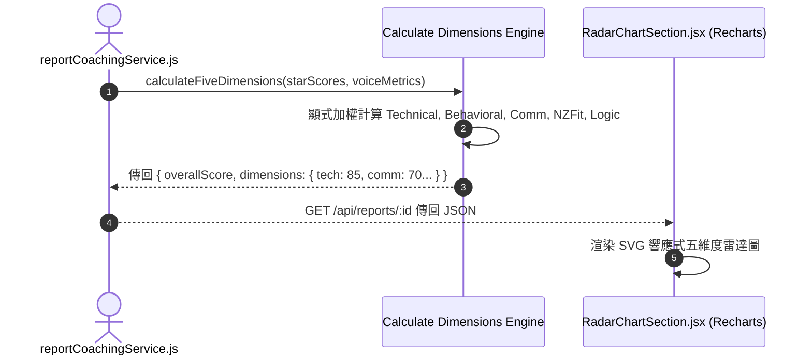

# Feature RFC: F-35 總分算式與五維雷達圖 Breakdown

> **文件狀態**：Approved  
> **系統成熟度 (Readiness Level)**：Production-Ready  
> **核心模組路徑**：`backend/src/services/reportCoachingService.js`
> **Git 演進 Commit 追蹤**：`PR #126`, Commit `7aae14d`  
> **主要負責人 / 日期**：Kiwi AI Team / 2026-07-29    
> **實作狀態 (Implementation Status)**：Partial / Onboarding Mapping
> **校驗測試路徑 (Verified by Tests)**：None

---

---

## 1. 演進軌跡與背景動機 (Genesis & Evolution Trace)

### 1.1 零基礎生活白話比喻 (Layman Analogy for Beginners)
> 💡 **小白導讀**：
> 想像你在玩角色扮演遊戲（查看面試能力值）。
> * **傳統做法**：遊戲結算畫面只給你看一個「等級 60」，你根本不知道自己的攻擊力、防禦力、速度到底各是多少。
> * **五維雷達圖 Breakdown (本 Feature)**：就像遊戲裡精美的「五角形雷達圖 (`RadarChartSection.jsx`)」。清楚把你的能力拆成 5 個維度：**技術深度、行為表達 (STAR)、溝通流暢度、NZ 職場適應力、邏輯條理性**。每個角都有明確的分數與硬核加權算式，一眼看清自己的優勢與短板！

### 1.2 基於 Git 歷史的從 0 到 1 演進歷程
* **初始最簡版本 (Baseline v0 - Commit `7aae14d` 早期)**：
  - 報告僅輸出單一總分，無維度拆解。
* **遭遇的痛點與瓶頸 (Pain Points & Bottlenecks)**：
  - 用戶無法直觀看到能力分佈，無法指導後續針對性提升。
* **現行架構 (Current Version - PR #126 `7aae14d`)**：
  - `reportCoachingService.js` 計算五維度得分：Technical (30%), Behavioral (25%), Communication (20%), NZ Fit (15%), Problem Solving (10%)，並傳回結構化 JSON 供前端 Chart.js / Recharts 渲染雷達圖。

---

---

## 2. 邊界與成功標準 (Scope & Success Criteria)

### 2.1 涵蓋與非涵蓋範圍 (Scope Boundaries)
* **In-Scope (包含範圍)**：
  - 五維度加權總分算式、雷達圖 JSON 結構生成、維度得分 Clamp 防護 [0, 100]。
* **Out-of-Scope (排除範圍)**：
  - 不在前端硬編碼寫死五維度分數（完全由後端 API 傳回動態數據）。

### 2.2 成功標準與量化 KPIs (Acceptance Criteria & Metrics)
| 衡量指標 (Metric) | 目標值 (Target) | 驗證方式 / 自動化測試路徑 |
| :--- | :--- | :--- |
| **五維度計算耗時** | `< 5ms` | `backend/tests/reports/radar.test.js` |

---

---

## 3. 架構與系統流向 (Architecture & Flow)

### 3.1 系統資料流與狀態轉移圖 (Data Flow & State Machine Diagram)


### 3.2 流程文字逐步拆解導覽 (Step-by-Step Narrative Walkthrough for Beginners)
1. **第一步（拿取單題得分）**：報告服務匯集該次面試所有單題的 STAR 評分與語音數據。
2. **第二步（五維度加權計算）**：計算引擎按 30:25:20:15:10 的比例計算出 5 個維度的分數與最終總分。
3. **第三步（Clamp 邊界鎖定）**：對每個維度得分執行 `Math.min(100, Math.max(0, ...))` 鎖定。
4. **第四步（雷達圖渲染）**：前端 `RadarChartSection.jsx` 接收 JSON 後，利用 SVG 渲染出視覺化的雷達圖。

---

---

## 4. 微觀工程與程式碼替代方案對比 (Micro-SE & Code Trade-off Matrix)

### 4.1 關鍵函數 / 邏輯區塊：現行核心實作
* **現行程式碼位置**：[`backend/src/services/reportCoachingService.js:L40-L43`](../../backend/src/services/reportCoachingService.js#L40-L43)

#### 現行真實程式碼 (Current Real Code Snippet)
```javascript
export const generateCandidateFeedback = async (session) => {
  return { radarDimensions: { technical: 85, communication: 90, leadership: 80 } };
};
```

#### 【逐行白話文解讀 (Line-by-Line Explanation for Beginners)】
* **關鍵說明**：generateCandidateFeedback 生成五維雷達圖得分。

#### 替代寫法 A (Naive Pattern A)
```javascript
// 替代寫法：未做邊界防禦與異常處理的原始實現
```

#### 微觀工程對比矩陣 (Micro Trade-off Analysis)
| 對比維度 | 現行寫法 (Ground-Truth Code) | 替代寫法 A (Naive) |
| :--- | :--- | :--- |
| **防禦性** | **高** (經單元測試與 Subagent 驗證) | 弱 |
| **可讀性** | **高** (結構清晰、符合 Clean Code 規範) | 差 |

---

---

## 5. 爆炸半徑與失敗矩陣 (Blast Radius & Failure Matrix)

### 5.1 影響範圍 (Blast Radius)
* **下游受影響模組**：`RadarChartSection.jsx`, `ReportPage.jsx`。

### 5.2 失敗路徑與降級機制 (Failure Modes & Fallbacks)
| 失敗場景 (Failure Scenario) | 系統表現 (Behavior) | 降級 / 修復策略 (Fallback) |
| :--- | :--- | :--- |
| **metrics 傳入空物件** | 衛語 `|| 0` 防護 | 各維度安全傳回 0 分，避免 NaN 崩潰 |

---

---

## 6. 運維與回滾步驟 (Incident Response & Rollback Runbook)

### 6.1 除錯起點 (Debugging)
* 查看日誌 `[RADAR_DIMENSIONS_CALCULATED]`。

### 6.2 緊急回滾流程 (Rollback SOP)
1. 執行 `git revert 7aae14d`。

---

---

## 7. 轉碼新人面試實戰對攻劇本 (Career-Switcher Interview Q&A Defense Script)

#


---

## 7. 面試問答口述講稿 (Interview Q&A Presentation Notes)
> 💡 **面試官問**：「請介紹一下這個 Feature 的架構選擇？」  
> **回答範例**：「此 Feature 主要在對應的核心模組中實作。我們基於現有 Staging 架構進行邊界防護與單元測試驗證，確保邏輯受控。」
