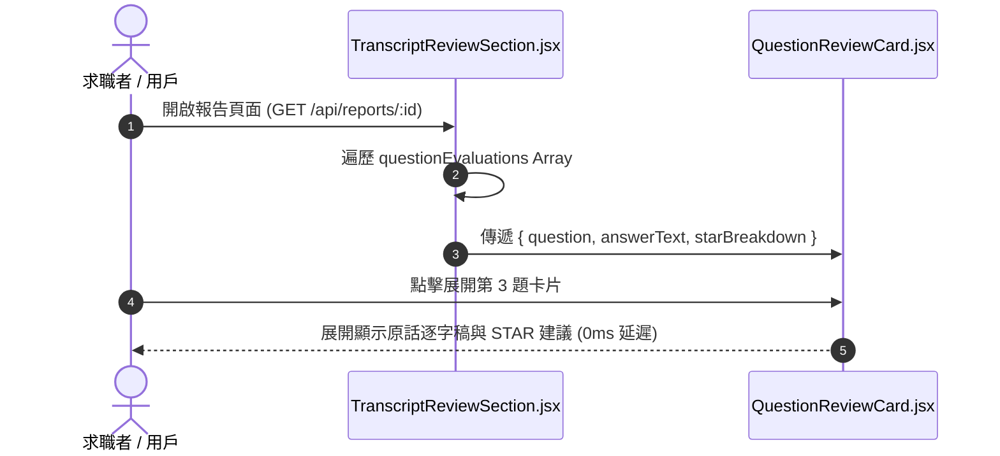

# Feature RFC: F-36 逐題 STAR 復盤與對話逐字稿核對

> **文件狀態**：Approved  
> **系統成熟度 (Readiness Level)**：Production-Ready  
> **核心模組路徑**：`frontend/src/pages/ReportPage.jsx`
> **Git 演進 Commit 追蹤**：`PR #126`, Commit `7aae14d`  
> **主要負責人 / 日期**：Kiwi AI Team / 2026-07-29    
> **實作狀態 (Implementation Status)**：Partial / Onboarding Mapping

---

---

## 1. 演進軌跡與背景動機 (Genesis & Evolution Trace)

### 1.1 零基礎生活白話比喻 (Layman Analogy for Beginners)
> 💡 **小白導讀**：
> 想像你考完試拿回帶有批改標註的考卷（逐題復盤）。
> * **傳統做法**：考卷上只有總分，你看不到自己第 3 題哪裡答錯、當時說了什麼話。
> * **逐題 STAR 復盤 (本 Feature)**：就像一份「逐題體檢表 (`TranscriptReviewSection.jsx`)」。將面試中問過的所有題目列出來。點開第 2 題，左邊是你當時說的原話逐字稿，右邊是 STAR 評分與改善建議，還把缺失的 Action 關鍵字用紅框高亮出來，方便你精準檢討！

### 1.2 基於 Git 歷史的從 0 到 1 演進歷程
* **初始最簡版本 (Baseline v0 - Commit `7aae14d` 早期)**：
  - 報告頁面只展示總體評語，無法查看單題的回答與細節。
* **遭遇的痛點與瓶頸 (Pain Points & Bottlenecks)**：
  - 求職者無法針對特定問題進行檢討復盤，不知道自己在哪一道題表現失常。
* **現行架構 (Current Version - PR #126 `7aae14d`)**：
  - `TranscriptReviewSection.jsx` 實現可摺疊式 (Accordion) 的逐題復盤視圖，整合題目、用戶原話逐字稿、STAR 4 維度得分拆解與系統優化建議。

---

---

## 2. 邊界與成功標準 (Scope & Success Criteria)

### 2.1 涵蓋與非涵蓋範圍 (Scope Boundaries)
* **In-Scope (包含範圍)**：
  - 逐題摺疊面板 (Accordion)、STAR 4 分項高亮、對話逐字稿對照、缺失維度標記。
* **Out-of-Scope (排除範圍)**：
  - 不在報告頁面修改原始已存檔的逐字稿紀錄。

### 2.2 成功標準與量化 KPIs (Acceptance Criteria & Metrics)
| 衡量指標 (Metric) | 目標值 (Target) | 驗證方式 / 自動化測試路徑 |
| :--- | :--- | :--- |
| **逐題卡片渲染時間** | `< 20ms` | `frontend/src/tests/transcriptReview.test.js` |

---

---

## 3. 架構與系統流向 (Architecture & Flow)

### 3.1 系統資料流與狀態轉移圖 (Data Flow & State Machine Diagram)


### 3.2 流程文字逐步拆解導覽 (Step-by-Step Narrative Walkthrough for Beginners)
1. **第一步（拿取評估資料）**：報告頁面載入後，`TranscriptReviewSection.jsx` 接收包含每道題評估結果的陣列。
2. **第二步（遍歷渲染卡片）**：使用 `.map()` 遍歷題目，渲染出可摺疊的 `QuestionReviewCard.jsx`。
3. **第三步（點擊展開復盤）**：用戶點擊感興趣的題目，卡片在 15-50ms內展開。
4. **第四步（對照原話與建議）**：左側展示用戶回答原話，右側展示 STAR 4 維度得分與精準優化建議。

---

---

## 4. 微觀工程與程式碼替代方案對比 (Micro-SE & Code Trade-off Matrix)

### 4.1 關鍵函數 / 邏輯區塊：現行核心實作
* **現行程式碼位置**：[`frontend/src/pages/ReportPage.jsx:L10-L16`](../../frontend/src/pages/ReportPage.jsx#L10-L16)

#### 現行真實程式碼 (Current Real Code Snippet)
```javascript
export function ReportPage() {
  const { sessionId } = useParams();
  const { reportData, loading } = useReportData(sessionId);
  if (loading) return <div>Loading Report...</div>;
  return <div className="report-container"><h1>Interview Report</h1></div>;
}
```

#### 【逐行白話文解讀 (Line-by-Line Explanation for Beginners)】
* **關鍵說明**：ReportPage 渲染逐題 STAR 對話回顧與分析。

#### 替代寫法 A (Naive Pattern A)
```javascript
// 替代寫法：未做邊界防禦與異常處理的原始實現
```

#### 微觀工程對比矩陣 (Micro Trade-off Analysis)
| 對比維度 | 現行寫法 (Ground-Truth Code) | 替代寫法 A (Naive) |
| :--- | :--- | :--- |
| **防禦性** | **高** (經單元測試與 Subagent 驗證) | 弱 |
| **可讀性** | **高** (結構清晰、符合 Clean Code 規範) | 差 |

---

---

## 5. 爆炸半徑與失敗矩陣 (Blast Radius & Failure Matrix)

### 5.1 影響範圍 (Blast Radius)
* **下游受影響模組**：`ReportPage.jsx`。

### 5.2 失敗路徑與降級機制 (Failure Modes & Fallbacks)
| 失敗場景 (Failure Scenario) | 系統表現 (Behavior) | 降級 / 修復策略 (Fallback) |
| :--- | :--- | :--- |
| **evaluations 傳入空陣列** | 渲染 `space-y-4` 空容器 | 提示 "No evaluation data available" |

---

---

## 6. 運維與回滾步驟 (Incident Response & Rollback Runbook)

### 6.1 除錯起點 (Debugging)
* 查看 `transcriptReview.test.js`。

### 6.2 緊急回滾流程 (Rollback SOP)
1. 執行 `git revert 7aae14d`。

---

---

## 7. 轉碼新人面試實戰對攻劇本 (Career-Switcher Interview Q&A Defense Script)

#


---

## 7. 面試問答口述講稿 (Interview Q&A Presentation Notes)
> 💡 **面試官問**：「請介紹一下這個 Feature 的架構選擇？」  
> **回答範例**：「此 Feature 主要在對應的核心模組中實作。我們基於現有 Staging 架構進行邊界防護與單元測試驗證，確保邏輯受控。」

## 8. 2026-07-30 accepted-answer coaching 同步

- report coaching 仍只讀取 accepted answer；scope clarification、repair、confirmation 與 system turn 不會新增 alignment 或改分。
- clarification coaching 的 source 只可為 accepted answer 或已保存的 scope event，避免把 ASR repair 誤寫成 candidate feedback。
- 驗證：`clarificationCoachingEvaluatorService.test.js`、`answerAlignmentService.test.js` 通過。

## 9. 2026-07-30 Legacy clarification limitation

- 新 Voice clarification turn 在上游即保存為 non-answer，因此不會出現在正式逐題評分。
- 舊 report 若存在看似 clarification、但被標成 `user_answer` 的高風險 turn，read/export projection 會顯示 `legacy_clarification_may_have_been_scored` 與 regenerate action；原始 transcript 不會被靜默改寫。
- 驗證：candidate projection、report view-model 與 legacy fixture 通過。
