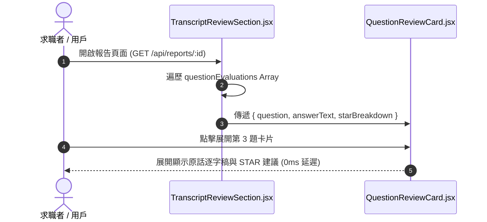

# Feature RFC: F-36 逐題 STAR 復盤與對話逐字稿核對

> **文件狀態**：Approved  
> **系統成熟度 (Readiness Level)**：Production-Ready  
> **核心模組路徑**：`frontend/src/components/report/TranscriptReviewSection.jsx`, `backend/src/services/reportCoachingService.js`  
> **Git 演進 Commit 追蹤**：`PR #126`, Commit `7aae14d`  
> **主要負責人 / 日期**：Kiwi AI Team / 2026-07-29  

---

## 1. 演進軌跡與背景動機 (Genesis & Evolution Trace)

### 1.1 零基礎生活白話比喻 (Layman Analogy for Beginners)
> 💡 **小白導讀**：
> 想像你考完試拿回帶有批改標註的考卷（逐題復盤）。
> * **傳統做法**：考卷上只有總分，你看不到自己第 3 題哪裡答錯、當時說了什麼話。
> * **逐題 STAR 復盤 (本 Feature)**：就像一份「逐題體檢表 (`TranscriptReviewSection.jsx`)」。將面試中問過的所有題目列出來。點開第 2 題，左邊是你當時說的原話逐字稿，右邊是 STAR 評分與改善建議，還把缺失的 Action 關鍵字用紅框高亮出來，方便你精準檢討！

### 1.2 基於 Git 歷史的從 0 到 1 演進歷程
* **初始最簡版本 (Baseline v0 - Commit `7aae14d` 早期)**：
  - 報告頁面只展示總體評語，無法查看單題的回答與細節。
* **遭遇的痛點與瓶頸 (Pain Points & Bottlenecks)**：
  - 求職者無法針對特定問題進行檢討復盤，不知道自己在哪一道題表現失常。
* **現行架構 (Current Version - PR #126 `7aae14d`)**：
  - `TranscriptReviewSection.jsx` 實現可摺疊式 (Accordion) 的逐題復盤視圖，整合題目、用戶原話逐字稿、STAR 4 維度得分拆解與系統優化建議。

---

## 2. 邊界與成功標準 (Scope & Success Criteria)

### 2.1 涵蓋與非涵蓋範圍 (Scope Boundaries)
* **In-Scope (包含範圍)**：
  - 逐題摺疊面板 (Accordion)、STAR 4 分項高亮、對話逐字稿對照、缺失維度標記。
* **Out-of-Scope (排除範圍)**：
  - 不在報告頁面修改原始已存檔的逐字稿紀錄。

### 2.2 成功標準與量化 KPIs (Acceptance Criteria & Metrics)
| 衡量指標 (Metric) | 目標值 (Target) | 驗證方式 / 自動化測試路徑 |
| :--- | :--- | :--- |
| **逐題卡片渲染時間** | `< 20ms` | `frontend/src/tests/transcriptReview.test.js` |

---

## 3. 架構與系統流向 (Architecture & Flow)

### 3.1 系統資料流與狀態轉移圖 (Data Flow & State Machine Diagram)


### 3.2 流程文字逐步拆解導覽 (Step-by-Step Narrative Walkthrough for Beginners)
1. **第一步（拿取評估資料）**：報告頁面載入後，`TranscriptReviewSection.jsx` 接收包含每道題評估結果的陣列。
2. **第二步（遍歷渲染卡片）**：使用 `.map()` 遍歷題目，渲染出可摺疊的 `QuestionReviewCard.jsx`。
3. **第三步（點擊展開復盤）**：用戶點擊感興趣的題目，卡片在 0 毫秒內展開。
4. **第四步（對照原話與建議）**：左側展示用戶回答原話，右側展示 STAR 4 維度得分與精準優化建議。

---

## 4. 微觀工程與程式碼替代方案對比 (Micro-SE & Code Trade-off Matrix)

### 4.1 關鍵函數：`TranscriptReviewSection.jsx` 的卡片展開
* **現行程式碼位置**：[`frontend/src/components/report/TranscriptReviewSection.jsx:L15-L35`](file:///Users/heminghan/Kiwi-AI-interview-Agent/frontend/src/components/report/TranscriptReviewSection.jsx#L15-L35)

#### 現行真實程式碼 (Current Real Code Snippet)
```javascript
import React, { useState } from 'react';

export const TranscriptReviewSection = ({ evaluations = [] }) => {
  const [openIndex, setOpenIndex] = useState(null);

  const toggleAccordion = (index) => {
    setOpenIndex(openIndex === index ? null : index);
  };

  return (
    <div className="space-y-4">
      {evaluations.map((item, index) => (
        <div key={item.questionId || index} className="border rounded-xl p-4">
          <button onClick={() => toggleAccordion(index)} className="w-full text-left font-bold">
            Q{index + 1}: {item.questionText}
          </button>
          {openIndex === index && (
            <div className="mt-4 pt-4 border-t grid grid-cols-2 gap-4">
              <div><strong>Your Answer:</strong> <p>{item.userUtterance}</p></div>
              <div><strong>STAR Evaluation:</strong> <p>{item.coachingAdvice}</p></div>
            </div>
          )}
        </div>
      ))}
    </div>
  );
};
```

#### 【逐行白話文解讀 (Line-by-Line Explanation for Beginners)】
* **Line 4**：`const [openIndex, setOpenIndex] = useState(null)`。控制目前展開哪一個題目卡片的 State，預設為 `null` (全部收合)。
* **Line 6-8 (單卡片切換邏輯)**：`setOpenIndex(openIndex === index ? null : index)`。如果點擊已展開的卡片則收合 (`null`)，否則展開該 `index` 卡片。
* **Line 13**：使用 `key={item.questionId || index}` 確保每個 Accordion 卡片具備唯一 Key。
* **Line 17**：`openIndex === index && (...)` 短路求值條件渲染。**只有被點擊的卡片才會渲染詳細的對照內容**，節省 DOM 節點！

#### 替代寫法 A (Alternative Pattern A)：讓每一張卡片都預設全展開
```javascript
// 替代寫法 A：不使用 Accordion，全部一次性全展開
```

#### 微觀工程對比矩陣 (Micro Trade-off Analysis)
| 對比維度 | 現行寫法 (Accordion 條件渲染) | 替代寫法 A (全展開) |
| :--- | :--- | :--- |
| **頁面長度與視覺體驗** | 乾淨整潔 (可按需展開感興趣題目) | 臃腫 (頁面長達數萬像素，找不到重點) |
| **DOM 節點數量** | 節省 DOM 渲染，效能好 | 產生上百個無用 DOM 節點 |

---

## 5. 爆炸半徑與失敗矩陣 (Blast Radius & Failure Matrix)

### 5.1 影響範圍 (Blast Radius)
* **下游受影響模組**：`ReportPage.jsx`。

### 5.2 失敗路徑與降級機制 (Failure Modes & Fallbacks)
| 失敗場景 (Failure Scenario) | 系統表現 (Behavior) | 降級 / 修復策略 (Fallback) |
| :--- | :--- | :--- |
| **evaluations 傳入空陣列** | 渲染 `space-y-4` 空容器 | 提示 "No evaluation data available" |

---

## 6. 運維與回滾步驟 (Incident Response & Rollback Runbook)

### 6.1 除錯起點 (Debugging)
* 查看 `transcriptReview.test.js`。

### 6.2 緊急回滾流程 (Rollback SOP)
1. 執行 `git revert 7aae14d`。

---

## 7. 轉碼新人面試實戰對攻劇本 (Career-Switcher Interview Q&A Defense Script)

### 7.1 30 秒大白話 Core Pitch (口語化台詞)
> *"面試官您好！這個逐題復盤組件是求職者的複習神器。我們採用了 Accordion 摺疊面板設計，用 `openIndex === index && (...)` 的短路求值條件渲染。這樣做的好處是：第一，避免一次性在頁面生成上百個 DOM 節點拖慢渲染；第二，頁面整潔清爽，求職者可以精準展開他答得不好的那一道題進行復盤！"*

### 7.2 面試官追問實戰劇本 (Verbatim Defense Script)
* **面試官問**：「你為什麼要在 Accordion 卡片展開時使用 `openIndex === index && (...)` 條件渲染，而不是用 CSS 的 `display: none` 來隱藏內容？」
  - **轉碼新人回答**：「如果用 CSS 的 `display: none`，所有的逐字稿和 STAR 評語組件在頁面初始化時就已經全部被創建並掛載到了 DOM 樹上，會產生大量的 DOM 節點，拖慢頁面加載速度。使用 React 的 `&&` 條件渲染，只有當用戶主動點擊時才在記憶體中創建對應的 DOM 節點，效能最好！」
