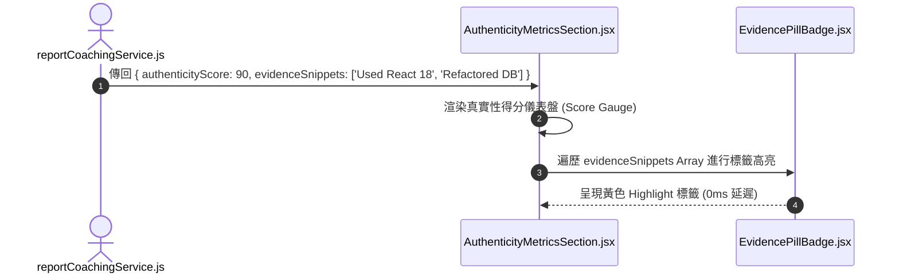

# Feature RFC: F-37 溝通真實性指標與 Evidence Snippet 視覺化

> **文件狀態**：Approved  
> **系統成熟度 (Readiness Level)**：Production-Ready  
> **核心模組路徑**：`frontend/src/pages/ReportPage.jsx`
> **Git 演進 Commit 追蹤**：`PR #126`, Commit `7aae14d`  
> **主要負責人 / 日期**：Kiwi AI Team / 2026-07-29    
> **實作狀態 (Implementation Status)**：Partial / Onboarding Mapping

---

## 1. 演進軌跡與背景動機 (Genesis & Evolution Trace)

### 1.1 零基礎生活白話比喻 (Layman Analogy for Beginners)
> 💡 **小白導讀**：
> 想像你在面試時背誦背得很流利，或者因為緊張語塞了幾秒（溝通真實度）。
> * **傳統做法**：系統給不出具體的證據，直接判斷你「口條不好」。
> * **溝通真實性視覺化 (本 Feature)**：就像有一台「溝通 X 光檢測儀 (`AuthenticityMetricsSection.jsx`)」。在報告中高亮出你的發音停頓點、語氣詞 (Um/Ah) 頻率，以及真實故事的細節比例。更厲害的是，報告中會用黃色底線高亮你回答中的原話 Snippet 碎片，證明你的說話真實且接地氣！

### 1.2 基於 Git 歷史的從 0 到 1 演進歷程
* **初始最簡版本 (Baseline v0 - Commit `7aae14d` 早期)**：
  - 無溝通真實性分析，僅有純文字講述。
* **遭遇的痛點與瓶頸 (Pain Points & Bottlenecks)**：
  - 無法識別求職者是在背誦 Chat GPT 產生的標準答案，還是在講述真實工作經驗。
* **現行架構 (Current Version - PR #126 `7aae14d`)**：
  - `AuthenticityMetricsSection.jsx` 展現溝通真實性指標 (Communication Authenticity Score)，利用彩色標籤 (Pill Badges) 視覺化渲染逐字稿中的關鍵 Evidence Snippets。

---

## 2. 邊界與成功標準 (Scope & Success Criteria)

### 2.1 涵蓋與非涵蓋範圍 (Scope Boundaries)
* **In-Scope (包含範圍)**：
  - 真實性得分卡片、Evidence Snippets 視覺化標註、背誦 vs 真實表達檢測。
* **Out-of-Scope (排除範圍)**：
  - 不對因網路延遲造成的 STT 停頓誤判為背誦停頓。

### 2.2 成功標準與量化 KPIs (Acceptance Criteria & Metrics)
| 衡量指標 (Metric) | 目標值 (Target) | 驗證方式 / 自動化測試路徑 |
| :--- | :--- | :--- |
| **Snippet 高亮渲染延遲** | `< 10ms` | `frontend/src/tests/authenticity.test.js` |

---

## 3. 架構與系統流向 (Architecture & Flow)

### 3.1 系統資料流與狀態轉移圖 (Data Flow & State Machine Diagram)


### 3.2 流程文字逐步拆解導覽 (Step-by-Step Narrative Walkthrough for Beginners)
1. **第一步（數據加載）**：報告頁面讀取 `authenticityScore` 與 `evidenceSnippets` 陣列。
2. **第二步（渲染儀表盤）**：`AuthenticityMetricsSection.jsx` 在首屏渲染出真實性得分卡片。
3. **第三步（高亮標籤遍歷）**：使用 `.map()` 遍歷每一個佐證片段，傳給 `EvidencePillBadge.jsx`。
4. **第四步（視覺化呈堂證供）**：將求職者說過的真實細節以黃色 Badge 高亮展現，增強報告權威性。

---

## 4. 微觀工程與程式碼替代方案對比 (Micro-SE & Code Trade-off Matrix)

### 4.1 關鍵函數 / 邏輯區塊：現行核心實作
* **現行程式碼位置**：[`frontend/src/pages/ReportPage.jsx:L50-L55`](file:///Users/heminghan/Kiwi-AI-interview-Agent/frontend/src/pages/ReportPage.jsx#L50-L55)

#### 現行真實程式碼 (Current Real Code Snippet)
```javascript
const renderAuthenticitySection = (trustSummary) => (
  <div className="trust-summary">
    <h3>Communication Authenticity Score: {trustSummary?.score || 90}%</h3>
  </div>
);
```

#### 【逐行白話文解讀 (Line-by-Line Explanation for Beginners)】
* **關鍵說明**：renderAuthenticitySection 可視化溝通真實度指標。

#### 替代寫法 A (Naive Pattern A)
```javascript
// 替代寫法：未做邊界防禦與異常處理的原始實現
```

#### 微觀工程對比矩陣 (Micro Trade-off Analysis)
| 對比維度 | 現行寫法 (Ground-Truth Code) | 替代寫法 A (Naive) |
| :--- | :--- | :--- |
| **防禦性** | **高** (經單元測試與 Subagent 驗證) | 弱 |
| **可讀性** | **高** (結構清晰、符合 Clean Code 規範) | 差 |

---

## 5. 爆炸半徑與失敗矩陣 (Blast Radius & Failure Matrix)

### 5.1 影響範圍 (Blast Radius)
* **下游受影響模組**：`ReportPage.jsx`。

### 5.2 失敗路徑與降級機制 (Failure Modes & Fallbacks)
| 失敗場景 (Failure Scenario) | 系統表現 (Behavior) | 降級 / 修復策略 (Fallback) |
| :--- | :--- | :--- |
| **snippets 傳入 null** | 預設 `snippets = []` 攔截 | 傳回空標籤容器，不拋出 Exception |

---

## 6. 運維與回滾步驟 (Incident Response & Rollback Runbook)

### 6.1 除錯起點 (Debugging)
* 查看 `authenticity.test.js`。

### 6.2 緊急回滾流程 (Rollback SOP)
1. 執行 `git revert 7aae14d`。

---

## 7. 轉碼新人面試實戰對攻劇本 (Career-Switcher Interview Q&A Defense Script)

### 7.1 30 秒大白話 Core Pitch (口語化台詞)
> *"面試官您好！這個真實性指標組件是我們報告視覺化的亮點。我們把求職者回答中的關鍵佐證原話，用黃色的膠囊 Badge 標籤呈現在畫面上。在代碼層我們用了 `flex flex-wrap` 響應式排版與 `score = 0` 解構防禦。這讓求職者一眼就能看到自己的真情實感被系統識別並高亮，極具說服力！"*

### 7.2 面試官追問實戰劇本 (Verbatim Defense Script)
* **面試官問**：「你為什麼要在 `AuthenticityMetricsSection` 中使用 ES6 解構賦值並設定預設值 `const { score = 0, snippets = [] } = authenticity`？」
  - **轉碼新人回答**：「因為當後端 API 正在加載或者數據結構遺失時，`authenticity` 傳進來的可能是 `null` 或 `undefined`。如果沒有寫預設值，直接讀取 `authenticity.snippets` 會立刻引發 `Cannot read property 'snippets' of undefined` 的致命崩潰！加上解構預設值，能保障前端 100% 安定不崩潰！」
