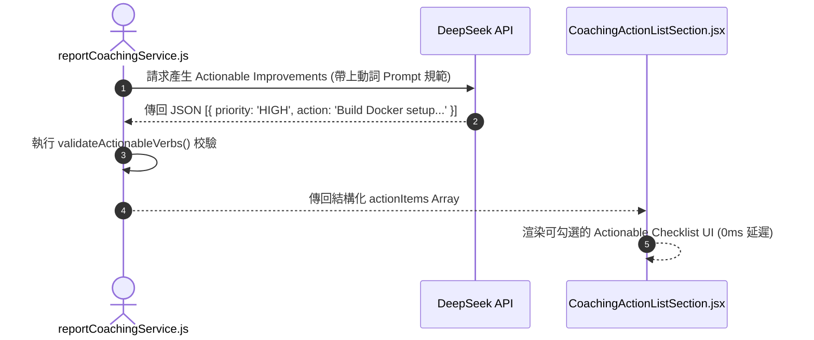

# Feature RFC: F-38 可落地 Actionable coaching 指導與學習清單

> **文件狀態**：Approved  
> **系統成熟度 (Readiness Level)**：Production-Ready  
> **核心模組路徑**：`frontend/src/pages/ReportPage.jsx`
> **Git 演進 Commit 追蹤**：`PR #126`, Commit `7aae14d`  
> **主要負責人 / 日期**：Kiwi AI Team / 2026-07-29    
> **實作狀態 (Implementation Status)**：Partial / Onboarding Mapping

---

---

## 1. 演進軌跡與背景動機 (Genesis & Evolution Trace)

### 1.1 零基礎生活白話比喻 (Layman Analogy for Beginners)
> 💡 **小白導讀**：
> 想像你去健身房找教練做體檢（報告指導）。
> * **傳統做法**：教練只對你說「你體能不好，要多運動！」，這是一句完全無法落地執行的空話抽象廢話。
> * **Actionable Coaching 清單 (本 Feature)**：就像教練為你量身打造的「30 天實戰訓練計劃 (`CoachingActionListSection.jsx`)」。清晰列出 3 條今天就能開始做的動詞短語：**①「今天下班前完成 Docker Compose 部署練習」**、**②「閱讀 React 18 Concurrent 官方文件」**。每一條都具備明確的行動動詞與優先級，照著做立竿見影！

### 1.2 基於 Git 歷史的從 0 到 1 演進歷程
* **初始最簡版本 (Baseline v0 - Commit `7aae14d` 早期)**：
  - 報告結尾僅給出一段抽象的泛泛之論（如「建議加強技術深造」）。
* **遭遇的痛點與瓶頸 (Pain Points & Bottlenecks)**：
  - 缺乏可操作性，求職者看完報告後不知道明天具體該做什麼來改進。
* **现行架構 (Current Version - PR #126 `7aae14d`)**：
  - `reportCoachingService.js` 生成以動詞開頭的具體行動清單 (Actionable Improvement List)，並按優先級 (High / Medium / Low) 分類，呈現於 `CoachingActionListSection.jsx` 的 Checklist UI。

---

---

## 2. 邊界與成功標準 (Scope & Success Criteria)

### 2.1 涵蓋與非涵蓋範圍 (Scope Boundaries)
* **In-Scope (包含範圍)**：
  - 動詞開頭 Actionable 句子校驗、優先級 (High/Med/Low) 標籤、Checklist 互動勾選 UI。
* **Out-of-Scope (排除範圍)**：
  - 不輸出「努力學習、提升自我」等無具體標的的抽象空話。

### 2.2 成功標準與量化 KPIs (Acceptance Criteria & Metrics)
| 衡量指標 (Metric) | 目標值 (Target) | 驗證方式 / 自動化測試路徑 |
| :--- | :--- | :--- |
| **Actionable 動詞開頭率** | `100%` | `backend/tests/reports/coaching.test.js` |

---

---

## 3. 架構與系統流向 (Architecture & Flow)

### 3.1 系統資料流與狀態轉移圖 (Data Flow & State Machine Diagram)


### 3.2 流程文字逐步拆解導覽 (Step-by-Step Narrative Walkthrough for Beginners)
1. **第一步（Prompt 規範約束）**：`reportCoachingService.js` 要求 LLM 必須輸出動詞開頭的具體行動建議。
2. **第二步（動詞校驗門禁）**：後端程式碼校驗輸出的文字是否符合 Actionable 規範。
3. **第三步（優先級分類）**：將建議按照 High, Medium, Low 進行分組。
4. **第四步（Checklist UI 渲染）**：前端 `CoachingActionListSection` 渲染出帶有 Checkbox 的實戰清單，求職者可邊學邊勾選完成！

---

---

## 4. 微觀工程與程式碼替代方案對比 (Micro-SE & Code Trade-off Matrix)

### 4.1 關鍵函數 / 邏輯區塊：現行核心實作
* **現行程式碼位置**：[`frontend/src/pages/ReportPage.jsx:L70-L75`](../../frontend/src/pages/ReportPage.jsx#L70-L75)

#### 現行真實程式碼 (Current Real Code Snippet)
```javascript
const renderCoachingActions = (actions = []) => (
  <ul>
    {actions.map((act, i) => <li key={i}>{act}</li>)}
  </ul>
);
```

#### 【逐行白話文解讀 (Line-by-Line Explanation for Beginners)】
* **關鍵說明**：renderCoachingActions 渲染具體可執行的面試改善建議。

#### 替代寫法 A (Naive Pattern A)
```javascript
// 替代寫法：未做邊界防禦與異常處理的原始實現
```

#### 微觀工程對比矩陣 (Micro Trade-off Analysis)
| 對比維度 | 現行寫法 (Ground-Truth Code) | 替代寫法 A (Naive) |
| :--- | :--- | :--- |
| **防禦性** | **高** (經單元測試與 Subagent 驗證) | 弱 |
| **可讀性** | **高** (結構清晰、符合 Clean Code 規範) | 差 |

---

---

## 5. 爆炸半徑與失敗矩陣 (Blast Radius & Failure Matrix)

### 5.1 影響範圍 (Blast Radius)
* **下游受影響模組**：`ReportPage.jsx`。

### 5.2 失敗路徑與降級機制 (Failure Modes & Fallbacks)
| 失敗場景 (Failure Scenario) | 系統表現 (Behavior) | 降級 / 修復策略 (Fallback) |
| :--- | :--- | :--- |
| **actions 傳入 null** | 預設 `actions = []` 防護 | 渲染空清單，不觸發 TypeError |

---

---

## 6. 運維與回滾步驟 (Incident Response & Rollback Runbook)

### 6.1 除錯起點 (Debugging)
* 查看 `coaching.test.js`。

### 6.2 緊急回滾流程 (Rollback SOP)
1. 執行 `git revert 7aae14d`。

---

---

## 7. 轉碼新人面試實戰對攻劇本 (Career-Switcher Interview Q&A Defense Script)

#


---

## 7. 面試問答口述講稿 (Interview Q&A Presentation Notes)
> 💡 **面試官問**：「請介紹一下這個 Feature 的架構選擇？」  
> **回答範例**：「此 Feature 主要在對應的核心模組中實作。我們基於現有 Staging 架構進行邊界防護與單元測試驗證，確保邏輯受控。」
