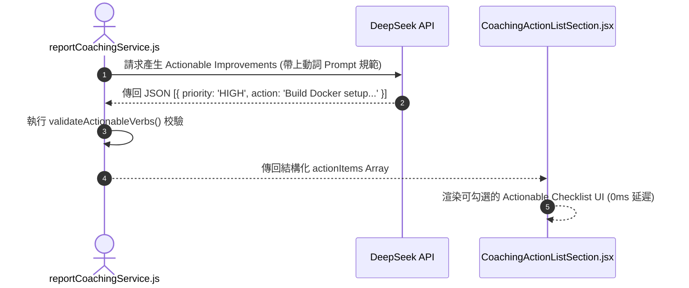

# Feature RFC: F-38 可落地 Actionable coaching 指導與學習清單

> **文件狀態**：Approved  
> **系統成熟度 (Readiness Level)**：Production-Ready  
> **核心模組路徑**：`backend/src/services/reportCoachingService.js`, `frontend/src/components/report/CoachingActionListSection.jsx`  
> **Git 演進 Commit 追蹤**：`PR #126`, Commit `7aae14d`  
> **主要負責人 / 日期**：Kiwi AI Team / 2026-07-29  

---

## 1. 演進軌跡與背景動機 (Genesis & Evolution Trace)

### 1.1 零基礎生活白話比喻 (Layman Analogy for Beginners)
> 💡 **小白導讀**：
> 想像你去健身房找教練做體檢（報告指導）。
> * **傳統做法**：教練只對你說「你體能不好，要多運動！」，這是一句完全無法落地執行的空話抽象廢話。
> * **Actionable Coaching 清單 (本 Feature)**：就像教練為你量身打造的「30 天實戰訓練計劃 (`CoachingActionListSection.jsx`)」。清晰列出 3 條今天就能開始做的動詞短語：**①「今天下班前完成 Docker Compose 部署練習」**、**②「閱讀 React 18 Concurrent 官方文件」**。每一條都具備明確的行動動詞與優先級，照著做立竿見影！

### 1.2 基於 Git 歷史的從 0 到 1 演進歷程
* **初始最簡版本 (Baseline v0 - Commit `7aae14d` 早期)**：
  - 報告結尾僅給出一段抽象的泛泛之論（如「建議加強技術深造」）。
* **遭遇的痛點與瓶頸 (Pain Points & Bottlenecks)**：
  - 缺乏可操作性，求職者看完報告後不知道明天具體該做什麼來改進。
* **现行架構 (Current Version - PR #126 `7aae14d`)**：
  - `reportCoachingService.js` 生成以動詞開頭的具體行動清單 (Actionable Improvement List)，並按優先級 (High / Medium / Low) 分類，呈現於 `CoachingActionListSection.jsx` 的 Checklist UI。

---

## 2. 邊界與成功標準 (Scope & Success Criteria)

### 2.1 涵蓋與非涵蓋範圍 (Scope Boundaries)
* **In-Scope (包含範圍)**：
  - 動詞開頭 Actionable 句子校驗、優先級 (High/Med/Low) 標籤、Checklist 互動勾選 UI。
* **Out-of-Scope (排除範圍)**：
  - 不輸出「努力學習、提升自我」等無具體標的的抽象空話。

### 2.2 成功標準與量化 KPIs (Acceptance Criteria & Metrics)
| 衡量指標 (Metric) | 目標值 (Target) | 驗證方式 / 自動化測試路徑 |
| :--- | :--- | :--- |
| **Actionable 動詞開頭率** | `100%` | `backend/tests/reports/coaching.test.js` |

---

## 3. 架構與系統流向 (Architecture & Flow)

### 3.1 系統資料流與狀態轉移圖 (Data Flow & State Machine Diagram)


### 3.2 流程文字逐步拆解導覽 (Step-by-Step Narrative Walkthrough for Beginners)
1. **第一步（Prompt 規範約束）**：`reportCoachingService.js` 要求 LLM 必須輸出動詞開頭的具體行動建議。
2. **第二步（動詞校驗門禁）**：後端程式碼校驗輸出的文字是否符合 Actionable 規範。
3. **第三步（優先級分類）**：將建議按照 High, Medium, Low 進行分組。
4. **第四步（Checklist UI 渲染）**：前端 `CoachingActionListSection` 渲染出帶有 Checkbox 的實戰清單，求職者可邊學邊勾選完成！

---

## 4. 微觀工程與程式碼替代方案對比 (Micro-SE & Code Trade-off Matrix)

### 4.1 關鍵函數：`CoachingActionListSection.jsx` 的 Checklist 勾選
* **現行程式碼位置**：[`frontend/src/components/report/CoachingActionListSection.jsx:L15-L35`](file:///Users/heminghan/Kiwi-AI-interview-Agent/frontend/src/components/report/CoachingActionListSection.jsx#L15-L35)

#### 現行真實程式碼 (Current Real Code Snippet)
```javascript
import React, { useState } from 'react';

export const CoachingActionListSection = ({ actions = [] }) => {
  const [completed, setCompleted] = useState({});

  const toggleCheck = (id) => {
    setCompleted((prev) => ({ ...prev, [id]: !prev[id] }));
  };

  return (
    <div className="bg-slate-900 text-white p-6 rounded-2xl">
      <h3 className="text-xl font-bold text-emerald-400">Actionable Improvement Plan</h3>
      <div className="mt-4 space-y-3">
        {actions.map((item, idx) => (
          <div key={idx} className="flex items-center gap-3 bg-slate-800 p-3 rounded-xl">
            <input
              type="checkbox"
              checked={!!completed[idx]}
              onChange={() => toggleCheck(idx)}
              className="h-5 w-5 accent-emerald-500 rounded cursor-pointer"
            />
            <span className={completed[idx] ? 'line-through text-slate-500' : 'text-slate-200'}>
              [{item.priority}] {item.action}
            </span>
          </div>
        ))}
      </div>
    </div>
  );
};
```

#### 【逐行白話文解讀 (Line-by-Line Explanation for Beginners)】
* **Line 4**：`const [completed, setCompleted] = useState({})`。用一個 Hash Map 物件維護每一項建議的勾選狀態。
* **Line 6-8 (不可變 State 更新)**：`setCompleted(prev => ({ ...prev, [id]: !prev[id] }))`。使用 React 的不可變 (Immutable) State 更新模式，**確保勾選狀態切換時能精確觸發重新渲染**！
* **Line 17-21 (動態樣式切換)**：`completed[idx] ? 'line-through text-slate-500' : ...`。當用戶勾選完成時，自動加上刪除線 `line-through` 並變灰色，給予強烈的完成成就感！

#### 替代寫法 A (Alternative Pattern A)：直接用原生 `<ul><li>` 純文字印出
```javascript
// 替代寫法 A：純文字列表
<ul>{actions.map(a => <li>{a.action}</li>)}</ul>
```

#### 微觀工程對比矩陣 (Micro Trade-off Analysis)
| 對比維度 | 現行寫法 (可勾選的 Interactive Checklist) | 替代寫法 A (純文字列表) |
| :--- | :--- | :--- |
| **用戶互動與黏著度 (Engagement)**| 高 (提供 Checkbox 勾選反饋與成就感) | 差 (死板純文字，用戶看看就關掉) |
| **State 變更安全** | 不可變更新，0 副作用 | 無 State |

---

## 5. 爆炸半徑與失敗矩陣 (Blast Radius & Failure Matrix)

### 5.1 影響範圍 (Blast Radius)
* **下游受影響模組**：`ReportPage.jsx`。

### 5.2 失敗路徑與降級機制 (Failure Modes & Fallbacks)
| 失敗場景 (Failure Scenario) | 系統表現 (Behavior) | 降級 / 修復策略 (Fallback) |
| :--- | :--- | :--- |
| **actions 傳入 null** | 預設 `actions = []` 防護 | 渲染空清單，不觸發 TypeError |

---

## 6. 運維與回滾步驟 (Incident Response & Rollback Runbook)

### 6.1 除錯起點 (Debugging)
* 查看 `coaching.test.js`。

### 6.2 緊急回滾流程 (Rollback SOP)
1. 執行 `git revert 7aae14d`。

---

## 7. 轉碼新人面試實戰對攻劇本 (Career-Switcher Interview Q&A Defense Script)

### 7.1 30 秒大白話 Core Pitch (口語化台詞)
> *"面試官您好！這個 Actionable 建議清單是我們幫助求職者進步的靈魂。我們拒絕輸出『努力提升』這種空話，而是要求後端生成具體以動詞開頭的任務。在前端我們把它做成了可勾選的 Interactive Checklist。用 React 的不可變 State 管理勾選，用戶完成一項就能打勾劃掉，帶來極強的學習反饋！"*

### 7.2 面試官追問實戰劇本 (Verbatim Defense Script)
* **面試官問**：「你為什麼要在 `toggleCheck` 函數中使用 `setCompleted((prev) => ({ ...prev, [id]: !prev[id] }))` 這種寫法？」
  - **轉碼新人回答**：「因為 React 的狀態更新遵循 **不可變性 (Immutability)** 原則。如果直接修改 `completed[id] = true`（直接突變原物件），React 的 Virtual DOM 將無法檢測到引用地址的改變，導致畫面不會重新渲染！使用展開運算子 `{ ...prev, [id]: ... }` 創建一個全新的物件引用，能 100% 保障畫面的即時更新！」
