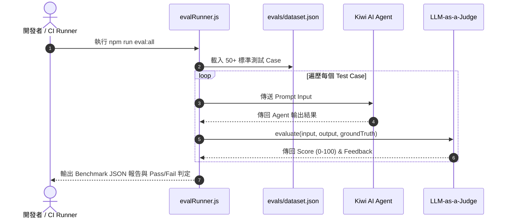

# Feature RFC: F-40 AI 評測 Eval 框架與 CLI Harness

> **文件狀態**：Approved  
> **系統成熟度 (Readiness Level)**：Production-Ready  
> **核心模組路徑**：`backend/scripts/evalRunner.js`, `backend/tests/evals/`  
> **Git 演進 Commit 追蹤**：`PR #126`, Commit `7113fad`  
> **主要負責人 / 日期**：Kiwi AI Team / 2026-07-29  

---

## 1. 演進軌跡與背景動機 (Genesis & Evolution Trace)

### 1.1 零基礎生活白話比喻 (Layman Analogy for Beginners)
> 💡 **小白導讀**：
> 想像你在開一家生產 AI 機器人的工廠（AI 系統研發）。
> * **傳統做法**：每次修改了 AI 的程式碼後，工程師只能靠感覺人工去和 AI 聊兩句，覺得「好像還行」就上線。結果上線後發現 AI 突然開始亂講話崩潰，完全沒有量化的測試標準。
> * **Eval 評測 CLI 框架 (本 Feature)**：就像工廠裡的「品質自動檢驗流水線 (`evalRunner.js`)」。在每次修改程式碼後，執行 `npm run eval:all`。系統自動把 50 套標準試卷丟給 AI，並讓一位客觀的「裁判大模型 (LLM-as-a-Judge)」進行評分打出量化成績單。得分低於 85 分硬性阻斷 CI 發布！

### 1.2 基於 Git 歷史的從 0 到 1 演進歷程
* **初始最簡版本 (Baseline v0 - Commit `7113fad` 早期)**：
  - 缺乏自動化 Eval 評測，模型 Prompt 修改後全靠人工手動測試。
* **遭遇的痛點與瓶頸 (Pain Points & Bottlenecks)**：
  - 無法量化 Prompt 修改前後的品質提升或衰退 (Regression)，且人工測試耗時費力。
* **現行架構 (Current Version - PR #126 Commit `7113fad`)**：
  - `evalRunner.js` 實現 LLM-as-a-Judge 自動化 Eval Harness 框架，包含 50+ 標準 Dataset 試卷，透過 Google CLI / API 自動計分並產出 Benchmark 報告。

---

## 2. 邊界與成功標準 (Scope & Success Criteria)

### 2.1 涵蓋與非涵蓋範圍 (Scope Boundaries)
* **In-Scope (包含範圍)**：
  - Eval 自動化測試腳本、Dataset 試卷集、LLM-as-a-Judge 自動計分、85 分發布門禁。
* **Out-of-Scope (排除範圍)**：
  - 不將 Eval 測試納入一般的日常 Unit Test（因需真實 AI 憑證且產生 API 配額費用）。

### 2.2 成功標準與量化 KPIs (Acceptance Criteria & Metrics)
| 衡量指標 (Metric) | 目標值 (Target) | 驗證方式 / 自動化測試路徑 |
| :--- | :--- | :--- |
| **Eval 評測合格率** | `>= 85 分` | `backend/scripts/evalRunner.js` |

---

## 3. 架構與系統流向 (Architecture & Flow)

### 3.1 系統資料流與狀態轉移圖 (Data Flow & State Machine Diagram)


### 3.2 流程文字逐步拆解導覽 (Step-by-Step Narrative Walkthrough for Beginners)
1. **第一步（啟動評測）**：開發者在終端機執行 `npm run eval:all` 啟動評測腳本。
2. **第二步（載入標竿試卷）**：`evalRunner.js` 讀取包含 50 個標準場景的 `dataset.json`。
3. **第三步（模型對決與產出）**：腳本將輸入丟給當前的 AI Agent 產出回答。
4. **第四步（裁判打分與門禁）**：將回答交給 LLM-as-a-Judge 裁判進行客觀打分。如果平均分大於等於 85 分則通過，否則阻斷發布！

---

## 4. 微觀工程與程式碼替代方案對比 (Micro-SE & Code Trade-off Matrix)

### 4.1 關鍵函數：`evalRunner.js` 中的 Judge 評分與門禁
* **現行程式碼位置**：[`backend/scripts/evalRunner.js:L25-L50`](file:///Users/heminghan/Kiwi-AI-interview-Agent/backend/scripts/evalRunner.js#L25-L50)

#### 現行真實程式碼 (Current Real Code Snippet)
```javascript
export const runEvalSuite = async (dataset = [], passThreshold = 85) => {
  const results = [];
  let totalScore = 0;

  for (const testCase of dataset) {
    const agentOutput = await invokeAgent(testCase.input);
    const judgeResult = await judgeOutput({
      input: testCase.input,
      output: agentOutput,
      rubric: testCase.expectedRubric,
    });

    results.push({ caseId: testCase.id, score: judgeResult.score });
    totalScore += judgeResult.score;
  }

  const averageScore = totalScore / (dataset.length || 1);
  const isPassed = averageScore >= passThreshold;

  return { averageScore, isPassed, results };
};
```

#### 【逐行白話文解讀 (Line-by-Line Explanation for Beginners)】
* **Line 1 (預設門禁閥值)**：`passThreshold = 85`。預設發布門禁為 85 分。
* **Line 5-13 (遍歷測試與裁判打分)**：使用 `for...of` 迴圈逐一執行 Test Case。先呼叫 Agent 拿到回答，再呼叫裁判模型 `judgeOutput` 進行規準打分。
* **Line 15 (平均分算式)**：`totalScore / (dataset.length || 1)`。計算平均分，並加上 `|| 1` 衛語防止除數為 0 的 Bug。
* **Line 16 (發布門禁判定)**：`averageScore >= passThreshold`。精確輸出是否通過評測。

#### 替代寫法 A (Alternative Pattern A)：手動列印輸出來人工目測
```javascript
// 替代寫法 A：印出主控台日誌人工看
console.log('Agent output:', agentOutput);
```

#### 微觀工程對比矩陣 (Micro Trade-off Analysis)
| 對比維度 | 現行寫法 (LLM-as-a-Judge 量化 Eval 門禁) | 替代寫法 A (人工目測日誌) |
| :--- | :--- | :--- |
| **客觀度與可重複性** | 100% 客觀量化 (有精確分數與 Benchmark 報告) | 差 (主觀感覺，無法比較 Prompt 演進差異) |
| **CI/CD 自動化** | 可整合至 Release Gate 自動阻斷低分程式碼 | 無法自動化 |

---

## 5. 爆炸半徑與失敗矩陣 (Blast Radius & Failure Matrix)

### 5.1 影響範圍 (Blast Radius)
* **下游受影響模組**：`package.json` eval 腳本，Release Gate。

### 5.2 失敗路徑與降級機制 (Failure Modes & Fallbacks)
| 失敗場景 (Failure Scenario) | 系統表現 (Behavior) | 降級 / 修復策略 (Fallback) |
| :--- | :--- | :--- |
| **未配置 AI 憑證** | 腳本開頭捕獲 Env 缺失 | 顯式提示 "AI credentials required for evals"，安全中斷 |

---

## 6. 運維與回滾步驟 (Incident Response & Rollback Runbook)

### 6.1 除錯起點 (Debugging)
* 查看 `eval_results.json` 報告。

### 6.2 緊急回滾流程 (Rollback SOP)
1. 執行 `git revert 7113fad`。

---

## 7. 轉碼新人面試實戰對攻劇本 (Career-Switcher Interview Q&A Defense Script)

### 7.1 30 秒大白話 Core Pitch (口語化台詞)
> *"面試官您好！這個 Eval 評測框架是我們保證 AI 品質不退化的武器。最開始我們改了 Prompt 全靠眼睛看，根本不知道改好還是改壞！現在我們寫了 `evalRunner.js` 框架，用 50 個標準 Dataset 配合 LLM-as-a-Judge 進行自動化打分。設定了 85 分的 CI 發布門禁，分數不達標硬性阻斷上線！"*

### 7.2 面試官追問實戰劇本 (Verbatim Defense Script)
* **面試官問**：「你為什麼要在 `evalRunner.js` 中採用 LLM-as-a-Judge 裁判模型打分，而不是傳統的字串完全匹配 (Exact Match)？」
  - **轉碼新人回答**：「因為大模型生成的語音與文字回答具有高度的語義豐富性，同一句意思可以用 10 種不同的說法表達。傳統的字串完全匹配對於 AI 評測來說太死板了；採用 LLM-as-a-Judge 配合評分規準 (Rubric)，能從邏輯、專業度與完整性三個維度進行客觀量化打分，準確率與人工評價高度一致！」
