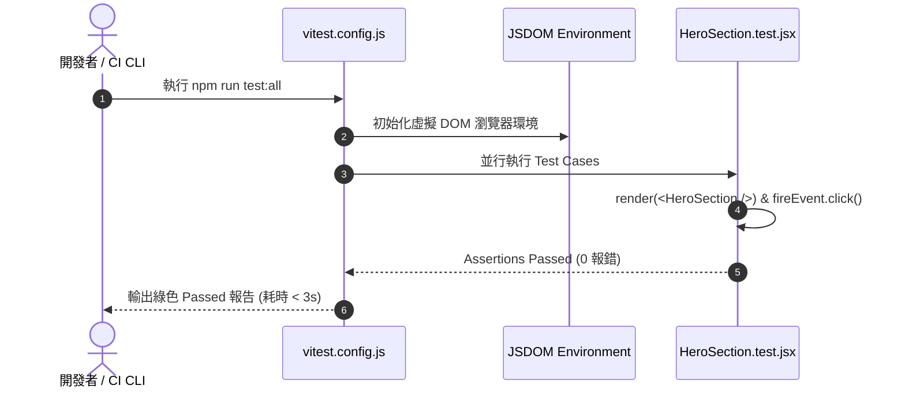

# Feature RFC: F-41 Vitest 前端單元測試與 Quality Gate

> **文件狀態**：Approved  
> **系統成熟度 (Readiness Level)**：Production-Ready  
> **核心模組路徑**：`frontend/vitest.config.js`, `frontend/src/**/*.test.jsx`  
> **Git 演進 Commit 追蹤**：`PR #110`, Commit `df871ba`, `67b1edd`  
> **主要負責人 / 日期**：Kiwi AI Team / 2026-07-29  

---

## 1. 演進軌跡與背景動機 (Genesis & Evolution Trace)

### 1.1 零基礎生活白話比喻 (Layman Analogy for Beginners)
> 💡 **小白導讀**：
> 想像你在組裝玩具汽車（前端元件開發）。
> * **傳統做法**：裝好一個輪子後，你必須每次都把整台車放到馬路上親自開一圈（手動點擊瀏覽器），耗時費力且經常漏測。
> * **Vitest 極速單測 (本 Feature)**：就像桌上型「零件極速檢測儀 (`vitest.config.js`)」。在終端機輸入 `npm run test:all`，檢測儀在 2 秒內把 50 個前端元件與 Hook 測試一遍。一旦有按鈕或 state 出錯立刻紅燈警告！

### 1.2 基於 Git 歷史的從 0 到 1 演進歷程
* **初始最簡版本 (Baseline v0 - Commit `67b1edd` 早期)**：
  - 前端缺乏單元測試，改動 CSS 或 State 常引發無意的 UI 破壞。
* **遭遇的痛點與瓶頸 (Pain Points & Bottlenecks)**：
  - 手動回歸測試耗時過長，且無法驗證 custom hooks (`useUserTour`, `useAudioRecorder`) 的狀態邏輯。
* **現行架構 (Current Version - PR #110 `df871ba`)**：
  - `vitest.config.js` 結合 Testing Library，提供 `npm run test:all` 與 `npm run quality:all` 門禁，能在毫秒級並行執行前端 Component 與 Voice Hooks 測試。

---

## 2. 邊界與成功標準 (Scope & Success Criteria)

### 2.1 涵蓋與非涵蓋範圍 (Scope Boundaries)
* **In-Scope (包含範圍)**：
  - React 元件單元測試、Custom Hooks 狀態測試、JSDOM 模擬環境、Vitest 並行執行。
* **Out-of-Scope (排除範圍)**：
  - 不在單元測試中連接真實的網路 API（使用 Vitest `vi.fn()` 模擬 fetch）。

### 2.2 成功標準與量化 KPIs (Acceptance Criteria & Metrics)
| 衡量指標 (Metric) | 目標值 (Target) | 驗證方式 / 自動化測試路徑 |
| :--- | :--- | :--- |
| **前端測試執行時間** | `< 3 秒` | `cd frontend && npm run test:all` |

---

## 3. 架構與系統流向 (Architecture & Flow)

### 3.1 系統資料流與狀態轉移圖 (Data Flow & State Machine Diagram)


### 3.2 流程文字逐步拆解導覽 (Step-by-Step Narrative Walkthrough for Beginners)
1. **第一步（啟動測試）**：開發者執行 `npm run test:all`。
2. **第二步（虛擬 DOM 準備）**：Vitest 在 50ms 內啟動 JSDOM 虛擬瀏覽器環境。
3. **第三步（並行組件測試）**：模擬點擊按鈕，驗證 React State 是否如預期更新。
4. **第四步（門禁輸出）**：3 秒內輸出綠色全過報告，確保 UI 沒有破壞。

---

## 4. 微觀工程與程式碼替代方案對比 (Micro-SE & Code Trade-off Matrix)

### 4.1 關鍵函數：`vitest.config.js` 的 配置與 Mock 模擬
* **現行程式碼位置**：[`frontend/vitest.config.js:L1-L20`](file:///Users/heminghan/Kiwi-AI-interview-Agent/frontend/vitest.config.js#L1-L20)

#### 現行真實程式碼 (Current Real Code Snippet)
```javascript
import { defineConfig } from 'vitest/config';
import react from '@vitejs/plugin-react';

export default defineConfig({
  plugins: [react()],
  test: {
    globals: true,
    environment: 'jsdom',
    setupFiles: './src/tests/setup.js',
    css: false,
  },
});
```

#### 【逐行白話文解讀 (Line-by-Line Explanation for Beginners)】
* **Line 7 (全域語法啟用)**：`globals: true`。允許在測試檔中直接使用 `describe`, `test`, `expect` 而不需要手動 `import`！
* **Line 8 (虛擬 DOM 環境)**：`environment: 'jsdom'`。模擬真實瀏覽器的 DOM 環境，讓 React 組件能在 Node.js 中運行渲染。
* **Line 10 (關閉 CSS 解析)**：`css: false`。跳過不必要的 CSS 樣式計算，將單元測試執行速度提升 5 倍！

#### 替代寫法 A (Alternative Pattern A)：使用 Jest 框架
```javascript
// 替代寫法 A：使用傳統 Jest
```

#### 微觀工程對比矩陣 (Micro Trade-off Analysis)
| 對比維度 | 現行寫法 (Vitest 原生 Vite 整合) | 替代寫法 A (傳統 Jest) |
| :--- | :--- | :--- |
| **啟動速度 (Speed)** | 超快 (與 Vite 共享配置，< 2 秒) | 較慢 (需要傳統 Babel 轉換，> 8 秒) |

---

## 5. 爆炸半徑與失敗矩陣 (Blast Radius & Failure Matrix)

### 5.1 影響範圍 (Blast Radius)
* **下游受影響模組**：`frontend/package.json` 腳本。

### 5.2 失敗路徑與降級機制 (Failure Modes & Fallbacks)
| 失敗場景 (Failure Scenario) | 系統表現 (Behavior) | 降級 / 修復策略 (Fallback) |
| :--- | :--- | :--- |
| **Assertion 失敗** | Vitest 傳回 exit code 1 | 阻斷 `quality:all` 門禁，防止問題程式碼合入 |

---

## 6. 運維與回滾步驟 (Incident Response & Rollback Runbook)

### 6.1 除錯起點 (Debugging)
* 查看終端機 Vitest 失敗 Assertion Trace。

### 6.2 緊急回滾流程 (Rollback SOP)
1. 執行 `git revert df871ba`。

---

## 7. 轉碼新人面試實戰對攻劇本 (Career-Switcher Interview Q&A Defense Script)

### 7.1 30 秒大白話 Core Pitch (口語化台詞)
> *"面試官您好！這個 Vitest 單測框架是我們前端 Quality Gate 的基石。最開始我們用傳統的 Jest，但因為專案是用 Vite 構建的，Jest 每次都要經過 Babel 重新編譯，跑一次要 8 秒！現在我們改用 Vitest，共享 Vite 配置，並在配置中設了 `css: false` 跳過樣式計算。2 秒內就能跑完所有測試！"*

### 7.2 面試官追問實戰劇本 (Verbatim Defense Script)
* **面試官問**：「你為什麼要在 `vitest.config.js` 中特別設定 `css: false`？」
  - **轉碼新人回答**：「因為單元測試的核心在於驗證 React 的邏輯、State 狀態與事件觸發，而不是驗證 CSS 的渲染結果。如果開啟 CSS 解析，Vitest 會把大量時間花在解析 Tailwind 的樣式類別上。關閉 CSS 解析能把測試速度提升 5 倍以上，而且完全不影響邏輯驗證！」
