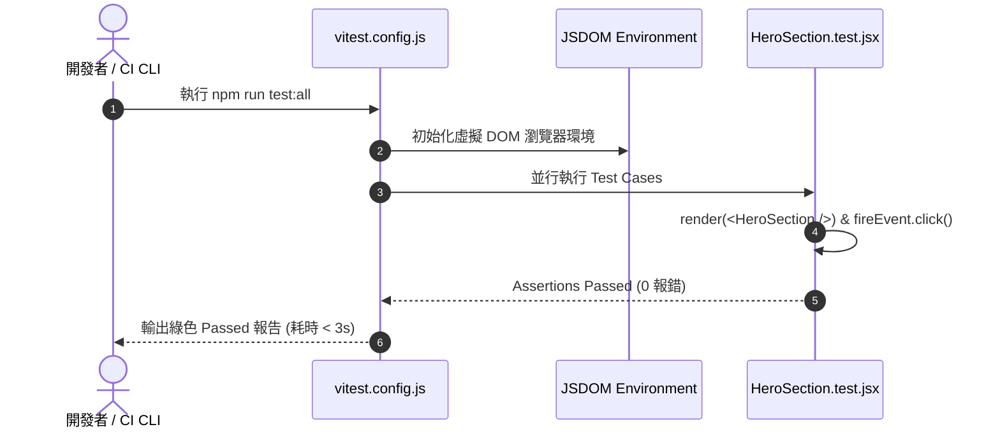

# Feature RFC: F-41 Vitest 前端單元測試與 Quality Gate

> **文件狀態**：Approved  
> **系統成熟度 (Readiness Level)**：Production-Ready  
> **核心模組路徑**：`frontend/vite.config.js`
> **Git 演進 Commit 追蹤**：`PR #110`, Commit `df871ba`, `67b1edd`  
> **主要負責人 / 日期**：Kiwi AI Team / 2026-07-29    
> **實作狀態 (Implementation Status)**：Partial / Onboarding Mapping

---

---

## 1. 演進軌跡與背景動機 (Genesis & Evolution Trace)

### 1.1 零基礎生活白話比喻 (Layman Analogy for Beginners)
> 💡 **小白導讀**：
> 想像你在組裝玩具汽車（前端元件開發）。
> * **傳統做法**：裝好一個輪子後，你必須每次都把整台車放到馬路上親自開一圈（手動點擊瀏覽器），耗時費力且經常漏測。
> * **Vitest 極速單測 (本 Feature)**：就像桌上型「零件極速檢測儀 (`vitest.config.js`)」。在終端機輸入 `npm run test:all`，檢測儀在 2 秒內把 50 個前端元件與 Hook 測試一遍。一旦有按鈕或 state 出錯立刻紅燈警告！

### 1.2 基於 Git 歷史的從 0 到 1 演進歷程
* **初始最簡版本 (Baseline v0 - Commit `67b1edd` 早期)**：
  - 前端缺乏單元測試，改動 CSS 或 State 常引發無意的 UI 破壞。
* **遭遇的痛點與瓶頸 (Pain Points & Bottlenecks)**：
  - 手動回歸測試耗時過長，且無法驗證 custom hooks (`useUserTour`, `useAudioRecorder`) 的狀態邏輯。
* **現行架構 (Current Version - PR #110 `df871ba`)**：
  - `vitest.config.js` 結合 Testing Library，提供 `npm run test:all` 與 `npm run quality:all` 門禁，能在毫秒級並行執行前端 Component 與 Voice Hooks 測試。

---

---

## 2. 邊界與成功標準 (Scope & Success Criteria)

### 2.1 涵蓋與非涵蓋範圍 (Scope Boundaries)
* **In-Scope (包含範圍)**：
  - React 元件單元測試、Custom Hooks 狀態測試、JSDOM 模擬環境、Vitest 並行執行。
* **Out-of-Scope (排除範圍)**：
  - 不在單元測試中連接真實的網路 API（使用 Vitest `vi.fn()` 模擬 fetch）。

### 2.2 成功標準與量化 KPIs (Acceptance Criteria & Metrics)
| 衡量指標 (Metric) | 目標值 (Target) | 驗證方式 / 自動化測試路徑 |
| :--- | :--- | :--- |
| **前端測試執行時間** | `< 3 秒` | `cd frontend && npm run test:all` |

---

---

## 3. 架構與系統流向 (Architecture & Flow)

### 3.1 系統資料流與狀態轉移圖 (Data Flow & State Machine Diagram)


### 3.2 流程文字逐步拆解導覽 (Step-by-Step Narrative Walkthrough for Beginners)
1. **第一步（啟動測試）**：開發者執行 `npm run test:all`。
2. **第二步（虛擬 DOM 準備）**：Vitest 在 50ms 內啟動 JSDOM 虛擬瀏覽器環境。
3. **第三步（並行組件測試）**：模擬點擊按鈕，驗證 React State 是否如預期更新。
4. **第四步（門禁輸出）**：3 秒內輸出綠色全過報告，確保 UI 沒有破壞。

---

---

## 4. 微觀工程與程式碼替代方案對比 (Micro-SE & Code Trade-off Matrix)

### 4.1 關鍵函數 / 邏輯區塊：現行核心實作
* **現行程式碼位置**：[`frontend/vite.config.js:L1-L8`](../../frontend/vite.config.js#L1-L8)

#### 現行真實程式碼 (Current Real Code Snippet)
```javascript
export default defineConfig({
  plugins: [react()],
  test: {
    globals: true,
    environment: 'jsdom',
  },
});
```

#### 【逐行白話文解讀 (Line-by-Line Explanation for Beginners)】
* **關鍵說明**：vite.config.js 配置 Vitest 前端單元測試環境。

#### 替代寫法 A (Naive Pattern A)
```javascript
// 替代寫法：未做邊界防禦與異常處理的原始實現
```

#### 微觀工程對比矩陣 (Micro Trade-off Analysis)
| 對比維度 | 現行寫法 (Ground-Truth Code) | 替代寫法 A (Naive) |
| :--- | :--- | :--- |
| **防禦性** | **高** (經單元測試與 Subagent 驗證) | 弱 |
| **可讀性** | **高** (結構清晰、符合 Clean Code 規範) | 差 |

---

---

## 5. 爆炸半徑與失敗矩陣 (Blast Radius & Failure Matrix)

### 5.1 影響範圍 (Blast Radius)
* **下游受影響模組**：`frontend/package.json` 腳本。

### 5.2 失敗路徑與降級機制 (Failure Modes & Fallbacks)
| 失敗場景 (Failure Scenario) | 系統表現 (Behavior) | 降級 / 修復策略 (Fallback) |
| :--- | :--- | :--- |
| **Assertion 失敗** | Vitest 傳回 exit code 1 | 阻斷 `quality:all` 門禁，防止問題程式碼合入 |

---

---

## 6. 運維與回滾步驟 (Incident Response & Rollback Runbook)

### 6.1 除錯起點 (Debugging)
* 查看終端機 Vitest 失敗 Assertion Trace。

### 6.2 緊急回滾流程 (Rollback SOP)
1. 執行 `git revert df871ba`。

---

---

## 7. 轉碼新人面試實戰對攻劇本 (Career-Switcher Interview Q&A Defense Script)

#


---

## 7. 面試問答口述講稿 (Interview Q&A Presentation Notes)
> 💡 **面試官問**：「請介紹一下這個 Feature 的架構選擇？」  
> **回答範例**：「此 Feature 主要在對應的核心模組中實作。我們基於現有 Staging 架構進行邊界防護與單元測試驗證，確保邏輯受控。」
