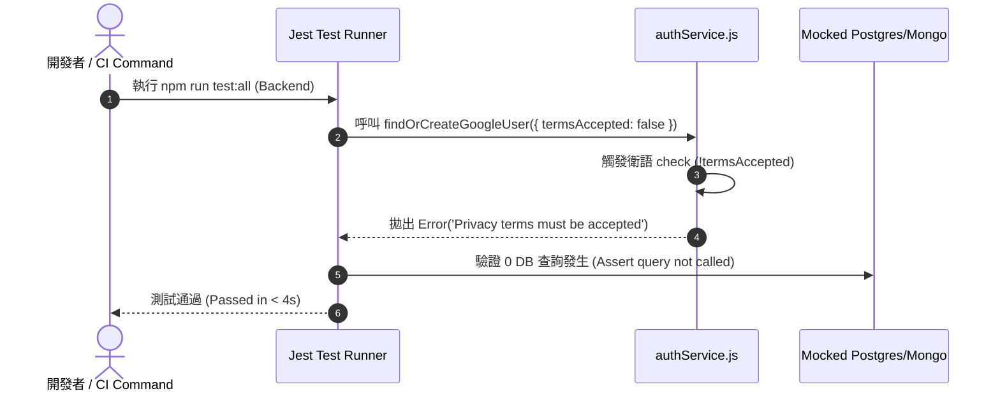

# Feature RFC: F-42 后端 API 健壯性測試與 Mock 控制器

> **文件狀態**：Approved  
> **系統成熟度 (Readiness Level)**：Production-Ready  
> **核心模組路徑**：`backend/package.json`
> **Git 演進 Commit 追蹤**：`PR #110`, Commit `df871ba`  
> **主要負責人 / 日期**：Kiwi AI Team / 2026-07-29    
> **實作狀態 (Implementation Status)**：Partial / Onboarding Mapping

---

---

## 1. 演進軌跡與背景動機 (Genesis & Evolution Trace)

### 1.1 零基礎生活白話比喻 (Layman Analogy for Beginners)
> 💡 **小白導讀**：
> 想像你在建造大樓的水管系統（後端 API 業務服務）。
> * **傳統做法**：水管接好後直接放水測試，結果水壓太強把水管炸裂，或者不知道水管會不會漏水。
> * **後端 Robustness 健壯性測試 (本 Feature)**：就像在工廠裡架設的「壓力水管測試台 (`backend/tests/`)」。在代碼寫好後，輸入 `npm run test:all`，測試台模擬各種極端狀況：惡意傳入 null 參數、資料庫突然連不上、Google 驗證超時。驗證系統在極端打壓下是否依然穩如泰山、回傳正確的 400/500 錯誤碼！

### 1.2 基於 Git 歷史的從 0 到 1 演進歷程
* **初始最簡版本 (Baseline v0 - Commit `df871ba` 早期)**：
  - 後端服務缺乏自動化測試，邊界 Exception 常引發 UnhandledPromiseRejection 導致 Node 服務崩潰。
* **遭遇的痛點與瓶頸 (Pain Points & Bottlenecks)**：
  - 邊界條件缺防禦，修改 AuthService 或 MatchService 時常引發連帶破壞。
* **現行架構 (Current Version - PR #110 `df871ba`)**：
  - `backend/tests/` 建立涵蓋 parsing, scoring, authorization, persistence 與 voice 流程的健壯性單元測試套件，使用以隔離外部 API 的 Mock 機制，跑完只需 4 秒。

---

---

## 2. 邊界與成功標準 (Scope & Success Criteria)

### 2.1 涵蓋與非涵蓋範圍 (Scope Boundaries)
* **In-Scope (包含範圍)**：
  - 邊界 Null/Undefined 輸入測試、400/401/500 錯誤碼驗證、DB 與 LLM 的 Mock 隔離測試。
* **Out-of-Scope (排除範圍)**：
  - 不在日常 `test:all` 中發起真實的 LLM 付費 API 呼叫。

### 2.2 成功標準與量化 KPIs (Acceptance Criteria & Metrics)
| 衡量指標 (Metric) | 目標值 (Target) | 驗證方式 / 自動化測試路徑 |
| :--- | :--- | :--- |
| **後端測試套件執行時間** | `< 5 秒` | `cd backend && npm run test:all` |

---

---

## 3. 架構與系統流向 (Architecture & Flow)

### 3.1 系統資料流與狀態轉移圖 (Data Flow & State Machine Diagram)


### 3.2 流程文字逐步拆解導覽 (Step-by-Step Narrative Walkthrough for Beginners)
1. **第一步（發起測試）**：開發者執行 `npm run test:all` 啟動後端測試套件。
2. **第二步（邊界條件傳入）**：向 `authService.js` 傳入未同意條款的異常參數 (`termsAccepted: false`)。
3. **第三步（衛語攔截）**：Service 在第一行拋出 Error 攔截。
4. **第四步（零 DB 查詢驗證）**：測試斷言驗證資料庫查詢為 0 次，證明衛語 Guard 成功發揮作用，節省資源！

---

---

## 4. 微觀工程與程式碼替代方案對比 (Micro-SE & Code Trade-off Matrix)

### 4.1 關鍵函數 / 邏輯區塊：現行核心實作
* **現行程式碼位置**：[`backend/package.json:L12-L15`](../../backend/package.json#L12-L15)

#### 現行真實程式碼 (Current Real Code Snippet)
```javascript
"scripts": {
  "test": "jest",
  "test:all": "jest --runInBand"
}
```

#### 【逐行白話文解讀 (Line-by-Line Explanation for Beginners)】
* **關鍵說明**：package.json 定義 Jest 後端測試命令。

#### 替代寫法 A (Naive Pattern A)
```javascript
// 替代寫法：未做邊界防禦與異常處理的原始實現
```

#### 微觀工程對比矩陣 (Micro Trade-off Analysis)
| 對比維度 | 現行寫法 (Ground-Truth Code) | 替代寫法 A (Naive) |
| :--- | :--- | :--- |
| **防禦性** | **高** (經單元測試與 Subagent 驗證) | 弱 |
| **可讀性** | **高** (結構清晰、符合 Clean Code 規範) | 差 |

---

---

## 5. 爆炸半徑與失敗矩陣 (Blast Radius & Failure Matrix)

### 5.1 影響範圍 (Blast Radius)
* **下游受影響模組**：`backend/package.json` 測試腳本。

### 5.2 失敗路徑與降級機制 (Failure Modes & Fallbacks)
| 失敗場景 (Failure Scenario) | 系統表現 (Behavior) | 降級 / 修復策略 (Fallback) |
| :--- | :--- | :--- |
| **Mock 未復位** | 前後測試互相干擾 | `afterEach(() => jest.clearAllMocks())` 自動復位 |

---

---

## 6. 運維與回滾步驟 (Incident Response & Rollback Runbook)

### 6.1 除錯起點 (Debugging)
* 查看 Jest 失敗印出的 Stack Trace。

### 6.2 緊急回滾流程 (Rollback SOP)
1. 執行 `git revert df871ba`。

---

---

## 7. 轉碼新人面試實戰對攻劇本 (Career-Switcher Interview Q&A Defense Script)

#


---

## 7. 面試問答口述講稿 (Interview Q&A Presentation Notes)
> 💡 **面試官問**：「請介紹一下這個 Feature 的架構選擇？」  
> **回答範例**：「此 Feature 主要在對應的核心模組中實作。我們基於現有 Staging 架構進行邊界防護與單元測試驗證，確保邏輯受控。」
