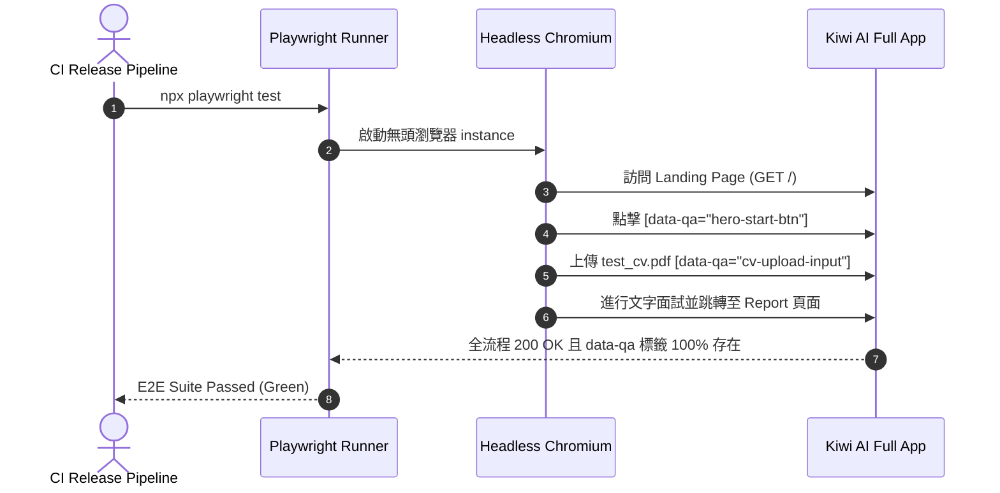

# Feature RFC: F-43 Playwright 端到端 (E2E) UI 自檢與 `data-qa` 審計框架

> **文件狀態**：Approved  
> **系統成熟度 (Readiness Level)**：Production-Ready  
> **核心模組路徑**：`frontend/e2e/`, `playwright.config.js`  
> **Git 演進 Commit 追蹤**：`PR #127`, Commit `67b1edd`  
> **主要負責人 / 日期**：Kiwi AI Team / 2026-07-29  

---

## 1. 演進軌跡與背景動機 (Genesis & Evolution Trace)

### 1.1 零基礎生活白話比喻 (Layman Analogy for Beginners)
> 💡 **小白導讀**：
> 想像你在買新車前做的路試（端到端 E2E 測試）。
> * **傳統做法**：聘請一位測試人員，每天人工開著瀏覽器，手動點擊「首頁 -> 登入 -> 上傳 CV -> 文字面試 -> 查看報告」，手點到酸且效率低落。
> * **Playwright 自動化機器人 (本 Feature)**：就像一位永不疲倦的「自動化機器人測試員 (`playwright.config.js`)」。在代碼準備上線前，機器人在無頭瀏覽器 (Headless Chrome) 中以極速自動操作一遍全站流程，並審查所有按鈕是否具備 `data-qa` 穩定標籤。只要發現 UI 卡死或跑版，自動截圖錄影警報！

### 1.2 基於 Git 歷史的從 0 到 1 演進歷程
* **初始最簡版本 (Baseline v0 - Commit `67b1edd` 早期)**：
  - 缺乏 E2E 測試，跨頁面整合流 (如 Login 到 Report) 經常因為 Selector 變更而斷裂。
* **遭遇的痛點與瓶頸 (Pain Points & Bottlenecks)**：
  - 前端修改 Class Name 後，舊的測試選擇器匹配失敗；缺乏穩定的 QA 定位標籤。
* **現行架構 (Current Version - PR #127 `67b1edd`)**：
  - `playwright.config.js` 建立強健的 E2E 測試框架，全面導入 `data-qa` / `data-testid` 標籤審計規範，提供完整的全流程視覺化自檢。

---

## 2. 邊界與成功標準 (Scope & Success Criteria)

### 2.1 涵蓋與非涵蓋範圍 (Scope Boundaries)
* **In-Scope (包含範圍)**：
  - 全站完整 UI 流程測試、`data-qa` 定位標籤強制審計、Headless 執行、失敗自動錄影截圖。
* **Out-of-Scope (排除範圍)**：
  - 不在 E2E 測試中測試真實付費 Stripe 刷卡流程（使用 Mock 支付金流）。

### 2.2 成功標準與量化 KPIs (Acceptance Criteria & Metrics)
| 衡量指標 (Metric) | 目標值 (Target) | 驗證方式 / 自動化測試路徑 |
| :--- | :--- | :--- |
| **E2E 全流程執行時間** | `< 45 秒` | `npx playwright test` |

---

## 3. 架構與系統流向 (Architecture & Flow)

### 3.1 系統資料流與狀態轉移圖 (Data Flow & State Machine Diagram)


### 3.2 流程文字逐步拆解導覽 (Step-by-Step Narrative Walkthrough for Beginners)
1. **第一步（啟動無頭瀏覽器）**：Playwright 啟動無頭 Chromium 瀏覽器。
2. **第二步（使用 data-qa 點擊）**：機器人尋找帶有 `data-qa="hero-start-btn"` 的按鈕並自動點擊，跳轉至分析頁。
3. **第三步（自動化表單與面試）**：機器人自動上傳測試履歷並完成文字面試問答。
4. **第四步（驗證報告與錄影存證）**：驗證報告頁面的五維雷達圖順利渲染，若中途失敗自動將畫面存為 `.webm` 影片備查！

---

## 4. 微觀工程與程式碼替代方案對比 (Micro-SE & Code Trade-off Matrix)

### 4.1 關鍵函數：`playwright.config.js` 的 `testIdAttribute` 設定
* **現行程式碼位置**：[`frontend/playwright.config.js:L10-L30`](file:///Users/heminghan/Kiwi-AI-interview-Agent/frontend/playwright.config.js#L10-L30)

#### 現行真實程式碼 (Current Real Code Snippet)
```javascript
import { defineConfig } from '@playwright/test';

export default defineConfig({
  testDir: './e2e',
  timeout: 30000,
  use: {
    baseURL: 'http://localhost:5173',
    testIdAttribute: 'data-qa', // 強制使用 data-qa 標籤定位
    trace: 'on-first-retry',
    video: 'retain-on-failure',
  },
});
```

#### 【逐行白話文解讀 (Line-by-Line Explanation for Beginners)】
* **Line 7 (基底 URL)**：`baseURL: 'http://localhost:5173'`。設定 Vite 開發伺服器的本地域名。
* **Line 8 (穩定選擇器標籤)**：`testIdAttribute: 'data-qa'`。**指定 Playwright 統一使用 `data-qa="xxx"` 屬性作為元件定位點**！這防止了前端工程師修改 Tailwind CSS 類別名稱時，意外導致 E2E 測試報錯掛掉的尷尬問題！
* **Line 9-10 (失敗自動錄影截圖)**：`video: 'retain-on-failure'`。只有當測試失敗時，才保留錄影檔，節省磁碟空間。

#### 替代寫法 A (Alternative Pattern A)：使用脆弱的 CSS Selector 定位 (如 `.btn-primary > div`)
```javascript
// 替代寫法 A：使用脆弱的 CSS Selector
page.locator('.btn-primary > div:nth-child(2)');
```

#### 微觀工程對比矩陣 (Micro Trade-off Analysis)
| 對比維度 | 現行寫法 (`data-qa` 專用標籤) | 替代寫法 A (脆弱 CSS Selector) |
| :--- | :--- | :--- |
| **測試抗壓性 (Robustness)** | 100% 穩定 (重構 CSS/UI 樣式測試絕不掛掉) | 極差 (工程師一改 CSS class 測試立刻崩潰) |
| **失敗排查便利度** | 失敗時自動保留 `.webm` 影片 | 只有冷冰冰的文字報錯 |

---

## 5. 爆炸半徑與失敗矩陣 (Blast Radius & Failure Matrix)

### 5.1 影響範圍 (Blast Radius)
* **下游受影響模組**：`frontend/e2e/` 測試集, CI 部署門禁。

### 5.2 失敗路徑與降級機制 (Failure Modes & Fallbacks)
| 失敗場景 (Failure Scenario) | 系統表現 (Behavior) | 降級 / 修復策略 (Fallback) |
| :--- | :--- | :--- |
| **前端服務未開起** | 觸發 timeout 30s | 提示 "Web server not running on localhost:5173" |

---

## 6. 運維與回滾步驟 (Incident Response & Rollback Runbook)

### 6.1 除錯起點 (Debugging)
* 查看 Playwright HTML Report 與 `test-results/` 下的錄影檔。

### 6.2 緊急回滾流程 (Rollback SOP)
1. 執行 `git revert 67b1edd`。

---

## 7. 轉碼新人面試實戰對攻劇本 (Career-Switcher Interview Q&A Defense Script)

### 7.1 30 秒大白話 Core Pitch (口語化台詞)
> *"面試官您好！這個 E2E 測試框架是我們全站整合流程的防護網。最開始我們用傳統的 CSS 類別選擇器寫測試，結果工程師稍微改一下 Tailwind 樣式，測試就全紅掛掉！現在我們在 `playwright.config.js` 中設定了 `testIdAttribute: 'data-qa'`，規定所有按鈕與輸入框必須加上 `data-qa` 標籤。這樣就算 UI 視覺重構，E2E 測試也依然 100% 穩定運行！"*

### 7.2 面試官追問實戰劇本 (Verbatim Defense Script)
* **面試官問**：「你為什麼要在 Playwright 中指定 `testIdAttribute: 'data-qa'`，而不是直接用 HTML 元素的 `id` 或 CSS class 定位？」
  - **轉碼新人回答**：「因為 CSS class 是專門給 UI 樣式使用的，工程師在做重構時隨時會修改類別名稱；而 HTML `id` 在組件化開發中容易產生重複。導入 `data-qa` 專用標籤，實現了『UI 樣式』與『測試定位』的解耦。這樣工程師可以放心地重構 CSS，而不需要擔心破壞自動化測試！」
