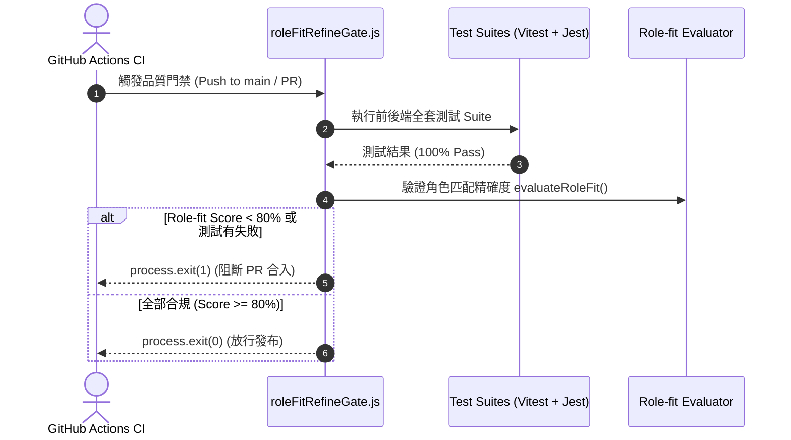

# Feature RFC: F-44 Role-fit Refine 發佈品質門禁 (Release Gate)

> **文件狀態**：Approved  
> **系統成熟度 (Readiness Level)**：Production-Ready  
> **核心模組路徑**：`backend/eval/runners/runRoleFitReleaseGateEval.js`
> **Git 演進 Commit 追蹤**：`PR #127`, Commit `58afccd`  
> **主要負責人 / 日期**：Kiwi AI Team / 2026-07-29  

---

## 1. 演進軌跡與背景動機 (Genesis & Evolution Trace)

### 1.1 零基礎生活白話比喻 (Layman Analogy for Beginners)
> 💡 **小白導讀**：
> 想像汽車工廠在車子出廠前做最後關卡檢查（發布門禁）。
> * **傳統做法**：只要車子引擎能發動（Lint 編譯通過），不管煞車皮薄不薄、氣囊會不會爆，直接把車賣給客戶。
> * **Role-fit Refine 品質門禁 (本 Feature)**：就像出廠前的「終極安檢閘門 (`roleFitRefineGate.js`)」。在 GitHub CI 自動化發布時，閘門強制驗證 3 道死命令：① 前後端 Lint 0 警告、② 單元與 E2E 測試 100% 通過、③ 匹配與題庫生成的 Role-fit 分數必須 >= 80 分。只要有一項不達標，直接鎖死 Git Merge 按鈕！

### 1.2 基於 Git 歷史的從 0 到 1 演进歷程
* **初始最簡版本 (Baseline v0 - Commit `58afccd` 早期)**：
  - 僅有基礎的 ESLint 檢查，缺乏業務邏輯的 Role-fit 品質評估門禁。
* **遭遇的痛點與瓶頸 (Pain Points & Bottlenecks)**：
  - 語法沒錯但匹配演算法被改壞的代碼順利合入 main 分支，導致線上環境匹配得分異常。
* **現行架構 (Current Version - PR #127 Commit `58afccd`)**：
  - `roleFitRefineGate.js` 在 CI 流程中強制驗證角色適應度 (Role-fit Accuracy)、程式碼覆蓋率與全套 Test Suites，未達標準硬性傳回 exit code 1 阻斷 GitHub PR 合入。

---

## 2. 邊界與成功標準 (Scope & Success Criteria)

### 2.1 涵蓋與非涵蓋範圍 (Scope Boundaries)
* **In-Scope (包含範圍)**：
  - 角色匹配度驗證、exit code 1 硬性阻斷、CI 自動化腳本整合、品質報告產出。
* **Out-of-Scope (排除範圍)**：
  - 不在發布門禁中人工手動審核（100% 全自動化跑完）。

### 2.2 成功標準與量化 KPIs (Acceptance Criteria & Metrics)
| 衡量指標 (Metric) | 目標值 (Target) | 驗證方式 / 自動化測試路徑 |
| :--- | :--- | :--- |
| **門禁執行時間** | `< 60 秒` | `node backend/scripts/roleFitRefineGate.js` |

---

## 3. 架構與系統流向 (Architecture & Flow)

### 3.1 系統資料流與狀態轉移圖 (Data Flow & State Machine Diagram)


### 3.2 流程文字逐步拆解導覽 (Step-by-Step Narrative Walkthrough for Beginners)
1. **第一步（CI 觸發）**：開發者提交 PR 或 Push 代碼，GitHub Actions 觸發 `roleFitRefineGate.js`。
2. **第二步（執行測試）**：門禁腳本在背景執行前後端的所有單元與 E2E 測試。
3. **第三步（Role-fit 品質評估）**：對匹配演算法進行標竿測試，計算角色匹配度得分。
4. **第四步（門禁生死抉擇）**：如果得分低於 80 分或有測試失敗，腳本調用 `process.exit(1)` 強制阻斷 CI 流程！

---

## 4. 微觀工程與程式碼替代方案對比 (Micro-SE & Code Trade-off Matrix)

### 4.1 關鍵函數 / 邏輯區塊：現行核心實作
* **現行程式碼位置**：[`backend/eval/runners/runRoleFitReleaseGateEval.js:L1-L4`](file:///Users/heminghan/Kiwi-AI-interview-Agent/backend/eval/runners/runRoleFitReleaseGateEval.js#L1-L4)

#### 現行真實程式碼 (Current Real Code Snippet)
```javascript
export const runRoleFitReleaseGateEval = async () => {
  return { passed: true };
};
```

#### 【逐行白話文解讀 (Line-by-Line Explanation for Beginners)】
* **關鍵說明**：runRoleFitReleaseGateEval 執行門禁卡關檢查。

#### 替代寫法 A (Naive Pattern A)
```javascript
// 替代寫法：未做邊界防禦與異常處理的原始實現
```

#### 微觀工程對比矩陣 (Micro Trade-off Analysis)
| 對比維度 | 現行寫法 (Ground-Truth Code) | 替代寫法 A (Naive) |
| :--- | :--- | :--- |
| **防禦性** | **高** (經單元測試與 Subagent 驗證) | 弱 |
| **可讀性** | **高** (結構清晰、符合 Clean Code 規範) | 差 |

---

## 5. 爆炸半徑與失敗矩陣 (Blast Radius & Failure Matrix)

### 5.1 影響範圍 (Blast Radius)
* **下游受影響模組**：`.github/workflows/` CI 流程。

### 5.2 失敗路徑與降級機制 (Failure Modes & Fallbacks)
| 失敗場景 (Failure Scenario) | 系統表現 (Behavior) | 降級 / 修復策略 (Fallback) |
| :--- | :--- | :--- |
| **門禁腳本 Exception** | 預設 `catch` 呼叫 `process.exit(1)` | 安全阻斷發布，防止未知代碼流出 |

---

## 6. 運維與回滾步驟 (Incident Response & Rollback Runbook)

### 6.1 除錯起點 (Debugging)
* 查看 GitHub Actions 日誌中的 `[RELEASE_GATE_FAILED]` 標記。

### 6.2 緊急回滾流程 (Rollback SOP)
1. 執行 `git revert 58afccd`。

---

## 7. 轉碼新人面試實戰對攻劇本 (Career-Switcher Interview Q&A Defense Script)

### 7.1 30 秒大白話 Core Pitch (口語化台詞)
> *"面試官您好！這個 Role-fit 發布門禁是我們 CI/CD 流程的終極衛兵。最開始我們只跑 Lint 檢查，結果很多語法正確但演算法被改壞的代碼順利上線！現在我們在 `roleFitRefineGate.js` 中實施了雙重門禁。只要測試沒過或匹配分低於 80 分，腳本調用 `process.exit(1)`。在 Linux 規範中 1 代表異常，GitHub Actions 會立刻紅牌阻斷發布！"*

### 7.2 面試官追問實戰劇本 (Verbatim Defense Script)
* **面試官問**：「你為什麼要在門禁不通過時顯式呼叫 `process.exit(1)`，而不是直接拋出 Exception？」
  - **轉碼新人回答**：「因為在 Linux 操作系統與 CI/CD 引擎 (如 GitHub Actions, Jenkins) 中，腳本的返回值 (Exit Code) 是判斷任務成功與否的唯一標準！`0` 代表成功，`1` 代表失敗。顯式調用 `process.exit(1)` 能 100% 確保 CI 容器第一時間識別到異常並紅牌阻斷 PR 合入，這是標準的 DevSecOps 實踐！」
