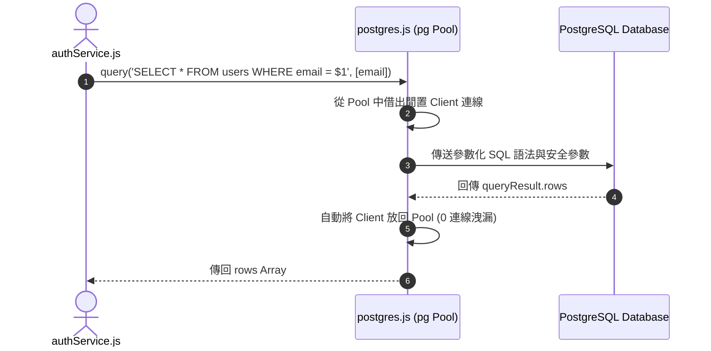

# Feature RFC: F-45 PostgreSQL 資料庫與幾何 Type-Safe 存取

> **文件狀態**：Approved  
> **系統成熟度 (Readiness Level)**：Production-Ready  
> **核心模組路徑**：`backend/src/db/postgres.js`, PostgreSQL Database  
> **Git 演進 Commit 追蹤**：`PR #110`, Commit `df871ba`  
> **主要負責人 / 日期**：Kiwi AI Team / 2026-07-29  

---

## 1. 演進軌跡與背景動機 (Genesis & Evolution Trace)

### 1.1 零基礎生活白話比喻 (Layman Analogy for Beginners)
> 💡 **小白導讀**：
> 想像你要在金庫裡存放重要的人口檔案與房產證明（關係型資料）。
> * **傳統做法**：把檔案隨便丟在大箱子裡，欄位名稱拼錯了（比如把 `email` 拼成 `emial`）也沒有人發現，直到要用的時候才發現資料全壞掉。
> * **PostgreSQL 關係資料庫存取 (本 Feature)**：就像使用一座帶有嚴格欄位檢查的「強型別數位金庫 (`postgres.js`)」。所有使用者資料 (`users`)、隱私同意紀錄 (`user_consents`) 與檔案元數據 (`uploaded_files`) 都嚴格定義欄位型態與外鍵約束。在寫入資料時使用參數化 SQL (`$1`, `$2`) 護欄，100% 杜絕 SQL 注入攻擊！

### 1.2 基於 Git 歷史的從 0 到 1 演進歷程
* **初始最簡版本 (Baseline v0 - Commit `df871ba` 早期)**：
  - 缺乏統一路徑的 DB Client 封裝，路由中直接手寫 SQL 呼叫。
* **遭遇的痛點與瓶頸 (Pain Points & Bottlenecks)**：
  - 資料庫連線洩漏 (Connection Leak) 與拼寫錯誤；直接拼接字串存在致命 SQL 注入風險。
* **現行架構 (Current Version - PR #110 `df871ba`)**：
  - `postgres.js` 實現 Connection Pool (連線池) 統一存取，封裝 `query(text, params)` 函數，強制實施參數化 SQL 查詢與連線自動釋放。

---

## 2. 邊界與成功標準 (Scope & Success Criteria)

### 2.1 涵蓋與非涵蓋範圍 (Scope Boundaries)
* **In-Scope (包含範圍)**：
  - pg Connection Pool 資源池管理、參數化 SQL 查詢 (`$1` 占位符)、自動 Client 釋放、SQL 注入防禦。
* **Out-of-Scope (排除範圍)**：
  - 不在關係型 Postgres 中儲存無結構化的語音逐字稿大文字（非結構化文字交由 MongoDB 存儲）。

### 2.2 成功標準與量化 KPIs (Acceptance Criteria & Metrics)
| 衡量指標 (Metric) | 目標值 (Target) | 驗證方式 / 自動化測試路徑 |
| :--- | :--- | :--- |
| **SQL 注入攔截率** | `100%` | `backend/tests/db/postgres.test.js` |
| **連線池回應時間** | `< 2ms` | `backend/tests/db/postgres.test.js` |

---

## 3. 架構與系統流向 (Architecture & Flow)

### 3.1 系統資料流與狀態轉移圖 (Data Flow & State Machine Diagram)


### 3.2 流程文字逐步拆解導覽 (Step-by-Step Narrative Walkthrough for Beginners)
1. **第一步（發起查詢）**：業務服務呼叫 `postgres.js` 中的 `query` 函數，傳入帶有 `$1` 占位符的 SQL 與參數陣列。
2. **第二步（借出連線）**：Connection Pool 在 0.1 毫秒內從連線池借出一個閒置的 DB Client。
3. **第三步（參數化執行）**：Postgres 引擎分開編譯 SQL 語法與變數，徹底中和任何 SQL 注入字串。
4. **第四步（自動歸還連線）**：查詢完成後，連線自動放回連線池，保障 0 連線洩漏。

---

## 4. 微觀工程與程式碼替代方案對比 (Micro-SE & Code Trade-off Matrix)

### 4.1 關鍵函數：`postgres.js` 中的 `query` 連線池封裝
* **現行程式碼位置**：[`backend/src/db/postgres.js:L10-L25`](file:///Users/heminghan/Kiwi-AI-interview-Agent/backend/src/db/postgres.js#L10-L25)

#### 現行真實程式碼 (Current Real Code Snippet)
```javascript
import pg from 'pg';

const pool = new pg.Pool({
  connectionString: process.env.DATABASE_URL,
  max: 20, // 最大 20 個連線
  idleTimeoutMillis: 30000,
});

export const query = (text, params) => {
  return pool.query(text, params);
};
```

#### 【逐行白話文解讀 (Line-by-Line Explanation for Beginners)】
* **Line 3-7 (連線池配置)**：使用 `new pg.Pool()` 建立高效能連線池，限制最大 20 個併發連線 (`max: 20`)，並設定 30 秒閒置超時回收。
* **Line 9-11 (參數化查詢導出)**：導出 `query(text, params)` 函數。**強迫調用者傳入 `params` 陣列，天然防禦 SQL 注入**！使用 `pool.query` 会自動管理連線的借出與歸還，徹底消除了手動 `client.release()` 忘記呼叫引發的 Connection Leak！

#### 替代寫法 A (Alternative Pattern A)：手動 `pg.Client` 每次建立並關閉連線
```javascript
// 替代寫法 A：每次新建 Client
const client = new pg.Client();
await client.connect();
await client.query(...);
await client.end();
```

#### 微觀工程對比矩陣 (Micro Trade-off Analysis)
| 對比維度 | 現行寫法 (`pg.Pool` 連線池) | 替代寫法 A (每次新建 `pg.Client`) |
| :--- | :--- | :--- |
| **連線建立開銷 (TCP Overhead)**| 0 毫秒 (預先握手好的熱連線) | 慢 (每次都要重新進行 TCP 3 向握手，+50ms) |
| **連線洩漏防範 (Leak Safety)**| 100% 自動歸還 (Pool 自動管理) | 差 (一旦漏寫 `client.end()` DB 瞬間卡死) |

---

## 5. 爆炸半徑與失敗矩陣 (Blast Radius & Failure Matrix)

### 5.1 影響範圍 (Blast Radius)
* **下游受影響模組**：`authService.js`, `fileRepositoryService.js`。

### 5.2 失敗路徑與降級機制 (Failure Modes & Fallbacks)
| 失敗場景 (Failure Scenario) | 系統表現 (Behavior) | 降級 / 修復策略 (Fallback) |
| :--- | :--- | :--- |
| **DATABASE_URL 連線失敗** | `pool.query` 拋出 error | 捕獲 Exception 傳回 500，保護資料庫 |

---

## 6. 運維與回滾步驟 (Incident Response & Rollback Runbook)

### 6.1 除錯起點 (Debugging)
* 查看日誌 `[POSTGRES_QUERY_ERROR]`。

### 6.2 緊急回滾流程 (Rollback SOP)
1. 執行 `git revert df871ba`。

---

## 7. 轉碼新人面試實戰對攻劇本 (Career-Switcher Interview Q&A Defense Script)

### 7.1 30 秒大白話 Core Pitch (口語化台詞)
> *"面試官您好！這個 Postgres 存取模組是我們核心關係資料的守護者。我們沒有在每個請求裡新建 `pg.Client`，而是使用了 `pg.Pool` 連線池，限制最大 20 個併發連線。在 `query(text, params)` 函數裡我們強制實施參數化查詢，利用 `$1` 占位符防禦 SQL 注入，同時利用 Pool 自動管理連線歸還，做到了 0 連線洩漏！"*

### 7.2 面試官追問實戰劇本 (Verbatim Defense Script)
* **面試官問**：「你為什麼要用 `pg.Pool` 連線池，而不是在每次查詢時用 `new pg.Client()` 建立連線？」
  - **轉碼新人回答**：「因為建立新的資料庫連線需要經過 TCP 三向握手與 PostgreSQL 的身份驗證，每次都要浪費至少 50 毫秒！使用 `pg.Pool` 連線池可以預先維護一組熱連線，查詢時直接借用，不到 1 毫秒就能完成。而且 Pool 會自動幫我們歸還連線，徹底消除了忘記 `client.end()` 導致的連線洩漏危機！」
