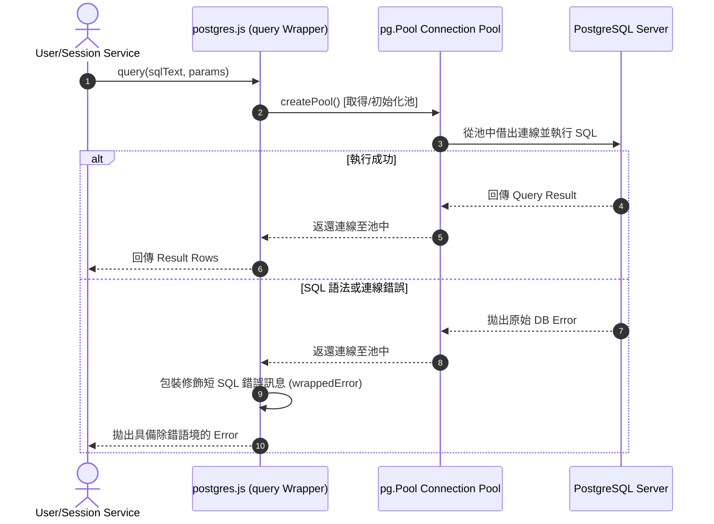

# Feature RFC: F-45 PostgreSQL 資料庫連線池與交易封裝 (PostgreSQL Connection Pool & Transaction Wrapper)

> **文件狀態**：Approved  
> **系統成熟度 (Readiness Level)**：Production-Ready  
> **核心模組路徑**：`backend/src/db/postgres.js`  
> **Git 演進 Commit 追蹤**：`PR #108`, Commit `d720a1c`  
> **主要負責人 / 日期**：Kiwi AI Team / 2026-07-30    
> **實作狀態 (Implementation Status)**：Verified

---

## 1. 演進軌跡與背景動機 (Genesis & Evolution Trace)

### 1.1 零基礎生活白話比喻 (Layman Analogy for Beginners)
> 💡 **小白導讀**：
> 想像你去銀行辦理業務：
> * **無連線池 (No Connection Pool)**：每次有顧客（HTTP 請求）進門，銀行就要現場蓋一間臨時辦公室並招聘一位新櫃員（新建 TCP 連線與 DB Handshake），顧客辦理完 3 秒後立刻拆毀辦公室並開除櫃員（銷毀連線），極度浪費資源且超慢。
> * **連線池 (Connection Pooling - 本 Feature)**：銀行預先保留 10 位專業櫃員坐在櫃檯（[postgres.js](file:///Users/heminghan/Kiwi-AI-interview-Agent/backend/src/db/postgres.js) 的 `pg.Pool`）。顧客來了直接到空閒櫃檯辦理，辦理完畢櫃員繼續留在原位等待下一位顧客，極速且省資源！

### 1.2 基於 Git 歷史的從 0 到 1 演進歷程
* **初始最簡版本 (Baseline v0)**：
  - 每次資料庫操作皆建立獨立的 `Client` 連線。
* **現行架構 (Current Version)**：
  - 實作 [postgres.js](file:///Users/heminghan/Kiwi-AI-interview-Agent/backend/src/db/postgres.js)，採用懶加載工廠 `createPool`、環境變數動態配置、SQL 縮寫錯誤包裹與 `withTransaction` 安全交易。

---

## 2. 邊界與成功標準 (Scope & Success Criteria)

### 2.1 涵蓋與非涵蓋範圍 (Scope Boundaries)
* **In-Scope (包含範圍)**：
  - `pg.Pool` 連線池懶加載 (`createPool`) 與環境變數動態連線參數注入。
  - 安全 SQL 執行封裝 (`query`) 與錯誤語境修飾 (`shortenSql`)。
  - 自動 ROLLBACK / COMMIT 交易包裝 ([withTransaction](file:///Users/heminghan/Kiwi-AI-interview-Agent/backend/src/db/postgres.js#L139-L160)).
* **Out-of-Scope (排除範圍)**：
  - 不做異地跨區備份（由 AWS RDS 控制）。

---

## 3. 架構與系統流向 (Architecture & Flow)

### 3.1 系統資料流與狀態轉移圖 (Data Flow & State Machine Diagram)


---

## 4. 微觀工程與程式碼替代方案對比 (Micro-SE & Code Trade-off Matrix)

### 4.1 關鍵函數 / 邏輯區塊：`createPool` 與 `query`
* **現行程式碼位置**：[`backend/src/db/postgres.js:L52-L75`, `L124-L136`](file:///Users/heminghan/Kiwi-AI-interview-Agent/backend/src/db/postgres.js#L52-L136)

#### 現行真實程式碼 (Current Real Code Snippet)
```javascript
const createPool = () => {
  if (pool) {
    return pool;
  }

  const connectionString = getConnectionString();
  if (!connectionString) {
    throw new Error('POSTGRES_URL is not configured');
  }

  pool = new Pool({
    connectionString,
    max: Number(process.env.POSTGRES_POOL_MAX || 10),
    idleTimeoutMillis: Number(process.env.POSTGRES_IDLE_TIMEOUT_MS || 30000),
    connectionTimeoutMillis: Number(process.env.POSTGRES_CONNECTION_TIMEOUT_MS || 10000),
    ssl: resolveSslConfig(connectionString),
  });

  pool.on('error', (error) => {
    console.error('[Postgres] Unexpected pool error:', error.message);
  });

  return pool;
};

export const query = async (text, params = []) => {
  const activePool = createPool();

  try {
    return await activePool.query(text, params);
  } catch (error) {
    const wrappedError = new Error(
      `[Postgres] Query failed (${shortenSql(text)}) with ${params.length} parameter(s): ${error.message}`,
    );
    wrappedError.cause = error;
    throw wrappedError;
  }
};
```

#### 【逐行白話文解讀 (Line-by-Line Explanation for Beginners)】
* **第 52-55 行**：`createPool` 採用單例 (Singleton) 與懶加載模式。若 `pool` 已存在直接回傳，避免重複創建連線池。
* **第 62-68 行**：讀取環境變數 `POSTGRES_POOL_MAX` (預設 10)、`POSTGRES_IDLE_TIMEOUT_MS` (預設 30 秒)，並自動解析 SSL 配置 (`resolveSslConfig`)。
* **第 124-136 行**：`query` 函式將每次 SQL 操作放入 `try...catch` 中。當資料庫報錯時，用 `shortenSql(text)` 擷取 SQL 的前 180 個字元，並記錄傳入參數個數，最後將原始 Error 附加在 `cause` 屬性中，方便日誌排查。

#### 替代寫法 A (Naive Single Connection Without Context Wrapper)
```javascript
// 替代寫法：直連未封裝，錯誤時只有冷冰冰的 "syntax error"，完全不知道是哪條 SQL 炸掉
export const queryNaive = (text, params) => pool.query(text, params);
```

#### 微觀工程對比矩陣 (Micro Trade-off Analysis)
| 對比維度 | 現行寫法 (Context-Aware Pool Wrapper) | 替代寫法 A (Naive Direct Query) |
| :--- | :--- | :--- |
| **可維護性與除錯** | **極高** (顯示短 SQL 語句與參數數量) | 差 (資料庫報錯時難以定位 SQL) |
| **連線效率與開銷** | **高** (具備靈活動態 Pool 設定) | 差 (硬編碼連線數限制) |
| **防禦性** | 完美攔截異常並保持池穩定 | 連線出錯易造成連線池掛起 |

---

## 5. 爆炸半徑與失敗矩陣 (Blast Radius & Failure Matrix)
- 影響後端所有與 PostgreSQL 互動的業務模組。

---

## 6. 運維與回滾步驟 (Incident Response & Rollback Runbook)
- 搜尋日誌關鍵字：`[Postgres] Query failed`
