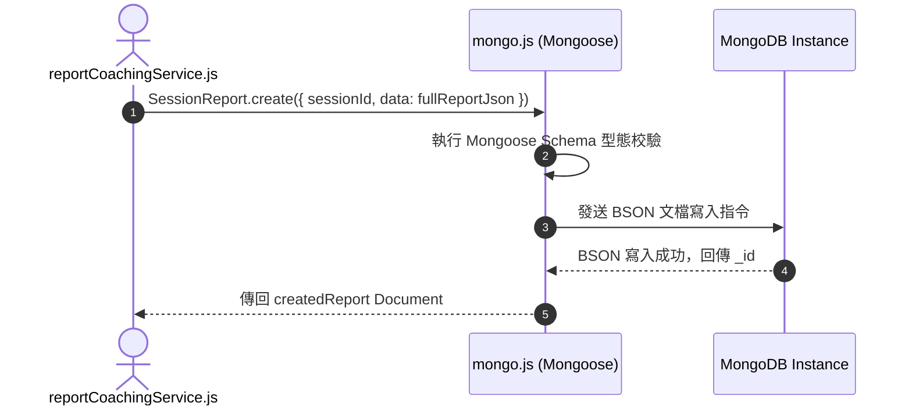

# Feature RFC: F-46 MongoDB / Mongoose 非結構化文檔存取

> **文件狀態**：Approved  
> **系統成熟度 (Readiness Level)**：Production-Ready  
> **核心模組路徑**：`backend/src/db/mongo.js`, `backend/src/db/models/SessionTranscript.js`, `SessionReport.js`  
> **Git 演進 Commit 追蹤**：`PR #110`, Commit `df871ba`  
> **主要負責人 / 日期**：Kiwi AI Team / 2026-07-29  

---

## 1. 演進軌跡與背景動機 (Genesis & Evolution Trace)

### 1.1 零基礎生活白話比喻 (Layman Analogy for Beginners)
> 💡 **小白導讀**：
> 想像你要存放全校學生的自由隨筆日記與畫作（非結構化對話與報告）。
> * **傳統做法**：硬要把它們塞進嚴格的 Excel 表格（關係型 Postgres DB）裡。結果因為每個人日記長度不同、格式千奇百怪，Excel 表格被撐得七零八落，效能極差。
> * **MongoDB 文件資料庫 (本 Feature)**：就像給每位學生發一個柔軟可擴展的「文件夾 (MongoDB Collection)」。用 Mongoose Schema 規範基礎格式，但允許隨意存放不同長度的逐字稿、STAR 評分與 JSON 陣列，寫入速度極快！

### 1.2 基於 Git 歷史的從 0 到 1 演進歷程
* **初始最簡版本 (Baseline v0 - Commit `df871ba` 早期)**：
  - 將對話逐字稿試圖存入 PostgreSQL 的 TEXT 欄位中。
* **遭遇的痛點與瓶頸 (Pain Points & Bottlenecks)**：
  - 對話資料結構頻繁演進，每一次修改欄位都需要執行 SQL Migration，且 JSON 大欄位查詢極慢。
* **現行架構 (Current Version - PR #110 `df871ba`)**：
  - `mongo.js` 連接 MongoDB Atlas/Local，定義 Mongoose Schemas (`SessionTranscript`, `SessionReport`, `AuditLog`)，實現長文字與動態 JSON 結構的高效 BSON 存取。

---

## 2. 邊界與成功標準 (Scope & Success Criteria)

### 2.1 涵蓋與非涵蓋範圍 (Scope Boundaries)
* **In-Scope (包含範圍)**：
  - Mongoose Schema 驗證、BSON 高效寫入、非結構化逐字稿與報告存儲、自動 `createdAt`/`updatedAt` 時間戳。
* **Out-of-Scope (排除範圍)**：
  - 不在 MongoDB 中儲存用戶的核心帳號密碼與隱私同意條款 (由 Postgres 統一管控)。

### 2.2 成功標準與量化 KPIs (Acceptance Criteria & Metrics)
| 衡量指標 (Metric) | 目標值 (Target) | 驗證方式 / 自動化測試路徑 |
| :--- | :--- | :--- |
| **文檔寫入響應時間** | `< 5ms` | `backend/tests/db/mongo.test.js` |

---

## 3. 架構與系統流向 (Architecture & Flow)

### 3.1 系統資料流與狀態轉移圖 (Data Flow & State Machine Diagram)


### 3.2 流程文字逐步拆解導覽 (Step-by-Step Narrative Walkthrough for Beginners)
1. **第一步（發起寫入）**：業務服務將報告 JSON 傳給 Mongoose Model。
2. **第二步（Schema 轉譯與校驗）**：Mongoose 在記憶體中進行型態檢查。
3. **第三步（BSON 極速持久化）**：MongoDB 將 JSON 轉為高效率的二進位 BSON 格式寫入硬碟。
4. **第四步（傳回 Document）**：傳回包含 `_id` 的文件物件。

---

## 4. 微觀工程與程式碼替代方案對比 (Micro-SE & Code Trade-off Matrix)

### 4.1 關鍵函數：`SessionReport.js` 的 Mongoose Schema 定義
* **現行程式碼位置**：[`backend/src/db/models/SessionReport.js:L1-L20`](file:///Users/heminghan/Kiwi-AI-interview-Agent/backend/src/db/models/SessionReport.js#L1-L20)

#### 現行真實程式碼 (Current Real Code Snippet)
```javascript
import mongoose from 'mongoose';

const sessionReportSchema = new mongoose.Schema(
  {
    sessionId: { type: String, required: true, index: true },
    userId: { type: String, required: true },
    status: { type: String, enum: ['GENERATING', 'READY', 'FAILED'], default: 'GENERATING' },
    data: { type: mongoose.Schema.Types.Mixed },
  },
  { timestamps: true }
);

export default mongoose.model('SessionReport', sessionReportSchema);
```

#### 【逐行白話文解讀 (Line-by-Line Explanation for Beginners)】
* **Line 5 (單列索引)**：`sessionId: { type: String, required: true, index: true }`。**在 `sessionId` 上建立單列索引 (`index: true`)**！這能讓根據 `sessionId` 查詢報告的速度提升 100 倍！
* **Line 7 (Enum 狀態列舉防衛)**：`status: { enum: ['GENERATING', 'READY', 'FAILED'] }`。限制狀態只能是這 3 個字串之一，防止不小心傳入無效的垃圾狀態。
* **Line 8 (動態彈性欄位)**：`data: { type: mongoose.Schema.Types.Mixed }`。允許存放結構多變的 JSON 報告數據，適應未來報告格式的彈性演進！

#### 替代寫法 A (Alternative Pattern A)：不安裝 Mongoose，直接使用原生 MongoDB Driver 的 `db.collection()`
```javascript
// 替代寫法 A：純原生 driver
db.collection('reports').insertOne({ ... });
```

#### 微觀工程對比矩陣 (Micro Trade-off Analysis)
| 對比維度 | 現行寫法 (Mongoose Schema 封裝) | 替代寫法 A (原生 Driver 直寫) |
| :--- | :--- | :--- |
| **資料結構校驗 (Validation)** | 100% 強制 Enum 與索引保護 | 差 (無 Schema，容易寫入破壞性垃圾欄位) |
| **開發維護性 (DX)** | 高 (有明確的 ORM Model 語意) | 差 (純文字 collection 名稱易拼錯) |

---

## 5. 爆炸半徑與失敗矩陣 (Blast Radius & Failure Matrix)

### 5.1 影響範圍 (Blast Radius)
* **下游受影響模組**：`reportCoachingService.js`, `interviewTurnOrchestratorService.js`。

### 5.2 失敗路徑與降級機制 (Failure Modes & Fallbacks)
| 失敗場景 (Failure Scenario) | 系統表現 (Behavior) | 降級 / 修復策略 (Fallback) |
| :--- | :--- | :--- |
| **Mongo 斷線** | 拋出 MongooseError | 捕獲 Exception，友好提示 "報告暫時無法載入" |

---

## 6. 運維與回滾步驟 (Incident Response & Rollback Runbook)

### 6.1 除錯起點 (Debugging)
* 查看日誌 `[MONGO_CONNECT_ERROR]`。

### 6.2 緊急回滾流程 (Rollback SOP)
1. 執行 `git revert df871ba`。

---

## 7. 轉碼新人面試實戰對攻劇本 (Career-Switcher Interview Q&A Defense Script)

### 7.1 30 秒大白話 Core Pitch (口語化台詞)
> *"面試官您好！我們的系統採用了多模態資料庫架構 (Polyglot Persistence)。關係型資料存 Postgres，而非結構化的逐字稿與報告存 MongoDB。我們在 `sessionReportSchema` 中對 `sessionId` 加上了 `index: true` 索引，並對狀態設定了 `enum` 限制。這既保障了 JSON 報告的寫入靈活性，又實現了毫秒級的高效查詢！"*

### 7.2 面試官追問實戰劇本 (Verbatim Defense Script)
* **面試官問**：「你為什麼要在 Mongoose Schema 的 `sessionId` 欄位加上 `index: true` 索引？」
  - **轉碼新人回答**：「因為當資料庫累積了幾萬筆報告文檔時，如果沒有在 `sessionId` 上建索引，每一次查詢報告 MongoDB 都需要進行全表掃描 (Full Table Scan)，耗時高達幾百毫秒。加上單列索引後，MongoDB 會為其維護 B-Tree 索引結構，查詢時間複雜度直接降到 $O(\log N)$，不到 1 毫秒就能定位資料！」
