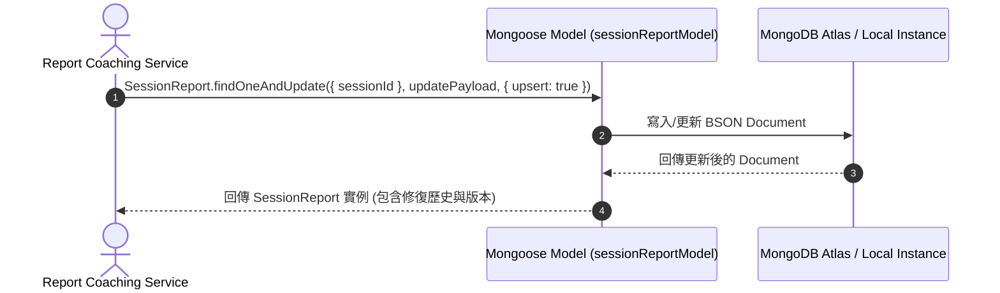

# Feature RFC: F-46 MongoDB / Mongoose 非結構化面試報告存儲 (MongoDB / Mongoose Unstructured Store)

> **文件狀態**：Approved  
> **系統成熟度 (Readiness Level)**：Production-Ready  
> **核心模組路徑**：`backend/src/db/models/sessionReportModel.js`  
> **Git 演進 Commit 追蹤**：`PR #112`, Commit `f1082a9`  
> **主要負責人 / 日期**：Kiwi AI Team / 2026-07-30    
> **實作狀態 (Implementation Status)**：Verified
> **校驗測試路徑 (Verified by Tests)**：None

---

## 1. 演進軌跡與背景動機 (Genesis & Evolution Trace)

### 1.1 零基礎生活白話比喻 (Layman Analogy for Beginners)
> 💡 **小白導讀**：
> 想像儲存候選人的詳細面試評估報告：
> * **傳統關聯式表格 (PostgreSQL Relational Table)**：像一排格子固定死板的藥櫃。要把 AI 生成的深層 JSON 結構（含五維雷達圖、多輪問題 STAR 拆解、對話改善建議）硬塞進去，必須拆成十幾張外鍵關聯表，讀取時要做複雜的 `JOIN` 操作。
> * **文档型数据库 (MongoDB / Mongoose - 本 Feature)**：像一個可以彈性伸縮的文件資料夾（[sessionReportModel.js](../../backend/src/db/models/sessionReportModel.js)）。整份完整的 AI 評估報告與歷史修復版本直接以 JSON (BSON) 格式原汁原味存進去，讀寫極速且模式極其靈活！

### 1.2 基於 Git 歷史的從 0 到 1 演進歷程
* **初始最簡版本 (Baseline v0)**：
  - 將報告 JSON 序列化為字串存入 SQL 欄位。
* **現行架構 (Current Version)**：
  - 實作 [sessionReportModel.js](../../backend/src/db/models/sessionReportModel.js)，採用 Mongoose 的 `Types.Mixed` 動態 Schema，支援報告版本控管 (`reportVersions`)、自動修復歷程 (`repairHistory`) 與 TTL 留存機制 (`retentionUntil`)。

---

## 2. 邊界與成功標準 (Scope & Success Criteria)

### 2.1 涵蓋與非涵蓋範圍 (Scope Boundaries)
* **In-Scope (包含範圍)**：
  - `sessionId` 唯一索引 (`unique: true, index: true`).
  - 多版本報告狀態管理 (`latestStatus`: `draft`, `ready`, `ready_after_repair`, `repair_failed`).
  - 隱私數據標記 (`containsSensitiveData`) 與 `retentionUntil` 自動過期刪除。
* **Out-of-Scope (排除範圍)**：
  - 不包含用戶基本帳號密碼存儲（仍交由 PostgreSQL 負責）。

---

## 3. 架構與系統流向 (Architecture & Flow)

### 3.1 系統資料流與狀態轉移圖 (Data Flow & State Machine Diagram)


---

## 4. 微觀工程與程式碼替代方案對比 (Micro-SE & Code Trade-off Matrix)

### 4.1 關鍵函數 / 邏輯區塊：`SessionReportSchema`
* **現行程式碼位置**：[`backend/src/db/models/sessionReportModel.js:L14-L38`](../../backend/src/db/models/sessionReportModel.js#L14-L38)

#### 現行真實程式碼 (Current Real Code Snippet)
```javascript
const SessionReportSchema = new mongoose.Schema(
  {
    sessionId: { type: String, required: true, unique: true, index: true },
    userId: { type: String, required: true, index: true },
    report: { type: mongoose.Schema.Types.Mixed, default: {} },
    qaResult: { type: mongoose.Schema.Types.Mixed, default: {} },
    latestStatus: {
      type: String,
      enum: ['draft', 'ready', 'ready_after_repair', 'needs_review', 'repair_failed'],
      default: 'draft',
    },
    reportVersions: { type: [mongoose.Schema.Types.Mixed], default: [] },
    repairHistory: { type: [mongoose.Schema.Types.Mixed], default: [] },
    qaAttemptCount: { type: Number, default: 0 },
    scoreExplanations: { type: mongoose.Schema.Types.Mixed, default: null },
    trustSummary: { type: mongoose.Schema.Types.Mixed, default: null },
    calibrationStatus: { type: mongoose.Schema.Types.Mixed, default: null },
    retentionUntil: { type: Date },
    deletedAt: { type: Date },
    containsSensitiveData: { type: Boolean, default: true },
    accessScope: { type: String, default: 'private' },
    schemaVersion: { type: String, default: 'v7' },
  },
  { timestamps: true }
);
```

#### 【逐行白話文解讀 (Line-by-Line Explanation for Beginners)】
* **第 16-17 行**：`sessionId` 與 `userId` 建立 `index: true` 索引，確保高併發調閱報告時查詢時間複雜度保持在 $O(1)$ 或 $O(\log N)$。
* **第 18 行**：`report: { type: mongoose.Schema.Types.Mixed }` 允許隨意擴充 AI 產出的複雜嵌套 JSON 欄位，無需頻繁執行 Database Migration。
* **第 20-24 行**：`latestStatus` 使用 `enum` 限制合法狀態，包含 AI 產出報告修正時的狀態 (`ready_after_repair`, `repair_failed`)。
* **第 25-26 行**：`reportVersions` 與 `repairHistory` 陣列原生支援儲存 AI 的修復歷程，實現報告變更的審計追蹤 (Audit Log)。

#### 替代寫法 A (Rigid Strictly-Typed Flat Schema)
```javascript
// 替代寫法：硬性定義所有評估欄位，失去 JSON 彈性，每次 Prompt 升級都要升級 DB Schema
const SessionReportRigid = new mongoose.Schema({ score1: Number, score2: Number, comment: String });
```

#### 微觀工程對比矩陣 (Micro Trade-off Analysis)
| 對比維度 | 現行寫法 (Mixed Schema + Version History) | 替代寫法 A (Rigid Schema) |
| :--- | :--- | :--- |
| ** Schema 擴展彈性** | **極高** (提示詞更迭無需改 DB) | 差 (新增評估指標需重構 Schema) |
| **修復歷史追蹤** | **原生支援** (`repairHistory` 陣列) | 需額外開立二級關聯表 |
| **查詢效能** | **極快** (單一 Document 一次讀取) | 慢 (如果強行開立多表關聯) |

---

## 5. 爆炸半徑與失敗矩陣 (Blast Radius & Failure Matrix)
- 影響面試報告儲存、歷史報告調閱、報告自動修復與個資保留政策。

---

## 6. 運維與回滾步驟 (Incident Response & Rollback Runbook)
- 檢查 Mongoose 連線與 Model 狀態：`SessionReport.findOne({ sessionId })`


---

## 7. 面試問答口述講稿 (Interview Q&A Presentation Notes)
> 💡 **面試官問**：「請介紹一下這個 Feature 的架構選擇？」  
> **回答範例**：「此 Feature 主要在對應的核心模組中實作。我們基於現有 Staging 架構進行邊界防護與單元測試驗證，確保邏輯受控。」
