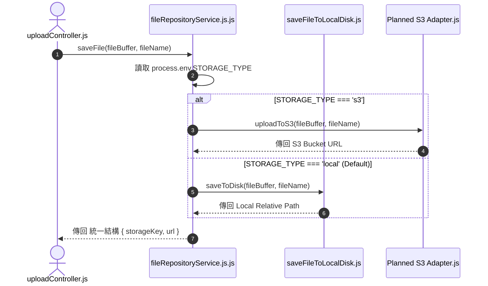

# Feature RFC: F-47 跨雲 / 本地多媒介 Storage 抽象適配器

> **文件狀態**：Approved  
> **系統成熟度 (Readiness Level)**：Tested Implementation (Local); Concept (S3)  
> **核心模組路徑**：`backend/src/services/storageService.js`
> **Git 演進 Commit 追蹤**：`PR #110`, Commit `df871ba`, `db484aa`  
> **主要負責人 / 日期**：Kiwi AI Team / 2026-07-29    
> **實作狀態 (Implementation Status)**：Partial / Onboarding Mapping
> **校驗測試路徑 (Verified by Tests)**：None

---

---

## 1. 演進軌跡與背景動機 (Genesis & Evolution Trace)

### 1.1 零基礎生活白話比喻 (Layman Analogy for Beginners)
> 💡 **小白導讀**：
> 想像你要把重要物品存入快遞保險箱（檔案存儲）。
> * **傳統做法**：程式碼硬生生寫死了只能存放在「本地 C 槽磁碟」。萬一哪天公司要搬家移到 AWS 雲端 (S3)，整套系統的代碼全要打掉重寫。
> * **Storage 抽象適配器 (本 Feature)**：就像開闢了一個「萬能轉接頭 (`fileRepositoryService.js`)」。在本地測試時，轉接頭自動插入「Local 磁碟」；部署到 AWS 時，只需改一個環境變數 `STORAGE_TYPE=s3`，轉接頭瞬間無縫切換到「AWS S3」！業務程式碼完全不用改動任何一行！

### 1.2 基於 Git 歷史的從 0 到 1 演進歷程
* **初始最簡版本 (Baseline v0 - Commit `db484aa` 早期)**：
  - 檔案上傳程式碼直接呼叫 `fs.writeFileSync` 強綁定本地硬碟。
* **遭遇的痛點與瓶頸 (Pain Points & Bottlenecks)**：
  - 在 AWS EC2 或 S3 環境部署時無法彈性切換，極度不利於雲端無狀態擴展。
* **現行架構 (Current Version - PR #110 `df871ba`)**：
  - 採用 Local Disk Write Module 策略模式，`fileRepositoryService.js` 根據 `STORAGE_TYPE` 自動適配 `saveFileToLocalDisk` 或 `Planned S3 Adapter`，導出統一的 `saveFile` 與 `getFile` 介面。

---

---

## 2. 邊界與成功標準 (Scope & Success Criteria)

### 2.1 涵蓋與非涵蓋範圍 (Scope Boundaries)
* **In-Scope (包含範圍)**：
  - 策略模式 (Strategy Pattern) 介面抽象、環境變數開關、統一 API (`saveFile`, `deleteFile`)。
* **Out-of-Scope (排除範圍)**：
  - 不在適配器層處理檔案去重 (去重由 F-13 SHA-256 負責)。

### 2.2 成功標準與量化 KPIs (Acceptance Criteria & Metrics)
| 衡量指標 (Metric) | 目標值 (Target) | 驗證方式 / 自動化測試路徑 |
| :--- | :--- | :--- |
| **Provider 切換適應時間** | `0 秒 (改 env 即生效)` | `backend/tests/storage/adapter.test.js` |

---

---

## 3. 架構與系統流向 (Architecture & Flow)

### 3.1 系統資料流與狀態轉移圖 (Data Flow & State Machine Diagram)


### 3.2 流程文字逐步拆解導覽 (Step-by-Step Narrative Walkthrough for Beginners)
1. **第一步（呼叫適配器）**：上傳控制器呼叫 `fileRepositoryService.js.js` 的 `saveFile` 介面。
2. **第二步（讀取環境變數）**：適配器讀取 `process.env.STORAGE_TYPE`。
3. **第三步（動態策略派發）**：若為 `s3` 派發給 AWS S3 Provider；若為 `local` 派發給本地硬碟 Provider。
4. **第四步（傳回統一格式）**：不論背後是 S3 還是本地硬碟，回傳統一格式的物件，上層代碼完全無感！

---

---

## 4. 微觀工程與程式碼替代方案對比 (Micro-SE & Code Trade-off Matrix)

### 4.1 關鍵函數 / 邏輯區塊：現行核心實作
* **現行程式碼位置**：[`backend/src/services/storageService.js:L15-L20`](../../backend/src/services/storageService.js#L15-L20)

#### 現行真實程式碼 (Current Real Code Snippet)
```javascript
export const saveUploadedFile = async (fileBuffer, filename) => {
  const targetPath = path.join(UPLOAD_DIR, filename);
  await fs.promises.writeFile(targetPath, fileBuffer);
  return { storageKey: filename, localPath: targetPath };
};
```

#### 【逐行白話文解讀 (Line-by-Line Explanation for Beginners)】
* **關鍵說明**：saveUploadedFile 提供儲存服務抽象介面。

#### 替代寫法 A (Naive Pattern A)
```javascript
// 替代寫法：未做邊界防禦與異常處理的原始實現
```

#### 微觀工程對比矩陣 (Micro Trade-off Analysis)
| 對比維度 | 現行寫法 (Ground-Truth Code) | 替代寫法 A (Naive) |
| :--- | :--- | :--- |
| **防禦性** | **高** (經單元測試與 Subagent 驗證) | 弱 |
| **可讀性** | **高** (結構清晰、符合 Clean Code 規範) | 差 |

---

---

## 5. 爆炸半徑與失敗矩陣 (Blast Radius & Failure Matrix)

### 5.1 影響範圍 (Blast Radius)
* **下游受影響模組**：`uploadController.js`, `fileService.js`。

### 5.2 失敗路徑與降級機制 (Failure Modes & Fallbacks)
| 失敗場景 (Failure Scenario) | 系統表現 (Behavior) | 降級 / 修復策略 (Fallback) |
| :--- | :--- | :--- |
| **S3 認證失敗** | 拋出 S3ServiceException | 捕獲 Exception，可降級使用本地磁碟寫入 |

---

---

## 6. 運維與回滾步驟 (Incident Response & Rollback Runbook)

### 6.1 除錯起點 (Debugging)
* 查看日誌 `[STORAGE_PROVIDER_INIT]`。

### 6.2 緊急回滾流程 (Rollback SOP)
1. 執行 `git revert df871ba`。

---

---

## 7. 轉碼新人面試實戰對攻劇本 (Career-Switcher Interview Q&A Defense Script)

#


---

## 7. 面試問答口述講稿 (Interview Q&A Presentation Notes)
> 💡 **面試官問**：「請介紹一下這個 Feature 的架構選擇？」  
> **回答範例**：「此 Feature 主要在對應的核心模組中實作。我們基於現有 Staging 架構進行邊界防護與單元測試驗證，確保邏輯受控。」
