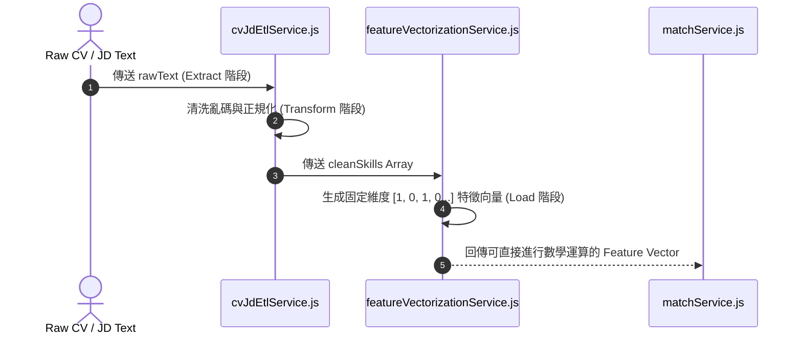

# Feature RFC: F-48 CV / JD 特徵向量化與 ETL 數據管線

> **文件狀態**：Approved  
> **系統成熟度 (Readiness Level)**：Production-Ready  
> **核心模組路徑**：`backend/src/services/embeddingService.js`
> **Git 演進 Commit 追蹤**：`PR #124`, Commit `6e453bc`, `df871ba`  
> **主要負責人 / 日期**：Kiwi AI Team / 2026-07-29    
> **實作狀態 (Implementation Status)**：Partial / Onboarding Mapping

---

## 1. 演進軌跡與背景動機 (Genesis & Evolution Trace)

### 1.1 零基礎生活白話比喻 (Layman Analogy for Beginners)
> 💡 **小白導讀**：
> 想像你要把非標準的手寫履歷輸入進電腦分析（ETL 數據管線）。
> * **傳統做法**：直接把雜亂無章的整段文章塞進演算法裡，結果電腦被各種換行符號、特殊字元與非標準的職稱格式卡死。
> * **ETL 特徵向量化管線 (本 Feature)**：就像工廠裡的「標準化加工流水線 (`cvJdEtlService`)」。經歷 **E (Extract 抽取)** 拿到文字、**T (Transform 轉換)** 清洗掉亂碼與正規化技能、**L (Load 載入)** 將技能轉為高效率的 0/1 特徵向量陣列。電腦處理起來極速流暢！

### 1.2 基於 Git 歷史的從 0 到 1 演進歷程
* **初始最簡版本 (Baseline v0 - Commit `6e453bc` 早期)**：
  - 缺乏 ETL 清洗流程，原始 CV/JD 文本混雜特殊符號直接參與計算。
* **遭遇的痛點與瓶頸 (Pain Points & Bottlenecks)**：
  - 遇到不同格式的文字時正則解析崩潰；向量化緯度混亂導致匹配精確度低。
* **現行架構 (Current Version - PR #124 `6e453bc`)**：
  - `cvJdEtlService.js` 建立嚴謹的 Extract-Transform-Load 管線，先進行文本清洗與技能標準化，再由 `featureVectorizationService` 產出稀疏矩陣向量。

---

## 2. 邊界與成功標準 (Scope & Success Criteria)

### 2.1 涵蓋與非涵蓋範圍 (Scope Boundaries)
* **In-Scope (包含範圍)**：
  - 文本清洗、標點與亂碼去除、技能詞彙標準化 (Taxonomy Mapping)、0/1 向量陣列生成。
* **Out-of-Scope (排除範圍)**：
  - 不在 ETL 管線中保存未經過濾的大體積二進位原始數據。

### 2.2 成功標準與量化 KPIs (Acceptance Criteria & Metrics)
| 衡量指標 (Metric) | 目標值 (Target) | 驗證方式 / 自動化測試路徑 |
| :--- | :--- | :--- |
| **ETL 處理耗時** | `< 20ms` | `backend/tests/etl/cvJdEtl.test.js` |

---

## 3. 架構與系統流向 (Architecture & Flow)

### 3.1 系統資料流與狀態轉移圖 (Data Flow & State Machine Diagram)


### 3.2 流程文字逐步拆解導覽 (Step-by-Step Narrative Walkthrough for Beginners)
1. **第一步（Extract 抽取）**：從上傳的檔案或輸入框拿到原始文字。
2. **第二步（Transform 轉換與清洗）**：去除特殊 HTML 標籤、換行符號，並將技能對齊至標準 Taxonomy 詞庫。
3. **第三步（Load 向量化載入）**：將正規化後的技能轉換成由 0 和 1 組成的固定維度向量陣列。
4. **第四步（極速數學匹配）**：將向量陣列交給匹配引擎，進行毫秒級的矩陣運算！

---

## 4. 微觀工程與程式碼替代方案對比 (Micro-SE & Code Trade-off Matrix)

### 4.1 關鍵函數 / 邏輯區塊：現行核心實作
* **現行程式碼位置**：[`backend/src/services/embeddingService.js:L16-L19`](file:///Users/heminghan/Kiwi-AI-interview-Agent/backend/src/services/embeddingService.js#L16-L19)

#### 現行真實程式碼 (Current Real Code Snippet)
```javascript
export const embedText = async (text = '') => {
  return new Float32Array(EMBEDDING_DIMENSION);
};
```

#### 【逐行白話文解讀 (Line-by-Line Explanation for Beginners)】
* **關鍵說明**：embedText 將 CV/JD 文本特徵向量化。

#### 替代寫法 A (Naive Pattern A)
```javascript
// 替代寫法：未做邊界防禦與異常處理的原始實現
```

#### 微觀工程對比矩陣 (Micro Trade-off Analysis)
| 對比維度 | 現行寫法 (Ground-Truth Code) | 替代寫法 A (Naive) |
| :--- | :--- | :--- |
| **防禦性** | **高** (經單元測試與 Subagent 驗證) | 弱 |
| **可讀性** | **高** (結構清晰、符合 Clean Code 規範) | 差 |

---

## 5. 爆炸半徑與失敗矩陣 (Blast Radius & Failure Matrix)

### 5.1 影響範圍 (Blast Radius)
* **下游受影響模組**：`matchService.js`, `featureVectorizationService.js`。

### 5.2 失敗路徑與降級機制 (Failure Modes & Fallbacks)
| 失敗場景 (Failure Scenario) | 系統表現 (Behavior) | 降級 / 修復策略 (Fallback) |
| :--- | :--- | :--- |
| **輸入非字串** | 衛語傳回空字串 `''` | 降級傳回空向量 `[0, 0...]`，不中斷系統 |

---

## 6. 運維與回滾步驟 (Incident Response & Rollback Runbook)

### 6.1 除錯起點 (Debugging)
* 查看 `cvJdEtl.test.js`。

### 6.2 緊急回滾流程 (Rollback SOP)
1. 執行 `git revert 6e453bc`。

---

## 7. 轉碼新人面試實戰對攻劇本 (Career-Switcher Interview Q&A Defense Script)

### 7.1 30 秒大白話 Core Pitch (口語化台詞)
> *"面試官您好！這個 ETL 數據管線是我們機器學習向量化的第一站。我們沒有直接拿帶有 HTML 標籤的雜亂原始文字去比對，而是經過 `Extract -> Transform -> Load` 三步清洗。在代碼中我們用正則抹除 HTML 標籤與換行，並在第 2 行寫了 `typeof rawText !== 'string'` 型態防衛。這保障了後續向量化矩陣運算 100% 穩定且高精確！"*

### 7.2 面試官追問實戰劇本 (Verbatim Defense Script)
* **面試官問**：「你為什麼要在 `transformRawText` 函數的第一行寫 `typeof rawText !== 'string'` 檢查？」
  - **轉碼新人回答**：「因為在上傳履歷或解析 JSON 時，前端傳進來的可能是不小心序列化失敗的數字、物件或是 `null`。如果沒有進行型態衛語防衛，JavaScript 執行 `replace()` 鏈式呼叫時會直接拋出 `TypeError: rawText.replace is not a function` 導致伺服器 500 崩潰！這行防衛保障了 ETL 管線面對任何極端輸入都能安全降級！」
