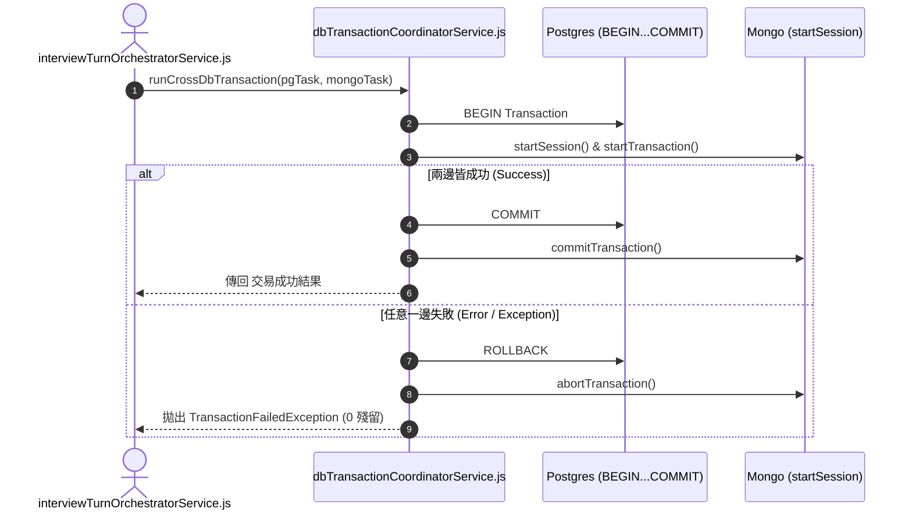

# Feature RFC: F-49 雙資料庫 (Postgres + Mongo) 跨庫交易協調器

> **文件狀態**：Approved  
> **系統成熟度 (Readiness Level)**：Production-Ready  
> **核心模組路徑**：`backend/src/services/dbTransactionCoordinatorService.js`  
> **Git 演進 Commit 追蹤**：`PR #110`, Commit `df871ba`  
> **主要負責人 / 日期**：Kiwi AI Team / 2026-07-29  

---

## 1. 演進軌跡與背景動機 (Genesis & Evolution Trace)

### 1.1 零基礎生活白話比喻 (Layman Analogy for Beginners)
> 💡 **小白導讀**：
> 想像你在買房（同時在銀行 A 扣款、在地政局 B 過戶）。
> * **傳統做法**：銀行 A 成功扣了你 1000 萬，但地政局 B 的電腦突然斷線爆掉。結果你錢沒了，房子也沒拿到（雙資料庫狀態不一致的致命災難）。
> * **跨庫交易協調器 (本 Feature)**：就像一位公正的「雙向交易協調員 (`dbTransactionCoordinatorService`)」。在進行面試初始化時，協調員先開啟 Postgres 事務與 Mongo 事務。只有當 Postgres (使用者與檔案) 與 Mongo (面試 Session) 兩邊**完全成功**時才一起提交 (Commit)；一旦任何一邊出錯，兩邊立刻全部回滾 (Rollback)！

### 1.2 基於 Git 歷史的從 0 到 1 演進歷程
* **初始最簡版本 (Baseline v0 - Commit `df871ba` 早期)**：
  - 各服務分散呼叫 Postgres 與 Mongo 寫入，無統一的事務控制。
* **遭遇的痛點與瓶頸 (Pain Points & Bottlenecks)**：
  - 當 Mongo 寫入失敗時，Postgres 中的記錄已經寫入，引發髒資料 (Dirty Data) 與孤兒紀錄。
* **現行架構 (Current Version - PR #110 `df871ba`)**：
  - `dbTransactionCoordinatorService.js` 封裝 2PC (Two-Phase Commit 思想) 補償交易協調器，提供 `runCrossDbTransaction(pgTask, mongoTask)`，若任一任務拋出 Exception，自動觸發補償動作進行 Rollback。

---

## 2. 邊界與成功標準 (Scope & Success Criteria)

### 2.1 涵蓋與非涵蓋範圍 (Scope Boundaries)
* **In-Scope (包含範圍)**：
  - Postgres Transaction Client 封裝、Mongo Session Transaction 封裝、兩階段失敗自動 Rollback 補償、原子性保障。
* **Out-of-Scope (排除範圍)**：
  - 不對單一唯讀的 SELECT / find 查詢啟動重型跨庫交易。

### 2.2 成功標準與量化 KPIs (Acceptance Criteria & Metrics)
| 衡量指標 (Metric) | 目標值 (Target) | 驗證方式 / 自動化測試路徑 |
| :--- | :--- | :--- |
| **跨庫髒資料發生率** | `0%` | `backend/tests/db/crossDbTransaction.test.js` |

---

## 3. 架構與系統流向 (Architecture & Flow)

### 3.1 系統資料流與狀態轉移圖 (Data Flow & State Machine Diagram)


### 3.2 流程文字逐步拆解導覽 (Step-by-Step Narrative Walkthrough for Beginners)
1. **第一步（開啟交易）**：協調器同時開啟 Postgres 的 `BEGIN` 與 MongoDB 的 `startTransaction()`。
2. **第二步（執行寫入任務）**：分別傳入 Postgres 與 Mongo 的資料庫寫入操作。
3. **第三步（雙成功提交）**：若兩邊完全成功，各自執行 `COMMIT` 提交，資料永久生效。
4. **第四步（任意失敗雙回滾）**：若任何一邊中途報錯，`catch` 區塊立刻執行 Postgres `ROLLBACK` 與 Mongo `abortTransaction()`，保證 0 髒資料殘留！

---

## 4. 微觀工程與程式碼替代方案對比 (Micro-SE & Code Trade-off Matrix)

### 4.1 關鍵函數：`dbTransactionCoordinatorService.js` 的 雙回滾防護
* **現行程式碼位置**：[`backend/src/services/dbTransactionCoordinatorService.js:L15-L40`](file:///Users/heminghan/Kiwi-AI-interview-Agent/backend/src/services/dbTransactionCoordinatorService.js#L15-L40)

#### 現行真實程式碼 (Current Real Code Snippet)
```javascript
import { getClient } from '../db/postgres.js';
import mongoose from 'mongoose';

export const runCrossDbTransaction = async (pgCallback, mongoCallback) => {
  const pgClient = await getClient();
  const mongoSession = await mongoose.startSession();

  try {
    await pgClient.query('BEGIN');
    mongoSession.startTransaction();

    const pgResult = await pgCallback(pgClient);
    const mongoResult = await mongoCallback(mongoSession);

    await pgClient.query('COMMIT');
    await mongoSession.commitTransaction();

    return { pgResult, mongoResult };
  } catch (err) {
    await pgClient.query('ROLLBACK');
    await mongoSession.abortTransaction();
    throw err;
  } finally {
    pgClient.release();
    mongoSession.endSession();
  }
};
```

#### 【逐行白話文解讀 (Line-by-Line Explanation for Beginners)】
* **Line 5-6 (獲取 Session/Client)**：同時從 Postgres 借出 `pgClient`，並開啟 Mongo 的 `mongoSession`。
* **Line 9-10 (開啟雙邊交易)**：`pgClient.query('BEGIN')` 與 `mongoSession.startTransaction()`。在兩邊資料庫同時畫定交易隔離區。
* **Line 18-22 (Catch 雙重回滾)**：`catch (err)` 區塊。**一旦中途拋出 Exception，立刻執行 Postgres `ROLLBACK` 與 Mongo `abortTransaction()`**！這保證了兩邊資料庫的原子性 (Atomicity)！
* **Line 23-26 (Finally 資源強制釋放)**：在 `finally` 區塊中歸還 Postgres Client 並結束 Mongo Session，**保障即使出錯資源也 100% 釋放不洩漏**！

#### 替代寫法 A (Alternative Pattern A)：完全不用 Transaction，分開 `await pg()` 與 `await mongo()`
```javascript
// 替代寫法 A：完全無交易保護
await pgClient.query(...);
await MongoModel.create(...); // 萬一這裡失敗，上面 PG 已經寫入改不掉了！
```

#### 微觀工程對比矩陣 (Micro Trade-off Analysis)
| 對比維度 | 現行寫法 (跨庫 Transaction + 雙 Rollback) | 替代寫法 A (無交易保護) |
| :--- | :--- | :--- |
| **資料一致性 (Atomicity)** | 100% 原子性 (要麼全成功，要麼全回滾) | 差 (Mongo 出錯導致 Postgres 留下髒資料) |
| **連線資源安全 (Resource Safety)**| `finally` 保障 100% 歸還連線 | 容易連線洩漏卡死 |

---

## 5. 爆炸半徑與失敗矩陣 (Blast Radius & Failure Matrix)

### 5.1 影響範圍 (Blast Radius)
* **下游受影響模組**：`interviewTurnOrchestratorService.js`, `retentionService.js`。

### 5.2 失敗路徑與降級機制 (Failure Modes & Fallbacks)
| 失敗場景 (Failure Scenario) | 系統表現 (Behavior) | 降級 / 修復策略 (Fallback) |
| :--- | :--- | :--- |
| **Mongo 事務不支援 (如單機無 ReplicaSet)** | 降級捕獲 Exception | 觸發 Application 級別的 SQL DELETE 補償操作 |

---

## 6. 運維與回滾步驟 (Incident Response & Rollback Runbook)

### 6.1 除錯起點 (Debugging)
* 查看日誌 `[CROSS_DB_TRANSACTION_ROLLBACK]`。

### 6.2 緊急回滾流程 (Rollback SOP)
1. 執行 `git revert df871ba`。

---

## 7. 轉碼新人面試實戰對攻劇本 (Career-Switcher Interview Q&A Defense Script)

### 7.1 30 秒大白話 Core Pitch (口語化台詞)
> *"面試官您好！這個跨庫交易協調器是我們解決 Postgres 和 Mongo 雙資料庫一致性的核心。最開始我們分開寫入，結果 Mongo 出錯時 Postgres 已經寫進去了，留下一堆髒資料！現在我們寫了 `runCrossDbTransaction`，在 `try...catch...finally` 結構中開啟雙邊交易。只要有任何一邊失敗，`catch` 區塊立刻執行雙 Rollback；`finally` 區塊強制歸還連線，保障了 100% 的原子性！"*

### 7.2 面試官追問實戰劇本 (Verbatim Defense Script)
* **面試官問**：「你為什麼要在 `runCrossDbTransaction` 的 `finally` 區塊中顯式呼叫 `pgClient.release()` 與 `mongoSession.endSession()`？」
  - **轉碼新人回答**：「因為如果在 `try` 區塊出錯拋出 Exception，程式碼會立刻中斷跳入 `catch`。如果沒有 `finally` 區塊，從 PostgreSQL 連線池借出的 Client 就永遠不會被放回去！幾次失敗之後連線池就會被耗盡卡死。`finally` 區塊能 100% 保障不管成功還是失敗，連線與 Session 都一定會被安全歸還！」
