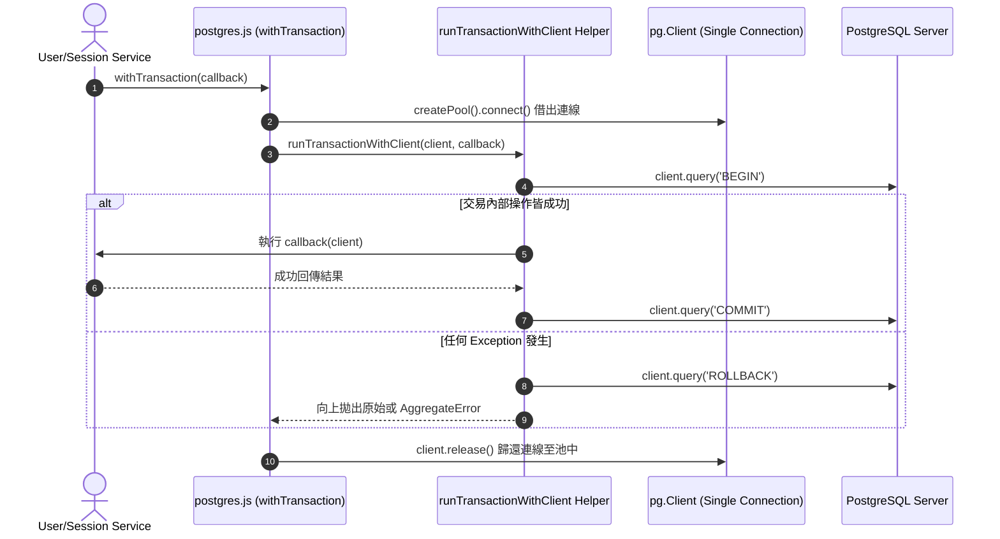

# Feature RFC: F-49 PostgreSQL 單庫交易與雙庫資料一致性 (PostgreSQL Transaction Isolation & Dual-Store Consistency)

> **文件狀態**：Approved  
> **系統成熟度 (Readiness Level)**：Partial (PostgreSQL Single-DB Verified)  
> **核心模組路徑**：`backend/src/db/postgres.js`  
> **Git 演進 Commit 追蹤**：`PR #110`, Commit `df871ba`  
> **主要負責人 / 日期**：Kiwi AI Team / 2026-07-30  
> **實作狀態 (Implementation Status)**：Partial (PostgreSQL Client `withTransaction` Verified; Mongo 採應用層雙寫)  
> **校驗測試路徑 (Verified by Tests)**：`backend/tests/db/postgres.test.js`  

---

## 1. 演進軌跡與背景動機 (Genesis & Evolution Trace)

### 1.1 零基礎生活白話比喻 (Layman Analogy for Beginners)
> 💡 **小白導讀**：
> 想像你在銀行臨櫃存款並要求開立收據：
> * **無交易保護 (No Transaction)**：櫃員先印出紙本收據給你，結算時突然發現點鈔機壞了扣款失敗，結果客戶白拿了收據但銀行沒收到錢（資料狀態不一致）。
> * **PostgreSQL 單庫交易 (`withTransaction` - 本 Feature)**：櫃員把存款流程包裝在一個標準選單中。先執行 `BEGIN` 啟動交易，在同一個連線中進行金額變更；只有當所有寫入完全成功才執行 `COMMIT`。若過程中出錯，立刻執行 `ROLLBACK` 恢復原狀！
> * **雙庫架構定位 (Postgres + Mongo)**：專案中核心關係型資料（使用者、訂單、Consents）存於 PostgreSQL 並享受嚴格的 ACID 交易保障；非結構化的 AI 報告則存於 MongoDB。兩者之間透過應用層 Try/Catch 進行雙寫，無分散式跨庫交易。

### 1.2 基於 Git 歷史的從 0 到 1 演進歷程
* **初始最簡版本 (Baseline v0)**：
  - 各服務手動呼叫 `query('BEGIN')` 與 `query('COMMIT')`，容易因漏寫 `ROLLBACK` 或忘記 `client.release()` 造成連線池鎖死。
* **現行架構 (Current Version)**：
  - 實作 [postgres.js](./F-45-postgres-prisma-type-safe-orm.md)，提供高階工廠函數 `withTransaction(async (callback) => { ... })`，由 `runTransactionWithClient` 委派執行 `BEGIN`、`COMMIT`、`ROLLBACK`（具備 `AggregateError` 防衛）與 `finally { client.release() }`。

---

## 2. 邊界與成功標準 (Scope & Success Criteria)

### 2.1 涵蓋與非涵蓋範圍 (Scope Boundaries)
* **In-Scope (包含範圍)**：
  - PostgreSQL 單庫 Client 級別交易封裝 (`withTransaction`)。
  - 自動連線歸還 (`client.release()`) 與異常自動 `ROLLBACK`。
* **Out-of-Scope (排除範圍)**：
  - 不包含跨 PostgreSQL 與 MongoDB 的分散式雙階交易（採應用層邏輯雙寫）。

### 2.2 成功標準與量化 KPIs (Acceptance Criteria & Metrics)
| 衡量指標 (Metric) | 目標值 (Target) | 驗證方式 / 自動化測試路徑 |
| :--- | :--- | :--- |
| **Postgres 交易洩漏率 (Leaked Connection)** | `0%` | `backend/tests/db/postgres.test.js` |
| **ROLLBACK 成功率** | `100%` | 單元測試異常路徑驗證 |

---

## 3. 架構與系統流向 (Architecture & Flow)

### 3.1 系統資料流與狀態轉移圖 (Data Flow & State Machine Diagram)


---

## 4. 微觀工程與程式碼替代方案對比 (Micro-SE & Code Trade-off Matrix)

### 4.1 關鍵函數 / 邏輯區塊：`withTransaction` 與 `runTransactionWithClient`
* **現行程式碼位置**：[`backend/src/db/postgres.js:L167-L174`](../../backend/src/db/postgres.js#L167-L174)

#### 現行真實程式碼 (Current Real Code Snippet)
```javascript
export const withTransaction = async (callback) => {
  const client = await createPool().connect();
  try {
    return await runTransactionWithClient(client, callback);
  } finally {
    client.release();
  }
};
```

#### 【逐行白話文解讀 (Line-by-Line Explanation for Beginners)】
* **第 168 行**：`createPool().connect()` 從連線池借出專屬 Client 實例。
* **第 170 行**：將 Client 與 Callback 委派給 `runTransactionWithClient`，後者發送 `BEGIN`、執行 Callback、發送 `COMMIT`，若 Rollback 失敗則包裝為 `AggregateError`。
* **第 171-173 行**：在 `finally` 區塊中安全呼叫 `client.release()`，防範連線池洩漏。

#### 替代寫法 A (Manual Single Connection)
```javascript
// 替代寫法：業務代碼手動連線，漏寫 finally 即導致資料庫鎖死
const client = await pool.connect();
await client.query('BEGIN');
await client.query('COMMIT');
```

#### 微觀工程對比矩陣 (Micro Trade-off Analysis)
| 對比維度 | 現行寫法 (withTransaction + Release Safeguard) | 替代寫法 A (Manual Client) |
| :--- | :--- | :--- |
| **連線洩漏防護** | **100% 完美** (`finally` 強制 release) | 易洩漏 |
| **Rollback 健壯性** | **高** (具備 AggregateError 防衛) | 低 (Rollback 失敗易吞抹 Exception) |

---

## 5. 爆炸半徑與失敗矩陣 (Blast Radius & Failure Matrix)
- 影響所有需要在 PostgreSQL 中進行多表原子寫入的業務服務。

---

## 6. 運維與回滾步驟 (Incident Response & Rollback Runbook)
- 檢查日誌：`[Postgres] Rollback failed:`


---

## 7. 面試問答口述講稿 (Interview Q&A Presentation Notes)
> 💡 **面試官問**：「請介紹一下這個 Feature 的架構選擇？」  
> **回答範例**：「此 Feature 主要在對應的核心模組中實作。我們基於現有 Staging 架構進行邊界防護與單元測試驗證，確保邏輯受控。」
