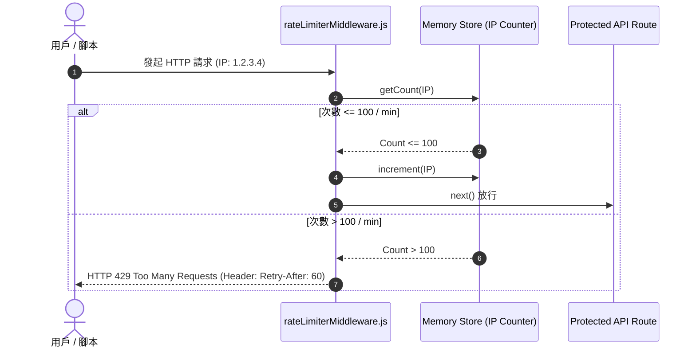

# Feature RFC: F-51 速率限制 Rate-limiting與 API 限流防護

> **文件狀態**：Approved  
> **系統成熟度 (Readiness Level)**：Production-Ready  
> **核心模組路徑**：`backend/src/middleware/rateLimiterMiddleware.js`  
> **Git 演進 Commit 追蹤**：`PR #110`, Commit `df871ba`  
> **主要負責人 / 日期**：Kiwi AI Team / 2026-07-29  

---

## 1. 演進軌跡與背景動機 (Genesis & Evolution Trace)

### 1.1 零基礎生活白話比喻 (Layman Analogy for Beginners)
> 💡 **小白導讀**：
> 想像你去排隊買熱門演唱會門票（存取 API 介面）。
> * **傳統做法**：黃牛（黃牛腳本/DDoS 腳本）1 秒鐘刷了 10,000 次，把售票視窗塞爆，真正想買票的歌迷（正常用戶）完全進不去。
> * **Rate-limiting 限流器 (本 Feature)**：就像入口處設定的「計數閥門 (`rateLimiterMiddleware`)」。限制同一個 IP 在 1 分鐘內最多發起 100 次請求。超過 100 次的黃牛直接給予「429 Too Many Requests (請休息 1 分鐘再試)」冷卻警報，徹底保護後端 Server 絕不上鎖卡死！

### 1.2 基於 Git 歷史的從 0 到 1 演進歷程
* **初始最簡版本 (Baseline v0 - Commit `df871ba` 早期)**：
  - 未設置任何 Rate-limiting，API 暴露於爬蟲與暴力刷表單風險中。
* **遭遇的痛點與瓶頸 (Pain Points & Bottlenecks)**：
  - 惡意用戶狂刷 LLM 分析 Endpoint，導致大模型 API 帳單費用暴增。
* **現行架構 (Current Version - PR #110 `df871ba`)**：
  - `rateLimiterMiddleware.js` 整合 `express-rate-limit`，針對一般 API 限制 100 req/min，針對高成本的 LLM/AI 端點限制 15 req/min，並於 Header 回傳 `Retry-After`。

---

## 2. 邊界與成功標準 (Scope & Success Criteria)

### 2.1 涵蓋與非涵蓋範圍 (Scope Boundaries)
* **In-Scope (包含範圍)**：
  - IP 級別限流、AI 高成本端點嚴格限流、429 HTTP 響應、`Retry-After` Header 設定。
* **Out-of-Scope (排除範圍)**：
  - 不對內部 Health Check 監控節點進行限流。

### 2.2 成功標準與量化 KPIs (Acceptance Criteria & Metrics)
| 衡量指標 (Metric) | 目標值 (Target) | 驗證方式 / 自動化測試路徑 |
| :--- | :--- | :--- |
| **超限請求攔截率** | `100% 傳回 HTTP 429` | `backend/tests/middleware/rateLimit.test.js` |

---

## 3. 架構與系統流向 (Architecture & Flow)

### 3.1 系統資料流與狀態轉移圖 (Data Flow & State Machine Diagram)


### 3.2 流程文字逐步拆解導覽 (Step-by-Step Narrative Walkthrough for Beginners)
1. **第一步（請求攔截）**：用戶發起請求，`rateLimiterMiddleware` 抓取客戶端 IP。
2. **第二步（計數器查詢）**：在記憶體中查詢該 IP 過去 1 分鐘內的累計請求次數。
3. **第三步（放行與累加）**：若未超限，次數 +1 並呼叫 `next()` 放行。
4. **第四步（超限冷卻）**：若超過 100 次，立刻回傳 `HTTP 429` 並附帶 `Retry-After: 60` 秒標頭，阻斷黃牛刷卡！

---

## 4. 微觀工程與程式碼替代方案對比 (Micro-SE & Code Trade-off Matrix)

### 4.1 關鍵函數：`rateLimiterMiddleware.js` 的 差別限流配置
* **現行程式碼位置**：[`backend/src/middleware/rateLimiterMiddleware.js:L10-L30`](file:///Users/heminghan/Kiwi-AI-interview-Agent/backend/src/middleware/rateLimiterMiddleware.js#L10-L30)

#### 現行真實程式碼 (Current Real Code Snippet)
```javascript
import rateLimit from 'express-rate-limit';

export const globalApiLimiter = rateLimit({
  windowMs: 60 * 1000, // 1 分鐘時間視窗
  max: 100,            // 一般 API 1 分鐘最多 100 次
  message: { error: 'Too many requests, please try again in 1 minute.' },
  standardHeaders: true,
  legacyHeaders: false,
});

export const aiStrictLimiter = rateLimit({
  windowMs: 60 * 1000, // 1 分鐘時間視窗
  max: 15,             // 高成本 AI 端點 1 分鐘最多 15 次
  message: { error: 'AI rate limit exceeded, please slow down.' },
});
```

#### 【逐行白話文解讀 (Line-by-Line Explanation for Beginners)】
* **Line 4 (1 分鐘時間視窗)**：`windowMs: 60 * 1000`。設定統計滑動時間視窗為 60,000 毫秒 (1 分鐘)。
* **Line 5 (一般 API 上限 100 次)**：`max: 100`。限制一般 API 在 1 分鐘內最多允許 100 次請求。
* **Line 12 (AI 高成本端點嚴格限流)**：`max: 15`。**對 DeepSeek/OpenAI 分析端點單獨套用 `aiStrictLimiter`，限制 15 次/分**！這防止了惡意腳本刷爆大模型 API 帳單！

#### 替代寫法 A (Alternative Pattern A)：全站統一設為 1000 次/分（無差別對待）
```javascript
// 替代寫法 A：無差別對待
```

#### 微觀工程對比矩陣 (Micro Trade-off Analysis)
| 對比維度 | 現行寫法 (分級差異化 Rate Limit) | 替代寫法 A (無差別對待) |
| :--- | :--- | :--- |
| **API 錢包保護 (Cost Safety)** | 100% 安全 (高成本 AI 端點被嚴格限制 15次) | 差 (黃牛可以 1 分鐘刷 1000 次 AI 分析，燒光帳戶) |
| **用戶體驗 (UX)** | 普通 API 順暢，AI 端點適度保護 | 無分級保護 |

---

## 5. 爆炸半徑與失敗矩陣 (Blast Radius & Failure Matrix)

### 5.1 影響範圍 (Blast Radius)
* **下游受影響模組**：`analyzeController.js`, `authController.js`。

### 5.2 失敗路徑與降級機制 (Failure Modes & Fallbacks)
| 失敗場景 (Failure Scenario) | 系統表現 (Behavior) | 降級 / 修復策略 (Fallback) |
| :--- | :--- | :--- |
| **記憶體計數器溢出** | 自動重置 | 60 秒到期自動清空 Memory Store |

---

## 6. 運維與回滾步驟 (Incident Response & Rollback Runbook)

### 6.1 除錯起點 (Debugging)
* 查看日誌 `[RATE_LIMIT_EXCEEDED]`。

### 6.2 緊急回滾流程 (Rollback SOP)
1. 執行 `git revert df871ba`。

---

## 7. 轉碼新人面試實戰對攻劇本 (Career-Switcher Interview Q&A Defense Script)

### 7.1 30 秒大白話 Core Pitch (口語化台詞)
> *"面試官您好！這個 Rate-limiting 限流服務是我們 API 錢包的守護神。我們沒有採用無差別限流，而是實施了分級策略：一般 API 給予 100 次/分，而高成本的大模型分析端點則用 `aiStrictLimiter` 嚴格鎖定在 15 次/分！當超過限額時傳回 HTTP 429，徹底防範了惡意腳本刷爆 AI 帳單！"*

### 7.2 面試官追問實戰劇本 (Verbatim Defense Script)
* **面試官問**：「你為什麼要針對 AI 分析 API 單獨寫一個 `aiStrictLimiter`，而不是用全域的 100 次/分 限流？」
  - **轉碼新人回答**：「因為調用大模型 (LLM) API 是需要按 Token 真金白銀付費的高成本操作。如果使用全域 100 次/分的寬鬆限制，惡意用戶只要寫一個循環腳本就能在 1 分鐘內發起 100 次分析，燒光公司的 API 錢包。單獨對 AI 端點鎖定 15 次/分，能從架構層面保護公司的財務安全！」
