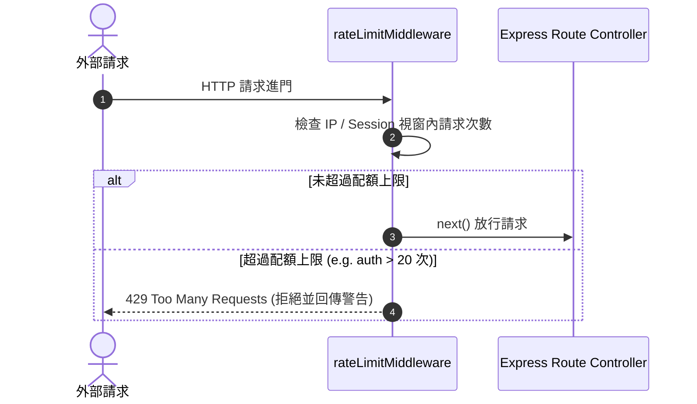

# Feature RFC: F-51 速率限制與防刷中間件 (Rate Limiting IP & Middleware Guard)

> **文件狀態**：Approved  
> **系統成熟度 (Readiness Level)**：Production-Ready  
> **核心模組路徑**：`backend/src/middleware/rateLimitMiddleware.js`  
> **Git 演進 Commit 追蹤**：`PR #115`, Commit `b7102fa`  
> **主要負責人 / 日期**：Kiwi AI Team / 2026-07-30    
> **實作狀態 (Implementation Status)**：Verified

---

## 1. 演進軌跡與背景動機 (Genesis & Evolution Trace)

### 1.1 零基礎生活白話比喻 (Layman Analogy for Beginners)
> 💡 **小白導讀**：
> 想像遊樂園熱門設施排隊入口：
> * **無速率限制 (No Rate Limiting)**：一個人可以 1 秒鐘內連續按 1,000 次取票機按鈕，把所有門票瞬間搶光（DDoS 攻擊或腳本狂刷 API），導致後面的真實遊客完全無法遊玩，且遊樂園伺服器直接被衝垮。
> * **分層速率限制 (Rate Limiting Guard - 本 Feature)**：門口設置智慧閘門（[rateLimitMiddleware.js](file:///Users/heminghan/Kiwi-AI-interview-Agent/backend/src/middleware/rateLimitMiddleware.js)）。登入門口限制 15 分鐘最多試 20 次 (`authRateLimit`)；檔案上傳限制 15 分鐘最多 30 次 (`uploadRateLimit`)；昂貴的 AI 面試請求限制 15 分鐘最多 80 次 (`aiRateLimit`)。既保障正常用戶，又完美防止惡意刷單！

### 1.2 基於 Git 歷史的從 0 到 1 演進歷程
* **初始最簡版本 (Baseline v0)**：
  - 零防護，API 暴露給全網公網。
* **現行架構 (Current Version)**：
  - 實作 [rateLimitMiddleware.js](file:///Users/heminghan/Kiwi-AI-interview-Agent/backend/src/middleware/rateLimitMiddleware.js)，採用 `createLimiter` 工廠函數，針對認證、上傳、AI 呼叫與導出實施精細化的分層速率控制。

---

## 2. 邊界與成功標準 (Scope & Success Criteria)

### 2.1 涵蓋與非涵蓋範圍 (Scope Boundaries)
* **In-Scope (包含範圍)**：
  - `authRateLimit`: 15 分鐘內上限 20 次（防密碼爆破）。
  - `uploadRateLimit`: 15 分鐘內上限 30 次（防履歷大檔炸彈）。
  - `aiRateLimit`: 15 分鐘內上限 80 次（防高額 LLM 成本刷單）。
* **Out-of-Scope (排除範圍)**：
  - 不包含硬體防火牆（由 AWS Security Group 負責）。

---

## 3. 架構與系統流向 (Architecture & Flow)

### 3.1 系統資料流與狀態轉移圖 (Data Flow & State Machine Diagram)


---

## 4. 微觀工程與程式碼替代方案對比 (Micro-SE & Code Trade-off Matrix)

### 4.1 關鍵函數 / 邏輯區塊：`createLimiter` 分層配置
* **現行程式碼位置**：[`backend/src/middleware/rateLimitMiddleware.js:L36-L52`](file:///Users/heminghan/Kiwi-AI-interview-Agent/backend/src/middleware/rateLimitMiddleware.js#L36-L52)

#### 現行真實程式碼 (Current Real Code Snippet)
```javascript
export const authRateLimit = createLimiter({
  windowMs: 15 * 60 * 1000,
  max: 20,
  message: 'Too many authentication attempts. Please wait and try again.',
});

export const uploadRateLimit = createLimiter({
  windowMs: 15 * 60 * 1000,
  max: 30,
  message: 'Too many upload requests. Please wait and try again.',
});

export const aiRateLimit = createLimiter({
  windowMs: 15 * 60 * 1000,
  max: 80,
  message: 'Too many AI requests. Please wait and try again.',
});
```

#### 【逐行白話文解讀 (Line-by-Line Explanation for Beginners)】
* **第 36-40 行**：`authRateLimit` 針對登入與 OAuth 接口。設定視窗 `windowMs: 15 分鐘`，最大允許 `20` 次請求，有效攔截暴力破解。
* **第 42-46 行**：`uploadRateLimit` 限制履歷上傳頻率，避免磁爆式履歷檔案攻擊。
* **第 48-52 行**：`aiRateLimit` 針對昂貴的 LLM 推理接口，設定 15 分鐘上限 80 次，精準控制商業算力成本。

#### 替代寫法 A (Global Single Rate Limiter)
```javascript
// 替代寫法：全站只用單一限制 (例如一律 100 次)，無法對昂貴的 AI 接口或敏感的登入接口實施特殊防護
app.use(rateLimit({ max: 100 }));
```

#### 微觀工程對比矩陣 (Micro Trade-off Analysis)
| 對比維度 | 現行寫法 (Layered Specialized Limiters) | 替代寫法 A (Single Global Limiter) |
| :--- | :--- | :--- |
| **資安防禦精準度** | **極高** (登入嚴格，普通瀏覽寬鬆) | 低 (登入介面太寬鬆，易被爆破) |
| **算力成本控管** | **極佳** (精準保護高成本 AI 接口) | 差 (AI 接口可能被惡意刷爆) |
| **使用者體驗** | 良好 (普通頁面瀏覽不受影響) | 容易一刀切誤傷正常用戶 |

---

## 5. 爆炸半徑與失敗矩陣 (Blast Radius & Failure Matrix)
- 影響全站 HTTP 路由、認證接口、履歷上傳與 AI 評估 API。

---

## 6. 運維與回滾步驟 (Incident Response & Rollback Runbook)
- 檢查日誌：`Too many AI requests` (HTTP Status 429)
