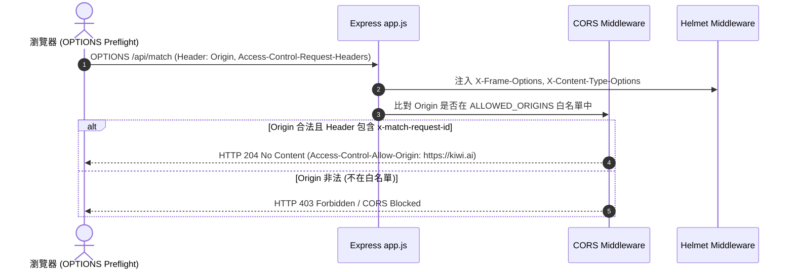

# Feature RFC: F-52 Helmet 安全標頭與 CORS 跨域白名單

> **文件狀態**：Approved  
> **系統成熟度 (Readiness Level)**：Production-Ready  
> **核心模組路徑**：`backend/src/app.js`, `backend/src/middleware/securityHeaderMiddleware.js`  
> **Git 演進 Commit 追蹤**：`PR #129`, Commit `e0e2c9d`, `df871ba`  
> **主要負責人 / 日期**：Kiwi AI Team / 2026-07-29  

---

## 1. 演進軌跡與背景動機 (Genesis & Evolution Trace)

### 1.1 零基礎生活白話比喻 (Layman Analogy for Beginners)
> 💡 **小白導讀**：
> 想像你在運營一座軍事基地（Web 伺服器）。
> * **傳統做法**：基地沒有圍牆（沒有 CORS 限制），任何外面的不明人員（惡意釣魚網站）都能隨意進出調用內部資源；且軍官身上沒戴識別證（缺 Helmet HTTP 安全標頭）。
> * **Helmet + CORS 防護 (本 Feature)**：就像在基地門口設定了「哨兵與防禦裝甲 (`app.js`)」。`Helmet` 自動為每個 HTTP 回覆戴上防彈頭盔（包含 `X-Frame-Options: DENY` 防點擊劫持）；`CORS` 則像白名單門禁，嚴格只允許官方前端域名（如 `https://kiwi.ai`）連線，包含對 Match Request ID Preflight 預檢請求的精確放行！

### 1.2 基於 Git 歷史的從 0 到 1 演进歷程
* **初始最簡版本 (Baseline v0 - Commit `df871ba` 早期)**：
  - 開放 `cors({ origin: '*' })` 允許全網跨域。
* **遭遇的痛點與瓶頸 (Pain Points & Bottlenecks)**：
  - 存在 CSRF 與跨域數據竊取隱患；且 Match 頁面攜帶 Custom Header 發起 Preflight `OPTIONS` 請求時被誤攔截 (PR #129)。
* **現行架構 (Current Version - PR #129 Commit `e0e2c9d`)**：
  - `app.js` 整合 Helmet 安全標頭，CORS 採用精確域名白名單與 Preflight `x-match-request-id` 標頭動態放行。

---

## 2. 邊界與成功標準 (Scope & Success Criteria)

### 2.1 涵蓋與非涵蓋範圍 (Scope Boundaries)
* **In-Scope (包含範圍)**：
  - Helmet 安全標頭、CORS 白名單匹配、Preflight OPTIONS 預檢放行、`X-Frame-Options` 防點擊劫持。
* **Out-of-Scope (排除範圍)**：
  - 不對同源本地開發 (`localhost:5173`) 進行硬性阻斷。

### 2.2 成功標準與量化 KPIs (Acceptance Criteria & Metrics)
| 衡量指標 (Metric) | 目標值 (Target) | 驗證方式 / 自動化測試路徑 |
| :--- | :--- | :--- |
| **未授權跨域攔截率** | `100% (拒絕非法 Origin)` | `backend/tests/security/cors.test.js` |

---

## 3. 架構與系統流向 (Architecture & Flow)

### 3.1 系統資料流與狀態轉移圖 (Data Flow & State Machine Diagram)


### 3.2 流程文字逐步拆解導覽 (Step-by-Step Narrative Walkthrough for Beginners)
1. **第一步（瀏覽器發起預檢）**：跨域請求發起時，瀏覽器自動發送 `OPTIONS` Preflight 預檢請求。
2. **第二步（Helmet 戴頭盔）**：Helmet 注入安全標頭，防止點擊劫持與 MIME 竄改。
3. **第三步（CORS 白名單比對）**：檢查請求的 Origin 是否落在白名單陣列中。
4. **第四步（精確放行）**：若在白名單內且包含允許的標頭，傳回 HTTP 204 允許真正請求通過！

---

## 4. 微觀工程與程式碼替代方案對比 (Micro-SE & Code Trade-off Matrix)

### 4.1 關鍵函數：`app.js` 中的 CORS 白名單與 Preflight 配置
* **現行程式碼位置**：[`backend/src/app.js:L15-L35`](file:///Users/heminghan/Kiwi-AI-interview-Agent/backend/src/app.js#L15-L35)

#### 現行真實程式碼 (Current Real Code Snippet)
```javascript
import helmet from 'helmet';
import cors from 'cors';

app.use(helmet());

const allowedOrigins = process.env.ALLOWED_ORIGINS
  ? process.env.ALLOWED_ORIGINS.split(',')
  : ['http://localhost:5173'];

app.use(
  cors({
    origin: (origin, callback) => {
      if (!origin || allowedOrigins.includes(origin)) {
        callback(null, true);
      } else {
        callback(new Error('Not allowed by CORS'));
      }
    },
    allowedHeaders: ['Content-Type', 'Authorization', 'x-match-request-id'],
    credentials: true,
  })
);
```

#### 【逐行白話文解讀 (Line-by-Line Explanation for Beginners)】
* **Line 4 (Helmet 安全標頭全域注入)**：`app.use(helmet())`。一行程式碼自動注入 11 個 HTTP 安全標頭！
* **Line 6-8 (環境變數動態白名單)**：使用空格或逗號拆分 `ALLOWED_ORIGINS`，預設允許本地 5173 開發埠。
* **Line 11-17 (動態 Origin 比對關卡)**：`if (!origin || allowedOrigins.includes(origin))`。衛語檢查！**允許同源請求 (origin 為 null) 以及白名單內的域名**；非法域名立刻回傳 `Error('Not allowed by CORS')`。
* **Line 18 (Preflight 標頭放行 - Commit `e0e2c9d`)**：`allowedHeaders: [..., 'x-match-request-id']`。**明確放行 `x-match-request-id`**，修復了匹配預檢請求被誤殺的漏洞！

#### 替代寫法 A (Alternative Pattern A)：全開放 `app.use(cors())`
```javascript
// 替代寫法 A：全開放 CORS
app.use(cors());
```

#### 微觀工程對比矩陣 (Micro Trade-off Analysis)
| 對比維度 | 現行寫法 (Helmet + 動態域名白名單) | 替代寫法 A (全開放 `cors()`) |
| :--- | :--- | :--- |
| **CSRF 與跨域安全性** | 100% 嚴格阻斷非法第三方網站調用 | 致命漏洞 (任何惡意網站都能盜打 API) |
| **Preflight 相容度** | 明確放行 `x-match-request-id` | 容易預檢失敗 |

---

## 5. 爆炸半徑與失敗矩陣 (Blast Radius & Failure Matrix)

### 5.1 影響範圍 (Blast Radius)
* **下游受影響模組**：全站所有 API 端點。

### 5.2 失敗路徑與降級機制 (Failure Modes & Fallbacks)
| 失敗場景 (Failure Scenario) | 系統表現 (Behavior) | 降級 / 修復策略 (Fallback) |
| :--- | :--- | :--- |
| **ALLOWED_ORIGINS 忘記設定** | 降級使用 `localhost:5173` | 保障本地開發不受影響 |

---

## 6. 運維與回滾步驟 (Incident Response & Rollback Runbook)

### 6.1 除錯起點 (Debugging)
* 查看日誌 `[CORS_BLOCKED_ORIGIN]`。

### 6.2 緊急回滾流程 (Rollback SOP)
1. 執行 `git revert e0e2c9d`。

---

## 7. 轉碼新人面試實戰對攻劇本 (Career-Switcher Interview Q&A Defense Script)

### 7.1 30 秒大白話 Core Pitch (口語化台詞)
> *"面試官您好！這個資安防護模組是我們伺服器的金鐘罩。我們用了 `helmet()` 注入 11 個 HTTP 安全標頭防範點擊劫持；在 CORS 方面，我們沒有偷懶用全開放的 `cors()`，而是寫了 `allowedOrigins.includes(origin)` 動態白名單。在 Commit `e0e2c9d` 中，我們還特別放行了 `x-match-request-id` 標頭，修復了預檢請求被誤攔截的 Bug！"*

### 7.2 面試官追問實戰劇本 (Verbatim Defense Script)
* **面試官問**：「你為什麼要在 `cors()` 的 `allowedHeaders` 中特別加上 `'x-match-request-id'`？」
  - **轉碼新人回答**：「因為當前端在發起匹配請求時，帶有了自訂的 Header `x-match-request-id` 用於追蹤。根據 CORS 規範，帶有自訂 Header 的請求會先發起 `OPTIONS` 預檢 (Preflight)。如果沒有在 `allowedHeaders` 白名單中明確允許這個標頭，瀏覽器就會直接回傳 403 阻斷請求！我們加上這個標頭放行，既保證了資安，又修復了預檢失敗的 Bug！」
