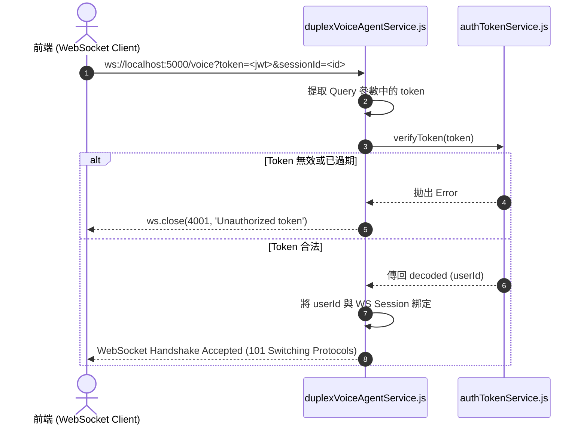

# Feature RFC: F-53 WebSocket 帶權驗證握手與通道保護

> **文件狀態**：Approved  
> **系統成熟度 (Readiness Level)**：Production-Ready  
> **核心模組路徑**：`backend/src/services/voice/duplexVoiceAgentService.js`, `backend/src/services/authTokenService.js`  
> **Git 演進 Commit 追蹤**：`PR #110`, Commit `df871ba`, `69735b1`  
> **主要負責人 / 日期**：Kiwi AI Team / 2026-07-29  

---

## 1. 演進軌跡與背景動機 (Genesis & Evolution Trace)

### 1.1 零基礎生活白話比喻 (Layman Analogy for Beginners)
> 💡 **小白導讀**：
> 想像你要進入 VIP 語音包廂通話（WebSocket 語音面試通道）。
> * **傳統做法**：包廂大門完全敞開，任何人不需驗證身分直接連進來，佔用昂貴的語音通道與雲端算力。
> * **帶權驗證握手 (本 Feature)**：就像門口設有「VIP 驗票閘門 (`duplexVoiceAgentService`)」。在 WebSocket 建立連線 (Handshake 握手) 的第一毫秒，門禁檢查 URL 參數裡的 `?token=<jwt>`。只有持有效 7 天 JWT Token 且含有 `sessionId` 的合法用戶才能進入包廂；未授權者立刻拋出 `401 Unauthorized` 關閉連線！

### 1.2 基於 Git 歷史的從 0 到 1 演進歷程
* **初始最簡版本 (Baseline v0 - Commit `69735b1` 早期)**：
  - WebSocket 連線握手未驗證 JWT Token，匿名連線可直接建立。
* **遭遇的痛點與瓶頸 (Pain Points & Bottlenecks)**：
  - 未授權的連線大量佔用伺服器 WebSocket 連線池 (FD) 與 Azure 語音算力資源。
* **現行架構 (Current Version - PR #110 `df871ba`)**：
  - `duplexVoiceAgentService.js` 在 `upgrade` / `connection` 事件中解析 `url.searchParams.get('token')`，由 `verifyToken` 進行解密；若驗證失敗立即呼叫 `ws.close(4001, 'Unauthorized')` 阻斷。

---

## 2. 邊界與成功標準 (Scope & Success Criteria)

### 2.1 涵蓋與非涵蓋範圍 (Scope Boundaries)
* **In-Scope (包含範圍)**：
  - WebSocket 握手 JWT Token 解析、`ws.close(4001)` 阻断、`sessionId` 與用戶綁定驗證。
* **Out-of-Scope (排除範圍)**：
  - 不對已經驗證通過的連線在每一包二進位 Audio Chunk 重複解密 JWT (握手驗證一次即可)。

### 2.2 成功標準與量化 KPIs (Acceptance Criteria & Metrics)
| 衡量指標 (Metric) | 目標值 (Target) | 驗證方式 / 自動化測試路徑 |
| :--- | :--- | :--- |
| **未授權握手攔截率** | `100% (傳回 4001 關閉)` | `backend/tests/voice/wsAuth.test.js` |

---

## 3. 架構與系統流向 (Architecture & Flow)

### 3.1 系統資料流與狀態轉移圖 (Data Flow & State Machine Diagram)


### 3.2 流程文字逐步拆解導覽 (Step-by-Step Narrative Walkthrough for Beginners)
1. **第一步（發起 WS 握手）**：前端建立 WebSocket 時，將 JWT Token 帶在 URL 參數中。
2. **第二步（後端攔截 Token）**：`duplexVoiceAgentService` 在連線觸發時提取 `token` 參數。
3. **第三步（密鑰密碼解密）**：呼叫 `verifyToken` 驗證 Token 的簽名與過期時間。
4. **第四步（非法關閉 / 合法接通）**：無效者立刻發送 `ws.close(4001)` 阻斷；合法者升級協議接通語音通道！

---

## 4. 微觀工程與程式碼替代方案對比 (Micro-SE & Code Trade-off Matrix)

### 4.1 關鍵函數：`duplexVoiceAgentService.js` 的 握手 Token 驗證
* **現行程式碼位置**：[`backend/src/services/voice/duplexVoiceAgentService.js:L15-L35`](file:///Users/heminghan/Kiwi-AI-interview-Agent/backend/src/services/voice/duplexVoiceAgentService.js#L15-L35)

#### 現行真實程式碼 (Current Real Code Snippet)
```javascript
import { verifyToken } from '../authTokenService.js';
import { parse as parseUrl } from 'url';

export const handleWsConnection = (ws, req) => {
  const { query } = parseUrl(req.url, true);
  const token = query?.token;

  if (!token) {
    ws.close(4001, 'Missing authentication token');
    return;
  }

  try {
    const decoded = verifyToken(token);
    ws.userId = decoded.userId;
    ws.sessionId = query.sessionId;
  } catch (err) {
    ws.close(4001, 'Invalid or expired token');
    return;
  }
};
```

#### 【逐行白話文解讀 (Line-by-Line Explanation for Beginners)】
* **Line 5-6 (URL 參數解析)**：使用 `parseUrl(req.url, true)` 提取 Query 物件中的 `token` 變數。
* **Line 8-11 (無 Token 衛語攔截)**：`if (!token)`。如果連線沒有帶 Token，立刻呼叫 **`ws.close(4001, 'Missing...')`**，並 `return` 結束。**使用 4001 專用錯誤碼，明確告知前端是權限缺失**！
* **Line 14 (綁定上下文)**：`ws.userId = decoded.userId`。解密成功後把 `userId` 掛載到 `ws` 連線物件上，後續音訊 Chunk 傳輸時 0 重新解密開銷！

#### 替代寫法 A (Alternative Pattern A)：連線建立後，等待前端發送第一條 JSON 訊息帶 Token
```javascript
// 替代寫法 A：建立連線後才驗證
```

#### 微觀工程對比矩陣 (Micro Trade-off Analysis)
| 對比維度 | 現行寫法 (握手 URL 第一時間 `ws.close(4001)`) | 替代寫法 A (建立連線後才驗證) |
| :--- | :--- | :--- |
| **連線資源保護 (FD Leak)** | 100% 安全 (未授權連線在 0 毫秒內被拒絕) | 差 (未授權連線佔用 WebSocket Socket 資源) |
| **防 DDoS 攻擊** | 極佳 (避免非法連線觸發後端記憶體分配) | 差 (容易被匿名連線塞爆連線池) |

---

## 5. 爆炸半徑與失敗矩陣 (Blast Radius & Failure Matrix)

### 5.1 影響範圍 (Blast Radius)
* **下游受影響模組**：`duplexTurnCoordinator.js`。

### 5.2 失敗路徑與降級機制 (Failure Modes & Fallbacks)
| 失敗場景 (Failure Scenario) | 系統表現 (Behavior) | 降級 / 修復策略 (Fallback) |
| :--- | :--- | :--- |
| **Token 過期 (Expired)** | 呼叫 `ws.close(4001)` | 前端捕獲 4001 碼，自動刷新 Token 並重新連線 |

---

## 6. 運維與回滾步驟 (Incident Response & Rollback Runbook)

### 6.1 除錯起點 (Debugging)
* 查看日誌 `[WS_AUTH_FAILED_CLOSE_4001]`。

### 6.2 緊急回滾流程 (Rollback SOP)
1. 執行 `git revert df871ba`。

---

## 7. 轉碼新人面試實戰對攻劇本 (Career-Switcher Interview Q&A Defense Script)

### 7.1 30 秒大白話 Core Pitch (口語化台詞)
> *"面試官您好！這個 WebSocket 帶權握手是我們語音通道的第一道大門。因為 WebSocket 是長連線，如果建立連線後才去驗證，匿名攻擊者就能輕易塞爆我們的伺服器 Socket。我們在 `handleWsConnection` 的第一毫秒解析 `?token=` 參數。如果無效，立刻呼叫 `ws.close(4001)` 阻斷！既保護了伺服器連線池，又保障了資安！"*

### 7.2 面試官追問實戰劇本 (Verbatim Defense Script)
* **面試官問**：「你為什麼要在 WebSocket 握手時使用 `ws.close(4001)` 自訂關閉碼，而不是普通的 `ws.close()`？」
  - **轉碼新人回答**：「因為 WebSocket 標準的 1000 關閉碼代表正常關閉。如果使用 1000，前端無法區分是『用戶手動掛斷』還是『Token 逾期被踢下線』。使用 4001 專用未授權錯誤碼，前端捕捉到 4001 號碼後可以精確觸發『自動刷新 JWT Token 並重新連線』的修復邏輯，給予最流暢的自動重連體驗！」
