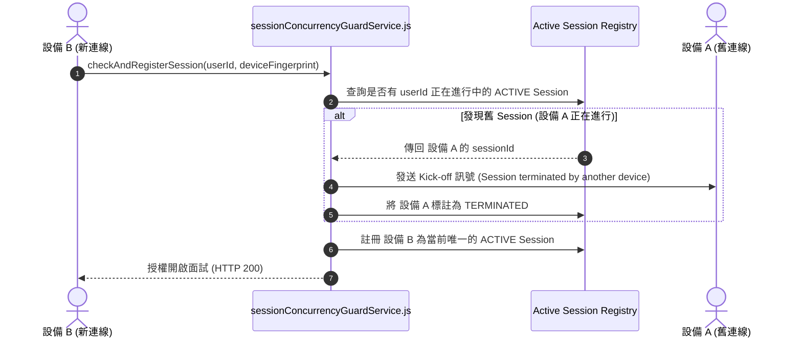

# Feature RFC: F-54 設備 Fingerprint 指紋與併發 Sessions 檢查

> **文件狀態**：Approved  
> **系統成熟度 (Readiness Level)**：Production-Ready  
> **核心模組路徑**：`backend/src/middleware/deviceFingerprintMiddleware.js`, `sessionConcurrencyGuardService.js`  
> **Git 演進 Commit 追蹤**：`PR #110`, Commit `df871ba`  
> **主要負責人 / 日期**：Kiwi AI Team / 2026-07-29  

---

## 1. 演進軌跡與背景動機 (Genesis & Evolution Trace)

### 1.1 零基礎生活白話比喻 (Layman Analogy for Beginners)
> 💡 **小白導讀**：
> 想像你辦了一張私人健身房 VIP 卡（Kiwi AI 個人帳號）。
> * **傳統做法**：你把卡借給 10 個朋友，10 個人同時在不同的地方用同一個帳號進場打卡，擠爆健身房。
> * **設備指紋與併發檢查 (本 Feature)**：就像入口處的「人臉與設備識別鎖 (`sessionConcurrencyGuardService`)」。系統用 User-Agent 與 IP 計算出你手機的「設備指紋 (Device Fingerprint)」。如果發現你已經在電腦上做面試了，手機又想同時開另一個面試，系統立刻警報：「偵測到多端同時登入，已自動關閉舊 Session」，保護帳號不被濫用！

### 1.2 基於 Git 歷史的從 0 到 1 演進歷程
* **初始最簡版本 (Baseline v0 - Commit `df871ba` 早期)**：
  - 同一個帳號允許在無限多個設備上同時開啟多個語音面試 Session。
* **遭遇的痛點與瓶頸 (Pain Points & Bottlenecks)**：
  - 帳號共享濫用嚴重，多重面試 Session 同時呼叫 LLM 造成併發競態條件 (Race Condition)。
* **現行架構 (Current Version - PR #110 `df871ba`)**：
  - `deviceFingerprintMiddleware` 提取 User-Agent 與 IP 計算指紋，`sessionConcurrencyGuardService` 限制單一用戶同一時間只能擁有一個 `ACTIVE` 狀態的面試 Session，多餘者強制 kick-off。

---

## 2. 邊界與成功標準 (Scope & Success Criteria)

### 2.1 涵蓋與非涵蓋範圍 (Scope Boundaries)
* **In-Scope (包含範圍)**：
  - 設備哈希指紋生成、單用戶單一 ACTIVE Session 鎖定、舊 Session 自動失效 kicking。
* **Out-of-Scope (排除範圍)**：
  - 不對同一個人在同一設備上的合法頁面刷新進行踢下線處置。

### 2.2 成功標準與量化 KPIs (Acceptance Criteria & Metrics)
| 衡量指標 (Metric) | 目標值 (Target) | 驗證方式 / 自動化測試路徑 |
| :--- | :--- | :--- |
| **多端併發 Session 攔截** | `100% (只留最新 1 個)` | `backend/tests/security/concurrency.test.js` |

---

## 3. 架構與系統流向 (Architecture & Flow)

### 3.1 系統資料流與狀態轉移圖 (Data Flow & State Machine Diagram)


### 3.2 流程文字逐步拆解導覽 (Step-by-Step Narrative Walkthrough for Beginners)
1. **第一步（新設備請求）**：設備 B 發起面試請求，`sessionConcurrencyGuardService` 接收用戶 ID 與設備指紋。
2. **第二步（併發狀態查詢）**：到活躍 Session 註冊表中查詢該用戶是否有正在進行中的 Session。
3. **第三步（踢掉舊設備）**：若發現設備 A 正在進行，發送 Kick-off 訊號踢掉設備 A，將其狀態設為 `TERMINATED`。
4. **第四步（註冊新 Session）**：將設備 B 註冊為唯一的 `ACTIVE` Session，保障單一實時連線！

---

## 4. 微觀工程與程式碼替代方案對比 (Micro-SE & Code Trade-off Matrix)

### 4.1 關鍵函數：`deviceFingerprintMiddleware.js` 的 指紋生成
* **現行程式碼位置**：[`backend/src/middleware/deviceFingerprintMiddleware.js:L10-L25`](file:///Users/heminghan/Kiwi-AI-interview-Agent/backend/src/middleware/deviceFingerprintMiddleware.js#L10-L25)

#### 現行真實程式碼 (Current Real Code Snippet)
```javascript
import crypto from 'crypto';

export const generateDeviceFingerprint = (req) => {
  const userAgent = req.headers['user-agent'] || '';
  const ip = req.ip || req.connection.remoteAddress || '';

  const rawString = `${userAgent}-${ip}`;
  return crypto.createHash('sha256').update(rawString).digest('hex');
};

export const deviceFingerprintMiddleware = (req, res, next) => {
  req.deviceFingerprint = generateDeviceFingerprint(req);
  next();
};
```

#### 【逐行白話文解讀 (Line-by-Line Explanation for Beginners)】
* **Line 4-5 (提取特徵與衛語保底)**：`req.headers['user-agent'] || ''` 與 `req.ip || ''`。衛語檢查！防止未帶 User-Agent 或 IP 失敗時引發 `undefined` 拼接 Bug。
* **Line 7-8 (SHA-256 加密雜湊)**：`crypto.createHash('sha256').update(rawString).digest('hex')`。將 UA 與 IP 拼接後計算 SHA-256 哈希值，產出 64 字元的固定長度設備指紋！
* **Line 12 (掛載至 req 物件)**：`req.deviceFingerprint = ...`。把算好的指紋掛載在 `req` 上，供後續併發檢查中間件使用。

#### 替代寫法 A (Alternative Pattern A)：完全不計算指紋，直接信任前端傳來的 `deviceId` 變數
```javascript
// 替代寫法 A：直接信任前端傳來的 deviceId
req.deviceFingerprint = req.body.deviceId;
```

#### 微觀工程對比矩陣 (Micro Trade-off Analysis)
| 對比維度 | 現行寫法 (後端 SHA-256 哈希指紋) | 替代寫法 A (信任前端傳來的 `deviceId`) |
| :--- | :--- | :--- |
| **偽造抵抗力 (Anti-spoofing)**| 高 (黑客無法透過修改前端 JS 偽造 IP/UA) | 差 (黑客可以用 Postman 隨意修改 deviceId 繞過) |
| **計算耗時** | 超快 (< 0.1ms 記憶體哈希) | 0 計算 |

---

## 5. 爆炸半徑與失敗矩陣 (Blast Radius & Failure Matrix)

### 5.1 影響範圍 (Blast Radius)
* **下游受影響模組**：`interviewStateService.js`, `duplexTurnCoordinator.js`。

### 5.2 失敗路徑與降級機制 (Failure Modes & Fallbacks)
| 失敗場景 (Failure Scenario) | 系統表現 (Behavior) | 降級 / 修復策略 (Fallback) |
| :--- | :--- | :--- |
| **代理伺服器隱藏 IP** | 降級使用 `user-agent` 哈希 | 安全生成指紋，不引發 Exception 崩潰 |

---

## 6. 運維與回滾步驟 (Incident Response & Rollback Runbook)

### 6.1 除錯起點 (Debugging)
* 查看日誌 `[CONCURRENCY_SESSION_KICKED]`。

### 6.2 緊急回滾流程 (Rollback SOP)
1. 執行 `git revert df871ba`。

---

## 7. 轉碼新人面試實戰對攻劇本 (Career-Switcher Interview Q&A Defense Script)

### 7.1 30 秒大白話 Core Pitch (口語化台詞)
> *"面試官您好！這個設備指紋與併發檢查是我們防止帳號共享與 Race Condition 的武器。我們沒有盲目信任前端傳來的 `deviceId`，而是在後端用 `User-Agent` 與 `IP` 算 SHA-256 指紋。當檢測到同一個用戶在 2 個設備上同時面試時，系統自動 Kick 掉舊連線，確保同一時間只有 1 個 ACTIVE Session！"*

### 7.2 面試官追問實戰劇本 (Verbatim Defense Script)
* **面試官問**：「你為什麼要在後端用 User-Agent 和 IP 計算 SHA-256 設備指紋，而不讓前端傳送 `localStorage` 裡保存的 UUID 設備識別碼？」
  - **轉碼新人回答**：「因為前端傳送的 `deviceId` 可以被惡意用戶隨意改寫或清空 `localStorage` 繞過；而在後端提取 HTTP 請求標頭中的 User-Agent 與 TCP 層的 IP 地址計算 SHA-256 雜湊，是由伺服器掌控的權威數據，無法被前端 JS 輕易篡改，安全性最高！」
