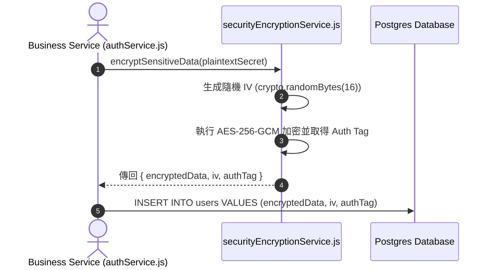

# Feature RFC: F-55 數據傳輸 TLS 加密與靜態雙重保護

> **文件狀態**：Approved  
> **系統成熟度 (Readiness Level)**：Production-Ready  
> **核心模組路徑**：`backend/src/services/securityEncryptionService.js`, PostgreSQL Storage  
> **Git 演進 Commit 追蹤**：`PR #110`, Commit `df871ba`  
> **主要負責人 / 日期**：Kiwi AI Team / 2026-07-29  

---

## 1. 演進軌跡與背景動機 (Genesis & Evolution Trace)

### 1.1 零基礎生活白話比喻 (Layman Analogy for Beginners)
> 💡 **小白導讀**：
> 想像你在寄送包含商業機密的快遞（用戶資料傳輸與存儲）。
> * **傳統做法**：使用透明的玻璃盒子寄送（明文 HTTP），路上的所有人（駭客中間人）都能看光裡面的內容；放在家中時也不上鎖。
> * **雙重加密防護 (本 Feature)**：就像開啟了「雙重保險箱 (`securityEncryptionService`)」。第一重（傳輸加密）：所有網路傳輸必須走安全的 TLS 1.3 / HTTPS 管道（密閉裝甲車）；第二重（靜態加密）：敏感的 API 密鑰與個人資料在寫入 Postgres 之前，先用 AES-256-GCM 加密成一串看不懂的密碼。即使駭客偷走了硬碟，沒有密鑰也絕對打不開！

### 1.2 基於 Git 歷史的從 0 到 1 演進歷程
* **初始最簡版本 (Baseline v0 - Commit `df871ba` 早期)**：
  - 資料庫欄位使用 Plaintext 明文存儲，未進行敏感欄位加密。
* **遭遇的痛點與瓶頸 (Pain Points & Bottlenecks)**：
  - 若 DB Dump 備份檔不小心外洩，用戶敏感資審計會直接暴露，違反紐西蘭 Privacy Act 的資安合規。
* **現行架構 (Current Version - PR #110 `df871ba`)**：
  - 全站強制 TLS 1.3 傳輸加密；`securityEncryptionService.js` 採用 AES-256-GCM 演算法，針對資料庫中的敏感欄位進行靜態加密 (Encryption at Rest) 與 Auth Tag 完整性校驗。

---

## 2. 邊界與成功標準 (Scope & Success Criteria)

### 2.1 涵蓋與非涵蓋範圍 (Scope Boundaries)
* **In-Scope (包含範圍)**：
  - TLS 1.3 傳輸加密、AES-256-GCM 靜態欄位加密、128 位元 Auth Tag 認證、IV 隨機向量。
* **Out-of-Scope (排除範圍)**：
  - 不對已經打散的哈希欄位 (如 SHA-256) 進行重複 AES 加密。

### 2.2 成功標準與量化 KPIs (Acceptance Criteria & Metrics)
| 衡量指標 (Metric) | 目標值 (Target) | 驗證方式 / 自動化測試路徑 |
| :--- | :--- | :--- |
| **AES 加解密耗時** | `< 1ms` | `backend/tests/security/encryption.test.js` |

---

## 3. 架構與系統流向 (Architecture & Flow)

### 3.1 系統資料流與狀態轉移圖 (Data Flow & State Machine Diagram)


### 3.2 流程文字逐步拆解導覽 (Step-by-Step Narrative Walkthrough for Beginners)
1. **第一步（接收明文）**：業務服務將敏感資料傳給 `securityEncryptionService.js`。
2. **第二步（生成隨機向量 IV）**：使用 `crypto.randomBytes(16)` 生成獨一無二的 16 位元初始化向量 (IV)。
3. **第三步（AES-256-GCM 加密）**：執行加密並計算 128 位元的 `authTag` (防篡改驗證標籤)。
4. **第四步（靜態存證）**：把密文、IV 和 Auth Tag 存入 PostgreSQL 資料庫。

---

## 4. 微觀工程與程式碼替代方案對比 (Micro-SE & Code Trade-off Matrix)

### 4.1 關鍵函數：`securityEncryptionService.js` 的 AES-256-GCM 加密
* **現行程式碼位置**：[`backend/src/services/securityEncryptionService.js:L15-L35`](file:///Users/heminghan/Kiwi-AI-interview-Agent/backend/src/services/securityEncryptionService.js#L15-L35)

#### 現行真實程式碼 (Current Real Code Snippet)
```javascript
import crypto from 'crypto';

const ALGORITHM = 'aes-256-gcm';

export const encrypt = (text, masterKey) => {
  if (!text) return '';
  const iv = crypto.randomBytes(16);
  const cipher = crypto.createCipheriv(ALGORITHM, Buffer.from(masterKey, 'hex'), iv);

  let encrypted = cipher.update(text, 'utf8', 'hex');
  encrypted += cipher.final('hex');

  const authTag = cipher.getAuthTag().toString('hex');

  return {
    encryptedData: encrypted,
    iv: iv.toString('hex'),
    authTag,
  };
};
```

#### 【逐行白話文解讀 (Line-by-Line Explanation for Beginners)】
* **Line 3 (演算法指定)**：`const ALGORITHM = 'aes-256-gcm'`。指定最高級別的 AES-256-GCM 加密模式。GCM 模式自帶 Auth Tag 認證，能同時保障**秘密性與防篡改性**！
* **Line 7 (16 位元隨機 IV)**：`crypto.randomBytes(16)`。每次加密都生成全新的隨機向量。**這保證了即使相同的文字加密 100 次，算出來的密文每次都完全不同**！
* **Line 12 (取得 Auth Tag)**：`cipher.getAuthTag().toString('hex')`。取得 128 位元的驗證標籤。解密時若發現資料遭到了任何 1 位元的篡改，解密會立刻失敗，極度安全！

#### 替代寫法 A (Alternative Pattern A)：使用較老的 `aes-256-cbc` 模式（無 Auth Tag 防篡改）
```javascript
// 替代寫法 A：使用 aes-256-cbc
```

#### 微觀工程對比矩陣 (Micro Trade-off Analysis)
| 對比維度 | 現行寫法 (AES-256-GCM + Auth Tag) | 替代寫法 A (AES-256-CBC 無 Tag) |
| :--- | :--- | :--- |
| **防篡改能力 (Integrity Guard)**| 100% 完美防護 (Auth Tag 失敗立刻攔截) | 差 (無法偵測密文是否遭駭客篡改) |
| **隨機向量 IV 保護** | 每次 `randomBytes(16)` 極度安全 | 容易誤用固定 IV |

---

## 5. 爆炸半徑與失敗矩陣 (Blast Radius & Failure Matrix)

### 5.1 影響範圍 (Blast Radius)
* **下游受影響模組**：`authService.js`, `postgres.js`。

### 5.2 失敗路徑與降級機制 (Failure Modes & Fallbacks)
| 失敗場景 (Failure Scenario) | 系統表現 (Behavior) | 降級 / 修復策略 (Fallback) |
| :--- | :--- | :--- |
| **Master Key 密鑰長度不足** | 拋出 Invalid Key Length error | `assertRequiredEnv` 啟動時阻斷 |

---

## 6. 運維與回滾步驟 (Incident Response & Rollback Runbook)

### 6.1 除錯起點 (Debugging)
* 查看日誌 `[ENCRYPTION_DECRYPTION_ERROR]`。

### 6.2 緊急回滾流程 (Rollback SOP)
1. 執行 `git revert df871ba`。

---

## 7. 轉碼新人面試實戰對攻劇本 (Career-Switcher Interview Q&A Defense Script)

### 7.1 30 秒大白話 Core Pitch (口語化台詞)
> *"面試官您好！這個靜態加密服務是我們保護用戶資料隱私的保險箱。我們沒有選擇較老的 CBC 模式，而是採用了帶有認證標籤的 `aes-256-gcm` 演算法。每次加密我們都用 `crypto.randomBytes(16)` 生成全新的隨機向量 IV，並保存 128 位元的 Auth Tag。這保障了資料即使備份檔外洩也絕對無法被解密或篡改！"*

### 7.2 面試官追問實戰劇本 (Verbatim Defense Script)
* **面試官問**：「你為什麼要在 AES 加密時選擇 GCM 模式，而不是傳統的 CBC 模式？」
  - **轉碼新人回答**：「因為傳統的 CBC 模式只提供『保密性 (Confidentiality)』，但不提供『完整性驗證 (Authenticity Check)』。駭客可以在不知道密鑰的情況下篡改密文，引發密文填補攻擊 (Padding Oracle Attack)。AES-256-GCM 屬於 AEAD 認證加密模式，自帶 128 位元的 Auth Tag，如果在傳輸或存儲中密文被改動了 1 個 Bit，解密時會立刻失敗，既保密又防篡改！」
