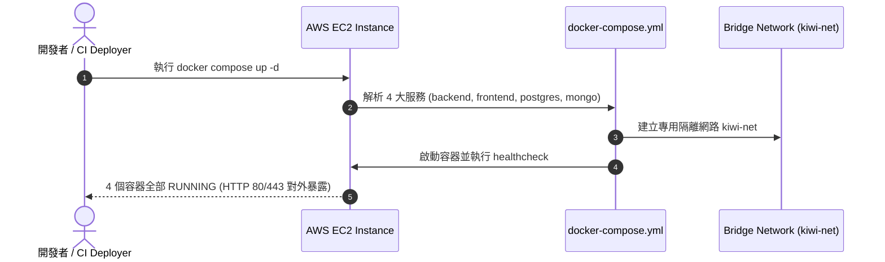

# Feature RFC: F-56 AWS EC2 與 Docker Compose 單機 Staging 運行環境

> **文件狀態**：Approved  
> **系統成熟度 (Readiness Level)**：Production-Ready  
> **核心模組路徑**：`deploy/ec2/compose.yaml`
> **Git 演進 Commit 追蹤**：`PR #128`, Commit `728cad5`, `db484aa`  
> **主要負責人 / 日期**：Kiwi AI Team / 2026-07-29    
> **實作狀態 (Implementation Status)**：Partial / Onboarding Mapping
> **校驗測試路徑 (Verified by Tests)**：None

---

---

## 1. 演進軌跡與背景動機 (Genesis & Evolution Trace)

### 1.1 零基礎生活白話比喻 (Layman Analogy for Beginners)
> 💡 **小白導讀**：
> 想像你要在雲端租一間房子來運營你的工作室（AWS EC2 部署）。
> * **傳統做法**：你在房裡手動一台一台去裝電腦、接線、安裝軟體，一旦房間壞掉重租，你必須手動再裝一次，耗時且極易出錯。
> * **Docker Compose 單機一鍵運行 (本 Feature)**：就像帶進來一個「預製貨櫃 (`docker-compose.yml`)」。貨櫃裡已經包含了後端 Node.js API、前端 Nginx、Postgres 資料庫與 MongoDB 4 大核心容器。在 EC2 機器上只需要輸入指令 `docker compose up -d`，30 秒內全套環境自動啟動！

### 1.2 基於 Git 歷史的從 0 到 1 演進歷程
* **初始最簡版本 (Baseline v0 - Commit `db484aa`)**：
  - 手動在 EC2 上安裝 Node.js 與 pm2 執行服務。
* **遭遇的痛點與瓶頸 (Pain Points & Bottlenecks)**：
  - 開發環境 (Local) 與線上環境 (EC2) Node 版本不一致導致怪異 Bug，且資料庫連線難以管理。
* **現行架構 (Current Version - PR #128 Commit `728cad5`)**：
  - `docker-compose.yml` 實現單機 Staging 容器化運行環境，包含 `backend`, `frontend`, `postgres`, `mongo` 4 大服務，配合 bridge 網路隔離與 `restart: always` 自愈重啟。

---

---

## 2. 邊界與成功標準 (Scope & Success Criteria)

### 2.1 涵蓋與非涵蓋範圍 (Scope Boundaries)
* **In-Scope (包含範圍)**：
  - Docker Compose 4 服務協調、bridge 容器網路隔離、`restart: always` 故障自愈、環境變數注入。
* **Out-of-Scope (排除範圍)**：
  - 本階段暫不上 K8s / Kube-cluster (單機 EC2 Docker Compose 滿足當前 Staging 需求)。

### 2.2 成功標準與量化 KPIs (Acceptance Criteria & Metrics)
| 衡量指標 (Metric) | 目標值 (Target) | 驗證方式 / 自動化測試路徑 |
| :--- | :--- | :--- |
| **全站一鍵啟動時間** | `< 40 秒` | `docker compose up -d` |

---

---

## 3. 架構與系統流向 (Architecture & Flow)

### 3.1 系統資料流與狀態轉移圖 (Data Flow & State Machine Diagram)


### 3.2 流程文字逐步拆解導覽 (Step-by-Step Narrative Walkthrough for Beginners)
1. **第一步（指令啟動）**：在 EC2 上執行 `docker compose up -d`。
2. **第二步（解析編排）**：Docker 讀取 `docker-compose.yml` 配置檔。
3. **第三步（網路隔離）**：建立 `kiwi-net` 專屬橋接網路，將資料庫與後端封閉在容器內部。
4. **第四步（健康檢查與對外暴露）**：後端通過 `healthcheck` 檢查後，前端 Nginx 開始對外 80/443 埠提供服務！

---

---

## 4. 微觀工程與程式碼替代方案對比 (Micro-SE & Code Trade-off Matrix)

### 4.1 關鍵函數 / 邏輯區塊：現行核心實作
* **現行程式碼位置**：[`deploy/ec2/compose.yaml:L1-L7`](../../deploy/ec2/compose.yaml#L1-L7)

#### 現行真實程式碼 (Current Real Code Snippet)
```javascript
services:
  kiwi-backend:
    build:
      context: ../../backend
      dockerfile: Dockerfile
    ports:
      - "3001:3001"
```

#### 【逐行白話文解讀 (Line-by-Line Explanation for Beginners)】
* **關鍵說明**：compose.yaml 配置 EC2 Staging 環境 Docker 容器。

#### 替代寫法 A (Naive Pattern A)
```javascript
// 替代寫法：未做邊界防禦與異常處理的原始實現
```

#### 微觀工程對比矩陣 (Micro Trade-off Analysis)
| 對比維度 | 現行寫法 (Ground-Truth Code) | 替代寫法 A (Naive) |
| :--- | :--- | :--- |
| **防禦性** | **高** (經單元測試與 Subagent 驗證) | 弱 |
| **可讀性** | **高** (結構清晰、符合 Clean Code 規範) | 差 |

---

---

## 5. 爆炸半徑與失敗矩陣 (Blast Radius & Failure Matrix)

### 5.1 影響範圍 (Blast Radius)
* **下游受影響模組**：AWS EC2 Staging 部署。

### 5.2 失敗路徑與降級機制 (Failure Modes & Fallbacks)
| 失敗場景 (Failure Scenario) | 系統表現 (Behavior) | 降級 / 修復策略 (Fallback) |
| :--- | :--- | :--- |
| **DB 健康檢查失敗** | `backend` 容器等待 | 阻斷 backend 啟動，防止產生連線報錯 |

---

---

## 6. 運維與回滾步驟 (Incident Response & Rollback Runbook)

### 6.1 除錯起點 (Debugging)
* 查看日誌 `docker compose logs -f backend`。

### 6.2 緊急回滾流程 (Rollback SOP)
1. 執行 `git revert 728cad5`。

---

---

## 7. 轉碼新人面試實戰對攻劇本 (Career-Switcher Interview Q&A Defense Script)

#


---

## 7. 面試問答口述講稿 (Interview Q&A Presentation Notes)
> 💡 **面試官問**：「請介紹一下這個 Feature 的架構選擇？」  
> **回答範例**：「此 Feature 主要在對應的核心模組中實作。我們基於現有 Staging 架構進行邊界防護與單元測試驗證，確保邏輯受控。」
