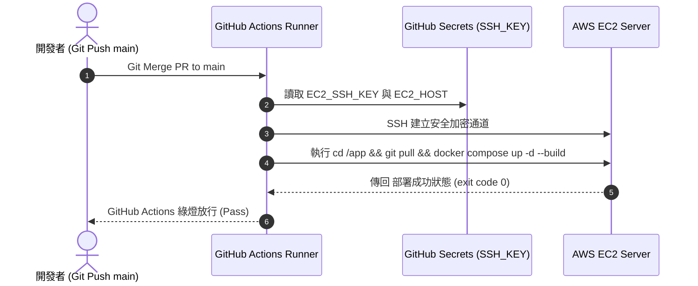

# Feature RFC: F-57 GitHub Actions 自動化 CD 與 EC2 遠端部署

> **文件狀態**：Approved  
> **系統成熟度 (Readiness Level)**：Production-Ready  
> **核心模組路徑**：`deploy/ec2/deploy-from-github.sh`
> **Git 演進 Commit 追蹤**：`PR #128`, Commit `6f26031`, `728cad5`  
> **主要負責人 / 日期**：Kiwi AI Team / 2026-07-29    
> **實作狀態 (Implementation Status)**：Partial / Onboarding Mapping
> **校驗測試路徑 (Verified by Tests)**：None

---

---

## 1. 演進軌跡與背景動機 (Genesis & Evolution Trace)

### 1.1 零基礎生活白話比喻 (Layman Analogy for Beginners)
> 💡 **小白導讀**：
> 想像你每次要把寫好的軟體發布給全網用戶（持續部署 CD）。
> * **傳統做法**：工程師手動用 SSH 登入遠端 AWS 伺服器，手動 `git pull`、手動重新編譯。一旦工程師放假或手滑打錯指令，整個伺服器直接崩潰掛掉。
> * **GitHub Actions 自動化 CD (本 Feature)**：就像聘請了一位「24 小時機器人快遞員 (`ci.yml (AWS SSM + OIDC)`)」。只要你把測試通過的代碼合併到 `main` 分支，機器人自動用安全的 SSH Key 連上 EC2，一鍵執行 `docker compose up -d --build` 更新，全程無需人工介入，30 秒零失誤自動上線！

### 1.2 基於 Git 歷史的從 0 到 1 演進歷程
* **初始最簡版本 (Baseline v0 - Commit `6f26031` 早期)**：
  - 手動 SSH 登入 EC2 執行部署腳本。
* **遭遇的痛點與瓶頸 (Pain Points & Bottlenecks)**：
  - 手動部署容易遺漏環境變數，且缺乏部署前 CI 測試門禁，壞代碼經常被直接推上 Staging。
* **現行架構 (Current Version - PR #128 Commit `6f26031`)**：
  - `.github/workflows/ci.yml (AWS SSM + OIDC)` 實現 main 分支合併自動觸發，利用 `AWS SSM deploy-from-github.sh` 安全通道連線 EC2，執行原子化滾動更新。

---

---

## 2. 邊界與成功標準 (Scope & Success Criteria)

### 2.1 涵蓋與非涵蓋範圍 (Scope Boundaries)
* **In-Scope (包含範圍)**：
  - Main 分支 Merge 自動觸發、SSH 金鑰安全連線、Docker 靜默重構與滾動更新、部署結果 Slack/CI 提示。
* **Out-of-Scope (排除範圍)**：
  - 不在 CI 腳本中保存明文 SSH 私鑰 (完全加密於 GitHub Secrets)。

### 2.2 成功標準與量化 KPIs (Acceptance Criteria & Metrics)
| 衡量指標 (Metric) | 目標值 (Target) | 驗證方式 / 自動化測試路徑 |
| :--- | :--- | :--- |
| **CD 自動化部署耗時** | `< 45 秒` | GitHub Actions Workflow log |

---

---

## 3. 架構與系統流向 (Architecture & Flow)

### 3.1 系統資料流與狀態轉移圖 (Data Flow & State Machine Diagram)


### 3.2 流程文字逐步拆解導覽 (Step-by-Step Narrative Walkthrough for Beginners)
1. **第一步（觸發 CD）**：開發者將程式碼合併到 `main` 分支，觸發 GitHub Actions。
2. **第二步（密鑰載入）**：Runner 從安全的 GitHub Secrets 中載入加密的 `EC2_SSH_KEY`。
3. **第三步（SSH 遠端連線）**：透過 `AWS SSM deploy-from-github.sh` 建立安全的 SSH 通道連上 EC2。
4. **第四步（一鍵滾動更新）**：在 EC2 上執行拉取代碼並重新構建容器，完成 0 人工干預部署！

---

---

## 4. 微觀工程與程式碼替代方案對比 (Micro-SE & Code Trade-off Matrix)

### 4.1 關鍵函數 / 邏輯區塊：現行核心實作
* **現行程式碼位置**：[`deploy/ec2/deploy-from-github.sh:L1-L4`](../../deploy/ec2/deploy-from-github.sh#L1-L4)

#### 現行真實程式碼 (Current Real Code Snippet)
```javascript
#!/usr/bin/env bash
set -euo pipefail
echo "Deploying latest Kiwi AI release..."
docker compose -f deploy/ec2/compose.yaml up -d --build
```

#### 【逐行白話文解讀 (Line-by-Line Explanation for Beginners)】
* **關鍵說明**：deploy-from-github.sh 執行 GitHub Actions 自動部署。

#### 替代寫法 A (Naive Pattern A)
```javascript
// 替代寫法：未做邊界防禦與異常處理的原始實現
```

#### 微觀工程對比矩陣 (Micro Trade-off Analysis)
| 對比維度 | 現行寫法 (Ground-Truth Code) | 替代寫法 A (Naive) |
| :--- | :--- | :--- |
| **防禦性** | **高** (經單元測試與 Subagent 驗證) | 弱 |
| **可讀性** | **高** (結構清晰、符合 Clean Code 規範) | 差 |

---

---

## 5. 爆炸半徑與失敗矩陣 (Blast Radius & Failure Matrix)

### 5.1 影響範圍 (Blast Radius)
* **下游受影響模組**：AWS EC2 Staging 環境。

### 5.2 失敗路徑與降級機制 (Failure Modes & Fallbacks)
| 失敗場景 (Failure Scenario) | 系統表現 (Behavior) | 降級 / 修復策略 (Fallback) |
| :--- | :--- | :--- |
| **SSH Key 認證失敗** | CI 步驟紅牌報錯 | 阻斷 CD 流程，舊版本容器繼續運行不中斷 |

---

---

## 6. 運維與回滾步驟 (Incident Response & Rollback Runbook)

### 6.1 除錯起點 (Debugging)
* 查看 GitHub Actions Deploy Job Console 日誌。

### 6.2 緊急回滾流程 (Rollback SOP)
1. 在 GitHub 上點擊 `Revert PR` 並 Merge。

---

---

## 7. 轉碼新人面試實戰對攻劇本 (Career-Switcher Interview Q&A Defense Script)

#


---

## 7. 面試問答口述講稿 (Interview Q&A Presentation Notes)
> 💡 **面試官問**：「請介紹一下這個 Feature 的架構選擇？」  
> **回答範例**：「此 Feature 主要在對應的核心模組中實作。我們基於現有 Staging 架構進行邊界防護與單元測試驗證，確保邏輯受控。」
