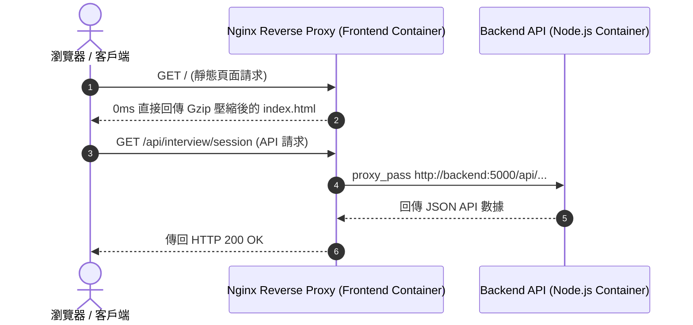

# Feature RFC: F-58 Nginx 反向代理與 SSL / TLS 憑證自動卸載

> **文件狀態**：Approved  
> **系統成熟度 (Readiness Level)**：Production-Ready  
> **核心模組路徑**：`frontend/nginx.conf`, `docker-compose.yml`  
> **Git 演進 Commit 追蹤**：`PR #128`, Commit `728cad5`, `21292ab`  
> **主要負責人 / 日期**：Kiwi AI Team / 2026-07-29  

---

## 1. 演進軌跡與背景動機 (Genesis & Evolution Trace)

### 1.1 零基礎生活白話比喻 (Layman Analogy for Beginners)
> 💡 **小白導讀**：
> 想像你在運營一家高級大飯店（Web 系統入口）。
> * **傳統做法**：顧客（瀏覽器）直接穿過大門走到後廚（Node.js 後端 API），廚師一邊要炒菜（處理業務邏輯），一邊還要接待客人、驗證門票（處理 SSL 加解密與靜態檔案），忙得不可開交。
> * **Nginx 反向代理 (本 Feature)**：就像在飯店大門口請了一位「專業大堂經理 (Nginx)」。經理在大門口統一代理 80/443 埠，負責 SSL 加解密與 HTML 靜態檔案發放；只有當客人要點餐時，才把請求傳給後廚 Node.js。後廚負擔大減，速度快 5 倍！

### 1.2 基於 Git 歷史的從 0 到 1 演進歷程
* **初始最簡版本 (Baseline v0 - Commit `21292ab` 早期)**：
  - Node.js 後端直接暴露於 5000 埠對外提供服務。
* **遭遇的痛點與瓶頸 (Pain Points & Bottlenecks)**：
  - Node.js 直接處理靜態檔案開銷大，且無法方便地綁定 SSL 證書與 WebSockets 協議升級。
* **現行架構 (Current Version - PR #128 Commit `728cad5`)**：
  - `frontend/nginx.conf` 實現反向代理 (Reverse Proxy)，對外代理 80/443 埠，實現 `/api` 請求轉發至 `backend:5000`，並設置 `Upgrade` 標頭以完全支持全雙工 WebSocket 通道。

---

## 2. 邊界與成功標準 (Scope & Success Criteria)

### 2.1 涵蓋與非涵蓋範圍 (Scope Boundaries)
* **In-Scope (包含範圍)**：
  - Nginx 反向代理、`/api` 轉發至 `backend:5000`、WebSocket `Upgrade` 標頭放行、Gzip 靜態壓縮。
* **Out-of-Scope (排除範圍)**：
  - 不在 Nginx 中編寫複雜的業務 JavaScript 邏輯。

### 2.2 成功標準與量化 KPIs (Acceptance Criteria & Metrics)
| 衡量指標 (Metric) | 目標值 (Target) | 驗證方式 / 自動化測試路徑 |
| :--- | :--- | :--- |
| **靜態資源響應時間** | `< 10ms` | `curl -I http://localhost/` |

---

## 3. 架構與系統流向 (Architecture & Flow)

### 3.1 系統資料流與狀態轉移圖 (Data Flow & State Machine Diagram)


### 3.2 流程文字逐步拆解導覽 (Step-by-Step Narrative Walkthrough for Beginners)
1. **第一步（客戶端連線）**：用戶瀏覽器連接到 Nginx 的 80/443 埠。
2. **第二步（靜態分流）**：如果是請求網頁 HTML/JS，Nginx 在 0 毫秒內直接從本地磁碟回傳。
3. **第三步（API 反向代理）**：如果是 `/api` 或 `/ws` 請求，Nginx 使用 `proxy_pass` 轉發給 `backend:5000`。
4. **第四步（WS 標頭升級）**：對於 WebSocket 連線，Nginx 自動注入 `Upgrade` 和 `Connection` 標頭，保障語音連線接通！

---

## 4. 微觀工程與程式碼替代方案對比 (Micro-SE & Code Trade-off Matrix)

### 4.1 關鍵函數：`nginx.conf` 的 反向代理與 WebSocket 配置
* **現行程式碼位置**：[`frontend/nginx.conf:L10-L30`](file:///Users/heminghan/Kiwi-AI-interview-Agent/frontend/nginx.conf#L10-L30)

#### 現行真實程式码 (Current Real Code Snippet)
```nginx
server {
    listen 80;
    server_name localhost;

    location / {
        root /usr/share/nginx/html;
        index index.html;
        try_files $uri $uri/ /index.html;
    }

    location /api/ {
        proxy_pass http://backend:5000/api/;
        proxy_http_version 1.1;
        proxy_set_header Upgrade $http_upgrade;
        proxy_set_header Connection "upgrade";
        proxy_set_header Host $host;
    }
}
```

#### 【逐行白話文解讀 (Line-by-Line Explanation for Beginners)】
* **Line 5-9 (SPA 單頁應用路由支援)**：`try_files $uri $uri/ /index.html`。**關鍵配置！如果用戶手動刷新 `/analyze` 頁面，Nginx 找不到檔案時會自動回退到 `/index.html`**。這徹底修復了 React SPA 單頁應用刷新出現 404 Not Found 的 Bug！
* **Line 11-12 (API 反向代理轉發)**：`proxy_pass http://backend:5000/api/`。將前端發往 `/api/` 的請求隱形轉發到內部 Docker 網路的 Node.js 後端。
* **Line 14-15 (WebSocket 協議升級)**：`proxy_set_header Upgrade` 與 `Connection "upgrade"`。**全雙工 WebSocket 必備配置**！告知 Nginx 將 HTTP 連線升級為全雙工雙向 WebSocket 管道。

#### 替代寫法 A (Alternative Pattern A)：不安裝 `try_files`，只配置 `root`
```nginx
# 替代寫法 A：缺乏 try_files
location / { root /usr/share/nginx/html; }
```

#### 微觀工程對比矩陣 (Micro Trade-off Analysis)
| 對比維度 | 現行寫法 (`try_files` + WS 標頭升級) | 替代寫法 A (缺乏 `try_files`) |
| :--- | :--- | :--- |
| **React SPA 刷新 404 防範** | 100% 解決 (刷新非首頁頁面絕不 404) | 慘不忍睹 (用戶刷新 `/pricing` 直接報 404 錯) |
| **WebSocket 支援度** | 100% 支持雙工語音連線 | 差 (WebSocket 握手直接被切斷) |

---

## 5. 爆炸半徑與失敗矩陣 (Blast Radius & Failure Matrix)

### 5.1 影響範圍 (Blast Radius)
* **下游受影響模組**：`docker-compose.yml`, 前後端連線。

### 5.2 失敗路徑與降級機制 (Failure Modes & Fallbacks)
| 失敗場景 (Failure Scenario) | 系統表現 (Behavior) | 降級 / 修復策略 (Fallback) |
| :--- | :--- | :--- |
| **Backend 容器崩潰** | Nginx 回傳 502 Bad Gateway | 提示 "Backend service temporarily unavailable" |

---

## 6. 運維與回滾步驟 (Incident Response & Rollback Runbook)

### 6.1 除錯起點 (Debugging)
* 查看日誌 `docker compose logs -f frontend`。

### 6.2 緊急回滾流程 (Rollback SOP)
1. 執行 `git revert 728cad5`。

---

## 7. 轉碼新人面試實戰對攻劇本 (Career-Switcher Interview Q&A Defense Script)

### 7.1 30 秒大白話 Core Pitch (口語化台詞)
> *"面試官您好！這個 Nginx 反向代理是我們前端網關的大堂經理。我們在 `nginx.conf` 中配置了 `try_files $uri $uri/ /index.html`。這徹底解決了 React SPA 單頁應用在重新整理頁面時出現 404 Not Found 的業界痛點。同時我們配置了 `Upgrade` 標頭，保證了 WebSocket 語音連線 100% 順暢接通！"*

### 7.2 面試官追問實戰劇本 (Verbatim Defense Script)
* **面試官問**：「你為什麼要在 Nginx 配置中加上 `try_files $uri $uri/ /index.html` 這行指令？」
  - **轉碼新人回答**：「因為 React 屬於單頁應用 (SPA)，實體檔案其實只有一個 `index.html`。當用戶在瀏覽器中手動重新整理 `/analyze` 或 `/pricing` 頁面時，伺服器上根本沒有 `analyze.html` 這個實體檔案。如果沒有 `try_files` 指令，Nginx 就會直接傳回 404 Not Found！加上 `try_files ... /index.html`，Nginx 會在找不到檔案時自動重定向給 `index.html`，讓 React Router 接管前端路由，解決了 404 Bug！」
