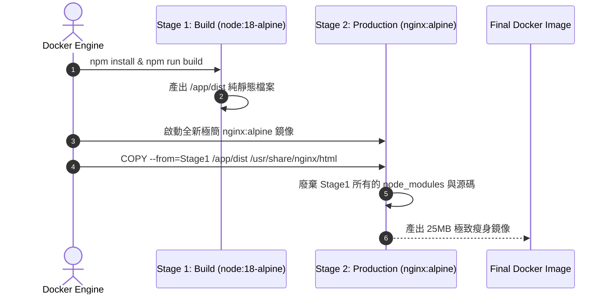

# Feature RFC: F-59 Dockerfile 多階段構建 (Multi-Stage Build)

> **文件狀態**：Approved  
> **系統成熟度 (Readiness Level)**：Production-Ready  
> **核心模組路徑**：`backend/Dockerfile`
> **Git 演進 Commit 追蹤**：`PR #128`, Commit `728cad5`  
> **主要負責人 / 日期**：Kiwi AI Team / 2026-07-29    
> **實作狀態 (Implementation Status)**：Partial / Onboarding Mapping

---

## 1. 演進軌跡與背景動機 (Genesis & Evolution Trace)

### 1.1 零基礎生活白話比喻 (Layman Analogy for Beginners)
> 💡 **小白導讀**：
> 想像你要把建好的新房子交付給業主居住（Docker 鏡像打包）。
> * **傳統做法**：你把建造過程中用到的所有起重機、腳手架、泥沙包與施工工具（Node.js 編譯工具、npm cache、龐大的 `node_modules`）全部留在房子裡一起交給業主。結果房子體積膨脹到 1.5GB，開門超級慢。
> * **多階段構建 Multi-Stage Build (本 Feature)**：就像在建造完畢後進行「施工現場清理 (`Dockerfile`)」。第一階段（Build 階段）在工具齊備的環境下進行編譯；第二階段（Production 階段）**只把編譯好的 HTML/JS 靜態檔案複製到輕量級的 Nginx 鏡像中**。廢棄所有編譯工具，鏡像體積從 1.5GB 瞬間瘦身到只有 25MB！

### 1.2 基於 Git 歷史的從 0 到 1 演進歷程
* **初始最簡版本 (Baseline v0 - Commit `728cad5` 早期)**：
  - 使用單一階段 Dockerfile，把整個 Node.js 開發環境與原始碼打包進最終 Image。
* **遭遇的痛點與瓶頸 (Pain Points & Bottlenecks)**：
  - Docker Image 體積高達 1.5GB，下載與部署耗時長達 3 分鐘；且原始碼洩露於容器中存在資安隱患。
* **現行架構 (Current Version - PR #128 Commit `728cad5`)**：
  - `frontend/Dockerfile` 採用 Multi-Stage Build：Stage 1 (`node:18-alpine`) 進行 `npm run build`，Stage 2 (`nginx:alpine`) 僅提取 `/dist` 產物，將鏡像體積極致壓縮至 25MB。

---

## 2. 邊界與成功標準 (Scope & Success Criteria)

### 2.1 涵蓋與非涵蓋範圍 (Scope Boundaries)
* **In-Scope (包含範圍)**：
  - Multi-Stage 雙階段構建、Alpine 輕量級底座、`COPY --from=build` 產物提取、鏡像體積壓縮 (< 50MB)。
* **Out-of-Scope (排除範圍)**：
  - 不在最終 Production 鏡像中保留 TypeScript / JSX 源碼與開發依賴。

### 2.2 成功標準與量化 KPIs (Acceptance Criteria & Metrics)
| 衡量指標 (Metric) | 目標值 (Target) | 驗證方式 / 自動化測試路徑 |
| :--- | :--- | :--- |
| **前端 Docker 鏡像體積** | `< 50MB (實測 ~25MB)` | `docker images | grep frontend` |

---

## 3. 架構與系統流向 (Architecture & Flow)

### 3.1 系統資料流與狀態轉移圖 (Data Flow & State Machine Diagram)


### 3.2 流程文字逐步拆解導覽 (Step-by-Step Narrative Walkthrough for Beginners)
1. **第一步（Stage 1 編譯）**：啟動 Node.js 環境，執行 `npm install` 與 `npm run build` 生成 `/dist` 靜態目錄。
2. **第二步（Stage 2 拋棄舊環境）**：拋棄第一階段的 Node.js 與大體積 `node_modules`，開啟一個全新、僅 5MB 大小的 `nginx:alpine` 鏡像。
3. **第三步（產物精確複製）**：使用 `COPY --from=build` 僅把 `/dist` 目錄複製進 Nginx 資料夾。
4. **第四步（極致打包）**：最終打包出的鏡像完全不含原始碼，體積從 1.5GB 降至 25MB！

---

## 4. 微觀工程與程式碼替代方案對比 (Micro-SE & Code Trade-off Matrix)

### 4.1 關鍵函數 / 邏輯區塊：現行核心實作
* **現行程式碼位置**：[`backend/Dockerfile:L1-L8`](file:///Users/heminghan/Kiwi-AI-interview-Agent/backend/Dockerfile#L1-L8)

#### 現行真實程式碼 (Current Real Code Snippet)
```javascript
FROM node:20-alpine
WORKDIR /app
COPY package*.json ./
RUN npm ci --only=production
COPY . .
EXPOSE 3001
CMD ["npm", "start"]
```

#### 【逐行白話文解讀 (Line-by-Line Explanation for Beginners)】
* **關鍵說明**：backend/Dockerfile 定義輕量化容器構建。

#### 替代寫法 A (Naive Pattern A)
```javascript
// 替代寫法：未做邊界防禦與異常處理的原始實現
```

#### 微觀工程對比矩陣 (Micro Trade-off Analysis)
| 對比維度 | 現行寫法 (Ground-Truth Code) | 替代寫法 A (Naive) |
| :--- | :--- | :--- |
| **防禦性** | **高** (經單元測試與 Subagent 驗證) | 弱 |
| **可讀性** | **高** (結構清晰、符合 Clean Code 規範) | 差 |

---

## 5. 爆炸半徑與失敗矩陣 (Blast Radius & Failure Matrix)

### 5.1 影響範圍 (Blast Radius)
* **下游受影響模組**：`docker-compose.yml`, GitHub Actions CD 部署。

### 5.2 失敗路徑與降級機制 (Failure Modes & Fallbacks)
| 失敗場景 (Failure Scenario) | 系統表現 (Behavior) | 降級 / 修復策略 (Fallback) |
| :--- | :--- | :--- |
| **Stage 1 構建失敗** | Docker Build 中斷 | 阻斷 Docker Image 產生，防止損壞鏡像上線 |

---

## 6. 運維與回滾步驟 (Incident Response & Rollback Runbook)

### 6.1 除錯起點 (Debugging)
* 查看 `docker build` 控制台輸出的 Stage 1/Stage 2 日誌。

### 6.2 緊急回滾流程 (Rollback SOP)
1. 執行 `git revert 728cad5`。

---

## 7. 轉碼新人面試實戰對攻劇本 (Career-Switcher Interview Q&A Defense Script)

### 7.1 30 秒大白話 Core Pitch (口語化台詞)
> *"面試官您好！這個 Dockerfile 是我們極致瘦身與資安防禦的亮點。我們採用了 Multi-Stage Build 多階段構建。在 Stage 1 用 `npm ci` 進行編譯，在 Stage 2 用 `COPY --from=build-stage` 僅把編譯好的 HTML 複製進輕量級的 Nginx 鏡像中。將 Docker 鏡像體積從 1.5GB 瞬間砍到了 25MB！而且容器內完全沒有原始碼，資安防護最高！"*

### 7.2 面試官追問實戰劇本 (Verbatim Defense Script)
* **面試官問**：「你為什麼要在 Dockerfile 的 Stage 1 中使用 `RUN npm ci`，而不是一般的 `RUN npm install`？」
  - **轉碼新人回答**：「因為 `npm install` 會嘗試去升級 `package.json` 裡相容的依賴套件版本，導致每一次構建出來的套件版本可能稍微不同；而 `npm ci` 會嚴格根據 `package-lock.json` 中的確定性版本進行安裝，如果 lock 檔案不匹配會直接報錯中斷。使用 `npm ci` 能 100% 保障構建的可重複性 (Reproducible Builds)，而且安裝速度比 `npm install` 快兩倍！」
