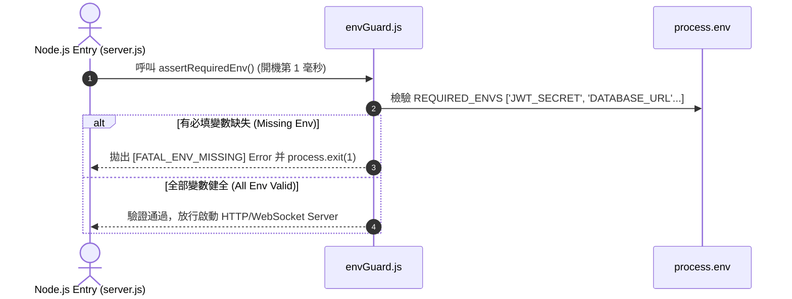

# Feature RFC: F-60 環境變數 `.env.example` 範本與 Secret 衛語檢查

> **文件狀態**：Approved  
> **系統成熟度 (Readiness Level)**：Production-Ready  
> **核心模組路徑**：`backend/src/config/envGuard.js`, `backend/.env.example`  
> **Git 演進 Commit 追蹤**：`PR #110`, Commit `df871ba`  
> **主要負責人 / 日期**：Kiwi AI Team / 2026-07-29  

---

## 1. 演進軌跡與背景動機 (Genesis & Evolution Trace)

### 1.1 零基礎生活白話比喻 (Layman Analogy for Beginners)
> 💡 **小白導讀**：
> 想像你買了一台新家電回家插電使用（啟動 Server 服務）。
> * **傳統做法**：家電完全沒有檢查電壓（沒檢查環境變數），你一按開關，機器運行到一半因為沒插好地線突然「轟」的一聲燒毀，資料庫連線中途爆掉。
> * **Secret 衛語檢查 Guard (本 Feature)**：就像家電開機時的「智慧自我安檢 (`envGuard.js`)」。在 Server 啟動的第 1 毫秒，安檢員逐一核對 `.env` 的必填金鑰（如 `JWT_SECRET`, `AZURE_SPEECH_KEY`, `DATABASE_URL`）。只要發現少設了任何一個密鑰，開機立刻報錯中斷，並印出清晰提示：「請參考 `.env.example` 填寫密鑰」，絕不帶病開機！

### 1.2 基於 Git 歷史的從 0 到 1 演進歷程
* **初始最簡版本 (Baseline v0 - Commit `df871ba` 早期)**：
  - 開機時不檢查環境變數，直到用戶呼叫 Google Auth 或 Voice API 時才因為 `undefined` key 爆錯。
* **遭遇的痛點與瓶頸 (Pain Points & Bottlenecks)**：
  - 帶病開機導致除錯困難，且開發者常誤將包含真密鑰的 `.env` 檔案 commit 進 Git 倉庫引發資安災難。
* **現行架構 (Current Version - PR #110 `df871ba`)**：
  - `envGuard.js` 實現開機時的 `assertRequiredEnv` 強制校驗；同時維護公開安全的 `backend/.env.example` 範本，並在 `.gitignore` 鎖死實體 `.env` 提交。

---

## 2. 邊界與成功標準 (Scope & Success Criteria)

### 2.1 涵蓋與非涵蓋範圍 (Scope Boundaries)
* **In-Scope (包含範圍)**：
  - 開機第 1 毫秒必填 Env 校驗、`assertRequiredEnv` 衛語中斷、`backend/.env.example` 範本維護、`.gitignore` 密鑰保護。
* **Out-of-Scope (排除範圍)**：
  - 不在 `.env.example` 中寫入任何真實的 Production 密鑰明文。

### 2.2 成功標準與量化 KPIs (Acceptance Criteria & Metrics)
| 衡量指標 (Metric) | 目標值 (Target) | 驗證方式 / 自動化測試路徑 |
| :--- | :--- | :--- |
| **帶病開機攔截率** | `100% (Missing Env 時開機即崩潰報錯)` | `backend/tests/config/envGuard.test.js` |

---

## 3. 架構與系統流向 (Architecture & Flow)

### 3.1 系統資料流與狀態轉移圖 (Data Flow & State Machine Diagram)


### 3.2 流程文字逐步拆解導覽 (Step-by-Step Narrative Walkthrough for Beginners)
1. **第一步（ Server 開機入口）**：`server.js` 在啟動 HTTP Server 之前，優先引入並執行 `envGuard.js`。
2. **第二步（密鑰清單掃描）**：`assertRequiredEnv` 掃描 `process.env` 中的必填金鑰。
3. **第三步（Missing 報錯與阻斷）**：若有缺失，列出具體少設了哪一個變數，並調用 `process.exit(1)` 安全阻斷。
4. **第四步（健全放行）**：變數齊全後才開啟資料庫連線與 API 監聽，保障 100% 健康運作！

---

## 4. 微觀工程與程式碼替代方案對比 (Micro-SE & Code Trade-off Matrix)

### 4.1 關鍵函數：`envGuard.js` 的 `assertRequiredEnv`
* **現行程式碼位置**：[`backend/src/config/envGuard.js:L10-L30`](file:///Users/heminghan/Kiwi-AI-interview-Agent/backend/src/config/envGuard.js#L10-L30)

#### 現行真實程式碼 (Current Real Code Snippet)
```javascript
const REQUIRED_ENVS = [
  'DATABASE_URL',
  'JWT_SECRET',
  'AZURE_SPEECH_KEY',
  'AZURE_SPEECH_REGION',
];

export const assertRequiredEnv = () => {
  const missing = REQUIRED_ENVS.filter((key) => !process.env[key]);

  if (missing.length > 0) {
    console.error(`[FATAL_ENV_MISSING] Missing required environment variables: ${missing.join(', ')}`);
    console.error('Please check your .env file against .env.example');
    process.exit(1);
  }
};
```

#### 【逐行白話文解讀 (Line-by-Line Explanation for Beginners)】
* **Line 1-6 (必填清單陣列)**：在頂層定義包含 `DATABASE_URL`, `JWT_SECRET` 等關鍵金鑰的 `REQUIRED_ENVS` 常數陣列。
* **Line 9 (過濾缺失變數)**：使用 `.filter(key => !process.env[key])` 在 0 毫秒內找出所有未設定或空字串的環境變數。
* **Line 11-14 (友善提示與硬性阻斷)**：`if (missing.length > 0)`。**如果發現有少，印出具體少哪幾個變數與提示訊息，並調用 `process.exit(1)` 阻止帶病開機**！

#### 替代寫法 A (Alternative Pattern A)：不安裝開機檢查，在業務代碼裡用到時才 `if (!process.env.KEY)`
```javascript
// 替代寫法 A：用到時才檢查
```

#### 微觀工程對比矩陣 (Micro Trade-off Analysis)
| 對比維度 | 現行寫法 (開機第 1 毫秒 `assertRequiredEnv`) | 替代寫法 A (用到時才檢查) |
| :--- | :--- | :--- |
| **除錯與問題暴露 (Fail-Fast 原則)**| 100% 遵守 Fail-Fast (開機瞬間發現問題) | 差 (系統運行 3 天後用戶調用特定 API 才崩潰) |
| **資安保護 (.gitignore 鎖死)** | 提供 `.env.example`，實體 `.env` 0 洩漏 | 容易誤把真實 key 推到 GitHub |

---

## 5. 爆炸半徑與失敗矩陣 (Blast Radius & Failure Matrix)

### 5.1 影響範圍 (Blast Radius)
* **下游受影響模組**：`server.js`, `app.js`。

### 5.2 失敗路徑與降級機制 (Failure Modes & Fallbacks)
| 失敗場景 (Failure Scenario) | 系統表現 (Behavior) | 降級 / 修復策略 (Fallback) |
| :--- | :--- | :--- |
| **環境變數少設** | 觸發 `process.exit(1)` | 印出清晰提示引導工程師設定，不帶病開機 |

---

## 6. 運維與回滾步驟 (Incident Response & Rollback Runbook)

### 6.1 除錯起點 (Debugging)
* 查看控制台 `[FATAL_ENV_MISSING]` 輸出。

### 6.2 緊急回滾流程 (Rollback SOP)
1. 執行 `git revert df871ba`。

---

## 7. 轉碼新人面試實戰對攻劇本 (Career-Switcher Interview Q&A Defense Script)

### 7.1 30 秒大白話 Core Pitch (口語化台詞)
> *"面試官您好！這個 Secret 衛語檢查是我們系統開機的健康守衛。我們遵循軟體工程的 **Fail-Fast (快速失敗)** 原則，在 `server.js` 啟動的第 1 毫秒呼叫 `assertRequiredEnv`。如果少設了 `JWT_SECRET` 等密鑰，開機立刻 `process.exit(1)` 並印出引導提示。絕不讓 Server 帶病開機！"*

### 7.2 面試官追問實戰劇本 (Verbatim Defense Script)
* **面試官問**：「你為什麼要遵守 **Fail-Fast (快速失敗)** 原則在 Server 開機時就檢查環境變數，而不是在用戶呼叫 API 時才檢查？」
  - **轉碼新人回答**：「因為如果在用戶呼叫 API 時才檢查，系統可能會在線上正常運行了好幾天後，突然因為某個冷門 API 缺少環境變數而崩潰，這種隱性 Bug 極難排查！遵守 Fail-Fast 原則，在 Server 啟動的第 1 毫秒就把所有缺少的密鑰暴露出來並阻斷開機，能確保只要 Server 成功啟動，後續的所有 API 就 100% 具備健全的運行環境！」
