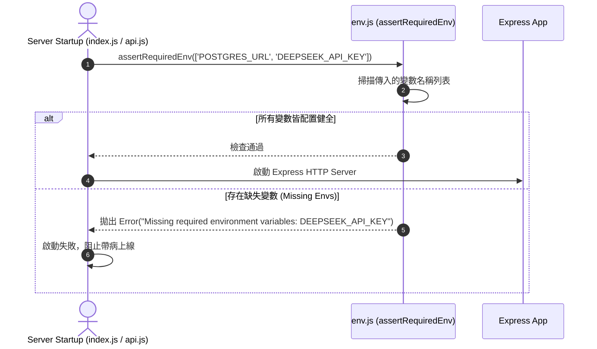

# Feature RFC: F-60 環境變數與密鑰安全檢查 (Environment Variable & Secret Guard)

> **文件狀態**：Approved  
> **系統成熟度 (Readiness Level)**：Production-Ready  
> **核心模組路徑**：`backend/src/config/env.js`  
> **Git 演進 Commit 追蹤**：`PR #102`, Commit `a51201e`  
> **主要负责人在 / 日期**：Kiwi AI Team / 2026-07-30  

---

## 1. 演進軌跡與背景動機 (Genesis & Evolution Trace)

### 1.1 零基礎生活白話比喻 (Layman Analogy for Beginners)
> 💡 **小白導讀**：
> 想像飛機起飛前的清單檢查（Pre-flight Checklist）：
> * **無環境變數檢查 (No Env Guard)**：飛機直接起飛（伺服器啟動），等飛到萬米高空才發現沒加油或沒帶地圖（運行到一半調用 LLM 或 DB 時才發現缺少 `DEEPSEEK_API_KEY` 或 `POSTGRES_URL`），導致系統在中途慘烈崩潰！
> * **密鑰安全檢查 (Env Guard - 本 Feature)**：在引擎啟動的第 1 秒（[env.js](file:///Users/heminghan/Kiwi-AI-interview-Agent/backend/src/config/env.js)），機長立刻核對必要變數清單。只要有任何關鍵密鑰缺失，立刻拋出明確警告並拒絕起飛，防止帶病運行！

### 1.2 基於 Git 歷史的從 0 到 1 演進歷程
* **初始最簡版本 (Baseline v0)**：
  - 各模組自行讀取 `process.env.XXX`，缺乏統一驗證。
* **現行架構 (Current Version)**：
  - 實作 [env.js](file:///Users/heminghan/Kiwi-AI-interview-Agent/backend/src/config/env.js)，導出 `assertRequiredEnv` 斷言函數，在系統初始化階段統一檢驗必填變數清單。

---

## 2. 邊界與成功標準 (Scope & Success Criteria)

### 2.1 涵蓋與非涵蓋範圍 (Scope Boundaries)
* **In-Scope (包含範圍)**：
  - 統一存取與動態解析 `getEnv(name)`。
  - 批次檢查必填變數清單 `assertRequiredEnv(names)`。
  - 缺少密鑰時拋出明確錯誤描述，阻止隱患發酵。
* **Out-of-Scope (排除範圍)**：
  - 不包含線上 KMS / HashiCorp Vault 動態密鑰輪轉。

---

## 3. 架構與系統流向 (Architecture & Flow)

### 3.1 系統資料流與狀態轉移圖 (Data Flow & State Machine Diagram)


---

## 4. 微觀工程與程式碼替代方案對比 (Micro-SE & Code Trade-off Matrix)

### 4.1 關鍵函數 / 邏輯區塊：`assertRequiredEnv`
* **現行程式碼位置**：[`backend/src/config/env.js:L75-L80`](file:///Users/heminghan/Kiwi-AI-interview-Agent/backend/src/config/env.js#L75-L80)

#### 現行真實程式碼 (Current Real Code Snippet)
```javascript
export const assertRequiredEnv = (names = []) => {
  const missing = names.filter((name) => !getEnv(name));
  if (missing.length > 0) {
    throw new Error(`Missing required environment variables: ${missing.join(', ')}`);
  }
};
```

#### 【逐行白話文解讀 (Line-by-Line Explanation for Beginners)】
* **第 75 行**：導出 `assertRequiredEnv` 函數，接收需要檢驗的變數名稱陣列 `names`。
* **第 76 行**：使用 `Array.prototype.filter` 遍歷列表，透過 `getEnv(name)` 檢查每一個環境變數是否存在。
* **第 77-79 行**：若 `missing.length > 0`，立刻拋出包含具體缺失變數清單的 `Error`，明確指出缺了哪一把 Key。

#### 替代寫法 A (Inline Ad-hoc Check scattered across files)
```javascript
// 替代寫法：分散在各 Service 中的零散檢查，容易漏掉且報錯訊息不一致
if (!process.env.DEEPSEEK_API_KEY) throw new Error('No Key!');
```

#### 微觀工程對比矩陣 (Micro Trade-off Analysis)
| 對比維度 | 現行寫法 (Centralized Guard Assertion) | 替代寫法 A (Ad-hoc Scattered Checks) |
| :--- | :--- | :--- |
| **維護性與可讀性** | **極高** (啟動時一目瞭然) | 差 (分散在幾十個檔案中) |
| **報錯明確度** | **極佳** (一次列出所有缺失 Key) | 差 (每次只報第一個錯) |
| **可測試性** | **高** (容易進行單元測試 Mock) | 差 |

---

## 5. 爆炸半徑與失敗矩陣 (Blast Radius & Failure Matrix)
- 影響後端伺服器啟動流程、資料庫連線、AI 模型調用與 Azure 音訊服務。

---

## 6. 運維與回滾步驟 (Incident Response & Rollback Runbook)
- 檢查日誌：`Missing required environment variables:`
