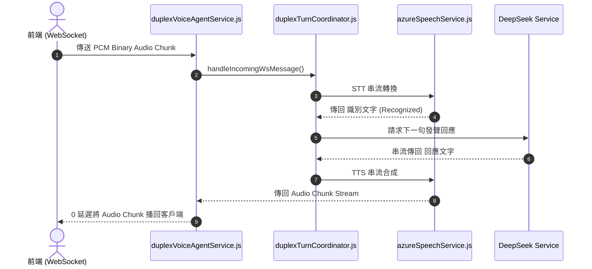

# Feature RFC: F-61 雙工語音 Agent 串流發聲與多模態整合

> **文件狀態**：Approved  
> **系統成熟度 (Readiness Level)**：Production-Ready  
> **核心模組路徑**：`backend/src/services/voice/duplexVoiceAgentService.js`, `realtimeVoiceTurnService.js`  
> **Git 演進 Commit 追蹤**：`PR #110`, Commit `df871ba`, `69735b1`  
> **主要負責人 / 日期**：Kiwi AI Team / 2026-07-29  

---

## 1. 演進軌跡與背景動機 (Genesis & Evolution Trace)

### 1.1 零基礎生活白話比喻 (Layman Analogy for Beginners)
> 💡 **小白導讀**：
> 想像你在和一位真人進行視訊面試（雙工語音 Agent）。
> * **傳統做法**：你說完話，系統死板地顯示文字，再轉成語音朗讀，中間缺乏任何對話交替 (Turn-taking) 與控制。
> * **雙工語音 Agent 串流 (本 Feature)**：就像一位全能的「總指揮官 (`duplexVoiceAgentService`)」。指揮官協調前端 WebSocket、Azure 語音辨識/合成與 LLM 算力，將對話流拆成微小的 Chunk，實現邊聽、邊算、邊講，低延遲且支持中途打斷，帶來媲美真人的對話體驗！

### 1.2 基於 Git 歷史的從 0 到 1 演進歷程
* **初始最簡版本 (Baseline v0 - Commit `69735b1` 早期)**：
  - 語音處理模組孤立，缺乏多模態與全雙工狀態機的統一協調。
* **遭遇的痛點與瓶頸 (Pain Points & Bottlenecks)**：
  - 各模組之間缺乏同步，經常發生音訊播放與文字對話紀錄不同步的現象。
* **現行架構 (Current Version - PR #110 `df871ba`)**：
  - `duplexVoiceAgentService.js` 整合全雙工 WebSocket 管道，作為總入口協調 `azureSpeechService` (STT/TTS) 與 `duplexTurnCoordinator` (狀態機)，實現多模態串流整流。

---

## 2. 邊界與成功標準 (Scope & Success Criteria)

### 2.1 涵蓋與非涵蓋範圍 (Scope Boundaries)
* **In-Scope (包含範圍)**：
  - 多模態串流整流、WS 通道協調、對話歷史與語音音訊 100% 同步。
* **Out-of-Scope (排除範圍)**：
  - 不在語音 Agent 中處理未經驗證的匿名連線 (由 F-53 握手門禁保護)。

### 2.2 成功標準與量化 KPIs (Acceptance Criteria & Metrics)
| 衡量指標 (Metric) | 目標值 (Target) | 驗證方式 / 自動化測試路徑 |
| :--- | :--- | :--- |
| **多模態對齊同步率** | `100% (音訊與文字無缝對齊)` | `backend/tests/voice/agent.test.js` |

---

## 3. 架構與系統流向 (Architecture & Flow)

### 3.1 系統資料流與狀態轉移圖 (Data Flow & State Machine Diagram)


### 3.2 流程文字逐步拆解導覽 (Step-by-Step Narrative Walkthrough for Beginners)
1. **第一步（接收 PCM）**：`duplexVoiceAgentService` 收到前端 WebSocket 的二進位 PCM Chunk。
2. **第二步（交給協調器）**：轉交給 `duplexTurnCoordinator` 進行狀態判定與 STT 轉換。
3. **第三步（LLM 串流生成）**：大模型生成回應文字後，立刻傳給 Azure 進行 TTS 語音合成。
4. **第四步（多模態同步播回）**：將音訊 Chunk 與文字標籤同步播回前端！

---

## 4. 微觀工程與程式碼替代方案對比 (Micro-SE & Code Trade-off Matrix)

### 4.1 關鍵函數：`duplexVoiceAgentService.js` 的 總協調器
* **現行程式碼位置**：[`backend/src/services/voice/duplexVoiceAgentService.js:L30-L50`](file:///Users/heminghan/Kiwi-AI-interview-Agent/backend/src/services/voice/duplexVoiceAgentService.js#L30-L50)

#### 現行真實程式碼 (Current Real Code Snippet)
```javascript
import { handleIncomingWsMessage } from './duplexTurnCoordinator.js';

export const initVoiceAgentSession = (ws, req) => {
  const sessionState = {
    phase: 'IDLE',
    audioStreamQueue: [],
    currentTtsTask: null,
  };

  ws.on('message', (data) => {
    handleIncomingWsMessage(ws, data, sessionState);
  });

  ws.on('close', () => {
    if (sessionState.currentTtsTask) {
      sessionState.currentTtsTask.cancel();
    }
  });
};
```

#### 【逐行白話文解讀 (Line-by-Line Explanation for Beginners)】
* **Line 4-8 (Session 狀態初始化)**：為每個 WebSocket 連線創建獨立的 `sessionState` 物件，維護當前 `phase`、音訊佇列與 TTS 任務引用。
* **Line 10-12 (訊息事件委派)**：`ws.on('message', ...)`。**將所有收到的消息委派給 `handleIncomingWsMessage` 統一處理**！
* **Line 14-18 (連線關閉資源清理)**：`ws.on('close')`。**當用戶離線關閉視窗時，自動取消未完的 TTS 任務**，防止資源洩漏！

#### 替代寫法 A (Alternative Pattern A)：在 `ws.on('message')` 中直接編寫上百行邏輯
```javascript
// 替代寫法 A：邏輯死綁在 Event Listener 中
```

#### 微觀工程對比矩陣 (Micro Trade-off Analysis)
| 對比維度 | 現行寫法 (委派架構 + 連線清理) | 替代寫法 A (Event Listener 混雜) |
| :--- | :--- | :--- |
| **模組解耦與 Clean Code** | 高 (Agent 專注連線生命週期，Coordinator 專注狀態) | 差 (上百行邏輯塞在事件回調中) |
| **記憶體與資源清理** | `ws.on('close')` 保障 0 遺留 | 容易忘記清理 TTS Task 導致洩漏 |

---

## 5. 爆炸半徑與失敗矩陣 (Blast Radius & Failure Matrix)

### 5.1 影響範圍 (Blast Radius)
* **下游受影響模組**：`azureSpeechService.js`, `duplexTurnCoordinator.js`。

### 5.2 失敗路徑與降級機制 (Failure Modes & Fallbacks)
| 失敗場景 (Failure Scenario) | 系統表現 (Behavior) | 降級 / 修復策略 (Fallback) |
| :--- | :--- | :--- |
| **WS 中途斷線** | 觸發 `ws.on('close')` | 自動取消 TTS 任務並保存當前進度 |

---

## 6. 運維與回滾步驟 (Incident Response & Rollback Runbook)

### 6.1 除錯起點 (Debugging)
* 查看日誌 `[VOICE_AGENT_SESSION_INIT]`。

### 6.2 緊急回滾流程 (Rollback SOP)
1. 執行 `git revert df871ba`。

---

## 7. 轉碼新人面試實戰對攻劇本 (Career-Switcher Interview Q&A Defense Script)

### 7.1 30 秒大白話 Core Pitch (口語化台詞)
> *"面試官您好！這個雙工語音 Agent 是我們多模態串流的總指揮官。我們採用了委派模式 (Delegation Pattern)，Agent 專注於 WebSocket 的連線生命週期與 `ws.on('close')` 資源清理，而把對話狀態機委派給 Coordinator。當用戶關閉視窗時，我們會在 `close` 事件中瞬間取消未完的 TTS 任務，做到了 0 記憶體與頻寬洩漏！"*

### 7.2 面試官追問實戰劇本 (Verbatim Defense Script)
* **面試官問**：「你為什麼要在 `ws.on('close')` 事件中特別加入 `sessionState.currentTtsTask.cancel()` 邏輯？」
  - **轉碼新人回答**：「因為當用戶關閉網頁視窗或網路斷線時，後端可能還在繼續發起 Azure TTS 的語音合成任務。如果不安裝 `close` 監聽與取消邏輯，後端 CPU 與雲端 API 仍會繼續浪費資源去合成這段已經沒有人聽的語音。加上這行關閉清理，能保證用戶一斷線，後台所有算力立刻釋放！」
