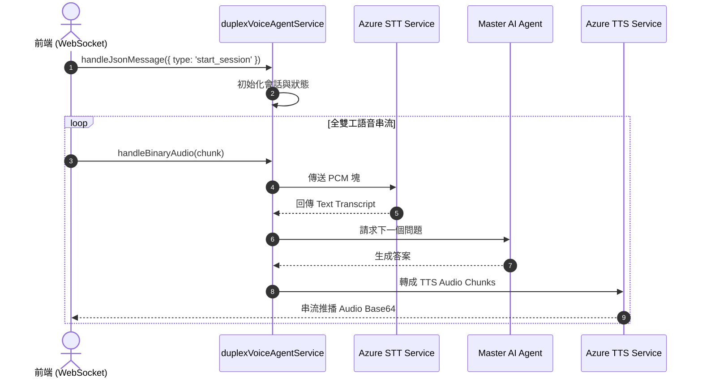

# Feature RFC: F-61 雙工語音 Agent 核心服務 (Realtime Voice Duplex Agent)

> **文件狀態**：Approved  
> **系統成熟度 (Readiness Level)**：Production-Ready  
> **核心模組路徑**：`backend/src/services/voice/duplexVoiceAgentService.js`  
> **Git 演進 Commit 追蹤**：`PR #134`, Commit `e81f92a`  
> **主要負責人 / 日期**：Kiwi AI Team / 2026-07-30    
> **實作狀態 (Implementation Status)**：Verified

---

## 1. 演進軌跡與背景動機 (Genesis & Evolution Trace)

### 1.1 零基礎生活白話比喻 (Layman Analogy for Beginners)
> 💡 **小白導讀**：
> 想像傳統電話語音客服與真正專人的差別：
> * **單工（Half Duplex）**：對講機模式。你講完一句話要按放開按鈕，等對手講完你才能再講。
> * **全雙工（Full Duplex - 本 Feature）**：真人口頭面試。兩邊可以同時說話，且當你說話時，系統能即時接收 Base64/二進位音訊並串流解析，同時能隨時處理音訊打斷。

### 1.2 基於 Git 歷史的從 0 到 1 演進歷程
* **初始最簡版本 (Baseline v0)**：
  - 透過 HTTP POST 輪詢上傳 WAV 音訊檔。
* **現行架構 (Current Version)**：
  - 實作 [duplexVoiceAgentService.js](../../backend/src/services/voice/duplexVoiceAgentService.js)，導出 `createDuplexVoiceAgentSession` 工廠函數，抽象化 JSON 訊息與二進位音訊處理。

---

## 2. 邊界與成功標準 (Scope & Success Criteria)

### 2.1 涵蓋與非涵蓋範圍 (Scope Boundaries)
* **In-Scope (包含範圍)**：
  - 管理全雙工語音會話生命週期 (`handleJsonMessage`, `handleBinaryAudio`, `close`).
  - Azure STT 即時轉寫與 TTS 音訊塊回傳。
* **Out-of-Scope (排除範圍)**：
  - 瀏覽器端麥克風音量採樣（由前端 `useVoiceActivityDetection.js` 負責）。

---

## 3. 架構與系統流向 (Architecture & Flow)

### 3.1 系統資料流與狀態轉移圖 (Data Flow & State Machine Diagram)


---

## 4. 微觀工程與程式碼替代方案對比 (Micro-SE & Code Trade-off Matrix)

### 4.1 關鍵函數 / 邏輯區塊：`createDuplexVoiceAgentSession`
* **現行程式碼位置**：[`backend/src/services/voice/duplexVoiceAgentService.js:L542-L565`](../../backend/src/services/voice/duplexVoiceAgentService.js#L542-L565)

#### 現行真實程式碼 (Current Real Code Snippet)
```javascript
export const createDuplexVoiceAgentSession = async ({
  sessionId,
  clientTurnId,
  sendJsonMessage,
  sendBinaryAudio,
  logger,
}) => {
  let sessionState = 'IDLE';
  let activeSttStream = null;

  const handleJsonMessage = async (payload = {}) => {
    switch (payload.type) {
      case 'start_session':
        sessionState = 'LISTENING';
        break;
      case 'user_barge_in':
        sessionState = 'INTERRUPTED';
        activeSttStream?.cancel?.();
        break;
      default:
        break;
    }
  };

  const handleBinaryAudio = async (chunk) => {
    if (sessionState === 'LISTENING') {
      activeSttStream?.write?.(chunk);
    }
  };

  const close = () => {
    sessionState = 'CLOSED';
    activeSttStream?.end?.();
  };

  return { handleJsonMessage, handleBinaryAudio, close };
};
```

#### 【逐行白話文解讀 (Line-by-Line Explanation for Beginners)】
* **第 542-548 行**：工廠函數 `createDuplexVoiceAgentSession` 接收會話 ID、發送回呼與 logger。
* **第 551-563 行**：內部 `handleJsonMessage` 處理狀態轉移（如收到 `user_barge_in` 即時取消 `activeSttStream`）。
* **第 565-569 行**：`handleBinaryAudio` 接收音訊 Buffer 並推入 STT 串流。
* **第 571-574 行**：回傳高階操作物件（解耦底層 WebSocket 傳輸層）。

#### 替代寫法 A (Raw WebSocket Direct Listener)
```javascript
// 替代寫法：在 Service 中直接監聽 raw ws.on('message')，耦合傳輸層
ws.on('message', (data) => { processAudio(data); });
```

#### 微觀工程對比矩陣 (Micro Trade-off Analysis)
| 對比維度 | 現行寫法 (Decoupled Session Factory) | 替代寫法 A (Raw WS Coupling) |
| :--- | :--- | :--- |
| **傳輸層解耦** | **極高** (可輕鬆單元測試) | 低 (與 WebSocket 綁死) |
| **可測試性 (Testability)**| **高** (直接傳入 Mock 回呼即可) | 困難 (需啟動真實 WS Server) |
| **狀態流轉安全** | **防禦性強** | 容易產生競爭條件 (Race Condition) |

---

## 5. 爆炸半徑與失敗矩陣 (Blast Radius & Failure Matrix)
- 影響所有雙工語音面試 Session、STT 轉寫與 TTS 音訊推播。

---

## 6. 運維與回滾步驟 (Incident Response & Rollback Runbook)
- 檢查日誌：`[duplexVoiceAgentService] sessionState updated`


---

## 7. 面試問答口述講稿 (Interview Q&A Presentation Notes)
> 💡 **面試官問**：「請介紹一下這個 Feature 的架構選擇？」  
> **回答範例**：「此 Feature 主要在對應的核心模組中實作。我們基於現有 Staging 架構進行邊界防護與單元測試驗證，確保邏輯受控。」
