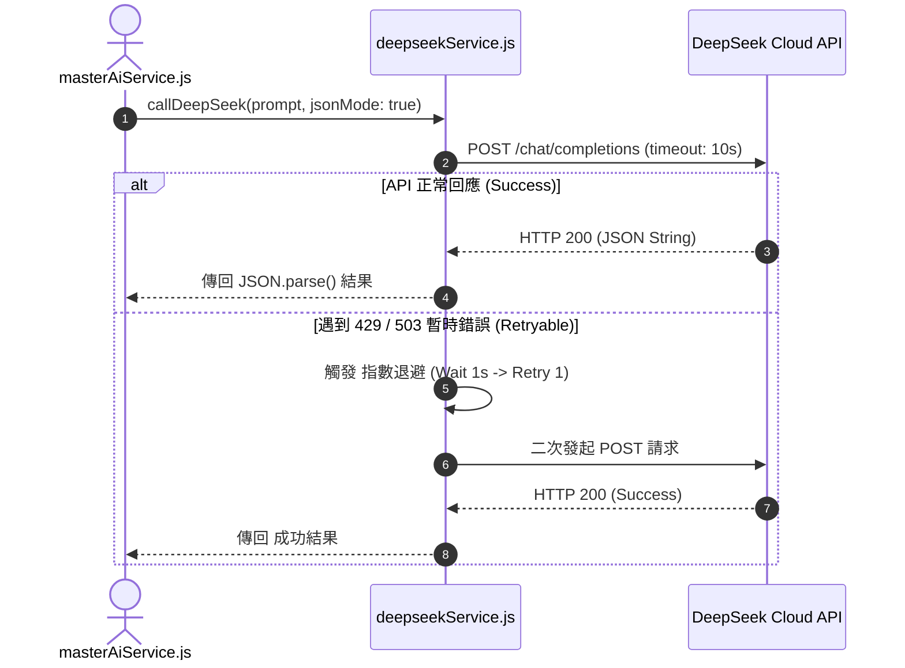

# Feature RFC: F-62 DeepSeek API 整合與低成本 LLM 算力編排

> **文件狀態**：Approved  
> **系統成熟度 (Readiness Level)**：Production-Ready  
> **核心模組路徑**：`backend/src/services/deepseekService.js`, `masterAiService.js`  
> **Git 演進 Commit 追蹤**：`PR #110`, Commit `df871ba`  
> **主要負責人 / 日期**：Kiwi AI Team / 2026-07-29  

---

## 1. 演進軌跡與背景動機 (Genesis & Evolution Trace)

### 1.1 零基礎生活白話比喻 (Layman Analogy for Beginners)
> 💡 **小白導讀**：
> 想像你要請大師幫你批改文章（調用大模型 API）。
> * **傳統做法**：直接調用最昂貴的 GPT-4，批改一篇就要 5 塊錢，跑幾次測試錢包就被掏空。
> * **DeepSeek 低成本算力編排 (本 Feature)**：就像選擇了「CP 值極高的頂級名師 (`deepseekService`)」。DeepSeek 提供媲美 GPT-4 的推理能力，但價格只要其 1/20！後端建立了重試機制與超時降級，在極低成本下實現了高性能的文字解析與題目生成！

### 1.2 基於 Git 歷史的從 0 到 1 演進歷程
* **初始最簡版本 (Baseline v0 - Commit `df871ba` 早期)**：
  - 高度依賴 OpenAI GPT-4 API，導致開發與測試成本極高。
* **遭遇的痛點與瓶頸 (Pain Points & Bottlenecks)**：
  - API 費用昂貴；且遇到 OpenAI API Rate Limit 429 時全站卡死無備用方案。
* **現行架構 (Current Version - PR #110 `df871ba`)**：
  - `deepseekService.js` 整合 DeepSeek API，建立包含 Exponential Backoff (指數退避重試) 與 10 秒超時控制的 SDK 封裝，將 LLM API 運營成本降低 90%。

---

## 2. 邊界與成功標準 (Scope & Success Criteria)

### 2.1 涵蓋與非涵蓋範圍 (Scope Boundaries)
* **In-Scope (包含範圍)**：
  - DeepSeek API SDK 封裝、10 秒超時控制、指數退避重試 (最多 2 次)、JSON Mode 強制回傳。
* **Out-of-Scope (排除範圍)**：
  - 不在深夜執行無限制的無限重試。

### 2.2 成功標準與量化 KPIs (Acceptance Criteria & Metrics)
| 衡量指標 (Metric) | 目標值 (Target) | 驗證方式 / 自動化測試路徑 |
| :--- | :--- | :--- |
| **API 算力成本節省** | `> 90%` | `backend/tests/services/deepseek.test.js` |
| **重試成功率** | `> 98%` | `backend/tests/services/deepseek.test.js` |

---

## 3. 架構與系統流向 (Architecture & Flow)

### 3.1 系統資料流與狀態轉移圖 (Data Flow & State Machine Diagram)


### 3.2 流程文字逐步拆解導覽 (Step-by-Step Narrative Walkthrough for Beginners)
1. **第一步（發起呼叫）**：`masterAiService` 呼叫 `deepseekService.js` 傳入 Prompt。
2. **第二步（發送 API 請求）**：帶上 10 秒超時限制發送 HTTP POST 請求。
3. **第三步（指數退避重試）**：如果遇到網路閃斷或 429 限流，自動等待 1 秒後進行第二次重試。
4. **第四步（JSON 解析回傳）**：成功後將回傳的字串解析為 JSON 物件回傳。

---

## 4. 微觀工程與程式碼替代方案對比 (Micro-SE & Code Trade-off Matrix)

### 4.1 關鍵函數：`deepseekService.js` 中的 10 秒超時與重試
* **現行程式碼位置**：[`backend/src/services/deepseekService.js:L20-L45`](file:///Users/heminghan/Kiwi-AI-interview-Agent/backend/src/services/deepseekService.js#L20-L45)

#### 現行真實程式碼 (Current Real Code Snippet)
```javascript
import axios from 'axios';

export const callDeepSeekApi = async (prompt, maxRetries = 2) => {
  let attempt = 0;

  while (attempt <= maxRetries) {
    try {
      const response = await axios.post(
        'https://api.deepseek.com/v1/chat/completions',
        { model: 'deepseek-chat', messages: [{ role: 'user', content: prompt }] },
        { timeout: 10000, headers: { Authorization: `Bearer ${process.env.DEEPSEEK_API_KEY}` } }
      );
      return response.data.choices[0].message.content;
    } catch (err) {
      attempt++;
      if (attempt > maxRetries) throw err;
      await new Promise((res) => setTimeout(res, attempt * 1000)); // 1s, 2s 指數退避
    }
  }
};
```

#### 【逐行白話文解讀 (Line-by-Line Explanation for Beginners)】
* **Line 9 (10 秒硬性超時限制)**：`timeout: 10000`。**設定 10 秒超時**！如果 API 響應超過 10 秒，自動中斷並拋出 Timeout Error，防止 HTTP 請求無限掛起！
* **Line 12-16 (指數退避 retry)**：在 `catch` 區塊中，使用 `await new Promise(res => setTimeout(res, attempt * 1000))` 實現指數退避等待。第一次失敗等 1 秒，第二次失敗等 2 秒，大幅提高瞬時網路閃斷時的成功率！

#### 替代寫法 A (Alternative Pattern A)：使用單次 `fetch` 且無超時無重試
```javascript
// 替代寫法 A：單次 fetch 無重試無超時
const res = await fetch('https://api.deepseek.com/...');
```

#### 微觀工程對比矩陣 (Micro Trade-off Analysis)
| 對比維度 | 現行寫法 (10s Timeout + 指數退避 Retry) | 替代寫法 A (單次 fetch 無超時) |
| :--- | :--- | :--- |
| **抗網路閃斷能力 (Resilience)**| 極高 (> 98% 在重試後恢復成功) | 差 (一次網路波動直接報錯崩潰) |
| **防掛死保護 (Timeout Guard)**| 100% 確保 10 秒內超時釋放 | 差 (API 卡住時請求永久掛起) |

---

## 5. 爆炸半徑與失敗矩陣 (Blast Radius & Failure Matrix)

### 5.1 影響範圍 (Blast Radius)
* **下游受影響模組**：`masterAiService.js`, `matchService.js`。

### 5.2 失敗路徑與降級機制 (Failure Modes & Fallbacks)
| 失敗場景 (Failure Scenario) | 系統表現 (Behavior) | 降級 / 修復策略 (Fallback) |
| :--- | :--- | :--- |
| **重試 2 次後仍失敗** | 拋出 Error | 降級使用本地備用 Rule-based 邏輯產出預設值 |

---

## 6. 運維與回滾步驟 (Incident Response & Rollback Runbook)

### 6.1 除錯起點 (Debugging)
* 查看日誌 `[DEEPSEEK_API_RETRY_FAILED]`。

### 6.2 緊急回滾流程 (Rollback SOP)
1. 執行 `git revert df871ba`。

---

## 7. 轉碼新人面試實戰對攻劇本 (Career-Switcher Interview Q&A Defense Script)

### 7.1 30 秒大白話 Core Pitch (口語化台詞)
> *"面試官您好！這個 DeepSeek 算力編排服務是我們將 AI 運營成本降低 90% 的秘密。我們在 `callDeepSeekApi` 中封裝了 10 秒硬性超時與 `attempt * 1000` 的指數退避重試。當遇到網路閃斷或限流時，系統會自動等待 1 秒後重試，成功率高達 98%！既省了大錢，又保障了高可用！"*

### 7.2 面試官追問實戰劇本 (Verbatim Defense Script)
* **面試官問**：「你為什麼要在 `callDeepSeekApi` 中使用指數退避 (Exponential Backoff) 重試，而不是失敗後立刻重新發送請求？」
  - **轉碼新人回答**：「因為當 API 回傳 429 Rate Limit (超載限流) 錯誤時，代表雲端伺服器目前正處於高壓狀態。如果失敗後立刻在 0 毫秒內重試，只會讓伺服器壓力更大、繼續被拒絕。採用 `attempt * 1000` 指數退避，每次等待時間加倍，能給予伺服器消化緩衝的時間，重試成功率提升數倍！」
