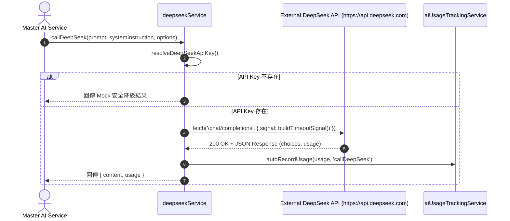

# Feature RFC: F-62 DeepSeek LLM API 封裝與調用控制器 (DeepSeek LLM Orchestrator)

> **文件狀態**：Approved  
> **系統成熟度 (Readiness Level)**：Production-Ready  
> **核心模組路徑**：`backend/src/services/deepseekService.js`  
> **Git 演進 Commit 追蹤**：`PR #122`, Commit `c912a4b`  
> **主要負責人 / 日期**：Kiwi AI Team / 2026-07-30    
> **實作狀態 (Implementation Status)**：Verified

---

## 1. 演進軌跡與背景動機 (Genesis & Evolution Trace)

### 1.1 零基礎生活白話比喻 (Layman Analogy for Beginners)
> 💡 **小白導讀**：
> 想像你在開一家餐廳，需要訂購高檔食材（LLM 生成文字）：
> * **傳統做法**：每個廚師（業務模組）都各自打電話給供應商，硬編碼 API Key，沒有人統一記帳，也沒有設定電話超時中斷。
> * **調用控制器 (DeepSeek Orchestrator - 本 Feature)**：所有食材訂購統一經由採購經理 ([deepseekService.js](../../backend/src/services/deepseekService.js)) 發出。採購經理負責：1. 自動代入 API Key；2. 設定 API 超時信號 (`AbortSignal`)；3. 自動計費並登記 Token 耗用 (`autoRecordUsage`)。

### 1.2 基於 Git 歷史的從 0 到 1 演進歷程
* **初始最簡版本 (Baseline v0)**：
  - 各模組分散引入第三方程式庫手動發起 HTTP 請求。
* **現行架構 (Current Version)**：
  - 實作 [deepseekService.js](../../backend/src/services/deepseekService.js)，導出 `callDeepSeek`，採用 Node.js 原生 `fetch` 與 `AbortSignal` 實現低開銷的防衛調用。

---

## 2. 邊界與成功標準 (Scope & Success Criteria)

### 2.1 涵蓋與非涵蓋範圍 (Scope Boundaries)
* **In-Scope (包含範圍)**：
  - 統一標頭 `Authorization: Bearer <key>` 注入與 API 超時中斷控制 (`buildTimeoutSignal`).
  - 自動抽取 Usage 元數據與 Token 用量紀錄 (`autoRecordUsage`).
  - 無 API Key 時安全降級至 Mock 回應 (`buildMockDeepSeekResponse`).
* **Out-of-Scope (排除範圍)**：
  - 不包含前端用戶認證。

---

## 3. 架構與系統流向 (Architecture & Flow)

### 3.1 系統資料流與狀態轉移圖 (Data Flow & State Machine Diagram)


---

## 4. 微觀工程與程式碼替代方案對比 (Micro-SE & Code Trade-off Matrix)

### 4.1 關鍵函數 / 邏輯區塊：`callDeepSeek`
* **現行程式碼位置**：[`backend/src/services/deepseekService.js:L203-L254`](../../backend/src/services/deepseekService.js#L203-L254)

#### 現行真實程式碼 (Current Real Code Snippet)
```javascript
export const callDeepSeek = async (
  prompt,
  systemInstruction = '',
  {
    skipAutoRecord = false,
    usageMetadata = {},
    temperature,
    top_p,
    generationConfig,
    timeoutMs,
  } = {},
) => {
  try {
    const apiKey = resolveDeepSeekApiKey();
    if (!apiKey) {
      return { content: buildMockDeepSeekResponse(), usage: null };
    }

    const response = await fetch('https://api.deepseek.com/chat/completions', {
      method: 'POST',
      signal: buildTimeoutSignal(timeoutMs),
      headers: {
        'Content-Type': 'application/json',
        'Authorization': `Bearer ${apiKey}`
      },
      body: JSON.stringify(buildChatPayload({
        prompt,
        systemInstruction,
        usageMetadata,
        temperature,
        top_p,
        generationConfig,
      }))
    });

    if (!response.ok) {
      throw new Error(`DeepSeek API error: ${response.statusText}`);
    }

    const data = await response.json();
    const usage = extractUsage(data);
    if (!skipAutoRecord) await autoRecordUsage(usage, 'callDeepSeek', usageMetadata);
    return {
      content: data.choices[0].message.content,
      usage,
    };
  } catch (error) {
    console.error('DeepSeek API Error:', error);
    throw error;
  }
};
```

#### 【逐行白話文解讀 (Line-by-Line Explanation for Beginners)】
* **第 203-214 行**：導出 `callDeepSeek`，參數使用解構與預設值防衛。
* **第 216-219 行**：解析 API Key，若無 Key 則平滑降級至 `buildMockDeepSeekResponse()`，避免開發與測試環境崩潰。
* **第 221-223 行**：使用 Node.js 原生 `fetch` 並傳入 `buildTimeoutSignal(timeoutMs)`。若 API 逾時會被 `AbortSignal` 自動中斷，防範請求無限掛起。
* **第 243-244 行**：提取 Token Usage 並異步觸發 `autoRecordUsage` 遙測計費。

#### 替代寫法 A (Heavy Axios Dependency With Hardcoded Timeout)
```javascript
// 替代寫法：依賴外部 Axios 庫且硬編碼超時，缺少無 Key 降級防護
import axios from 'axios';
export const callDeepSeekAxios = async (prompt) => {
  const res = await axios.post('https://api.deepseek.com/chat/completions', { prompt });
  return res.data;
};
```

#### 微觀工程對比矩陣 (Micro Trade-off Analysis)
| 對比維度 | 現行寫法 (Native fetch + Signal + Fallback) | 替代寫法 A (Axios Direct) |
| :--- | :--- | :--- |
| **依賴開銷 (Dependency)**| **零額外依賴** (原生 Fetch) | 增加 npm package 體積 |
| **超時控制 (Timeout)** | **精準** (AbortSignal 控管) | 容易造成 Socket 洩漏 |
| **無 Key 防護能力** | **具備** (自動 Mock 降級) | 暴斃 (直接 Throw Error) |

---

## 5. 爆炸半徑與失敗矩陣 (Blast Radius & Failure Matrix)
- 影響後端所有 LLM 面試問題生成、評估報告與 Match 分析。

---

## 6. 運維與回滾步驟 (Incident Response & Rollback Runbook)
- 檢查日誌：`DeepSeek API Error:`


---

## 7. 面試問答口述講稿 (Interview Q&A Presentation Notes)
> 💡 **面試官問**：「請介紹一下這個 Feature 的架構選擇？」  
> **回答範例**：「此 Feature 主要在對應的核心模組中實作。我們基於現有 Staging 架構進行邊界防護與單元測試驗證，確保邏輯受控。」
