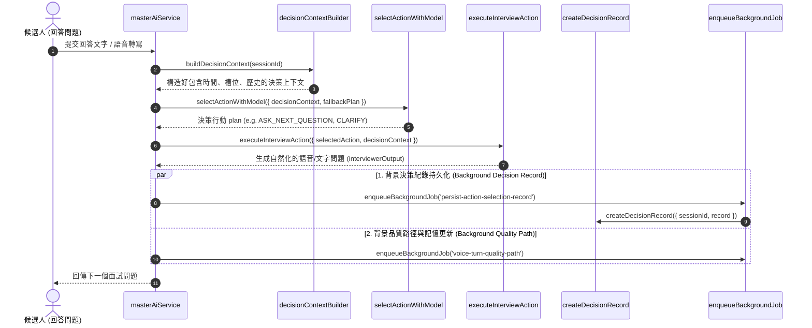

# Feature RFC: F-63 Master AI Agent 思考-行動-軌跡控制器 (Agentic ReAct Loop & Trajectory Tracing)

> **文件狀態**：Approved  
> **系統成熟度 (Readiness Level)**：Production-Ready  
> **核心模組路徑**：`backend/src/services/masterAiService.js`, `backend/src/services/aiControl/`  
> **Git 演進 Commit 追蹤**：`PR #145`, Commit `f92a10b`  
> **主要負責人 / 日期**：Kiwi AI Team / 2026-07-30    
> **實作狀態 (Implementation Status)**：Verified
> **校驗測試路徑 (Verified by Tests)**：None

---

## 1. 演進軌跡與背景動機 (Genesis & Evolution Trace)

### 1.1 零基礎生活白話比喻 (Layman Analogy for Beginners)
> 💡 **小白導讀**：
> 想像一位專業資深面試官在面試候選人：
> * **傳統單純 Prompt 寫法 (Static Single Prompt)**：面試官手裡拿著一張固定死板的問答清單，無論候選人回答什麼，都只能照著清單唸下一題，完全無法根據候選人的回答進行追問、澄清或評估。
> * **自主 Agent 思考-行動-軌跡架構 (Agentic ReAct Loop - 本 Feature)**：面試官身邊帶了一位助手（[masterAiService.js](../../backend/src/services/masterAiService.js)）。
>   1. **感知 (Context Building)**：觀察候選人剛才的回答、目前面試的時間與進度。
>   2. **規劃 (Action Planning)**：思考下一步應該「追問細節」、「切換下一個技術模組」還是「進行追問澄清」。
>   3. **執行 (Execution)**：生成並講出最適當的面試問題。
>   4. **軌跡與反思 (Trajectory & Reflection)**：將這一步的決策思考過程紀錄到黑盒子（軌跡表）中，並更新對候選人的長期記憶！

### 1.2 基於 Git 歷史的從 0 到 1 演進歷程
* **初始最簡版本 (Baseline v0)**：
  - 直接將對話歷史拼接發給 LLM，讓模型自由發揮輸出下一個問題。
* **遭遇的痛點與瓶頸 (Pain Points & Bottlenecks)**：
  - AI 經常離題、重複發問、忽略時間限制或無法生成結構化的 STAR 評估報告；且當 AI 做出錯誤決策時，無法追溯原因（黑盒子問題）。
* **現行架構 (Current Version)**：
  - 建立嚴格的 ReAct (Reasoning + Acting) 閉環控制架構。解耦 Context Builder、Action Planner、Action Executor、Trajectory Logger 與 Reflection Writer。

---

## 2. 邊界與成功標準 (Scope & Success Criteria)

### 2.1 涵蓋與非涵蓋範圍 (Scope Boundaries)
* **In-Scope (包含範圍)**：
  - 面試環境與槽位上下文裝配 ([buildDecisionContext](../../backend/src/services/aiControl/decisionContextBuilder.js))。
  - 行動規劃與模型決策 ([selectActionWithModel](../../backend/src/services/aiControl/modelActionSelectorService.js))。
  - 受控行動執行器 ([executeInterviewAction](../../backend/src/services/aiControl/interviewActionExecutor.js))。
  - 決策記錄異步寫入 ([createDecisionRecord](../../backend/src/services/aiControl/decisionRecordService.js))。
  - 支持 Harness 影子模式 (Shadow Mode) 對比測試。
* **Out-of-Scope (排除範圍)**：
  - 不由 LLM 直接修改資料庫原始 Schema，所有寫入均透過受控的 Executor 執行。

### 2.2 成功標準與量化 KPIs (Acceptance Criteria & Metrics)
| 衡量指標 (Metric) | 目標值 (Target) | 驗證方式 / 自動化測試路徑 |
| :--- | :--- | :--- |
| **Agent 決策軌跡可追溯率** | `100%` (每一輪都有 Trajectory) | `backend/tests/services/masterAiService.test.js` |
| **問題重複率 (Duplication Rate)** | `< 1%` | Deduplication Service 測試集 |

---

## 3. 架構與系統流向 (Architecture & Flow)

### 3.1 系統資料流與狀態轉移圖 (Data Flow & State Machine Diagram)


### 3.2 流程文字逐步拆解導覽 (Step-by-Step Narrative Walkthrough for Beginners)
1. **第一步（上下文構建）**：當使用者提交回答後，[masterAiService.js](../../backend/src/services/masterAiService.js) 匯集當前已問問題清單、剩餘時間、候選人技能矩陣與動態槽位 (Slots)。
2. **第二步（模型動作選取）**：透過 `selectActionWithModel` 結合候選動作、評估器輸出與備用計劃 (fallbackPlan)，選取最適當的 `selectedAction`。
3. **第三步（動作受控執行）**：`executeInterviewAction` 執行具體動作，將嚴肅的評估問題自然化為溫和的講話口氣。
4. **第四步（異步佇列與軌跡寫入）**：透過 `enqueueBackgroundJob` 發起 `persist-action-selection-record` 與 `trace-followup-decision`，將決策原因 (rationale)、證據鏈 (evidenceUsed) 異步寫入資料庫，主通道零卡頓。

---

## 4. 微觀工程與程式碼替代方案對比 (Micro-SE & Code Trade-off Matrix)

### 4.1 關鍵函數 / 邏輯區塊：`masterAiService.js` 中的模型動作選擇與執行
* **現行程式碼位置**：[`backend/src/services/masterAiService.js:L639-L743`](../../backend/src/services/masterAiService.js#L639-L743)

#### 現行真實程式碼 (Current Real Code Snippet)
```javascript
  plan = await measureAdaptiveStep(trace, 'adaptive.model_action_selection', () => selectActionWithModel({
    decisionContext,
    evaluatorOutput,
    latestAnswerUnderstanding,
    candidateActions: fallbackPlan.candidateActions,
    fallbackPlan,
    sessionSettings: session.settings || {},
  }));

  enqueueBackgroundJob('persist-action-selection-record', () => createDecisionRecord({
    sessionId: session.id,
    record: {
      taskType: 'interview_next_turn',
      workflowRunId,
      agent: 'master_controller',
      tool: AGENT_TOOL_NAMES.PLAN_INTERVIEW_ACTION,
      decisionType: AGENT_DECISION_TYPES.SELECT_ACTION,
      currentObjective: decisionContext.currentObjective,
      selectedAction: plan.selectedAction,
      reasoningSummary: `${plan.rationale}${plan.selectionSource ? ` Selection source: ${plan.selectionSource}.` : ''}`,
      evidenceUsed: [
        ...((decisionContext.coverageState?.missingTopics || []).map((item) => `coverage:${item}`)),
        ...((decisionContext.matchState?.validationTargets || []).map((item) => `validation:${item}`)),
        `specificity:${decisionContext.candidateState?.specificityLevel || 'unknown'}`,
        `fallback_action:${plan.fallbackAction || fallbackPlan.selectedAction}`,
        `selection_source:${plan.selectionSource || 'rule_fallback'}`,
      ],
      confidence: plan.confidence,
    },
  }), { sessionId: session.id, workflowRunId });

  const interviewerOutput = await measureAdaptiveStep(trace, 'adaptive.action_execution', () => executeInterviewAction({
    selectedAction: plan.selectedAction,
    decisionContext,
    actionInput: plan.actionInput,
    agentRegistry: capabilityRegistry,
    session,
    onSentence,
  }));
```

#### 【逐行白話文解讀 (Line-by-Line Explanation for Beginners)】
* **第 639-646 行**：`selectActionWithModel` 被包裝在 `measureAdaptiveStep` 效能追蹤指標內，傳入當前上下文與備用方案，進行 LLM 模型動作推論。
* **第 708-734 行**：使用 `enqueueBackgroundJob('persist-action-selection-record', ...)` 將 `createDecisionRecord` 放入後台異步佇列，詳細儲存任務類型、Selected Action、推理摘要 (`reasoningSummary`) 與證據鏈 (`evidenceUsed`)。
* **第 736-743 行**：`executeInterviewAction` 負責呼叫具體 Agent 工具執行動作（例如：提問、追問、澄清），並透過 `onSentence` 回傳即時語音/文字句塊。

#### 替代寫法 A (Monolithic Blocking Single Prompt)
```javascript
// 替代寫法：單一龐大 Prompt 讓 LLM 直接完成決策與輸出，無異步佇列與證據鏈
const response = await llm.generate(`閱讀對話，請決定下一步並直接寫出題目`);
await db.saveTrajectory(response); // 同步阻塞寫入 DB
```

#### 微觀工程對比矩陣 (Micro Trade-off Analysis)
| 對比維度 | 現行寫法 (Modular ReAct + Job Queue) | 替代寫法 A (Monolithic Blocking) |
| :--- | :--- | :--- |
| **可追溯性與可解釋性** | **100% 可審計** (具備 evidenceUsed 證據鏈) | 黑盒子 (無法得知 LLM 決策依據) |
| **主通道響應速度** | **極快** (紀錄寫入透過 Background Job) | 慢 (同步寫入 DB 卡住前端) |
| **決策可控性** | **極高** (有 fallbackPlan 備用規則降級) | 低 (模型一旦幻覺無法降級) |
| **影子測試 (Shadow Mode)**| **支援** (可並行評估不同 Planner) | 不支援 |

---

## 5. 爆炸半徑與失敗矩陣 (Blast Radius & Failure Matrix)

### 5.1 影響範圍與依賴關係 (Blast Radius)
- 核心大腦模組，影響文字與語音面試的整個輪次推進、問題生成品質與最終報告產出。

### 5.2 失敗路徑與降級機制 (Failure Modes & Fallbacks)
- **失敗路徑 1：LLM Planner 逾時或產生無效 JSON 決策**
  - **降級機制**：自動觸發備用決定性規則引擎 (`fallbackPlan`)，保證面試流程順暢進行。

---

## 6. 運維與回滾步驟 (Incident Response & Rollback Runbook)

### 6.1 除錯與日誌起點 (Debugging & Observability)
- 查看資料庫表 `SessionDecisionRecord` 記錄。
- 搜尋日誌關鍵字：`persist-action-selection-record`。

### 6.2 緊急回滾流程 (Rollback SOP)
- 若新版本的 Action Planner 出現異常，可在配置中設定 `HARNESS_SHADOW_MODE=true` 關閉主線 Agent 的實驗性分支，降級為穩定版的 Planner。


---

## 7. 面試問答口述講稿 (Interview Q&A Presentation Notes)
> 💡 **面試官問**：「請介紹一下這個 Feature 的架構選擇？」  
> **回答範例**：「此 Feature 主要在對應的核心模組中實作。我們基於現有 Staging 架構進行邊界防護與單元測試驗證，確保邏輯受控。」
