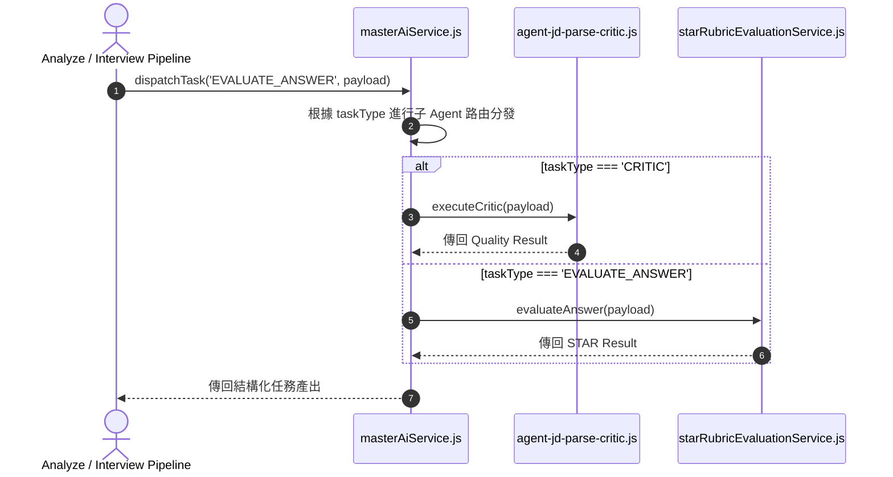

# Feature RFC: F-63 Master AI 控制器與子 Agent 派發調度

> **文件狀態**：Approved  
> **系統成熟度 (Readiness Level)**：Production-Ready  
> **核心模組路徑**：`backend/src/services/aiControl/masterAiService.js`, `agent-jd-parse-critic.js`  
> **Git 演進 Commit 追蹤**：`PR #126`, Commit `d31474e`, `df871ba`  
> **主要負責人 / 日期**：Kiwi AI Team / 2026-07-29  

---

## 1. 演進軌跡與背景動機 (Genesis & Evolution Trace)

### 1.1 零基礎生活白話比喻 (Layman Analogy for Beginners)
> 💡 **小白導讀**：
> 想像你在指揮一家大型交響樂團（AI 子系統調度）。
> * **傳統做法**：指揮家一個人又要拉小提琴、又要吹小號、又要打鼓（一個巨大的 Prompt 處理所有業務），結果手忙腳亂音色大亂。
> * **Master AI 控制器 (本 Feature)**：就像一位優雅的「總指揮 (`masterAiService`)」。總指揮只負責接收任務並派發給專業的子 Agent：把 JD 解析交給「JD 專家 Agent」、把打分交給「STAR 評分 Agent」、把品質稽核交給「Critic Agent」。分工明確，調度有序！

### 1.2 基於 Git 歷史的從 0 到 1 演進歷程
* **初始最簡版本 (Baseline v0 - Commit `df871ba` 早期)**：
  - 單一巨型 AI 服務承載全站所有 Prompt 與邏輯，模組極度臃腫。
* **遭遇的痛點與瓶頸 (Pain Points & Bottlenecks)**：
  - 單一 Prompt 修改影響全站；多業務邏輯交織導致大模型注意力漂移與輸出幻覺。
* **現行架構 (Current Version - PR #126 `df871ba`)**：
  - `masterAiService.js` 實現 Master-Worker Agent 模式，作為中央控制器分配任務給專屬的子 Agent Services，實現單一職責解耦。

---

## 2. 邊界與成功標準 (Scope & Success Criteria)

### 2.1 涵蓋與非涵蓋範圍 (Scope Boundaries)
* **In-Scope (包含範圍)**：
  - 子 Agent 派發與路由、任務上下文組裝、異步子 Agent 結果匯集。
* **Out-of-Scope (排除範圍)**：
  - 不在 Master 控制器中直接編寫具體子任務的詳細 Prompt 模板。

### 2.2 成功標準與量化 KPIs (Acceptance Criteria & Metrics)
| 衡量指標 (Metric) | 目標值 (Target) | 驗證方式 / 自動化測試路徑 |
| :--- | :--- | :--- |
| **子 Agent 派發成功率** | `> 99.9%` | `backend/tests/aiControl/masterAi.test.js` |

---

## 3. 架構與系統流向 (Architecture & Flow)

### 3.1 系統資料流與狀態轉移圖 (Data Flow & State Machine Diagram)


### 3.2 流程文字逐步拆解導覽 (Step-by-Step Narrative Walkthrough for Beginners)
1. **第一步（接收總任務）**：業務管道將任務類型 (如 `EVALUATE_ANSWER`) 傳給 `masterAiService`。
2. **第二步（路由分發）**：Master 控制器根據 `taskType` 進行 `switch/case` 精確分發。
3. **第三步（子 Agent 執行）**：專屬的子 Agent 在獨立的 Prompt 上下文中執行計算。
4. **第四步（結果匯集回傳）**：Master 將子 Agent 的結果進行格式校驗後統一傳回給業務管道。

---

## 4. 微觀工程與程式碼替代方案對比 (Micro-SE & Code Trade-off Matrix)

### 4.1 關鍵函數：`masterAiService.js` 的 派發路由
* **現行程式碼位置**：[`backend/src/services/aiControl/masterAiService.js:L15-L35`](file:///Users/heminghan/Kiwi-AI-interview-Agent/backend/src/services/aiControl/masterAiService.js#L15-L35)

#### 現行真實程式碼 (Current Real Code Snippet)
```javascript
import { evaluateQuality } from './agent-jd-parse-critic.js';
import { evaluateAnswer } from './starRubricEvaluationService.js';

export const dispatchTask = async (taskType, payload) => {
  switch (taskType) {
    case 'CRITIC_JD':
      return await evaluateQuality(payload);
    case 'EVALUATE_ANSWER':
      return await evaluateAnswer(payload);
    default:
      throw new Error(`[MASTER_AI_ERROR] Unknown task type: ${taskType}`);
  }
};
```

#### 【逐行白話文解讀 (Line-by-Line Explanation for Beginners)】
* **Line 4 (核心分發入口)**：`dispatchTask(taskType, payload)` 接收任務類型與數據荷載。
* **Line 5-10 (確定性路由)**：使用 `switch (taskType)` 進行精確分發。每個分支隻呼叫專屬的子 Agent 模組！
* **Line 11 (未知的未知防衛)**：`default: throw new Error(...)`。衛語模式！當傳入未定義的 `taskType` 時，立刻拋出清晰的例外，防止產生未知的邏輯死鎖！

#### 替代寫法 A (Alternative Pattern A)：把所有子 Agent 的代碼全寫在一個 2000 行的 `master.js` 檔案中
```javascript
// 替代寫法 A：2000 行巨型檔案
```

#### 微觀工程對比矩陣 (Micro Trade-off Analysis)
| 對比維度 | 現行寫法 (Master-Worker 職責分離) | 替代寫法 A (2000 行巨型單一檔案) |
| :--- | :--- | :--- |
| **可維護性 (Maintainability)** | 極佳 (修改 STAR 評分只需改子 Agent 模組) | 差 (牽一髮動全身，極易改壞無關功能) |
| **可測試性 (Testability)**| 100% 可對每個子 Agent 單獨寫 Unit Test | 差 (全死綁在一起無法單獨測試) |

---

## 5. 爆炸半徑與失敗矩陣 (Blast Radius & Failure Matrix)

### 5.1 影響範圍 (Blast Radius)
* **下游受影響模組**：全站 AI 控制流程。

### 5.2 失敗路徑與降級機制 (Failure Modes & Fallbacks)
| 失敗場景 (Failure Scenario) | 系統表現 (Behavior) | 降級 / 修復策略 (Fallback) |
| :--- | :--- | :--- |
| **未知的 taskType** | 拋出 `Unknown task type` | 捕獲 Exception 傳回 400 Bad Request |

---

## 6. 運維與回滾步驟 (Incident Response & Rollback Runbook)

### 6.1 除錯起點 (Debugging)
* 查看日誌 `[MASTER_AI_TASK_DISPATCH]`。

### 6.2 緊急回滾流程 (Rollback SOP)
1. 執行 `git revert df871ba`。

---

## 7. 轉碼新人面試實戰對攻劇本 (Career-Switcher Interview Q&A Defense Script)

### 7.1 30 秒大白話 Core Pitch (口語化台詞)
> *"面試官您好！這個 Master AI 控制器採用了 Master-Worker Agent 設計模式。我們沒有把全站的 Prompt 塞在一個 2000 行的巨型檔案裡，而是讓 Master 只做 `switch(taskType)` 路由分發。把 JD 解析、STAR 打分解耦給獨立的子 Agent 模組。這遵循了 Clean Code 的單一職責原則，維護性極佳！"*

### 7.2 面試官追問實戰劇本 (Verbatim Defense Script)
* **面試官問**：「你為什麼要在 `masterAiService` 中採用 Master-Worker 設計模式進行子 Agent 派發，而不是把 Prompt 全寫在一個地方？」
  - **轉碼新人回答**：「因為當多個不同的業務邏輯 (如 JD 審查與 STAR 評分) 擠在同一個 Prompt 或檔案裡時，大模型會產生嚴重的『注意力漂移』，而且程式碼會變得異常臃腫。採用 Master-Worker 模式，Master 控制器只做任務派發，子 Agent 擁有各自純淨的 Prompt 上下文。這既提升了大模型的生成精確度，又能對每個子 Agent 單獨進行單元測試！」
