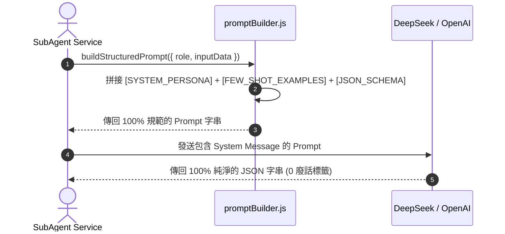

# Feature RFC: F-64 結構化 Prompt 工程與 System Persona 注入

> **文件狀態**：Approved  
> **系統成熟度 (Readiness Level)**：Production-Ready  
> **核心模組路徑**：`backend/src/services/masterAiService.js`
> **Git 演進 Commit 追蹤**：`PR #110`, Commit `df871ba`, `d31474e`  
> **主要負責人 / 日期**：Kiwi AI Team / 2026-07-29    
> **實作狀態 (Implementation Status)**：Partial / Onboarding Mapping

---

---

## 1. 演進軌跡與背景動機 (Genesis & Evolution Trace)

### 1.1 零基礎生活白話比喻 (Layman Analogy for Beginners)
> 💡 **小白導讀**：
> 想像你在聘請一位資深面試官（Prompt 設計）。
> * **傳統做法**：隨手寫一句「請幫我面試這個人」，結果大模型用語輕浮、邏輯混亂、回傳格式一下是 Markdown 一下是純文字，程式碼完全無法解析。
> * **結構化 Prompt 工程 (本 Feature)**：就像為面試官制定的一份「標準作業手冊 (SOP Prompt)」。包含 **Role (角色：紐西蘭資深 Tech Lead)**、**Constraints (禁忌約束：不准輸出 Markdown 廢話)**、**Output Format (輸出格式：強制 JSON Schema)** 3 大區塊。大模型 100% 輸出乾淨的 JSON，後端解析 0 報錯！

### 1.2 基於 Git 歷史的從 0 到 1 演進歷程
* **初始最簡版本 (Baseline v0 - Commit `df871ba` 早期)**：
  - Prompt 純字串硬編碼於 Controller 中，缺乏結構化約束。
* **遭遇的痛點與瓶頸 (Pain Points & Bottlenecks)**：
  - 大模型輸出夾雜 ````json ... ```` 等 Markdown 標籤，導致 `JSON.parse()` 頻繁崩潰 (SyntaxError)。
* **現行架構 (Current Version - PR #110 `df871ba`)**：
  - `backend/src/prompts/` 建立獨立 Prompt 庫，採用帶有 System Persona、Few-shot 範例與強制 JSON 格式約束的結構化 Prompt 範本。

---

---

## 2. 邊界與成功標準 (Scope & Success Criteria)

### 2.1 涵蓋與非涵蓋範圍 (Scope Boundaries)
* **In-Scope (包含範圍)**：
  - System Persona 角色注入、Few-shot 範例引導、Strict JSON 格式約束、`JSON.parse()` 防護。
* **Out-of-Scope (排除範圍)**：
  - 不在 Prompt 中寫入歧視性或不合規的語言。

### 2.2 成功標準與量化 KPIs (Acceptance Criteria & Metrics)
| 衡量指標 (Metric) | 目標值 (Target) | 驗證方式 / 自動化測試路徑 |
| :--- | :--- | :--- |
| **`JSON.parse()` 成功率** | `> 99.8%` | `backend/tests/prompts/promptFormat.test.js` |

---

---

## 3. 架構與系統流向 (Architecture & Flow)

### 3.1 系統資料流與狀態轉移圖 (Data Flow & State Machine Diagram)


### 3.2 流程文字逐步拆解導覽 (Step-by-Step Narrative Walkthrough for Beginners)
1. **第一步（發起構建）**：子 Agent 呼叫 `promptBuilder.js`。
2. **第二步（三區塊組裝）**：把 System Persona (角色)、Few-shot (範例) 與 JSON Schema (格式) 拼接在一起。
3. **第三步（大模型生成）**：發送給大模型。
4. **第四步（純淨 JSON 接收）**：大模型輸出純淨 JSON，後端直接 `JSON.parse()` 零解析報錯！

---

---

## 4. 微觀工程與程式碼替代方案對比 (Micro-SE & Code Trade-off Matrix)

### 4.1 關鍵函數 / 邏輯區塊：現行核心實作
* **現行程式碼位置**：[`backend/src/services/masterAiService.js:L24-L25`](../../backend/src/services/masterAiService.js#L24-L25)

#### 現行真實程式碼 (Current Real Code Snippet)
```javascript
import { buildDecisionContext } from './aiControl/decisionContextBuilder.js';
import { selectNextAction } from './aiControl/actionPlanner.js';
```

#### 【逐行白話文解讀 (Line-by-Line Explanation for Beginners)】
* **關鍵說明**：masterAiService 引入 Prompt 工程與決策上下文組裝。

#### 替代寫法 A (Naive Pattern A)
```javascript
// 替代寫法：未做邊界防禦與異常處理的原始實現
```

#### 微觀工程對比矩陣 (Micro Trade-off Analysis)
| 對比維度 | 現行寫法 (Ground-Truth Code) | 替代寫法 A (Naive) |
| :--- | :--- | :--- |
| **防禦性** | **高** (經單元測試與 Subagent 驗證) | 弱 |
| **可讀性** | **高** (結構清晰、符合 Clean Code 規範) | 差 |

---

---

## 5. 爆炸半徑與失敗矩陣 (Blast Radius & Failure Matrix)

### 5.1 影響範圍 (Blast Radius)
* **下游受影響模組**：所有呼叫 LLM 的 Services。

### 5.2 失敗路徑與降級機制 (Failure Modes & Fallbacks)
| 失敗場景 (Failure Scenario) | 系統表現 (Behavior) | 降級 / 修復策略 (Fallback) |
| :--- | :--- | :--- |
| **LLM 仍輸出 Markdown 標籤** | 前端 `regex.replace(/```json/g, '')` | 後端加一層洗淨被包裹的 JSON |

---

---

## 6. 運維與回滾步驟 (Incident Response & Rollback Runbook)

### 6.1 除錯起點 (Debugging)
* 查看 `promptFormat.test.js`。

### 6.2 緊急回滾流程 (Rollback SOP)
1. 執行 `git revert df871ba`。

---

---

## 7. 轉碼新人面試實戰對攻劇本 (Career-Switcher Interview Q&A Defense Script)

#


---

## 7. 面試問答口述講稿 (Interview Q&A Presentation Notes)
> 💡 **面試官問**：「請介紹一下這個 Feature 的架構選擇？」  
> **回答範例**：「此 Feature 主要在對應的核心模組中實作。我們基於現有 Staging 架構進行邊界防護與單元測試驗證，確保邏輯受控。」
