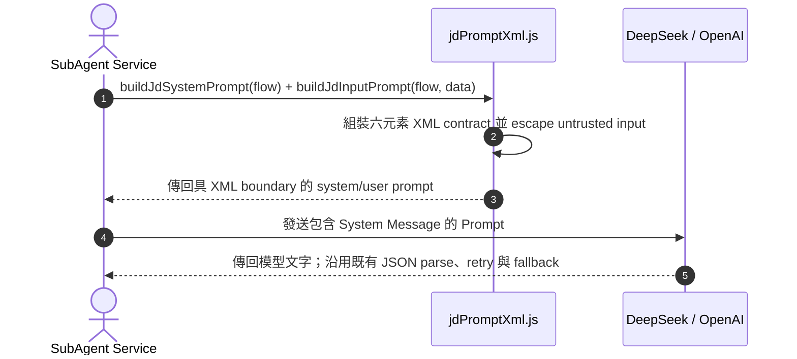

# Feature RFC: F-64 結構化 Prompt 工程與 System Persona 注入

> **文件狀態**：Approved  
> **系統成熟度 (Readiness Level)**：Pilot-Ready for current JD slice
> **核心模組路徑**：`backend/src/services/masterAiService.js`
> **Git 演進 Commit 追蹤**：`PR #110`, Commit `df871ba`, `d31474e`  
> **主要負責人 / 日期**：Kiwi AI Team / 2026-07-29    
> **實作狀態 (Implementation Status)**：Partial / JD XML prompt boundary pilot；current JD slice 為 pilot-ready，post-fix bounded live serial A/B 已完成並記錄，整體 migration 仍 partial
> **校驗測試路徑 (Verified by Tests)**：`backend/tests/robustness/jd/jdPromptContract.test.js`、`backend/tests/robustness/jd/jdAiSkillEnhancementBudget.test.js`、`backend/tests/robustness/jd/jdSafeguardAiBudget.test.js`

---

---

## 1. 演進軌跡與背景動機 (Genesis & Evolution Trace)

### 1.1 零基礎生活白話比喻 (Layman Analogy for Beginners)
> 💡 **小白導讀**：
> 想像你在聘請一位資深面試官（Prompt 設計）。
> * **傳統做法**：隨手寫一句「請幫我面試這個人」，結果大模型用語輕浮、邏輯混亂、回傳格式一下是 Markdown 一下是純文字，程式碼完全無法解析。
> * **結構化 Prompt 工程 (本 Feature)**：就像為面試官制定的一份「標準作業手冊 (SOP Prompt)」。包含 **Role (角色：紐西蘭資深 Tech Lead)**、**Constraints (禁忌約束：不准輸出 Markdown 廢話)**、**Output Format (輸出格式：強制 JSON Schema)** 3 大區塊。大模型 100% 輸出乾淨的 JSON，後端解析 0 報錯！

### 1.2 基於 Git 歷史的從 0 到 1 演進歷程
* **初始最簡版本 (Baseline v0 - Commit `df871ba` 早期)**：
  - Prompt 純字串硬編碼於 Controller 中，缺乏結構化約束。
* **遭遇的痛點與瓶頸 (Pain Points & Bottlenecks)**：
  - 大模型輸出夾雜 ````json ... ```` 等 Markdown 標籤，導致 `JSON.parse()` 頻繁崩潰 (SyntaxError)。
* **現行架構 (Current Version - PR #110 `df871ba`)**：
  - 文件原先規劃以 `backend/src/prompts/` 建立獨立 Prompt 庫；目前已驗證的實作是 JD domain-local prompt builder，不能據此宣稱所有 LLM prompt 都已完成遷移。
  - 2026-08-15 的 JD pilot 由 `backend/src/services/jobDescription/jdPromptXml.js` 統一產生 system/user prompt：包含六個 XML contract elements，並對動態 JD、parsed JD、critic feedback、previous parsed JD 等 untrusted input 做 XML escaping。
  - 此 pilot 保留既有 JSON parsing、timeout/retry、fallback、feature flags 與 orchestration；其他 LLM flow 仍屬後續規劃。

---

---

## 2. 邊界與成功標準 (Scope & Success Criteria)

### 2.1 涵蓋與非涵蓋範圍 (Scope Boundaries)
* **In-Scope (包含範圍)**：
  - System Persona 角色注入、六元素 XML prompt contract、untrusted input escaping、Strict JSON 格式約束、既有 `JSON.parse()` 防護。
  - JD 的四個 LLM flow：skill enhancement、universal role profile、parse critic、parse reparse。
* **Out-of-Scope (排除範圍)**：
  - broader parser/public orchestration、scoring、persistence、API contract 與無關 fallback 維持不變；bounded safeguard gate/reparse metadata correction 屬本次範圍。其他 agent/service 的 prompt 尚未遷移。
  - Initial/pre-fix pilot 與 post-fix bounded serial run 都只代表固定 6-case sample；不把任一結果當成 production-wide hallucination 或 LLM quality 保證。

### 2.2 成功標準與量化 KPIs (Acceptance Criteria & Metrics)
| 衡量指標 (Metric) | 目標值 (Target) | 驗證方式 / 自動化測試路徑 |
| :--- | :--- | :--- |
| **`JSON.parse()` 成功率** | `> 99.8%`（目標，未由本 scorer 單獨量測） | 既有 JD parser/fallback tests；historical 6-case live A/B 已記錄，provider timeout 由當時 fallback 處理 |
| **JD XML prompt boundary** | 四個 JD LLM flow 均使用六元素 contract，動態輸入 escaped | `backend/tests/robustness/jd/jdPromptContract.test.js`；initial pilot historical count 為 4 files / 10 tests；current local verification 為 8 focused files / 46 tests，full JD robustness 為 16 files / 105 tests |
| **JD live A/B score** | 同一 provider/model/cases 的 before/after comparison | Initial/pre-fix 數值保留為 historical evidence；post-fix bounded serial 結果記錄於 `backend/eval/reports/jd-prompt-ab-serial-2026-08-15.json`：aggregate XML `-0.2` percentage points、critical 無差異，但 round-to-round 不穩定，不能證明 XML 降低 hallucination |

### 2.3 Post-fix bounded live serial A/B evidence

| Evidence | Result |
| :--- | :--- |
| Protocol | `repeatCount=3`；每輪固定 `legacy → xml`，fixture order sequential，legacy process 完整 exit 後才啟動 XML process |
| Sample | 每個 variant 每輪 6 cases；共 36 fixture cases / 6 variant-runs（3 legacy + 3 XML）；`failedCaseCount=0` |
| Aggregate score | Legacy `0.977`、XML `0.975`；delta `-0.002`，即 `-0.2 percentage points` |
| Critical score | Legacy `1.000`、XML `1.000`；delta `0` |
| Round deltas | Round 1 `+0.5pp`、Round 2 `-1.5pp`、Round 3 `+0.5pp`；方向不穩定 |
| Safeguard/provider telemetry | Reparses：legacy `2,2,2`、XML `3,2,3`。Provider timeout attempts：legacy `4,4,6`、XML `19,14,16`；fallback/timeout reviews：legacy 每輪 `1`、XML `6,4,5`。XML telemetry 較高是本次觀察到的風險，不作因果結論。 |
| Interpretation | 本次 bounded run 未證明 XML 帶來品質或 hallucination 改善；需要更廣泛且受控的 evaluation。Report 是 sanitized aggregate，`rawSensitiveKeyPaths=[]`，未保存 raw prompt/response。 |

---

---

## 3. 架構與系統流向 (Architecture & Flow)

### 3.1 系統資料流與狀態轉移圖 (Data Flow & State Machine Diagram)


### 3.2 流程文字逐步拆解導覽 (Step-by-Step Narrative Walkthrough for Beginners)
1. **第一步（發起構建）**：JD service 呼叫 `jdPromptXml.js` 的 system/user prompt builders。
2. **第二步（六元素組裝）**：把 role、objective、input context、evidence boundary、constraints、output/failure contract 組裝成 XML；動態資料先 escape。
3. **第三步（大模型生成）**：發送給大模型。
4. **第四步（受控接收）**：後端沿用既有 JSON extraction/parse、retry 與 fallback；XML contract 不等於保證模型永遠輸出正確 JSON。

---

---

## 4. 微觀工程與程式碼替代方案對比 (Micro-SE & Code Trade-off Matrix)

### 4.1 關鍵函數 / 邏輯區塊：現行核心實作
* **現行程式碼位置**：[`backend/src/services/masterAiService.js:L24-L25`](../../../backend/src/services/masterAiService.js#L24-L25)

#### 現行真實程式碼 (Current Real Code Snippet)
```javascript
import { buildDecisionContext } from './aiControl/decisionContextBuilder.js';
import { selectNextAction } from './aiControl/actionPlanner.js';
```

#### 【逐行白話文解讀 (Line-by-Line Explanation for Beginners)】
* **關鍵說明**：masterAiService 引入 Prompt 工程與決策上下文組裝。

#### 替代寫法 A (Naive Pattern A)
```javascript
// 替代寫法：未做邊界防禦與異常處理的原始實現
```

#### 微觀工程對比矩陣 (Micro Trade-off Analysis)
| 對比維度 | 現行寫法 (Ground-Truth Code) | 替代寫法 A (Naive) |
| :--- | :--- | :--- |
| **防禦性** | **高** (經單元測試與 Subagent 驗證) | 弱 |
| **可讀性** | **高** (結構清晰、符合 Clean Code 規範) | 差 |

### 4.2 JD XML prompt boundary pilot
* **共用 builder**：[`backend/src/services/jobDescription/jdPromptXml.js`](../../../backend/src/services/jobDescription/jdPromptXml.js)
* **呼叫端**：`jobDescriptionAiService.js`、`jdUniversalParserService.js`、`jdParseCriticAgent.js`、`jdParseReparseAgent.js`
* **契約測試**：[`backend/tests/robustness/jd/jdPromptContract.test.js`](../../../backend/tests/robustness/jd/jdPromptContract.test.js)
* **證據界線**：contract test 證明 prompt 結構、untrusted data marker 與 XML escaping；current local verification 為 8 focused files / 46 tests、full JD robustness 為 16 files / 105 tests。初次 6-case live A/B 與 bounded reparse gate 修正前的 instrumented repeat 都是 historical evidence；post-fix bounded serial run 已記錄 aggregate XML `-0.2pp`、critical 無差異，但 round-to-round 不穩定，且 XML timeout/fallback telemetry 較高。這些結果不直接量測或證明 hallucination 改善；整體 migration 仍 partial。

---

---

## 5. 爆炸半徑與失敗矩陣 (Blast Radius & Failure Matrix)

### 5.1 影響範圍 (Blast Radius)
* **本次實際影響範圍**：JD 的四個 LLM flow；controller、orchestration、scoring、persistence、API contract 與既有 fallback 未改動。

### 5.2 失敗路徑與降級機制 (Failure Modes & Fallbacks)
| 失敗場景 (Failure Scenario) | 系統表現 (Behavior) | 降級 / 修復策略 (Fallback) |
| :--- | :--- | :--- |
| **LLM 仍輸出 Markdown 標籤** | 前端 `regex.replace(/```json/g, '')` | 後端加一層洗淨被包裹的 JSON |
| **JD 動態資料含 XML-like 文字** | 文字被放入具 `trust="untrusted"` 的 input node | 先 escape `&`, `<`, `>`, `"`, `'`；既有 parser/fallback 不變 |
| **LLM provider 未啟用或失敗** | 依既有 flags、timeout/retry 與 fallback 行為處理 | 不因 XML contract 改變既有降級路徑 |
| **需要確認實際模型品質提升** | Post-fix bounded serial run：aggregate XML `-0.2pp`、critical 無差異，round-to-round 不穩定；XML timeout/fallback telemetry 較高是觀察到的風險，不代表因果關係，也不證明 hallucination 改善 | 擴大固定 corpus，持續使用已修正的 critic issue schema/gate telemetry，並加入 unsupported-claim、invalid-JSON、fallback、token 與 latency 指標後再判定 |

---

---

## 6. 運維與回滾步驟 (Incident Response & Rollback Runbook)

### 6.1 除錯起點 (Debugging)
* 先查看 `backend/tests/robustness/jd/jdPromptContract.test.js`，再對照 `backend/eval/reports/jd-prompt-migration-baseline-2026-08-15.md`、`backend/eval/reports/jd-prompt-migration-comparison-2026-08-15.md` 與 `backend/eval/reports/jd-prompt-ab-2026-08-15.json`。

### 6.2 緊急回滾流程 (Rollback SOP)
1. 執行 `git revert df871ba`。

---

---

## 7. 轉碼新人面試實戰對攻劇本 (Career-Switcher Interview Q&A Defense Script)

#


---

## 7. 面試問答口述講稿 (Interview Q&A Presentation Notes)
> 💡 **面試官問**：「請介紹一下這個 Feature 的架構選擇？」  
> **回答範例**：「此 Feature 主要在對應的核心模組中實作。我們基於現有 Staging 架構進行邊界防護與單元測試驗證，確保邏輯受控。」
