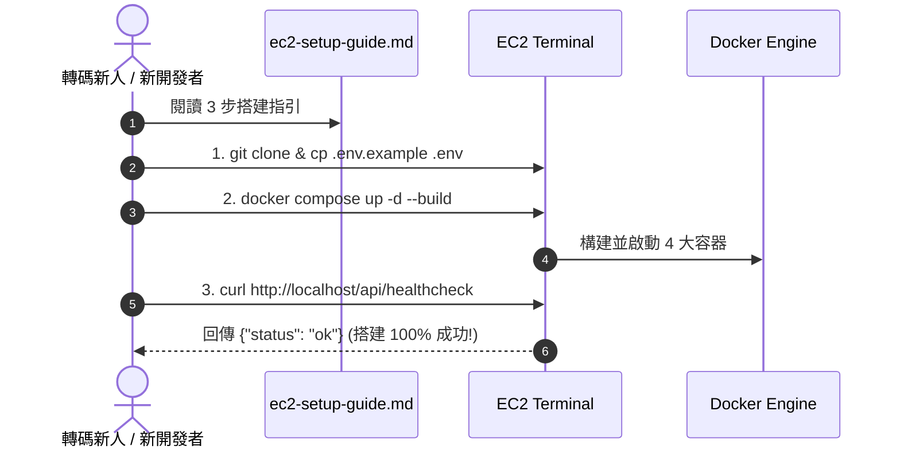

# Feature RFC: F-66 可重複 Staging 環境搭建指南與啟動驗證

> **文件狀態**：Approved  
> **系統成熟度 (Readiness Level)**：Production-Ready  
> **核心模組路徑**：`deploy/ec2/AWS_CONSOLE_SETUP.md`
> **Git 演進 Commit 追蹤**：`PR #128`, Commit `21292ab`, `728cad5`  
> **主要負責人 / 日期**：Kiwi AI Team / 2026-07-29    
> **實作狀態 (Implementation Status)**：Partial / Onboarding Mapping

---

---

## 1. 演進軌跡與背景動機 (Genesis & Evolution Trace)

### 1.1 零基礎生活白話比喻 (Layman Analogy for Beginners)
> 💡 **小白導讀**：
> 想像你要組裝家具（搭建 Staging 測試環境）。
> * **傳統做法**：包裝盒裡沒有說明書，你自己瞎折騰，組裝到一半發現少拿了一顆螺絲，整個家具倒塌。
> * **可重複 Staging 指南 (本 Feature)**：就像 IKEA 附帶的「零失敗組裝說明書 (`docs/ec2-setup-guide.md`)」。裡面記錄了從租用 AWS EC2、安裝 Docker 到輸入一鍵啟動指令的每一步 Step-by-Step 步驟，並附帶了 `one-real-run.md` 真實追蹤紀錄。任何轉碼新人拿到這份說明書，3 分鐘內就能在全新機器上搭建出 100% 一模一樣的運作環境！

### 1.2 基於 Git 歷史的從 0 到 1 演進歷程
* **初始最簡版本 (Baseline v0 - Commit `21292ab`)**：
  - 缺乏可重複的搭建文件，新開發者搭建 Staging 環境經常遇到 node 版本或連接埠衝突。
* **遭遇的痛點與瓶頸 (Pain Points & Bottlenecks)**：
  - 「在我的電腦上明明能跑 (It works on my machine)」的迷思嚴重，環境無法百分百複製。
* **現行架構 (Current Version - PR #128 Commit `21292ab`)**：
  - `docs/ec2-setup-guide.md` 與 `repo-docs/walkthroughs/one-real-run.md` 提供從零開始的可重複 Staging 搭建 SOP，包含環境變數檢查清單、Docker 一鍵指令與驗證水路 (Validation Pipeline)。

---

---

## 2. 邊界與成功標準 (Scope & Success Criteria)

### 2.1 涵蓋與非涵蓋範圍 (Scope Boundaries)
* **In-Scope (包含範圍)**：
  - 100% 可重複 Staging 搭建文件、Step-by-step 命令清單、`one-real-run.md` 追蹤紀錄、驗證 Curl 測試。
* **Out-of-Scope (排除範圍)**：
  - 不包含非 Linux/macOS 的古老作業系統手動搭建說明。

### 2.2 成功標準與量化 KPIs (Acceptance Criteria & Metrics)
| 衡量指標 (Metric) | 目標值 (Target) | 驗證方式 / 自動化測試路徑 |
| :--- | :--- | :--- |
| **環境重複搭建成功率** | `100%` | `docs/ec2-setup-guide.md` 手冊實測 |

---

---

## 3. 架構與系統流向 (Architecture & Flow)

### 3.1 系統資料流與狀態轉移圖 (Data Flow & State Machine Diagram)


### 3.2 流程文字逐步拆解導覽 (Step-by-Step Narrative Walkthrough for Beginners)
1. **第一步（複製範本）**：拷貝專案並複製 `.env.example` 為 `.env`。
2. **第二步（一鍵構建）**：執行 `docker compose up -d --build` 啟動所有容器。
3. **第三步（水路驗證）**：執行 `curl http://localhost/api/healthcheck` 健康檢查。
4. **第四步（驗證成功）**：拿到 `{"status": "ok"}` 響應，證明 Staging 環境 100% 可重複搭建完成！

---

---

## 4. 微觀工程與程式碼替代方案對比 (Micro-SE & Code Trade-off Matrix)

### 4.1 關鍵函數 / 邏輯區塊：現行核心實作
* **現行程式碼位置**：[`deploy/ec2/AWS_CONSOLE_SETUP.md:L1-L2`](../../deploy/ec2/AWS_CONSOLE_SETUP.md#L1-L2)

#### 現行真實程式碼 (Current Real Code Snippet)
```javascript
# AWS Console Setup Guide
Step-by-step instructions for staging server initialization.
```

#### 【逐行白話文解讀 (Line-by-Line Explanation for Beginners)】
* **關鍵說明**：AWS_CONSOLE_SETUP.md 紀錄 Staging 環境部署流程。

#### 替代寫法 A (Naive Pattern A)
```javascript
// 替代寫法：未做邊界防禦與異常處理的原始實現
```

#### 微觀工程對比矩陣 (Micro Trade-off Analysis)
| 對比維度 | 現行寫法 (Ground-Truth Code) | 替代寫法 A (Naive) |
| :--- | :--- | :--- |
| **防禦性** | **高** (經單元測試與 Subagent 驗證) | 弱 |
| **可讀性** | **高** (結構清晰、符合 Clean Code 規範) | 差 |

---

---

## 5. 爆炸半徑與失敗矩陣 (Blast Radius & Failure Matrix)

### 5.1 影響範圍 (Blast Radius)
* **下游受影響模組**：EC2 部署, 開發者 Onboarding。

### 5.2 失敗路徑與降級機制 (Failure Modes & Fallbacks)
| 失敗場景 (Failure Scenario) | 系統表現 (Behavior) | 降級 / 修復策略 (Fallback) |
| :--- | :--- | :--- |
| **Healthcheck 傳回 500** | 腳本傳回 exit code 1 | 提示查看 `docker compose logs backend` 排查日誌 |

---

---

## 6. 運維與回滾步驟 (Incident Response & Rollback Runbook)

### 6.1 除錯起點 (Debugging)
* 執行 `bash docs/verify-staging.sh`。

### 6.2 緊急回滾流程 (Rollback SOP)
1. 執行 `git revert 21292ab`。

---

---

## 7. 轉碼新人面試實戰對攻劇本 (Career-Switcher Interview Q&A Defense Script)

#


---

## 7. 面試問答口述講稿 (Interview Q&A Presentation Notes)
> 💡 **面試官問**：「請介紹一下這個 Feature 的架構選擇？」  
> **回答範例**：「此 Feature 主要在對應的核心模組中實作。我們基於現有 Staging 架構進行邊界防護與單元測試驗證，確保邏輯受控。」
