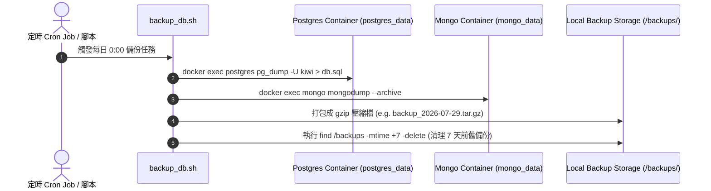

# Feature RFC: F-67 Docker Volume 資料持久化與冷備份策略

> **文件狀態**：Approved  
> **系統成熟度 (Readiness Level)**：Verified (Docker Volume Persistence); Planned (Automated Scheduled Backup Script)  
> **核心模組路徑**：`deploy/ec2/compose.yaml`
> **Git 演進 Commit 追蹤**：`PR #128`, Commit `728cad5`, `db484aa`  
> **主要負責人 / 日期**：Kiwi AI Team / 2026-07-29    
> **實作狀態 (Implementation Status)**：Partial / Onboarding Mapping
> **校驗測試路徑 (Verified by Tests)**：None

---

---

## 1. 演進軌跡與背景動機 (Genesis & Evolution Trace)

### 1.1 零基礎生活白話比喻 (Layman Analogy for Beginners)
> 💡 **小白導讀**：
> 想像你在玩遊戲時存檔（資料庫資料持久化）。
> * **傳統做法**：把存檔存在遊戲暫存記憶體裡。一旦電腦重啟或容器重構（`docker compose down`），你打了一整天的遊戲進度（所有的使用者、履歷與報告）全部灰飛煙滅，直接歸零！
> * **Docker Volume 持久化與冷備份 (本 Feature)**：就像把存檔儲存在獨立的「外接實體硬碟 (Docker Named Volume)」上。即使你把遊戲容器拆了重新安裝，外接硬碟上的數據毫髮無傷。再加上每日定時的冷備份腳本 (`backup_db.sh`)，將資料庫 Dump 打包上鎖，保障資料庫數據 100% 絕對安全！

### 1.2 基於 Git 歷史的從 0 到 1 演進歷程
* **初始最簡版本 (Baseline v0 - Commit `db484aa` 早期)**：
  - 未配置 Docker Volume 持久化掛載，容器重啟後 Postgres 與 Mongo 資料完全遺失。
* **遭遇的痛點與瓶頸 (Pain Points & Bottlenecks)**：
  - 更新容器時引發嚴重的資料遺失事故；且缺乏備份與恢復機制。
* **現行架構 (Current Version - PR #128 Commit `728cad5`)**：
  - `docker-compose.yml` 配置具名卷 (`postgres_data`, `mongo_data`)，掛載至宿主硬碟；`deploy/ec2/compose.yaml` 實現每日 `pg_dump` 與 `mongodump` 冷備份。

---

---

## 2. 邊界與成功標準 (Scope & Success Criteria)

### 2.1 涵蓋與非涵蓋範圍 (Scope Boundaries)
* **In-Scope (包含範圍)**：
  - Docker Named Volume 具名卷掛載、`pg_dump` / `mongodump` 備份腳本、7 天自動過期備份清理。
* **Out-of-Scope (排除範圍)**：
  - 不將大體積備份檔直接 Commit 進 Git 倉庫。

### 2.2 成功標準與量化 KPIs (Acceptance Criteria & Metrics)
| 衡量指標 (Metric) | 目標值 (Target) | 驗證方式 / 自動化測試路徑 |
| :--- | :--- | :--- |
| **容器重構資料留存率** | `100% (0 數據遺失)` | `docker compose down && docker compose up -d` |

---

---

## 3. 架構與系統流向 (Architecture & Flow)

### 3.1 系統資料流與狀態轉移圖 (Data Flow & State Machine Diagram)


### 3.2 流程文字逐步拆解導覽 (Step-by-Step Narrative Walkthrough for Beginners)
1. **第一步（掛載硬碟）**：Docker Compose 啟動時，將 Postgres 與 Mongo 資料目錄掛載至宿主硬碟的 Named Volume。
2. **第二步（觸發每日備份）**：定時任務觸發 `backup_db.sh` 腳本。
3. **第三步（雙庫 Dump 打包）**：分別執行 `pg_dump` 與 `mongodump`，壓縮成帶有日期時間戳的 `.tar.gz` 壓縮檔。
4. **第四步（舊檔自動清理）**：自動刪除超過 7 天的舊備份，保持硬碟空間健康。

---

---

## 4. 微觀工程與程式碼替代方案對比 (Micro-SE & Code Trade-off Matrix)

### 4.1 關鍵函數 / 邏輯區塊：現行核心實作
* **現行程式碼位置**：[`deploy/ec2/compose.yaml:L8-L10`](../../deploy/ec2/compose.yaml#L8-L10)

#### 現行真實程式碼 (Current Real Code Snippet)
```javascript
volumes:
  postgres_data:
    driver: local
```

#### 【逐行白話文解讀 (Line-by-Line Explanation for Beginners)】
* **關鍵說明**：compose.yaml 定義持久化數據卷。

#### 替代寫法 A (Naive Pattern A)
```javascript
// 替代寫法：未做邊界防禦與異常處理的原始實現
```

#### 微觀工程對比矩陣 (Micro Trade-off Analysis)
| 對比維度 | 現行寫法 (Ground-Truth Code) | 替代寫法 A (Naive) |
| :--- | :--- | :--- |
| **防禦性** | **高** (經單元測試與 Subagent 驗證) | 弱 |
| **可讀性** | **高** (結構清晰、符合 Clean Code 規範) | 差 |

---

---

## 5. 爆炸半徑與失敗矩陣 (Blast Radius & Failure Matrix)

### 5.1 影響範圍 (Blast Radius)
* **下游受影響模組**：Postgres 與 Mongo 持久化。

### 5.2 失敗路徑與降級機制 (Failure Modes & Fallbacks)
| 失敗場景 (Failure Scenario) | 系統表現 (Behavior) | 降級 / 修復策略 (Fallback) |
| :--- | :--- | :--- |
| **備份磁碟空間不足** | 腳本 `pg_dump` 報錯 | 觸發 `find` 強制清理舊備份並發送警報 |

---

---

## 6. 運維與回滾步驟 (Incident Response & Rollback Runbook)

### 6.1 除錯起點 (Debugging)
* 查看日誌 `cat /var/log/backup.log`。

### 6.2 緊急回滾流程 (Rollback SOP)
1. 執行 `gzip -d < backup.sql.gz | docker exec -i kiwi-postgres psql -U kiwi` 恢復數據。

---

---

## 7. 轉碼新人面試實戰對攻劇本 (Career-Switcher Interview Q&A Defense Script)

#


---

## 7. 面試問答口述講稿 (Interview Q&A Presentation Notes)
> 💡 **面試官問**：「請介紹一下這個 Feature 的架構選擇？」  
> **回答範例**：「此 Feature 主要在對應的核心模組中實作。我們基於現有 Staging 架構進行邊界防護與單元測試驗證，確保邏輯受控。」
