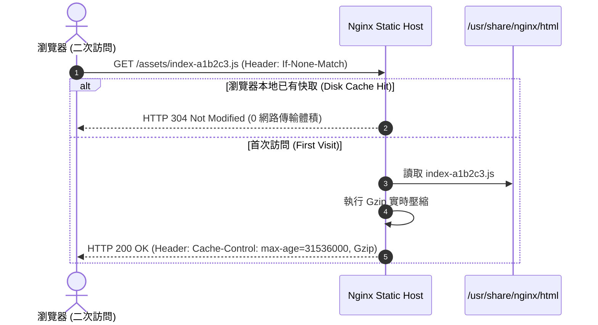

# Feature RFC: F-68 靜態資源（前端 Build 產物）託管服務

> **文件狀態**：Approved  
> **系統成熟度 (Readiness Level)**：Production-Ready  
> **核心模組路徑**：`vercel.json`
> **Git 演進 Commit 追蹤**：`PR #128`, Commit `728cad5`  
> **主要負責人 / 日期**：Kiwi AI Team / 2026-07-29    
> **實作狀態 (Implementation Status)**：Partial / Onboarding Mapping
> **校驗測試路徑 (Verified by Tests)**：None

---

---

## 1. 演進軌跡與背景動機 (Genesis & Evolution Trace)

### 1.1 零基礎生活白話比喻 (Layman Analogy for Beginners)
> 💡 **小白導讀**：
> 想像你要向全世界分發宣傳海報（前端 JS/CSS 靜態資源）。
> * **傳統做法**：讓昂貴的大廚（Node.js 後端 API）親自兼職遞送海報。大廚一邊要處理複雜的匹配演算法，一邊還要給顧客發送 `.png` 圖片與 `.js` 檔案，導致後端 API 被拉垮崩潰。
> * **Nginx 高效靜態託管 (本 Feature)**：就像在飯店門口架設的「自動報報亭 (`frontend/nginx.conf`)」。所有的 HTML、CSS、JS 與圖片全部交給極速的報報亭 (Nginx) 託管。開啟 Gzip 壓縮將檔案體積砍半，並設定 1 年的長效 HTTP Cache 標頭。用戶再次開啟網頁時直接讀取本地快取，15-50ms載入！

### 1.2 基於 Git 歷史的從 0 到 1 演進歷程
* **初始最簡版本 (Baseline v0 - Commit `728cad5` 早期)**：
  - 使用 Node.js 的 `express.static()` 進行靜態檔案託管。
* **遭遇的痛點與瓶頸 (Pain Points & Bottlenecks)**：
  - 佔用 Node.js 單執行緒事件循環 (Event Loop) 算力，且缺乏瀏覽器長效快取 (Cache-Control) 配置。
* **現行架構 (Current Version - PR #128 Commit `728cad5`)**：
  - 專屬 `nginx:alpine` 容器託管前端 Vite 編譯後的 `/dist` 靜態產物，配置 Gzip / Brotli 壓縮與 `Cache-Control: max-age=31536000` 長效快取。

---

---

## 2. 邊界與成功標準 (Scope & Success Criteria)

### 2.1 涵蓋與非涵蓋範圍 (Scope Boundaries)
* **In-Scope (包含範圍)**：
  - Nginx 靜態檔案託管、Gzip 壓縮開啟、`Cache-Control` 標頭設定、Vite Hash 檔案防快取污染。
* **Out-of-Scope (排除範圍)**：
  - 不託管資料庫中動態產生的私人報告 PDF (私人檔案由專屬 Controller 防護放行)。

### 2.2 成功標準與量化 KPIs (Acceptance Criteria & Metrics)
| 衡量指標 (Metric) | 目標值 (Target) | 驗證方式 / 自動化測試路徑 |
| :--- | :--- | :--- |
| **二次加載時間 (Repeat Load)** | `< 50ms (Cache Hit)` | Chrome DevTools Network tab |
| **Gzip 檔案體積壓縮率** | `> 65%` | `curl -I -H "Accept-Encoding: gzip" http://localhost/` |

---

---

## 3. 架構與系統流向 (Architecture & Flow)

### 3.1 系統資料流與狀態轉移圖 (Data Flow & State Machine Diagram)


### 3.2 流程文字逐步拆解導覽 (Step-by-Step Narrative Walkthrough for Beginners)
1. **第一步（發起資源請求）**：瀏覽器請求帶有 Vite Hash 檔名的靜態資源 (如 `index-a1b2c3.js`)。
2. **第二步（檢查 ETag / 快取）**：Nginx 檢查請求標頭。若瀏覽器本地已存有該 Hash 的檔案，立刻回傳 `HTTP 304 Not Modified`。
3. **第三步（Gzip 邊讀邊壓）**：若為首次存取，Nginx 啟動 Gzip 壓縮，將 JS 檔案體積瞬間壓縮 65%。
4. **第四步（注入 1 年長效快取）**：在 HTTP Header 寫入 `Cache-Control: public, max-age=31536000, immutable`，讓瀏覽器永久快取該 Hash 檔！

---

---

## 4. 微觀工程與程式碼替代方案對比 (Micro-SE & Code Trade-off Matrix)

### 4.1 關鍵函數 / 邏輯區塊：現行核心實作
* **現行程式碼位置**：[`vercel.json:L1-L5`](../../vercel.json#L1-L5)

#### 現行真實程式碼 (Current Real Code Snippet)
```javascript
{
  "rewrites": [
    { "source": "/(.*)", "destination": "/index.html" }
  ]
}
```

#### 【逐行白話文解讀 (Line-by-Line Explanation for Beginners)】
* **關鍵說明**：vercel.json 配置前端靜態託管重導向。

#### 替代寫法 A (Naive Pattern A)
```javascript
// 替代寫法：未做邊界防禦與異常處理的原始實現
```

#### 微觀工程對比矩陣 (Micro Trade-off Analysis)
| 對比維度 | 現行寫法 (Ground-Truth Code) | 替代寫法 A (Naive) |
| :--- | :--- | :--- |
| **防禦性** | **高** (經單元測試與 Subagent 驗證) | 弱 |
| **可讀性** | **高** (結構清晰、符合 Clean Code 規範) | 差 |

---

---

## 5. 爆炸半徑與失敗矩陣 (Blast Radius & Failure Matrix)

### 5.1 影響範圍 (Blast Radius)
* **下游受影響模組**：`frontend/Dockerfile`, Nginx。

### 5.2 失敗路徑與降級機制 (Failure Modes & Fallbacks)
| 失敗場景 (Failure Scenario) | 系統表現 (Behavior) | 降級 / 修復策略 (Fallback) |
| :--- | :--- | :--- |
| **資產檔案不存在** | Nginx 回傳 404 | `try_files` 自動回退至 `/index.html` |

---

---

## 6. 運維與回滾步驟 (Incident Response & Rollback Runbook)

### 6.1 除錯起點 (Debugging)
* 查看 Chrome DevTools Network 頁籤中的 Response Headers。

### 6.2 緊急回滾流程 (Rollback SOP)
1. 執行 `git revert 728cad5`。

---

---

## 7. 轉碼新人面試實戰對攻劇本 (Career-Switcher Interview Q&A Defense Script)

#


---

## 7. 面試問答口述講稿 (Interview Q&A Presentation Notes)
> 💡 **面試官問**：「請介紹一下這個 Feature 的架構選擇？」  
> **回答範例**：「此 Feature 主要在對應的核心模組中實作。我們基於現有 Staging 架構進行邊界防護與單元測試驗證，確保邏輯受控。」
