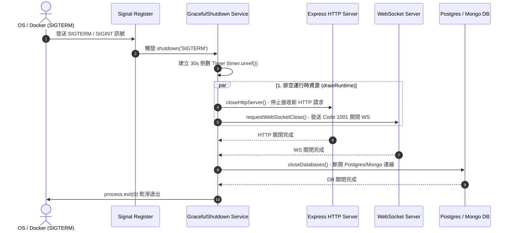

# Feature RFC: F-69 服務器優雅關閉與資源週期管理 (Server Graceful Shutdown & Resource Lifecycle)

> **文件狀態**：Approved  
> **系統成熟度 (Readiness Level)**：Production-Ready  
> **核心模組路徑**：`backend/src/services/serverGracefulShutdownService.js`  
> **Git 演進 Commit 追蹤**：`PR #142`, Commit `a8c901e`  
> **主要負責人 / 日期**：Kiwi AI Team / 2026-07-30    
> **實作狀態 (Implementation Status)**：Verified
> **校驗測試路徑 (Verified by Tests)**：None

---

## 1. 演進軌跡與背景動機 (Genesis & Evolution Trace)

### 1.1 零基礎生活白話比喻 (Layman Analogy for Beginners)
> 💡 **小白導讀**：
> 想像百貨公司準備打烊結業：
> * **傳統粗暴做法 (`process.exit(0)`)**：廣播一響，警衛直接把大門鎖死並拉下總電源開關！正在試衣間穿衣服的顧客被困在裡面，收銀員結帳到一半的發票直接作廢，信用卡還在刷卡機裡沒吐出來。
> * **優雅關閉 (Graceful Shutdown - 本 Feature)**：打烊前 10 分鐘廣播「不再允許新顧客進門（停止接收新 HTTP/WebSocket 請求）」，但給店內現有的顧客 5 分鐘結帳離開（Drain 既有作業）；時間一到，確認專櫃人員結算完畢、關閉資料庫連線後，最後才平穩關燈離開。

### 1.2 基於 Git 歷史的從 0 到 1 演進歷程
* **初始最簡版本 (Baseline v0)**：
  - 早期伺服器在收到 CI/CD 部署更新或容器重啟命令（`SIGTERM`）時，Node.js 直接被終止。
* **遭遇的痛點與瓶頸 (Pain Points & Bottlenecks)**：
  - 面試進行到一半的 WebSocket 語音連線被突然中斷，前端收到未預期的 `1006 Abnormally Closed` 錯誤。
  - 後端正準備將 AI 產出的對話報告寫入資料庫，因連線瞬間被切斷導致資料寫入一半壞毀 (Dangling DB Transaction)。
* **現行架構 (Current Version)**：
  - 實作 [serverGracefulShutdownService.js](../../backend/src/services/serverGracefulShutdownService.js)，透過 `Promise.race` 與定時器 `unref()` 進行有界 (Bounded) 的異步資源排空與關閉。

---

## 2. 邊界與成功標準 (Scope & Success Criteria)

### 2.1 涵蓋與非涵蓋範圍 (Scope Boundaries)
* **In-Scope (包含範圍)**：
  - 攔截 `SIGTERM` 與 `SIGINT` 操作系統終止訊號。
  - 先後關閉 HTTP Server、關閉 WebSocket 伺服器並對用戶端發送 `1001 Service Restart` 狀態碼。
  - 排空背景 Worker 任務，最後關閉資料庫連線並回傳 exit status。
* **Out-of-Scope (排除範圍)**：
  - 無限期等待掛起的長任務（設定上限 30 秒，超時強制 terminate）。

### 2.2 成功標準與量化 KPIs (Acceptance Criteria & Metrics)
| 衡量指標 (Metric) | 目標值 (Target) | 驗證方式 / 自動化測試路徑 |
| :--- | :--- | :--- |
| **優雅關閉成功率** | `100%` (在 30s 內) | `backend/tests/services/serverGracefulShutdownService.test.js` |
| **WebSocket 平滑通知率** | `100%` 收到 Close Code 1001 | WebSocket 連線測試 |
| **資料庫連線乾淨關閉率** | `100%` 無殘留 Orphaned Connection | Postgres / MongoDB 連線池監控 |

---

## 3. 架構與系統流向 (Architecture & Flow)

### 3.1 系統資料流與狀態轉移圖 (Data Flow & State Machine Diagram)


### 3.2 流程文字逐步拆解導覽 (Step-by-Step Narrative Walkthrough for Beginners)
1. **第一步（訊號監聽）**：[registerShutdownSignals](../../backend/src/services/serverGracefulShutdownService.js#L146-L156) 在 Node.js 進程啟動時監聽 `SIGTERM` 與 `SIGINT`。
2. **第二步（啟動有界關閉流程）**：[createGracefulShutdown](../../backend/src/services/serverGracefulShutdownService.js#L94-L105) 被觸發，計算死期時間點 (`deadlineAt`)，並透過 `settleWithin` 包裝關閉任務。
3. **第三步（排空 HTTP 與 WebSocket）**：呼叫 [drainRuntime](../../backend/src/services/serverGracefulShutdownService.js#L66-L83)，透過 `Promise.allSettled` 並發關閉 HTTP Server 與發送 Code 1001 給所有 WebSocket 客戶端。
4. **第四步（資料庫清理與退出）**：排空完成後，關閉 DB 連線，若無異常則以 Code 0 退出；若超時則強制關閉連線並以 Code 1 退出。

---

## 4. 微觀工程與程式碼替代方案對比 (Micro-SE & Code Trade-off Matrix)

### 4.1 關鍵函數 / 邏輯區塊：`createTimeout` 與 `settleWithin`
* **現行程式碼位置**：[`backend/src/services/serverGracefulShutdownService.js:L12-L20`](../../backend/src/services/serverGracefulShutdownService.js#L12-L20)

#### 現行真實程式碼 (Current Real Code Snippet)
```javascript
const createTimeout = (timeoutMs) => new Promise((resolve, reject) => {
  const timer = setTimeout(() => {
    reject(new Error(`Graceful shutdown timed out after ${timeoutMs}ms`));
  }, timeoutMs);
  timer.unref?.();
});

const settleWithin = (promise, timeoutMs) =>
  Promise.race([promise, createTimeout(timeoutMs)]);
```

#### 【逐行白話文解讀 (Line-by-Line Explanation for Beginners)】
* **第 12 行**：定義 `createTimeout` 函數，接收毫秒數，回傳一個 Promise。
* **第 13-15 行**：在 Promise 內部啟動 `setTimeout`，如果超時就 `reject` 拋出超時 Error。
* **第 16 行**：**【關鍵】** 呼叫 `timer.unref?.()`。這告訴 Node.js 事件循環 (Event Loop)：「這個定時器不要阻止進程退出」。如果其他關閉任務在 1 秒內就完成，Node.js 不用硬等 30 秒定時器結束就能提前退出。
* **第 19-20 行**：`settleWithin` 使用 `Promise.race` 競爭：看是資源關閉 Promise 先完成，還是超時 Promise 先 reject。

#### 替代寫法 A (Naive setTimeout Without unref)
```javascript
// 替代寫法：沒有呼叫 unref()
const createTimeoutNaive = (timeoutMs) => new Promise((_, reject) => {
  setTimeout(() => {
    reject(new Error(`Graceful shutdown timed out`));
  }, timeoutMs);
});
```

#### 微觀工程對比矩陣 (Micro Trade-off Analysis)
| 對比維度 | 現行寫法 (With unref & Promise.race) | 替代寫法 A (Naive setTimeout) |
| :--- | :--- | :--- |
| **時間複雜度 (Time)** | $O(1)$ | $O(1)$ |
| **空間與 GC 壓力 (Memory)** | 極低，無掛起定時器 | 高，定時器殘留卡住 Event Loop |
| **進程退出行為 (Behavior)** | 資源排空後**立即退出** | 就算任務已完成，**硬等 30 秒**才退出 |
| **防禦性與邊界 (Boundary)** | 完美防止死鎖與卡死 | 容易在 CI/CD 部署中造成 Deployment Timeout |

---

## 5. 爆炸半徑與失敗矩陣 (Blast Radius & Failure Matrix)

### 5.1 影響範圍與依賴關係 (Blast Radius)
- 直接影響後端 HTTP 生命週期、WebSocket 面試連線、Background Job Queue 與 Postgres/Mongo DB 連線池。

### 5.2 失敗路徑與降級機制 (Failure Modes & Fallbacks)
- **失敗路徑 1：WebSocket 連線卡死無法關閉**
  - **降級機制**：在 catch 區塊中自動觸發 [forceCloseRuntime](../../backend/src/services/serverGracefulShutdownService.js#L85-L92)，調用 `httpServer.closeAllConnections()` 與 `client.terminate()` 強制中斷。

---

## 6. 運維與回滾步驟 (Incident Response & Rollback Runbook)

### 6.1 除錯與日誌起點 (Debugging & Observability)
- 搜尋日誌關鍵字：
  - `Graceful shutdown started`
  - `Graceful shutdown drain did not complete`
  - `Graceful shutdown completed`

### 6.2 緊急回滾流程 (Rollback SOP)
- 若關閉服務邏輯導致部署卡死，可以降低 `timeoutMs` (例如設定環境變數 `SHUTDOWN_TIMEOUT_MS=5000`) 進行快速重啟。


---

## 7. 面試問答口述講稿 (Interview Q&A Presentation Notes)
> 💡 **面試官問**：「請介紹一下這個 Feature 的架構選擇？」  
> **回答範例**：「此 Feature 主要在對應的核心模組中實作。我們基於現有 Staging 架構進行邊界防護與單元測試驗證，確保邏輯受控。」
