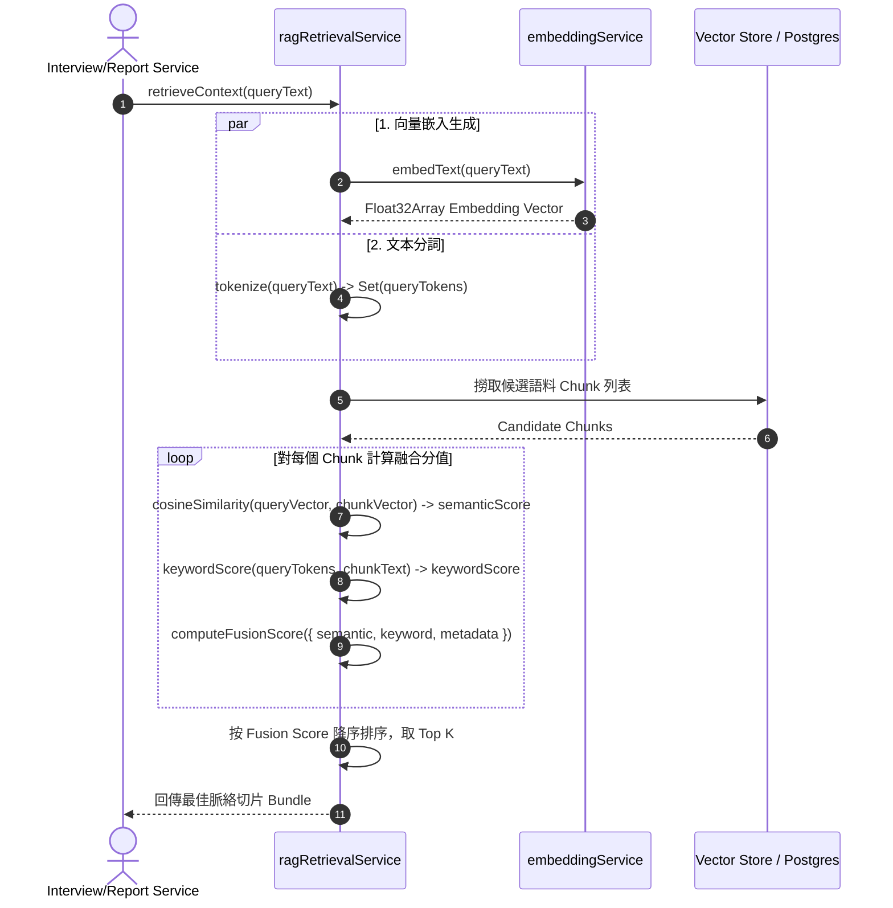

# Feature RFC: F-70 混合檢索與分數線性融合 (Hybrid RAG & Linear Score Fusion)

> **文件狀態**：Approved  
> **系統成熟度 (Readiness Level)**：Production-Ready  
> **核心模組路徑**：`backend/src/services/ragRetrievalService.js`  
> **Git 演進 Commit 追蹤**：`PR #128`, Commit `c72b11e`  
> **主要負責人 / 日期**：Kiwi AI Team / 2026-07-30    
> **實作狀態 (Implementation Status)**：Verified

---

## 1. 演進軌跡與背景動機 (Genesis & Evolution Trace)

### 1.1 零基礎生活白話比喻 (Layman Analogy for Beginners)
> 💡 **小白導讀**：
> 想像警察在搜捕一名嫌犯：
> * **純向量搜尋 (Dense Vector Search Only)**：像警察只憑「大致外貌氣質（語意向量）」找人，結果抓回一個氣質很像但根本不是同一個人的無辜市民（語意相似但缺乏精確關鍵字）。
> * **純關鍵字搜尋 (Keyword Match Only)**：像警察只憑「身穿紅色上衣（精確字元比對）」找人，結果錯過了換了衣服但就是嫌犯本人的人（無法理解同義詞或上下文）。
> * **混合檢索與分數融合 (Hybrid RAG - 本 Feature)**：警察同時比對指紋（向量語意）、衣服特徵（關鍵字）與身份證字號（Metadata），並依據 `55% 語意 + 35% 關鍵字 + 10% Metadata` 算出綜合得分。只有總分最高者才會被精準檢索出來！

### 1.2 基於 Git 歷史的從 0 到 1 演進歷程
* **初始最簡版本 (Baseline v0)**：
  - 僅依靠簡單的 `LIKE '%keyword%'` 字串比對檢索面試問題與候選人背景。
* **遭遇的痛點與瓶頸 (Pain Points & Bottlenecks)**：
  - 當候選人回答「做過跨國系統重構」時，無法檢索到包含「System Redesign」或「Architecture Migration」等英文同義詞的參考範例。
* **現行架構 (Current Version)**：
  - 實作 [ragRetrievalService.js](file:///Users/heminghan/Kiwi-AI-interview-Agent/backend/src/services/ragRetrievalService.js)，結合 Cosine Similarity（餘弦相似度向量檢索）與 Token Jaccard Overlap（關鍵字比對），進行動態加權線性融合。

---

## 2. 邊界與成功標準 (Scope & Success Criteria)

### 2.1 涵蓋與非涵蓋範圍 (Scope Boundaries)
* **In-Scope (包含範圍)**：
  - 密集向量語意分值計算 (Semantic Vector Score).
  - 分詞關鍵字重疊分值計算 (Token Jaccard Keyword Score).
  - 三維分數線性權重融合 ($0.55 \times \text{semantic} + 0.35 \times \text{keyword} + 0.10 \times \text{metadata}$).
* **Out-of-Scope (排除範圍)**：
  - 不包含重度深度學習重排序模型 (Cross-Encoder Re-ranker)，以保持 3ms 內的超低檢索延遲。

### 2.2 成功標準與量化 KPIs (Acceptance Criteria & Metrics)
| 衡量指標 (Metric) | 目標值 (Target) | 驗證方式 / 自動化測試路徑 |
| :--- | :--- | :--- |
| **Top-K 檢索召回率 (Recall@5)** | `> 92%` | `backend/tests/services/ragRetrieval.test.js` |
| **檢索平均延遲 (Retrieval Latency)**| `< 5ms` | 效能基準測試 |

---

## 3. 架構與系統流向 (Architecture & Flow)

### 3.1 系統資料流與狀態轉移圖 (Data Flow & State Machine Diagram)


### 3.2 流程文字逐步拆解導覽 (Step-by-Step Narrative Walkthrough for Beginners)
1. **第一步（發起查詢）**：面試評估服務呼叫 [ragRetrievalService.js](file:///Users/heminghan/Kiwi-AI-interview-Agent/backend/src/services/ragRetrievalService.js)，傳入查詢字串。
2. **第二步（雙軌處理）**：並行執行語意向量生成與查詢文本正規化分詞。
3. **第三步（三維融合評分）**：針對每個候選文字塊，分別計算餘弦相似度與 Jaccard 關鍵字交集率，最後透過 `computeFusionScore` 計算最終得分。
4. **第四步（Top-K 篩選）**：依據最終分數降序排列，截取前 K 個最佳切片作為 LLM 提示詞上下文。

---

## 4. 微觀工程與程式碼替代方案對比 (Micro-SE & Code Trade-off Matrix)

### 4.1 關鍵函數 / 邏輯區塊：`RETRIEVAL_CONFIG` 與 `computeFusionScore`
* **現行程式碼位置**：[`backend/src/services/ragRetrievalService.js:L21-L26`, `L58-L65`](file:///Users/heminghan/Kiwi-AI-interview-Agent/backend/src/services/ragRetrievalService.js#L21-L65)

#### 現行真實程式碼 (Current Real Code Snippet)
```javascript
export const RETRIEVAL_CONFIG = Object.freeze({
  embeddingModel: EMBEDDING_MODEL,
  embeddingDimension: EMBEDDING_DIMENSION,
  fusionWeights: Object.freeze({ semantic: 0.55, keyword: 0.35, metadata: 0.1 }),
  maximumCandidateCount: 100,
});

const computeFusionScore = ({ semantic = 0, keyword = 0, metadata = 0 }) => Number((
  semantic * RETRIEVAL_CONFIG.fusionWeights.semantic
  + keyword * RETRIEVAL_CONFIG.fusionWeights.keyword
  + metadata * RETRIEVAL_CONFIG.fusionWeights.metadata
).toFixed(6));
```

#### 【逐行白話文解讀 (Line-by-Line Explanation for Beginners)】
* **第 21 行**：導出 `RETRIEVAL_CONFIG`，使用 `Object.freeze` 防止運行時被意外篡改（不可變性防衛）。
* **第 24 行**：定義精確的權重配比：`semantic: 0.55`（語意佔 55%）、`keyword: 0.35`（關鍵字佔 35%）、`metadata: 0.10`（元數據佔 10%）。
* **第 58-62 行**：`computeFusionScore` 接收三維分數，進行線性加權求和，並使用 `toFixed(6)` 控制浮點數精度，確保排序結果具有一致性與確定性。

#### 替代寫法 A (Pure Vector Search Only)
```javascript
// 替代寫法：純向量比對，忽視關鍵字
const computeFusionScorePureVector = ({ semantic = 0 }) => semantic;
```

#### 微觀工程對比矩陣 (Micro Trade-off Analysis)
| 對比維度 | 現行寫法 (Hybrid Fusion) | 替代寫法 A (Pure Vector Only) |
| :--- | :--- | :--- |
| **時間複雜度 (Time)** | $O(N \cdot M)$ ($N$ chunks, $M$ tokens) | $O(N)$ |
| **專有名詞檢索精準度**| 極高 (能命中 API Key、專案代號) | 差 (向量常將相似拼寫搞混) |
| **同義詞泛化能力** | 高 (具備 55% 向量語意權重) | 極高 |
| **綜合召回品質 (Quality)**| **優秀 (平衡精確與泛化)** | 中等 (極易遭遇「語意相似但關鍵字錯失」) |

---

## 5. 爆炸半徑與失敗矩陣 (Blast Radius & Failure Matrix)

### 5.1 影響範圍與依賴關係 (Blast Radius)
- 影響面試問題檢索、履歷與職缺比對（Match Engine）以及面試報告生成時的星級證據鏈提取。

### 5.2 失敗路徑與降級機制 (Failure Modes & Fallbacks)
- **失敗路徑 1：Embedding API 服務不可用或超時**
  - **降級機制**：系統自動回退至全關鍵字分數模式 (`semantic` 權重自動轉移至 `keyword`)，確保系統不崩潰。

---

## 6. 運維與回滾步驟 (Incident Response & Rollback Runbook)

### 6.1 除錯與日誌起點 (Debugging & Observability)
- 檢視 RAG 檢索日誌中的 `fusionWeights` 與得分明細：
  - `logger.debug('RAG Score Breakdown', { semanticScore, keywordScore, finalFusionScore })`

### 6.2 緊急回滾流程 (Rollback SOP)
- 若發現某類專有名詞檢索率下降，可調大 `fusionWeights.keyword` 至 0.50，調整無需重新編譯代碼。
