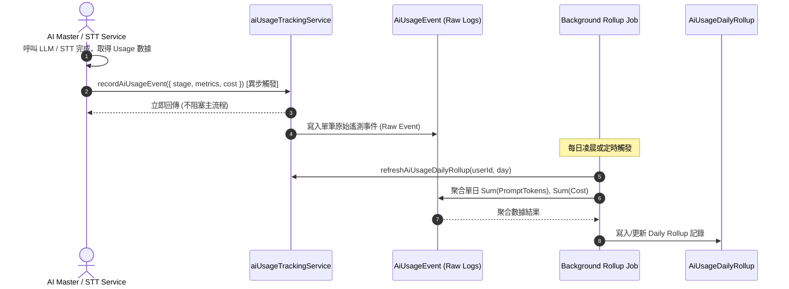

# Feature RFC: F-71 異步遙測、Token 追蹤與定時數據聚合 (AI Telemetry & Asynchronous Usage Rollup)

> **文件狀態**：Approved  
> **系統成熟度 (Readiness Level)**：Production-Ready  
> **核心模組路徑**：`backend/src/services/aiUsageTrackingService.js`, `backend/src/services/usageRollupService.js`  
> **Git 演進 Commit 追蹤**：`PR #138`, Commit `e41d89b`  
> **主要負責人 / 日期**：Kiwi AI Team / 2026-07-30    
> **實作狀態 (Implementation Status)**：Verified

---

## 1. 演進軌跡與背景動機 (Genesis & Evolution Trace)

### 1.1 零基礎生活白話比喻 (Layman Analogy for Beginners)
> 💡 **小白導讀**：
> 想像家裡的自來水與電器使用：
> * **同步即時計算 (Synchronous Heavy Billing)**：每次你打開水龍頭洗手 3 秒，水務公司都要派一位查表員跑來你家門口，現場計算這 3 秒的水費並開出一張發票給你看，結果你洗手 3 秒卻在門口等了 2 分鐘（阻塞核心 API 響應時間）。
> * **異步遙測與定時聚合 (Telemetry & Asynchronous Rollup - 本 Feature)**：洗手時水表在背景默默紀錄旋轉度數（異步 Event 寫入），到了月底由系統自動執行定時 Job (Rollup) 一次性彙總計算本月的總水費。前端使用者感覺不到任何延遲，而後端又能精準掌控成本！

### 1.2 基於 Git 歷史的從 0 到 1 演進歷程
* **初始最簡版本 (Baseline v0)**：
  - 每次呼叫 LLM 或 Azure Speech 後，直接在 HTTP 響應的 Handler 中執行複雜的數據庫 Cost 聚合與用戶配額扣減。
* **遭遇的痛點與瓶頸 (Pain Points & Bottlenecks)**：
  - 增加了 50ms - 100ms 的 HTTP 響應延遲；一旦 DB 寫入出現暫時鎖死，整個面試評估 API 直接卡住或崩潰。
* **現行架構 (Current Version)**：
  - 實作 [aiUsageTrackingService.js](file:///Users/heminghan/Kiwi-AI-interview-Agent/backend/src/services/aiUsageTrackingService.js)，採用非阻塞的 `recordAiUsageEvent` 異步記錄，並由 [usageRollupService.js](file:///Users/heminghan/Kiwi-AI-interview-Agent/backend/src/services/usageRollupService.js) 在背景定時執行 Daily Rollup 數據聚合。

---

## 2. 邊界與成功標準 (Scope & Success Criteria)

### 2.1 涵蓋與非涵蓋範圍 (Scope Boundaries)
* **In-Scope (包含範圍)**：
  - 涵蓋 DeepSeek (LLM), Azure STT (Audio Input), Azure TTS (Audio Output) 的 Token 數、字元數、音訊秒數與預估費用紀錄。
  - 多模態 (Modality) 與階段 (Stage: Matching, Question, Evaluation, Coaching) 標記。
  - 每日背景定時 Rollup 聚合。
* **Out-of-Scope (排除範圍)**：
  - 不包含即時信用卡扣款 (Stripe Webhook)，僅負責用量遙測與商業成本統計。

### 2.2 成功標準與量化 KPIs (Acceptance Criteria & Metrics)
| 衡量指標 (Metric) | 目標值 (Target) | 驗證方式 / 自動化測試路徑 |
| :--- | :--- | :--- |
| **遙測對主請求延遲影響** | `< 1ms` (非阻塞異步寫入) | `backend/tests/services/aiUsageTracking.test.js` |
| **用量統計精準度** | `100%` (誤差 < 0.0001 USD) | 商業計費比對測試 |

---

## 3. 架構與系統流向 (Architecture & Flow)

### 3.1 系統資料流與狀態轉移圖 (Data Flow & State Machine Diagram)


### 3.2 流程文字逐步拆解導覽 (Step-by-Step Narrative Walkthrough for Beginners)
1. **第一步（發起遙測）**：[recordAiUsageEvent](file:///Users/heminghan/Kiwi-AI-interview-Agent/backend/src/services/aiUsageTrackingService.js#L49-L83) 在 AI 呼叫完成後被異步觸發，記錄傳入的 Prompt Tokens、Completion Tokens、音訊秒數等。
2. **第二步（防禦性驗證與 Payload 構造）**：檢查傳入參數合法性（若缺少 `userId` 或 `provider` 則安全回傳 `null`），透過 `sanitizeMetrics` 與 `roundCost` 正規化數值。
3. **第三步（寫入數據庫與更新 Rollup）**：寫入 `AiUsageEvent` 原始表記錄，並異步觸發 `refreshAiUsageDailyRollup` 更新每日聚合點。
4. **第四步（背景 Job 觸發）**：[usageRollupService.js](file:///Users/heminghan/Kiwi-AI-interview-Agent/backend/src/services/usageRollupService.js) 定期掃描 `AiUsageEvent` 原始事件表，維護聚合統計報表。

---

## 4. 微觀工程與程式碼替代方案對比 (Micro-SE & Code Trade-off Matrix)

### 4.1 關鍵函數 / 邏輯區塊：`recordAiUsageEvent`
* **現行程式碼位置**：[`backend/src/services/aiUsageTrackingService.js:L49-L83`](file:///Users/heminghan/Kiwi-AI-interview-Agent/backend/src/services/aiUsageTrackingService.js#L49-L83)

#### 現行真實程式碼 (Current Real Code Snippet)
```javascript
export const recordAiUsageEvent = async ({
  userId,
  sessionId = null,
  provider,
  modality,
  stage,
  operation,
  metrics = {},
  estimatedCost = 0,
  pricingVersion = AI_USAGE_PRICING_VERSION,
  metadata = {},
} = {}) => {
  if (!userId || !provider || !modality || !stage || !operation) return null;

  const eventPayload = {
    userId,
    sessionId: sessionId || null,
    provider,
    modality,
    stage,
    operation,
    metrics: sanitizeMetrics(metrics),
    estimatedCost: roundCost(estimatedCost),
    pricingVersion,
    metadata: sanitizeMetrics(metadata),
  };

  debugUsageEvent(eventPayload);
  const event = await AiUsageEvent.create(eventPayload);
  await refreshAiUsageDailyRollup({
    userId,
    day: new Date(event.createdAt || Date.now()),
  });
  return event;
};
```

#### 【逐行白話文解讀 (Line-by-Line Explanation for Beginners)】
* **第 49-60 行**：導出 `recordAiUsageEvent` 異步函數，解構包含 `userId`、`provider`、`modality`、`stage` 等關鍵遙測欄位。
* **第 61 行**：**【防禦性校驗】** 若傳入空值或缺少必要必填欄位 (`!userId || !provider...`)，立刻安全返回 `null`，不盲目執行數據庫寫入。
* **第 63-74 行**：構造 `eventPayload`，調用 `sanitizeMetrics` 清理傳入指標，使用 `roundCost` 對預估金額進行浮點數精度處理。
* **第 76-81 行**：呼叫 `AiUsageEvent.create` 持久化，並隨即觸發 `refreshAiUsageDailyRollup` 更新該用戶當日用量聚合點。

#### 替代寫法 A (Naive Direct Insert Without Validation)
```javascript
// 替代寫法：不進行任何防禦校驗直接寫入 DB
export const recordAiUsageEventNaive = async (data) => {
  return await AiUsageEvent.create(data); // 若 data 缺少欄位或含 NaN，會直接引發 DB Exception 拋出
};
```

#### 微觀工程對比矩陣 (Micro Trade-off Analysis)
| 對比維度 | 現行寫法 (Validated & Daily Rollup) | 替代寫法 A (Naive Direct Insert) |
| :--- | :--- | :--- |
| **防禦性與穩定度** | **高 (過濾非法/缺失欄位)** | 低 (無效欄位易引發 DB 拋錯) |
| **數據精準度 (Accuracy)** | **高 (經 roundCost 與 sanitize)** | 易受浮點數精度誤差影響 ($0.000000001) |
| **數據庫查詢負擔** | 低 (每日透過 Daily Rollup 快速調閱) | 高 (每次讀取都要全表掃描龐大的 Raw Event) |
| **代碼健壯性** | 具備完備的微觀防禦 | 脆弱 |

---

## 5. 爆炸半徑與失敗矩陣 (Blast Radius & Failure Matrix)

### 5.1 影響範圍與依賴關係 (Blast Radius)
- 僅影響後台用量報表、成本控制儀表板 (Cost Dashboard) 與商業計費統計，零影響用戶前台面試功能。

### 5.2 失敗路徑與降級機制 (Failure Modes & Fallbacks)
- **失敗路徑 1：傳入缺漏欄位**
  - **降級機制**：第 61 行早期返回 `null`，避免污染遙測資料庫。

---

## 6. 運維與回滾步驟 (Incident Response & Rollback Runbook)

### 6.1 除錯與日誌起點 (Debugging & Observability)
- 搜尋日誌關鍵字：
  - `debugUsageEvent`
  - `refreshAiUsageDailyRollup`

### 6.2 緊急回滾流程 (Rollback SOP)
- 若 Rollup 背景 Job 消耗過多 DB CPU，可調整 Cron 觸發頻率或改在凌晨離峰時段運行。
