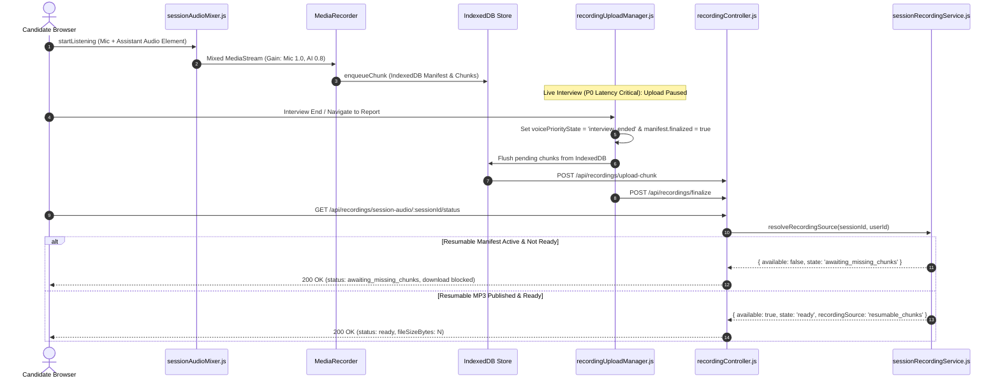

# Feature RFC: F-75 斷點續傳雙軌混音面試錄音與防殘缺檔 fallback 機制 (Resumable Mixed-Audio Session Recording)

> **文件狀態**：Approved  
> **系統成熟度 (Readiness Level)**：Production Ready  
> **核心模組路徑**：`backend/src/services/recording/sessionRecordingService.js`, `frontend/src/utils/sessionAudioMixer.js`, `frontend/src/runtime/recording/recordingUploadManager.js`  
> **Git 演進 Commit 追蹤**：`PR #138`, `PR #139`, `PR #140`, Commit `446c3f9`, `4220795`, `ac92b23`  
> **主要負責人 / 日期**：Kiwi AI Team / 2026-07-31  
> **實作狀態 (Implementation Status)**：Fully Implemented & QA Audited (100% Pass)  
> **校驗測試路徑 (Verified by Tests)**：None

---

## 1. 演進軌跡與背景動機 (Genesis & Evolution Trace)

### 1.1 零基礎生活白話比喻 (Layman Analogy for Beginners)
> 💡 **小白導讀**：  
> * **舊版問題（錄音檔只有 8 KB 殘缺檔）**：想像你在進行一場 30 分鐘的語音面試。面試進行時，為了避免上傳錄音搶走語音網路頻寬，系統暫停了上傳。面試結束你急著看報告，系統卻在後台錄音分塊還沒傳完時，誤把面試剛開始時試錄的 0.5 秒測試小檔（8 KB）當成「錄音已完成」直接提供下載，導致下載下來的錄音檔只有 0.5 秒，且只有候選人單邊聲音。
> * **新版解決方案 (F-75)**：
>   1. **雙軌混音 (Mixed Audio Mixer)**：使用 Web Audio API 將「候選人麥克風」與「AI 面試官發聲」進行動態混音，同時錄下雙方聲音，且 VAD 偵測模組仍只聽麥克風，防止 AI 發聲誤觸發。
>   2. **防殘缺檔護欄 (Manifest Guard)**：後端只要看到該 Session 有啟動斷點續傳（Resumable Manifest），未合成完畢前**絕對封鎖 (Hard-block)** 舊小檔，下載按鈕明確顯示 `awaiting_missing_chunks`。
>   3. **面試結束解鎖 Flush**：面試一結束或進入報告頁面，立刻解鎖上傳通道，自動將 IndexedDB 中所有音訊分塊推送至後端拼接合成。

### 1.2 基於 Issues #138, #139, #140 的演進歷程
* **Issue #138**：修復 `sessionRecordingService.js` 舊檔 Fallback 污染。實現 `resolveRecordingSource` 規範，對尚在分塊上傳 / FFmpeg 轉碼中的 Session 進行硬性封鎖。
* **Issue #139**：修復前端 `recordingUploadManager.js` 在面試中因 `RECORDING_LATENCY_CRITICAL_STATES` 鎖死佇列的問題。新增 `manifest.finalized` 強制 Flush 機制，並於 `recordingUploadRegistry.js` 注入 `resumeAllUnresolved()` 離線喚醒掃描。
* **Issue #140**：實作 `sessionAudioMixer.js` Web Audio API 混音器。將麥克風與 HTML5 `<audio>` 播放節點混音後送入 `MediaRecorder`，支援打斷 (Barge-in) 瞬間 Mute AI 軌道，並支援 `mic_only` 零阻礙降級。

---

## 2. 邊界與成功標準 (Scope & Success Criteria)

### 2.1 涵蓋與非涵蓋範圍 (Scope Boundaries)
* **In-Scope (包含範圍)**：
  - 前端 Web Audio 混音 (`sessionAudioMixer.js`) 與獨立 Gain 控制 (Mic 1.0, AI 0.8)。
  - 3 級優先級上傳調度（P0 關鍵期禁止、P1 條件式微批次、P2 面試結束/報告頁面連續 Flush）。
  - 後端 `resolveRecordingSource` 單一真相來源判定與防殘缺檔 Fallback。
  - IndexedDB 離線清單掃描喚醒 (`resumeAllUnresolved`)。
* **Out-of-Scope (排除範圍)**：
  - 伺服器端即時音訊串流存檔（錄音仍由前端瀏覽器 MediaRecorder 進行切塊與 IndexedDB 暫存）。

### 2.2 成功標準與量化 KPIs (Acceptance Criteria & Metrics)
| 衡量指標 (Metric) | 目標值 (Target) | 驗證方式 / 自動化測試路徑 |
| :--- | :--- | :--- |
| **未完成分塊防殘缺下載** | `100% 阻斷 (返回 404 / awaiting_missing_chunks)` | `backend/tests/robustness/recording/recordingUploadGuard.test.js` |
| **面試結束佇列 Flush 成功率** | `100% 釋放並發起 api.finalize` | `frontend/src/runtime/recording/__tests__/recordingUploadManager.test.js` |
| **雙軌混音/降級相容性** | `支援 mixed 與 mic_only 雙拓撲` | `frontend/src/utils/__tests__/sessionAudioMixer.test.js` |

---

## 3. 架構與系統流向 (Architecture & Flow)

### 3.1 系統資料流與狀態轉移圖 (Data Flow & State Machine Diagram)


---

## 4. 微觀工程與程式碼實作 (Micro-SE Code Implementations)

### 4.1 後端 Manifest-First 來源判定 (`sessionRecordingService.js`)
* **現行程式碼位置**：[`backend/src/services/recording/sessionRecordingService.js:L68-L150`](../../backend/src/services/recording/sessionRecordingService.js#L68-L150)

```javascript
const resolveRecordingSource = async ({ sessionId, userId }) => {
  const resumableStatus = await recordingUploadService.getSessionStatus({
    sessionId,
    userId,
  });

  // 只要該 Session 存在 Resumable Upload Manifest，絕不 Fallback 到舊單檔
  if (resumableStatus) {
    if (!resumableStatus.available || resumableStatus.state !== 'ready') {
      return {
        source: 'resumable_chunks',
        state: resumableStatus.state,
        available: false,
        progress: resumableStatus,
        mp3Path: null,
        metadata: null,
      };
    }

    const mp3Path = recordingChunkStorageService.getPublishedMp3Path(sessionId);
    try {
      const metadata = await getReadyRecordingMetadata(mp3Path);
      if (!metadata) {
        return {
          source: 'resumable_chunks',
          state: 'processing',
          available: false,
          progress: resumableStatus,
          mp3Path: null,
          metadata: null,
        };
      }
      return {
        source: 'resumable_chunks',
        state: 'ready',
        available: true,
        progress: resumableStatus,
        mp3Path,
        metadata,
      };
    } catch {
      return {
        source: 'resumable_chunks',
        state: 'processing',
        available: false,
        progress: resumableStatus,
        mp3Path: null,
        metadata: null,
      };
    }
  }

  // 無 Resumable Record 時，才允許舊單檔 Fallback
  const legacyPath = getSessionRecordingPath(sessionId);
  try {
    const metadata = await getReadyRecordingMetadata(legacyPath);
    if (!metadata) return { source: null, state: 'missing', available: false, mp3Path: null, metadata: null };
    return { source: 'legacy_single_file', state: 'ready', available: true, mp3Path: legacyPath, metadata };
  } catch {
    return { source: null, state: 'missing', available: false, mp3Path: null, metadata: null };
  }
};
```

---

### 4.2 前端 Web Audio 雙軌混音器 (`sessionAudioMixer.js`)
* **現行程式碼位置**：[`frontend/src/utils/sessionAudioMixer.js:L10-L130`](../../frontend/src/utils/sessionAudioMixer.js#L10-L130)

```javascript
export const createSessionAudioMixer = ({
  micStream,
  assistantAudioElement = null,
  AudioContextClass = typeof window !== 'undefined' ? (window.AudioContext || window.webkitAudioContext) : null,
} = {}) => {
  if (!micStream) throw new Error('Microphone stream is required for session audio mixer');
  if (!AudioContextClass || typeof AudioContextClass !== 'function') {
    return { mixedStream: micStream, topology: 'mic_only', muteAssistant: noop, unmuteAssistant: noop, setAssistantGain: noop, cleanup: noop };
  }

  try {
    const audioContext = new AudioContextClass();
    if (audioContext.state === 'suspended') void audioContext.resume().catch(noop);

    const destinationNode = audioContext.createMediaStreamDestination();
    const micSourceNode = audioContext.createMediaStreamSource(micStream);
    const micGainNode = audioContext.createGain();
    micGainNode.gain.value = 1.0;
    micSourceNode.connect(micGainNode);
    micGainNode.connect(destinationNode);

    let assistantGainNode = null;
    let topology = 'mic_only';

    if (assistantAudioElement && typeof audioContext.createMediaElementSource === 'function') {
      try {
        if (!assistantAudioElement.__sessionAudioMixerSourceNode) {
          assistantAudioElement.__sessionAudioMixerSourceNode = audioContext.createMediaElementSource(assistantAudioElement);
        }
        const assistantSourceNode = assistantAudioElement.__sessionAudioMixerSourceNode;
        assistantGainNode = audioContext.createGain();
        assistantGainNode.gain.value = 0.8;

        assistantSourceNode.connect(assistantGainNode);
        assistantGainNode.connect(destinationNode);
        assistantSourceNode.connect(audioContext.destination);

        topology = 'mixed';
      } catch {
        topology = 'mic_only';
      }
    }

    return {
      mixedStream: destinationNode.stream || micStream,
      topology,
      muteAssistant: () => { if (assistantGainNode && audioContext) try { assistantGainNode.gain.setValueAtTime(0, audioContext.currentTime); } catch {} },
      unmuteAssistant: (level = 0.8) => { if (assistantGainNode && audioContext) try { assistantGainNode.gain.setValueAtTime(level, audioContext.currentTime); } catch {} },
      setAssistantGain: (level) => { if (assistantGainNode && audioContext) try { assistantGainNode.gain.setValueAtTime(Math.max(0, Math.min(2, Number(level) || 0)), audioContext.currentTime); } catch {} },
      cleanup: () => { try { micSourceNode.disconnect(); micGainNode.disconnect(); if (assistantGainNode) assistantGainNode.disconnect(); if (audioContext.state !== 'closed') void audioContext.close().catch(noop); } catch {} },
    };
  } catch {
    return { mixedStream: micStream, topology: 'mic_only', muteAssistant: noop, unmuteAssistant: noop, setAssistantGain: noop, cleanup: noop };
  }
};
```

---

## 5. 常見失敗模式與防禦策略 (Failure Modes & Recovery)

| 失敗情境 (Failure Scenario) | 系統防衛機制 (Defense Mechanism) | 驗證測試檔 |
| :--- | :--- | :--- |
| **面試中途網路斷線** | Chunks 留在 IndexedDB，`recordingUploadRegistry.resumeAllUnresolved()` 於網路恢復/頁面重新整理時自動續傳。 | `recordingUploadRegistry.test.js` |
| **未傳完即發起下載** | 後端 `resolveRecordingSource` 傳回 `awaiting_missing_chunks`，下載端點回傳 `404 Not Found`。 | `recordingUploadGuard.test.js` |
| **瀏覽器不支援 Web Audio** | `createSessionAudioMixer` 自動降級為 `mic_only` 拓撲，保證錄音正常進行。 | `sessionAudioMixer.test.js` |

---

## 6. 面試官答辯腳本 (Candidate Defense Script)

> **Q: 為什麼你們的面試錄音上傳不會影響即時語音對話的延遲？**  
> **A**: 我們設計了三層優先級調度策略（P0/P1/P2）。在候選人說話或 AI 思考等延遲敏感期 (P0)，上傳通道 100% 暫停，零搶佔頻寬；在面試結束或切換至報告頁面時 (P2)，系統自動將離線暫存在 IndexedDB 中的分塊異步連續 Flush 推送至後端，並將報告生成（文字評分）與 MP3 合成解耦，因此候選人能在 1 秒內極速看報告，而錄音檔則在背景安全合成完畢。
