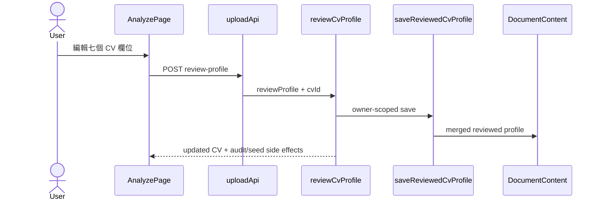

# Feature RFC: F-77 CV Profile Human Review Gate

> **文件狀態**：Updated
> **系統成熟度 (Readiness Level)**：Partial — CV review endpoint、canonical profile transformation 與本地測試存在；browser、live persistence 與 production verification 未在本 RFC 宣稱完成。
> **核心模組路徑**：`backend/src/api/routes/uploadRoutes.js`、`backend/src/controllers/uploadController.js`、`backend/src/services/cv/cvReviewedProfileService.js`、`frontend/src/utils/cvReviewViewModel.js`、`frontend/src/pages/AnalyzePage.jsx`
> **Git 演進 Commit 追蹤**：Current source snapshot `a89e6eba` (2026-08-02)
> **主要負責人 / 日期**：Kiwi engineering / 2026-08-02
> **實作狀態 (Implementation Status)**：Partial
> **校驗測試路徑 (Verified by Tests)**：`backend/tests/unit/cvReviewedDataIntegrity.test.js`、`frontend/src/utils/__tests__/cvReviewViewModel.test.js`、`backend/tests/robustness/cv/cvParsingRobustness.test.js`

## 1. 目標與邊界

CV parser 先產生可編輯的 profile；使用者確認後，系統才把 reviewed profile 當成 Match 的可信輸入。這不是重新解析 CV，也不是使用者資料刪除功能。

In-scope：七個 review fields、未編輯 sections preservation、human-review metadata、reviewed text/evidence/analysis rebuild、owner-scoped persistence、audit log 與下一個 JD workflow gate。Out-of-scope：CV parser 的 extraction quality、JD review（F-78）、Match scoring（F-14）、真人 browser usability。

## 2. Feature Definition & Code Blueprint

### 2.1 Entry point

| 項目 | 定義 |
| --- | --- |
| Trigger | Analyze page 的 `handleConfirmCVReview`；使用者先選擇 CV，再確認欄位 |
| HTTP entry | `POST /upload/cv/:cvId/review-profile` (`uploadRoutes.js:26-32`) |
| Controller | `reviewCvProfile` (`uploadController.js:182-208`) |
| Service entry | `saveReviewedCvProfile({ cvId, userId, reviewProfile })` |
| Gate | 後續 `handleGeneratePlan` 必須看到 `isCvHumanVerified`，否則 early return (`AnalyzePage.jsx:649-652`) |

### 2.2 Input / object contract

```js
// reviewProfile: request body object
{
  candidateSummary: string,
  coreSkills: string[] | { label: string }[],
  experienceEvidence: string,
  projectEvidence: string,
  educationCredentials: string,
  certifications: string,
  keyCompetencies: string[] | { label: string }[],
}
```

`normalizeReviewedCvProfile` trims text and turns list-like values into clean strings (`cvReviewedProfileService.js:12-25`). Empty review objects fail with `Missing CV review fields` (`:65-69`). Existing sections are copied into a Map and only reviewed keys are replaced (`:44-57`), so contact/languages/other untouched sections remain.

### 2.3 Helper catalog

| Helper | Input → output | Side effect / reuse |
| --- | --- | --- |
| `normalizeReviewedCvProfile` | raw review → canonical seven-field object | Pure; reusable by service tests |
| `upsertReviewedSections` | existing sections + canonical review → merged sections | Pure; internal profile builder |
| `buildReviewedCvText` | base profile + review → section text | Pure; used for evidence and parser input |
| `buildCvEvidenceProfile` | reviewed profile + text → evidence profile | Pure domain helper |
| `buildCvAnalysis` | profile/evidence/text → candidate analysis | Pure domain helper |
| `saveReviewedCvProfile` | ids + review → persisted CV record | DB write; do not call from UI directly |

### 2.4 Implementation algorithm (規格；不是現行程式碼)

```text
function confirmCvReview(cvId, userId, input):
  const review = normalizeReviewedCvProfile(input)
  if no review field has content: return 400 Missing CV review fields
  const base = loadOwnedCvDocument(cvId, userId)
  const sections = upsertReviewedSections(base.sections, review)
  const profile = copy(base) and replace only reviewed fields
  profile.skills = review.coreSkills.map(label => { label, sourceType: 'human_review', confidence: 1 })
  profile.metadata = { humanReviewStatus: 'verified', inputTrustLevel: 'human_reviewed', humanReviewedAt }
  const reviewedText = buildReviewedCvText(base, review)
  profile.evidenceProfile = buildCvEvidenceProfile(profile, reviewedText)
  profile.cvAnalysis = buildCvAnalysis(profile, profile.evidenceProfile, reviewedText)
  persist canonical profile, display view, sections, text, and human-reviewed version tags
  touch retention, refresh question seeds, write review_cv_profile audit event
  return updated owner-scoped CV
```

### 2.5 Output and failure contract

| Output / branch | Current behaviour |
| --- | --- |
| Success | Updated CV with `profile.metadata.humanReviewStatus = verified`, `reviewedText`, evidence profile and `cvAnalysis`; DB versions are `cv_profile_human_reviewed_v1` and `cv_parser_v2_human_reviewed` (`:124-140`) |
| No fields | 400 `Missing CV review fields`; no persistence |
| Non-owner / missing CV | ownership service throws; controller does not bypass it |
| Frontend success | selected CV is replaced, local status becomes `verified`, analysis resets, workflow advances to JD input (`AnalyzePage.jsx:623-631`) |
| Frontend failure | status message `CV review failed`; saving flag is cleared (`:632-635`) |

## 3. Data flow



## 4. Evidence matrix

| Claim | Source | Test | Boundary / status |
| --- | --- | --- | --- |
| Review route and controller exist | `uploadRoutes.js:26-32`, `uploadController.js:182-208` | `cvParsingRobustness.test.js` | local source / Partial |
| Untouched sections and full skills are preserved | `cvReviewedProfileService.js:44-57,71-94` | `cvReviewedDataIntegrity.test.js:4-51` | local deterministic / Verified |
| UI produces seven editable fields and payload | `cvReviewViewModel.js:1-14,85-116` | `cvReviewViewModel.test.js:4-60` | local deterministic / Verified |
| Match cannot start before CV review | `AnalyzePage.jsx:649-652` | no browser gate in this task | browser / Not verified |
| DB write and audit event succeed in deployed runtime | `cvReviewedProfileService.js:124-140`, controller `:189-206` | no live DB run here | live/production / Not verified |

## 5. Operations and interview explanation

Debug from `review_cv_profile`, CV id, and `humanReviewStatus`; then inspect `reviewedText` and version tags. A safe rollback is to stop calling the review endpoint or restore the prior CV document snapshot; do not manually edit the Mongo document without an owner-scoped migration. In plain language: the user checks parser output, the service keeps untouched CV sections, rebuilds the canonical evidence, and marks exactly that CV as human reviewed before matching.
