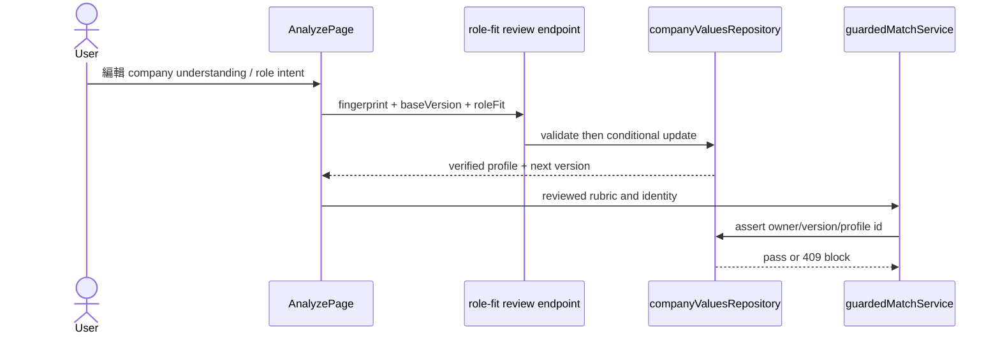

# Feature RFC: F-78 JD / Role-Fit Human Review Gate

> **文件狀態**：Updated
> **系統成熟度 (Readiness Level)**：Partial — role-fit draft、review validation、optimistic versioning 與 Match gate 已有 source/test evidence；真人 UI、live DB 與 provider verification 未宣稱完成。
> **核心模組路徑**：`backend/src/api/routes/jobDescriptionRoutes.js`、`backend/src/controllers/jobDescriptionController.js`、`backend/src/services/jobDescription/roleFitProfileBuilder.js`、`backend/src/services/company/companyValuesRepository.js`、`frontend/src/utils/jdHumanReview.js`、`frontend/src/pages/AnalyzePage.jsx`
> **Git 演進 Commit 追蹤**：Current source snapshot `a89e6eba` (2026-08-02)
> **主要負責人 / 日期**：Kiwi engineering / 2026-08-02
> **實作狀態 (Implementation Status)**：Partial
> **校驗測試路徑 (Verified by Tests)**：`backend/tests/robustness/jd/roleFitReviewRepositoryRobustness.test.js`、`backend/tests/robustness/jd/roleFitJdContextRobustness.test.js`、`backend/tests/robustness/match/guardedMatchHumanReviewRobustness.test.js`、`frontend/src/utils/__tests__/jdHumanReview.test.js`

## 1. 目標與邊界

JD parser 產生的是可審查的 company understanding 與 role intent draft。使用者確認後，系統才把同一個 owner、fingerprint、profile id、review version 視為 Match 可用的 Role-Fit 輸入。這個 RFC 不負責抓 URL 內容（F-79）或抽取 company values（F-80）。

## 2. Feature Definition & Code Blueprint

### 2.1 Entry point / input

| 項目 | 定義 |
| --- | --- |
| Draft | `buildRoleFitProfile({ rawJD, rubric, companyWebsiteUrl, userCompanyContext, companyWebsiteEvidence })` |
| Confirm endpoint | `PUT /job-description/role-fit/reviews/:jdFingerprint` (`jobDescriptionRoutes.js:22-25`) |
| Controller | `confirmRoleFitReview` (`jobDescriptionController.js:54-90`) |
| Input | `jdFingerprint`, `baseVersion`, `roleFit` (或 `jdRubric.roleFit`) |
| Gate | `assertVerifiedCompanyRoleFitReview` 必須通過 owner/fingerprint/version/profile id 比對 |

`buildRoleFitProfile` 會建立 `schemaVersion: role_fit_profile_v1`、`companyContext`、`companyUnderstanding`、`roleIntent`、`review: { status: 'unreviewed', version: 1, baseVersion: 0 }` (`roleFitProfileBuilder.js:282-332`)。`validateRoleFitReviewInput` 要求安全 HTTP(S) URL 或 manual context、至少一個 role-intent item，且拒絕 prompt-like review text (`:335-355`)。

### 2.2 Object contract and helpers

```js
roleFit.review = { status: 'verified', baseVersion: number, version: number, reviewedAt: string }
roleFit.companyUnderstanding = { summary, facts, businessModel, customersOrUsers, productsOrServices, operatingContext }
roleFit.roleIntent = { items: [{ statement, priority, sourceLabel, sourceTrace, reviewConfidence }] }
```

| Helper | Input → output | Side effect |
| --- | --- | --- |
| `buildRoleFitProfile` | JD rubric/context → reviewable draft | pure |
| `validateRoleFitReviewInput` | role-fit draft → `{ valid, errorCodes, safeWebsiteUrl }` | pure |
| `confirmCompanyRoleFitReview` | owner + fingerprint + base version + draft → verified profile | conditional DB update |
| `applyRoleFitReviewConfidence` (repository helper) | draft confidence fields → user-confirmed fields | pure transform |
| `assertVerifiedCompanyRoleFitReview` | persisted identity/version → profile or 409 | DB read; Match boundary only |
| `stampHumanReviewMetadata` | frontend rubric + status → safeguard/metadata version | pure frontend transform |

### 2.3 Implementation algorithm (規格；不是現行程式碼)

```text
function confirmRoleFit(user, fingerprint, baseVersion, draft):
  require fingerprint, draft, integer baseVersion >= 1
  const validation = validateRoleFitReviewInput(draft)
  if invalid: return 400 Invalid role-fit review with errorCodes
  const nextVersion = baseVersion + 1
  const reviewed = applyRoleFitReviewConfidence(draft)
  reviewed.review = { status: 'verified', baseVersion, version: nextVersion, reviewedAt: now }
  update one record where { userId, jdFingerprint, roleFitReviewVersion: baseVersion }
  if no record updated: return 409 stale/non-owned review
  return saved roleFit + jdRubric + nextVersion

function matchGate(input):
  const persisted = assertVerifiedCompanyRoleFitReview(owner, fingerprint, version, profileId)
  if check fails: stop with role_fit_review_required/conflict
  otherwise pass the reviewed rubric to guarded Match
```

### 2.4 Output and failure contract

| Branch | Current output / action |
| --- | --- |
| Confirm success | JSON `roleFit`, `jdRubric`, `reviewVersion`; persisted status `verified` and incremented version (`companyValuesRepository.js:183-213`) |
| Invalid draft | 400 `Invalid role-fit review` with validation error codes |
| Missing fields | 400 `Missing role-fit review` |
| Stale version / lost owner record | 409 `Role-fit review conflict`; user must re-summarise (`:179-181,210-212`) |
| Match identity mismatch | 409 from `assertVerifiedCompanyRoleFitReview`; no downstream match (`:216-232`) |
| Frontend status | verified review stamps metadata and can clear a parser safeguard only as an explicit human-review override; edited/unreviewed state remains blocked (`jdHumanReview.test.js:4-65`) |

## 3. Data flow



## 4. Evidence matrix

| Claim | Source | Test | Boundary / status |
| --- | --- | --- | --- |
| Draft starts unreviewed and is source-labelled | `roleFitProfileBuilder.js:300-331` | `roleFitJdContextRobustness.test.js:24-60` | local / Verified |
| Confirm uses optimistic versioning | `companyValuesRepository.js:170-213` | `roleFitReviewRepositoryRobustness.test.js:73-144` | local deterministic / Verified |
| Match requires persisted verified identity | `companyValuesRepository.js:216-232` | `roleFitReviewRepositoryRobustness.test.js:146-177`, guarded-match tests | local / Verified |
| Browser review flow and plan button are usable | `AnalyzePage.jsx:544-613,649-662` | no browser run here | browser / Not verified |

## 5. Operations and interview explanation

Debug with `jdFingerprint`, `roleFitReviewVersion`, `roleFitProfile.id`, and `roleFitReviewStatus`. Never “fix” a 409 by incrementing the version in the client; re-summarise and confirm the latest draft. In plain language: the parser proposes a company/role understanding, the user confirms it, and the server signs that exact version before matching can use it.
