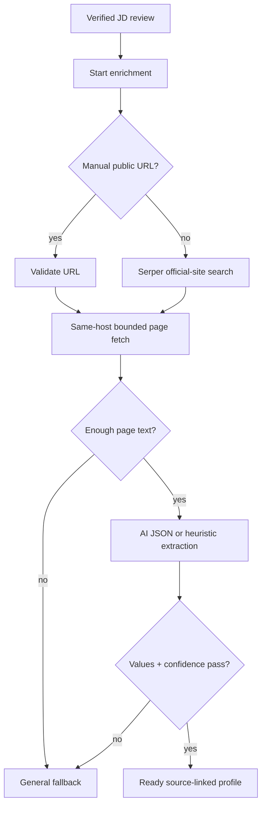

# Feature RFC: F-80 Company Values Enrichment

> **文件狀態**：Updated
> **系統成熟度 (Readiness Level)**：Partial — reviewed JD trigger, official-site resolution, bounded page fetch, heuristic/DeepSeek extraction and fallback persistence are implemented and locally tested; live Serper/DeepSeek/site quality and human browser review are not verified.
> **核心模組路徑**：`backend/src/api/routes/jobDescriptionRoutes.js`、`backend/src/controllers/jobDescriptionController.js`、`backend/src/services/company/companyValuesEnrichmentService.js`、`backend/src/services/company/companyWebsiteResolverService.js`、`backend/src/services/company/companyPageFetchService.js`、`backend/src/services/company/companyValuesExtractorService.js`
> **Git 演進 Commit 追蹤**：Current source snapshot `a89e6eba` (2026-08-02)
> **主要負責人 / 日期**：Kiwi engineering / 2026-08-02
> **實作狀態 (Implementation Status)**：Partial
> **校驗測試路徑 (Verified by Tests)**：`backend/tests/robustness/company/companyValuesRobustness.test.js`、`backend/tests/robustness/company/companyResearchAvailabilityRobustness.test.js`、`backend/tests/robustness/jd/companyWebsiteEvidenceService.test.js`

## 1. 目標與邊界

在 JD Role-Fit review 完成後，背景工作從手動 website URL 或 Serper 找到的 official site 建立 company mission、values、culture notes，供 motivation/coaching 使用。輸出必須保留 source URL、confidence 與 fallback reason；沒有可靠證據時使用 general fallback，不得把猜測當成公司事實。

## 2. Feature Definition & Code Blueprint

### 2.1 Entry point / trigger

| 項目 | 定義 |
| --- | --- |
| HTTP trigger | `POST /job-description/company-values/enrichment` (`jobDescriptionRoutes.js:22-25`) |
| Controller | `startCompanyValuesForReviewedJD` (`jobDescriptionController.js:92-126`) |
| Service entry | `startCompanyValuesEnrichment({ userId, jdFingerprint, companyName, location, jdText, manualWebsiteUrl })` |
| Execution | `enqueueBackgroundJob('company-values-enrichment', () => runCompanyValuesEnrichment(...))` (`companyValuesEnrichmentService.js:195-230`) |
| Preconditions | owner auth, raw JD, fingerprint; company name or manual URL is needed for a useful search |

### 2.2 Object contract

```js
// ready profile (shape assembled by saveCompanyValuesProfile)
{
  status: 'ready', source: 'official_website' | 'manual', websiteUrl: string,
  companyName: string, confidence: number, mission: string,
  values: [{ id, label, description, sourceUrl, confidence }],
  cultureNotes: string[], fetchedPages: [{ url, status, textPreview }]
}
```

| Helper | Input → output | Side effect / reuse |
| --- | --- | --- |
| `resolveCompanyWebsite` | company/manual URL → public official URL + confidence | Serper provider or public URL check |
| `scoreSearchResult` | search result + company name → 0..1 score | pure; excludes job boards/social domains |
| `fetchCompanyValuePages` | official URL → bounded same-host pages | network; max pages default 6, content cap |
| `extractCompanyValuesFromPages` | page text → normalized values object | optional DeepSeek; heuristic fallback |
| `buildGeneralCompanyValuesFallback` | company + reason → safe generic profile | pure fallback |
| `saveCompanyValuesProfile` | profile fields → persisted owner/fingerprint record | DB write |

### 2.3 Implementation algorithm (規格；不是現行程式碼)

```text
function enrichCompanyValues(input):
  if no userId or fingerprint: return null
  mark status pending, enqueue background job

function runJob(input):
  const company = input.companyName or hostname(manualWebsiteUrl)
  if no company and no manual URL: persist general fallback(missing_company_name); return
  mark searching
  const resolved = resolveCompanyWebsite(manual URL or Serper scored result)
  if no resolved URL: persist fallback(no_reliable_official_website); return
  mark fetching; pages = fetchCompanyValuePages(resolved.websiteUrl)
  if no page text >= 300 chars: persist fallback(company_pages_not_fetchable); return
  mark extracting; extracted = extractCompanyValuesFromPages(pages)
  if no values or confidence < source threshold: persist fallback(low_confidence_or_no_values_extracted); return
  persist ready profile with mission, values, culture notes, source URLs and confidence
  on exception: persist fallback(enrichment_error) with error message
```

### 2.4 Source and safety rules

`resolveCompanyWebsite` accepts a safe public manual URL with confidence `1`, or searches up to the configured query limit and rejects blocked/job-board/social domains (`companyWebsiteResolverService.js:4-14,23-50,53-142`). Page fetch follows redirects only when hostname remains the same and limits pages, content type, size and timeout (`companyPageFetchService.js:55-116`). The extractor uses only supplied website evidence in its AI prompt and falls back to a deterministic heading/bullet heuristic (`companyValuesExtractorService.js:89-160`).

## 3. Data flow and fallback states



## 4. Output and evidence matrix

| Claim | Source | Test | Boundary / status |
| --- | --- | --- | --- |
| Reviewed JD endpoint starts queued enrichment | `jobDescriptionController.js:92-126`, `companyValuesEnrichmentService.js:195-230` | company research availability tests | local source / Partial |
| Official sites score above job boards | `companyWebsiteResolverService.js:36-50` | `companyValuesRobustness.test.js:8-29` | local deterministic / Verified |
| URL and company context produce stable JD fingerprint | company fingerprint service | `companyValuesRobustness.test.js:31-55` | local / Verified |
| Same-host fetch and bounded page statuses | `companyPageFetchService.js:55-116` | `companyWebsiteEvidenceService.test.js` | local / Partial |
| Extracted values are normalized and source-linked | `companyValuesExtractorService.js:20-37,89-160` | company values robustness suite | local/provider boundary / Partial |
| Live Serper/DeepSeek quality and final coaching usefulness | provider/runtime | no live provider or human review here | live/human / Not verified |

## 5. Operations and interview explanation

Observe `status` transitions (`pending → searching → fetching → extracting → ready` or fallback), `confidence`, `fallbackReason`, `searchResults`, and `fetchedPages`. A provider failure should leave an explainable fallback, not block the reviewed JD. In plain language: after the user confirms the JD, Kiwi finds the company’s public site, reads a few same-site pages, extracts only evidence-backed values, and tells downstream coaching when the evidence is weak.
